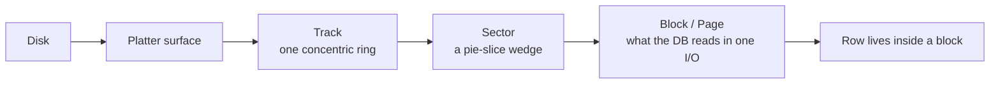
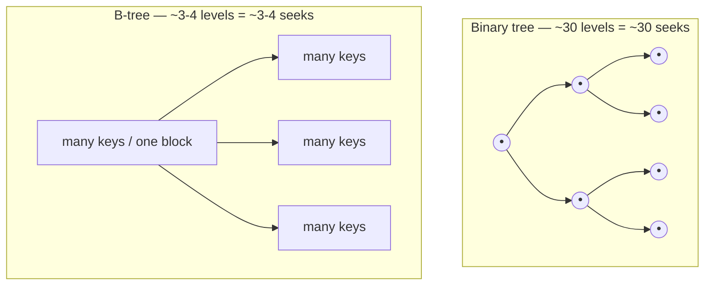
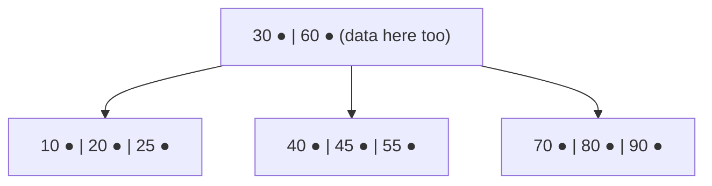
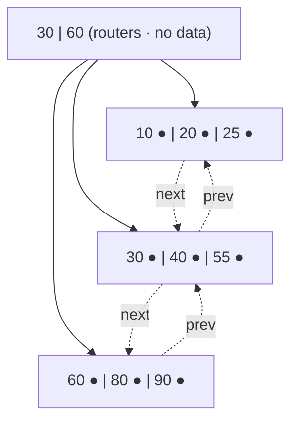
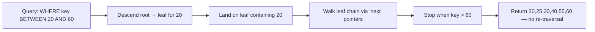
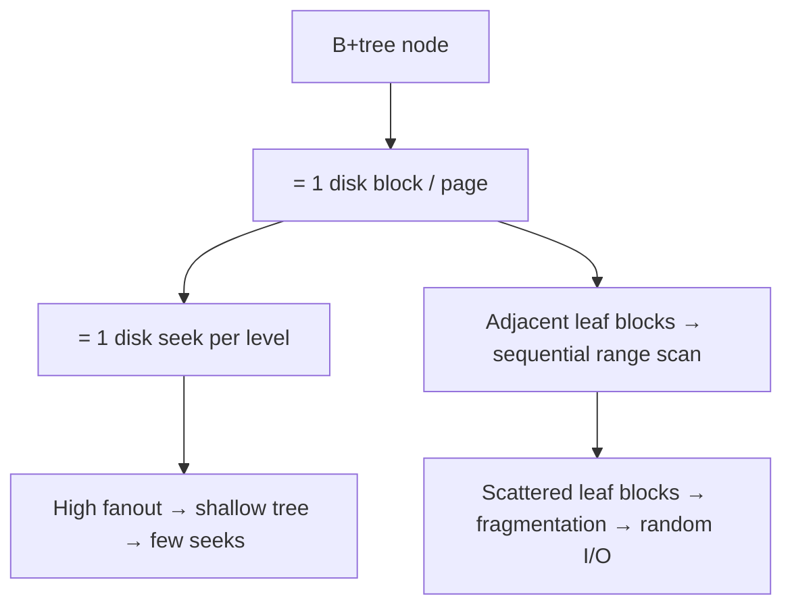

# B-Tree, B+Tree & the Disk Underneath

How database indexes are shaped by the physical reality of disks — **tracks, sectors, blocks** — and why B-trees and B+trees are the structure of choice. Diagrams included as flow/Mermaid charts.

---

## 1. The Core Idea — Disk Is Slow, So Minimize Trips to It

A CPU works in nanoseconds; reading from a spinning disk takes **milliseconds** — about a million times slower. B-trees exist to answer a lookup in the **fewest possible disk reads**.

A disk can't hand you one row at a time — it reads a whole **block** (e.g. 8 KB) per operation. So a B-tree packs *hundreds of keys into one node*, makes *one node = one block*, and stays very shallow. A billion rows fit in a tree only **3–4 levels deep**, so any row is ~3–4 disk reads away.

> **Remember this:** **One tree node = one disk block = one disk read.** Every design choice below flows from that single equation.

---

## 2. Anatomy of a Disk: Track, Sector, Block

A disk is a stack of spinning **platters**; a read/write head floats over each surface. The surface is divided so the controller can address an exact spot.

### Addressing hierarchy (flow)



### Cross-section of a platter (ASCII)

```
                    ___________________
                .-''                   ''-.
             .-'        outer track        '-.
           .'      .--------------------.      '.
          /      .'      mid track        '.     \
         /      /     .------------.        \     \
        |      |     /  inner track \        |     |
        |      |    |   .--------.   |       |     |
        |      |    |  | SPINDLE |  |        |     |
        |      |    |   '--------'   |       |     |
        |      |     \              /        |     |
         \      \     '------------'        /     /
          \      '.                       .'     /
           '.      '--------------------'      .'
             '-.      \  SECTOR wedge /     .-'
                ''-.   \   (slice)   /  .-''
                    '''-\___________/'''
                         ^
                BLOCK = where a SECTOR crosses a TRACK
                (the smallest chunk the database reads)
```

| Term | What it is | Why it matters |
|------|------------|----------------|
| **Track** | One concentric ring on a platter | The head sits over one track; moving between tracks is the slow **seek** |
| **Sector** | A pie-slice wedge | The smallest addressable physical unit (classically 512 B, now often 4 KB) |
| **Block / Page** | One or more sectors grouped (8 KB Postgres, 16 KB InnoDB) | **What the DB actually reads/writes** — never a single row |
| **Cylinder** | Same track number across all stacked platters | Reachable without moving the head |

---

## 3. Why Not a Normal Binary Tree?

A balanced **binary** search tree over a billion rows is ~30 levels deep. Each node is at a random disk location, so that's up to **30 disk seeks** per lookup — unacceptable.

A B-tree swaps "2 children per node" for "**hundreds of children per node**" (**high fanout**). More keys per node ⇒ fewer levels ⇒ fewer disk reads. Fanout is high precisely because **one node fills one disk block**.



---

## 4. The B-Tree

A self-balancing, sorted, multi-way tree. Its defining trait: **keys *and* their data/pointers can live in any node**, internal or leaf. A search can finish early at an internal node.

**Properties (order m):**
- Each node holds up to `m−1` sorted keys and up to `m` child pointers.
- All leaves are at the **same depth** — always balanced.
- An overflow triggers a **split**, pushing the middle key up to the parent (the hidden write cost).



> `●` = data / row payload attached to a key — **present at every level**. There are **no links between leaves**, so a range scan must climb up and down the tree repeatedly. A search for `30` stops at the root — no need to descend.

---

## 5. The B+Tree — What Real Databases Use

Two refinements make it ideal for databases:

1. **All data lives only in the leaves.** Internal nodes hold **keys as routers only** — no payload. That packs more keys per internal node ⇒ higher fanout ⇒ shallower tree.
2. **The leaves are linked in a sorted chain.** Once you find the start of a range, you walk the leaf chain sideways — no tree re-traversal. *This is the signature feature.*



> All data (`●`) sits in the **leaf level**; `30` and `60` repeat in the root only as **signposts**. The dotted `next/prev` links are the leaf chain — why `BETWEEN`, `ORDER BY`, and range scans are so cheap.

### Range scan on a B+tree (flow)



---

## 6. B-Tree vs B+Tree

| Aspect | B-Tree | B+Tree |
|--------|--------|--------|
| Where data lives | In every node (internal + leaf) | Only in leaf nodes |
| Internal nodes | Hold keys + data | Hold keys as routers only → higher fanout |
| Key duplication | Each key appears once | Router keys repeat in leaves |
| Leaf links | None | Linked list across leaves |
| Point lookup | Can finish early at an internal node | Always walks down to a leaf |
| Range / `ORDER BY` | Slow — traverse up and down | Fast — scan the leaf chain |
| Tree height | Slightly taller (less fanout) | Shorter (more fanout) |
| Used by | Some file systems, older designs | Virtually all RDBMS indexes (Postgres, MySQL/InnoDB, Oracle, SQL Server) |

> **Interview one-liner:** A B+tree keeps all data in linked leaves and uses internal nodes purely as a sorted directory — giving higher fanout (shallower tree, fewer disk reads) and cheap range scans. That's why databases pick it over a plain B-tree.

---

## 7. How the Tree Maps Onto the Disk

The opening equation now pays off: **each B+tree node is built to be exactly one disk block/page.**

- Descending one level = reading **one block** = **one disk seek**.
- High fanout (hundreds of router keys per block) keeps the tree 3–4 levels tall, so almost any row is 3–4 block reads away.
- A range scan reads consecutive **leaf** blocks along the linked list — often physically near each other, turning slow **random I/O** into fast **sequential I/O**.
- An **index-only scan** works because the leaf block already holds everything the query needs — no second trip to the table's data blocks.

Fragmentation is the flip side: if logically adjacent leaf blocks end up scattered across distant tracks, the head must seek between them and the "sequential" range scan degrades back toward random I/O.



---

## 8. Self-Test Questions

1. Why is one disk read worth ~a million CPU operations, and how does that shape B-tree design?
2. Define track, sector, and block — and explain which one the database actually reads.
3. Why would a binary search tree be a terrible on-disk index?
4. In a B-tree, where can data live? In a B+tree, where?
5. What single feature of a B+tree makes range scans fast, and why?
6. Why does a B+tree have higher fanout than a B-tree of the same block size?
7. A point lookup for an existing key: which tree can answer it without reaching a leaf?
8. Explain how "one node = one block" makes an index-only scan possible.
9. How does index fragmentation turn a fast range scan back into slow random I/O?
