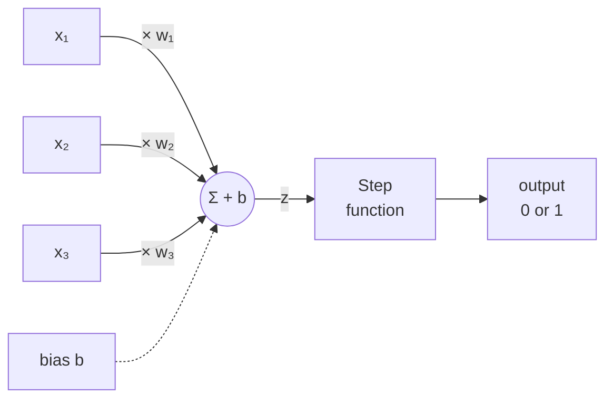
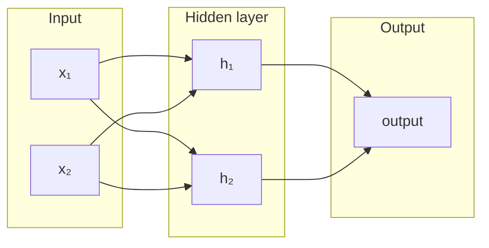

# The Perceptron — A Deep-Dive Study Guide

*Part of the Deep Learning roadmap · Phase 1: Neural Network Core*

The perceptron is the single artificial "neuron" that every neural network is built from. Understand it thoroughly and the rest of deep learning becomes variations on this one idea: weigh some inputs, add them up, make a decision, and adjust the weights when you're wrong.

---

## 1. The core idea

A perceptron takes several numbers as input and produces a single binary decision (yes/no, 1/0) as output. Think of it as a tiny decision-maker that weighs evidence.

**Analogy — deciding whether to go for a run.** Your inputs are things like: *is it sunny?* (x₁), *did I sleep well?* (x₂), *do I have free time?* (x₃). Each input gets a **weight** reflecting how much it matters to you. Free time might carry a large weight; sunshine a small one. The perceptron multiplies each input by its weight, sums them, and if the total clears a threshold, the decision is "yes, run."

The three ingredients:

- **Inputs** (x₁, x₂, …, xₙ) — the features / evidence.
- **Weights** (w₁, w₂, …, wₙ) — how much each input matters. *These are what the model learns.*
- **Bias** (b) — a baseline that shifts the threshold, controlling how eager the neuron is to fire before any evidence arrives.

---

## 2. The structure at a glance

Inputs are each multiplied by a weight, all the products are summed together with a bias, and that single number `z` is passed through an activation function to produce the output.



A more literal picture of the same flow:

```
        w₁
  x₁ ●───────┐
             │
        w₂   ▼
  x₂ ●─────► Σ (w·x) + b ──► z ──►  [ step ]  ──►  output (0 or 1)
             ▲                       if z>0 → 1
        w₃   │                       else   → 0
  x₃ ●───────┘
             ▲
   bias b ───┘
```

Read it left to right: **inputs → weighted sum + bias → activation → decision.** That's the entire forward computation of a perceptron.

---

## 3. The math

The perceptron computes its output in two steps.

**Step 1 — the weighted sum (a.k.a. the pre-activation):**

$$
z = w_1x_1 + w_2x_2 + \dots + w_nx_n + b = \sum_{i=1}^{n} w_i x_i + b
$$

In vector form this is just a dot product plus a bias:

$$
z = \mathbf{w} \cdot \mathbf{x} + b
$$

**Step 2 — the activation function (the decision):**

The classic perceptron uses the **step function**:

$$
\text{output} =
\begin{cases}
1 & \text{if } z > 0 \\
0 & \text{if } z \le 0
\end{cases}
$$

So the entire perceptron is: *multiply, sum, add the bias, check the sign.* That's the whole forward computation.

> **Note on the bias.** Sometimes the bias is written as a weight `w₀` attached to a constant input `x₀ = 1`. This "bias trick" lets you treat the bias like any other weight, which simplifies the math and the code.

---

## 4. The geometry: linear separability

This is the single most important thing to understand about a perceptron, because it explains both its power and its limits.

The equation `w · x + b = 0` defines a **decision boundary**. In 2D (two inputs) this boundary is a **straight line**; in 3D it's a **plane**; in higher dimensions a **hyperplane**. Everything on one side of the boundary is classified as 1, everything on the other side as 0.

```
  x₂
   ▲            ╲  decision boundary:  w·x + b = 0
   │      ○   ○  ╲
   │   ○     ○    ╲        ○ = class 0
   │             ╲  ●
   │      ○       ╲   ●    ● = class 1
   │               ╲   ●
   │                ╲ ●  ●
   └─────────────────────────►  x₁
        one straight line cleanly splits the two classes
```

This means a single perceptron can *only* solve problems where the two classes can be separated by a straight line (or flat hyperplane). Such problems are called **linearly separable**.

- The weights **w** control the *orientation* (tilt) of the boundary.
- The bias **b** controls its *position* (how far it sits from the origin).

Learning, then, is just the process of rotating and shifting this line until it cleanly separates the two classes.

---

## 5. How a perceptron learns

Here is what makes it *machine learning* rather than a fixed formula: the perceptron adjusts its own weights from its mistakes. You show it examples whose correct answers you already know, and whenever it guesses wrong, it nudges the weights.

**The perceptron learning rule**, applied to each weight after seeing one example:

$$
w_i \leftarrow w_i + \eta \,(y - \hat{y})\, x_i
$$

$$
b \leftarrow b + \eta \,(y - \hat{y})
$$

where:

- **η (eta)** is the **learning rate** — a small positive number (e.g. 0.1) controlling how big each nudge is.
- **y** is the *target* (correct answer).
- **ŷ** is the perceptron's *prediction*.
- **xᵢ** is the input value for that weight.

**The intuition:**

- If the prediction is **correct**, then `y − ŷ = 0`, so nothing changes. Good — don't fix what works.
- If the perceptron said **0 but should have said 1**, the error is **+1**, so each weight moves *up* in proportion to its input. This raises `z` next time, making the neuron more likely to fire.
- If it said **1 but should have said 0**, the error is **−1**, so the weights move *down*, making it less likely to fire.

You loop over the training examples repeatedly (each full pass is called an **epoch**) until the perceptron classifies everything correctly or you hit a maximum number of passes.

### The Perceptron Convergence Theorem

There is a reassuring guarantee: **if the data is linearly separable, the perceptron learning rule is guaranteed to find a separating boundary in a finite number of steps.** If the data is *not* linearly separable, the algorithm never settles — it keeps oscillating forever. (This is one motivation for the smoother, gradient-based methods used in modern networks.)

---

## 6. Worked example: learning the AND gate

Let's teach a perceptron the logical AND — output 1 only when *both* inputs are 1.

| x₁ | x₂ | target (y) |
|----|----|------------|
| 0  | 0  | 0          |
| 0  | 1  | 0          |
| 1  | 0  | 0          |
| 1  | 1  | 1          |

Start with `w₁ = 0, w₂ = 0, b = 0` and learning rate `η = 0.1`. Feed the rows in, compute `z`, apply the step function, and correct the weights whenever the prediction is wrong. After a few epochs the weights converge to values like:

```
w₁ = 0.2,  w₂ = 0.2,  b = −0.3
```

Let's verify:

- Row (1,1): `z = 0.2 + 0.2 − 0.3 = 0.1 > 0` → fires → **1** ✓
- Row (1,0): `z = 0.2 + 0 − 0.3 = −0.1 ≤ 0` → **0** ✓
- Row (0,1): `z = 0 + 0.2 − 0.3 = −0.1 ≤ 0` → **0** ✓
- Row (0,0): `z = 0 + 0 − 0.3 = −0.3 ≤ 0` → **0** ✓

All four correct — it learned the rule purely from examples, never being told the formula. The same procedure learns OR (the weights just shift so the boundary sits differently).

---

## 7. Code it from scratch (NumPy)

The best way to lock this in is to build it. This is a complete perceptron in ~25 lines — no ML library doing the thinking.

```python
import numpy as np

class Perceptron:
    def __init__(self, n_inputs, lr=0.1, epochs=20):
        self.w = np.zeros(n_inputs)
        self.b = 0.0
        self.lr = lr
        self.epochs = epochs

    def predict(self, x):
        z = np.dot(self.w, x) + self.b
        return 1 if z > 0 else 0

    def fit(self, X, y):
        for epoch in range(self.epochs):
            errors = 0
            for xi, target in zip(X, y):
                pred = self.predict(xi)
                update = self.lr * (target - pred)
                self.w += update * xi      # perceptron learning rule
                self.b += update
                errors += int(update != 0.0)
            if errors == 0:                # converged — no mistakes this pass
                print(f"Converged after {epoch + 1} epochs")
                break

# Train on the AND gate
X = np.array([[0, 0], [0, 1], [1, 0], [1, 1]])
y = np.array([0, 0, 0, 1])

model = Perceptron(n_inputs=2)
model.fit(X, y)

for xi in X:
    print(xi, "->", model.predict(xi))
print("weights:", model.w, "bias:", model.b)
```

Run it and watch it converge. Then try changing `y` to the OR gate (`[0, 1, 1, 1]`) — it still works. Then try XOR (`[0, 1, 1, 0]`) and watch it **never converge**, no matter how many epochs. That failure is the whole point of the next section.

---

## 8. The famous limitation: XOR

XOR ("exclusive or") outputs 1 when the two inputs **differ**:

| x₁ | x₂ | XOR |
|----|----|-----|
| 0  | 0  | 0   |
| 0  | 1  | 1   |
| 1  | 0  | 1   |
| 1  | 1  | 0   |

Plot these four points:

```
  x₂
   1 │  ●        ○        ● = class 1  (output 1)
     │ (0,1)   (1,1)      ○ = class 0  (output 0)
     │
   0 │  ○        ●
     │ (0,0)   (1,0)
     └───────────────► x₁
        0        1
   No single straight line can put both ● on one side
   and both ○ on the other — XOR is NOT linearly separable.
```

The two "1" cases sit at opposite corners, and so do the two "0" cases. **No single straight line can separate the 1s from the 0s** — the problem is not linearly separable. Since a perceptron *is* a straight line, it simply cannot represent XOR.

---

## 9. The bridge to real neural networks

The fix is elegant: **stack perceptrons into layers.** One layer of perceptrons feeds its outputs into another layer. With even a single "hidden" layer in between, the network can combine several straight-line boundaries into a **curved, complex** decision region — and XOR becomes solvable.



This layered model is the **Multi-Layer Perceptron (MLP)** — the first true neural network. Two changes make it trainable:

1. **Replace the hard step function** with a smooth activation (sigmoid, tanh, or ReLU). The step function has a flat, zero gradient everywhere, so you can't use calculus to guide learning. Smooth functions have useful gradients.
2. **Train with backpropagation** — an algorithm that uses the chain rule to figure out how much each weight in *every* layer contributed to the error, then nudges them all accordingly.

That is exactly where the roadmap goes next: activations, loss functions, backpropagation, and optimizers — all of which are just the perceptron idea made deeper and smoother.

---

## 10. Exercises to test yourself

1. **By hand:** Run two epochs of the learning rule on the OR gate starting from all-zero weights (η = 0.1). Do the weights end up separating the classes?
2. **Geometry:** For weights `w₁ = 0.2, w₂ = 0.2, b = −0.3`, write the equation of the decision line and sketch it. Which side is class 1?
3. **Code:** Modify the NumPy class to *print the weights after every epoch* so you can watch the boundary move as it learns.
4. **Break it:** Train on XOR and add a counter for total updates. Confirm it never reaches zero errors. Then reflect on *why* — draw the four points.
5. **Extend:** Add a second perceptron layer (by hand or in code) and see if you can hand-design weights that solve XOR.

---

## 11. Key takeaways

- A perceptron is: **weighted sum → add bias → step function → binary output.**
- The **weights and bias are learned** from labeled examples via the perceptron learning rule: nudge weights in proportion to `(target − prediction) × input`.
- Geometrically, a perceptron draws a **single straight-line (hyperplane) boundary**; it only solves **linearly separable** problems.
- **Convergence is guaranteed** for linearly separable data, and impossible (non-terminating) otherwise.
- It **cannot solve XOR** — which motivated **multi-layer networks**, smooth activations, and **backpropagation**, i.e. modern deep learning.

---

## Glossary

| Term | Meaning |
|------|---------|
| **Weight (w)** | A learned number setting how much an input matters. |
| **Bias (b)** | A learned offset that shifts the decision threshold. |
| **Pre-activation (z)** | The weighted sum + bias, before the activation function. |
| **Activation function** | Turns `z` into an output; the classic perceptron uses the step function. |
| **Decision boundary** | The line/plane `w · x + b = 0` separating the two classes. |
| **Linearly separable** | Classes that *can* be split by a single straight line/hyperplane. |
| **Learning rate (η)** | Step size controlling how big each weight update is. |
| **Epoch** | One full pass over the training data. |
| **Convergence** | Reaching a state with no classification errors. |
| **MLP** | Multi-Layer Perceptron — perceptrons stacked in layers; the first real neural net. |
