# 📊 Statistics & Probability for Data Science

Notes for lessons **82–109**, each with a diagram and a "why it matters in data science" section.

> **Viewing diagrams:** the `mermaid` blocks render automatically on **GitHub, GitLab, Obsidian, Notion, and VS Code** (with the *Markdown Preview Mermaid Support* extension). Text diagrams render everywhere.

---

## 📑 Table of Contents

**Part 1: Descriptive Statistics**
- [82. What is Statistics](#82-what-is-statistics-and-its-application)
- [83. Types of Statistics](#83-types-of-statistics)
- [84. Population vs Sample](#84-population-vs-sample)
- [85. Central Tendency](#85-measures-of-central-tendency)
- [86. Dispersion](#86-measures-of-dispersion)
- [87. Why n − 1?](#87-why-sample-variance-is-divided-by-n--1)
- [88. Standard Deviation](#88-standard-deviation)
- [89. Variables](#89-what-are-variables)
- [90. Random Variables](#90-random-variables)
- [91. Histograms](#91-histograms)
- [92. Percentiles & Quartiles](#92-percentiles--quartiles)
- [93. 5-Number Summary](#93-five-number-summary--box-plot)
- [94. Covariance & Correlation](#94-covariance--correlation)

**Part 2: Probability & Distributions**
- [95. Addition Rule](#95-addition-rule)
- [96. Multiplication Rule](#96-multiplication-rule)
- [97. PMF, PDF, CDF](#97-pmf-pdf--cdf)
- [98. Types of Distributions](#98-types-of-probability-distributions)
- [99. Bernoulli](#99-bernoulli-distribution)
- [100. Binomial](#100-binomial-distribution)
- [101. Poisson](#101-poisson-distribution)
- [102. Normal](#102-normal--gaussian-distribution)
- [103. Standard Normal & Z-Score](#103-standard-normal-distribution--z-score)
- [104. Uniform](#104-uniform-distribution)
- [105. Log-Normal](#105-log-normal-distribution)
- [106. Power Law](#106-power-law-distribution)
- [107. Pareto](#107-pareto-distribution)
- [108. Central Limit Theorem](#108-central-limit-theorem)
- [109. Estimates](#109-estimates)

**[🧾 Cheat Sheet](#-final-cheat-sheet)**

---

# Part 1: Descriptive Statistics

## 82. What is Statistics and its Application

**Statistics** is the science of **collecting, organizing, analyzing, and interpreting data** to make decisions.

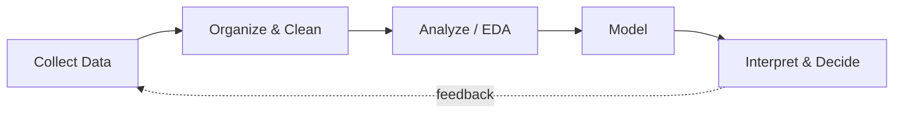

**In data science, statistics is used at every stage:**

| Stage | How statistics is used |
|---|---|
| EDA | Mean, spread, distributions, relationships |
| Data cleaning | Outlier detection, missing-value imputation |
| Feature engineering | Scaling, transformations, feature selection |
| Modeling | Linear/logistic regression, Naive Bayes are statistical models |
| Evaluation | Confidence intervals, significance tests |
| Business | A/B testing, forecasting, customer analytics |

---

## 83. Types of Statistics

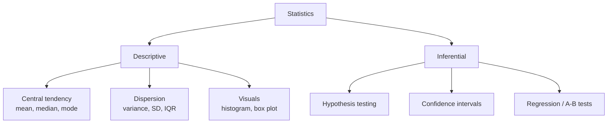

| Type | Purpose | Data science example |
|---|---|---|
| **Descriptive** | Summarize data you have | "Average order value last month = ₹850" (EDA, dashboards) |
| **Inferential** | Generalize from sample → population | "New checkout page increases conversion for **all** users" |

---

## 84. Population vs Sample

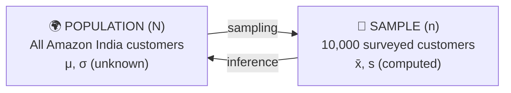

| | Population | Sample |
|---|---|---|
| Mean | μ | x̄ |
| Std. deviation | σ | s |
| Size | N | n |

**In data science:**
- Your **training data is a sample**, and the model is used on the population (real-world data).
- **Biased sample → biased model.** A model trained only on urban users may fail for rural users.
- Use **stratified sampling** to keep class proportions: `train_test_split(X, y, stratify=y)`.

---

## 85. Measures of Central Tendency

```
Symmetric (Normal)          Right-Skewed (Income)        Left-Skewed (Easy exam)
        ▄█▄                    █▄                                    ▄█
      ▄█████▄                  ███▄                                ▄███
    ▄█████████▄                █████▄▄                         ▄▄█████
  ▄█████████████▄              ████████▄▄▄▄              ▄▄▄▄████████
        ↑                      ↑ ↑   ↑                       ↑   ↑ ↑
 Mean = Median = Mode       Mode Med Mean                 Mean Med Mode
```

| Measure | Definition | Use when | Imputation |
|---|---|---|---|
| **Mean** | Sum ÷ count | Symmetric data, no outliers | `SimpleImputer(strategy='mean')` |
| **Median** | Middle sorted value | Skewed data / outliers | `strategy='median'` |
| **Mode** | Most frequent value | Categorical data | `strategy='most_frequent'` |

**Example:** salaries ₹30k, 35k, 40k, 45k, **₹10 lakh**. The mean is ≈ ₹2.3 lakh (misleading), while the median is **₹40k** (representative).

💡 **Mean > Median → right-skewed** (common for prices and income).

---

## 86. Measures of Dispersion

Same mean, different spread:

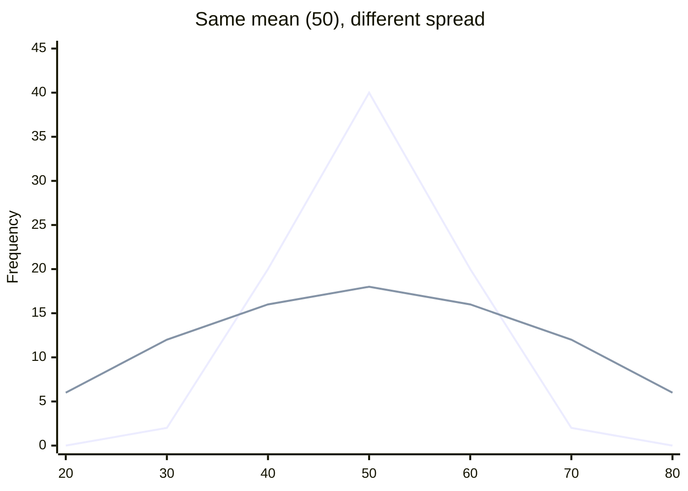

| Measure | Formula | Notes |
|---|---|---|
| Range | Max − Min | Very sensitive to outliers |
| Variance | Σ(x − x̄)² / (n − 1) | Squared units |
| Std. deviation | √Variance | Same units as the data |
| IQR | Q3 − Q1 | Robust to outliers |

**In data science:**
- **Feature selection:** near-zero variance means no information → `VarianceThreshold`.
- **Finance:** variance of returns = risk.
- **Reliability:** compare delivery-time spread across warehouses.

---

## 87. Why Sample Variance Is Divided by n − 1

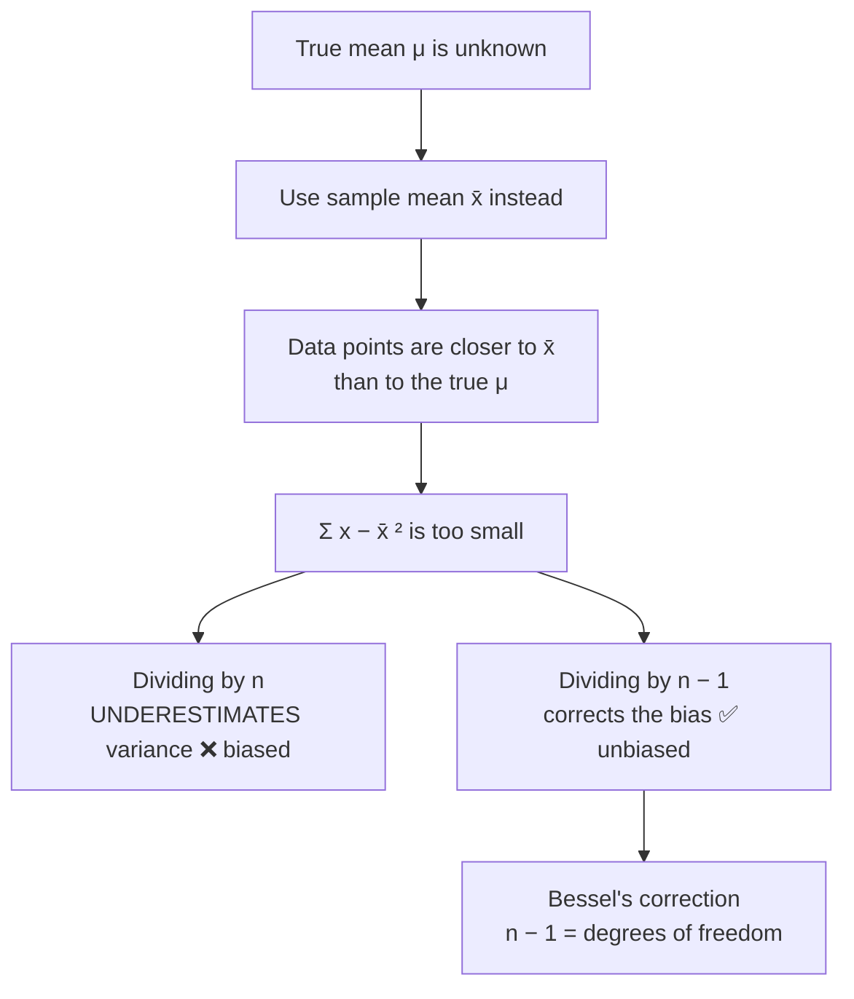

**Degrees of freedom:** once x̄ is fixed, only **n − 1** values can vary freely, and the last value is forced.

⚠️ **Library defaults differ:**

```python
import numpy as np, pandas as pd
x = [2, 4, 6, 8]
np.var(x)            # 5.0    → divides by n     (ddof=0)
pd.Series(x).var()   # 6.667  → divides by n − 1 (ddof=1)
```

With large datasets the difference is negligible; with small samples it matters.

---

## 88. Standard Deviation

**σ = √Variance**, the typical distance of points from the mean, in the **same units as the data**.

```
         Delivery time: mean = 30 min, SD = 5 min

    |----- 1 SD -----|----- 1 SD -----|
   25 min          30 min          35 min
                  (mean)
    ←—— most deliveries fall here ——→
```

**In data science:**
- **Standardization:** `z = (x − mean) / SD`, needed for KNN, SVM, PCA, and gradient descent.
- **Outliers:** points beyond **mean ± 3 SD**.
- **Model stability:** cross-validation accuracy reported as **85% ± 2%**.
- **Monitoring:** alert when a metric moves several SDs from normal.

---

## 89. What Are Variables?

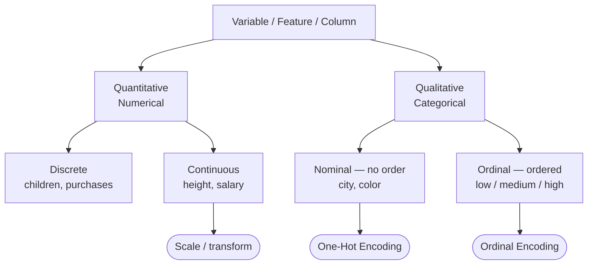

**In data science:** the variable type decides the **encoding**, the **chart** (histogram vs bar chart), and the **model** (regression for a continuous target, classification for a categorical one).
**X = features (inputs), y = target (what you predict).**

---

## 90. Random Variables

A **random variable** maps each outcome of a random process **to a number**.

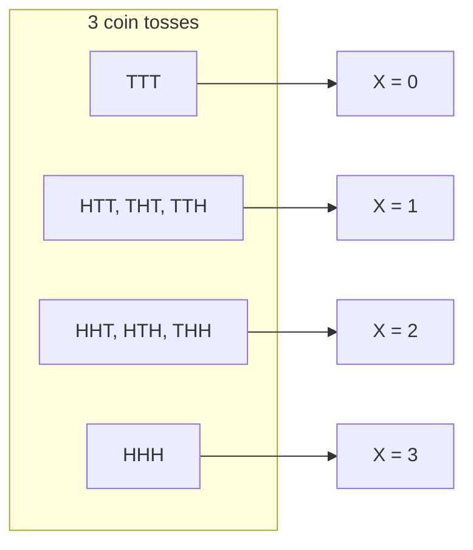

| Type | Values | Described by | Example |
|---|---|---|---|
| Discrete | Countable | **PMF** | Number of purchases |
| Continuous | Any value in a range | **PDF** | Time on website |

**In data science:** treating features and targets as random variables lets you apply distributions. Logistic regression treats the target as a **Bernoulli** random variable, and `predict_proba()` outputs probabilities because predictions are uncertain.

---

## 91. Histograms

A histogram groups numeric data into **bins**, and bar height shows frequency.

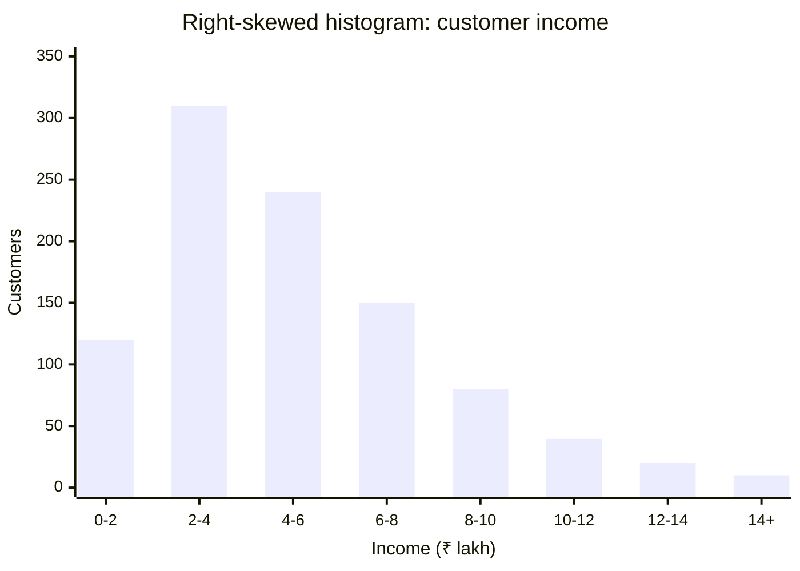

**What it reveals:** shape (symmetric, skewed, bimodal), center, spread, outliers, gaps.

```
Bimodal (two hidden groups)        Spike = data problem
   ▄█▄       ▄█▄                       █
  █████     █████                ▄▄▄   █   ▄▄▄
 ███████▄▄▄███████              ██████ █ ██████
                                      ↑ placeholder 0 / 999
```

**In data science:**
- It is the first plot in EDA: `df['col'].hist()` or `sns.histplot(df['col'], kde=True)`.
- Right skew → apply a **log transform**.
- A bimodal shape suggests **hidden segments**.
- Bin count matters: too few hides patterns, too many creates noise.

---

## 92. Percentiles & Quartiles

```
 Sorted data ─────────────────────────────────────────────►
 |──── 25% ────|──── 25% ────|──── 25% ────|──── 25% ────|
Min            Q1          Q2=Median       Q3           Max
           (25th pct)     (50th pct)    (75th pct)
               |←──────── IQR = Q3 − Q1 ────────→|
                        (middle 50%)
```

**IQR outlier rule:**

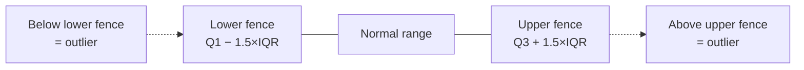

**In data science:**
- **Outlier removal** with IQR fences.
- **p95 / p99 latency:** engineers track the slowest users, not the average.
- **Binning:** `pd.qcut(df['spend'], 4)` gives spending quartiles.
- **`RobustScaler`** uses the median and IQR, so it is not distorted by outliers.

---

## 93. Five-Number Summary & Box Plot

**Min · Q1 · Median · Q3 · Max**

```
                 Q1    Median   Q3
   Min           ┌──────┬────────┐                Max
    ├────────────┤      │        ├────────────────┤          ●  ●
                 └──────┴────────┘                        outliers
    ←─ whisker ─→ ←──── IQR ─────→ ←─── whisker ──→
```

```python
df.describe()          # count, mean, std, min, 25%, 50%, 75%, max
sns.boxplot(x='dept', y='salary', data=df)   # compare groups
```

**In data science:** box plots show outliers and skew quickly and are ideal for **comparing groups** (salary by department, delivery time by city). The summary stays reliable even with skewed data.

---

## 94. Covariance & Correlation

```
 r ≈ +1 (strong +)     r ≈ −1 (strong −)     r ≈ 0 (none)      r ≈ 0 but non-linear!
            •          •                      •    •   •            •       •
          • •            • •                •   •    •               •     •
        • •                • •                 •  •   •               •   •
      • •                    • •             •    •  •                 • •
    •                          •               •   •                    •
 Study hrs → Marks     Price → Demand       Shoe size → IQ        Pearson misses this
```

| | Covariance | Correlation (Pearson r) |
|---|---|---|
| Formula | Σ(x − x̄)(y − ȳ) / (n − 1) | Cov(X,Y) / (σₓ σᵧ) |
| Range | −∞ to +∞ | **−1 to +1** |
| Tells | Direction only | Direction **+ strength** |
| Unit-dependent? | Yes ❌ | No ✅ |

**Spearman correlation** works on ranks, captures **monotonic non-linear** relationships, and is robust to outliers.

**In data science:**
- **Heatmap:** `sns.heatmap(df.corr(), annot=True, cmap='coolwarm')`
- **Feature selection:** keep features correlated with the target.
- **Multicollinearity:** if two features have |r| > 0.8–0.9, drop one.
- **PCA** is built on the **covariance matrix**.


⚠️ **Correlation ≠ causation.** A hidden third variable (a **confounder**) can drive both.

---

# Part 2: Probability & Distributions

## 95. Addition Rule

**P(A ∪ B) = P(A) + P(B) − P(A ∩ B)**

```
   Mutually Exclusive                  Not Mutually Exclusive
   (no overlap)                        (overlap counted twice → subtract it)

   ┌───────┐   ┌───────┐               ┌─────────┬────┬─────────┐
   │   A   │   │   B   │               │    A    │A∩B │    B    │
   │ die=2 │   │ die=5 │               │  King   │K♥ │  Heart  │
   └───────┘   └───────┘               └─────────┴────┴─────────┘
   P(A∪B) = 1/6 + 1/6 = 2/6            P(A∪B) = 4/52 + 13/52 − 1/52 = 16/52
```

**In data science:**
- **Multi-class** (cat / dog / bird): classes are mutually exclusive → **softmax**, probabilities sum to 1.
- **Multi-label** (a movie can be Action **and** Comedy): labels overlap → a **sigmoid per label**.
- P(churn **or** complaint) must subtract the overlap, or you overestimate the at-risk group.

---

## 96. Multiplication Rule

- **Independent:** P(A ∩ B) = P(A) × P(B)
- **Dependent:** P(A ∩ B) = P(A) × P(B | A)

**Dependent example: drawing 2 red balls without replacement (3 red, 2 blue):**

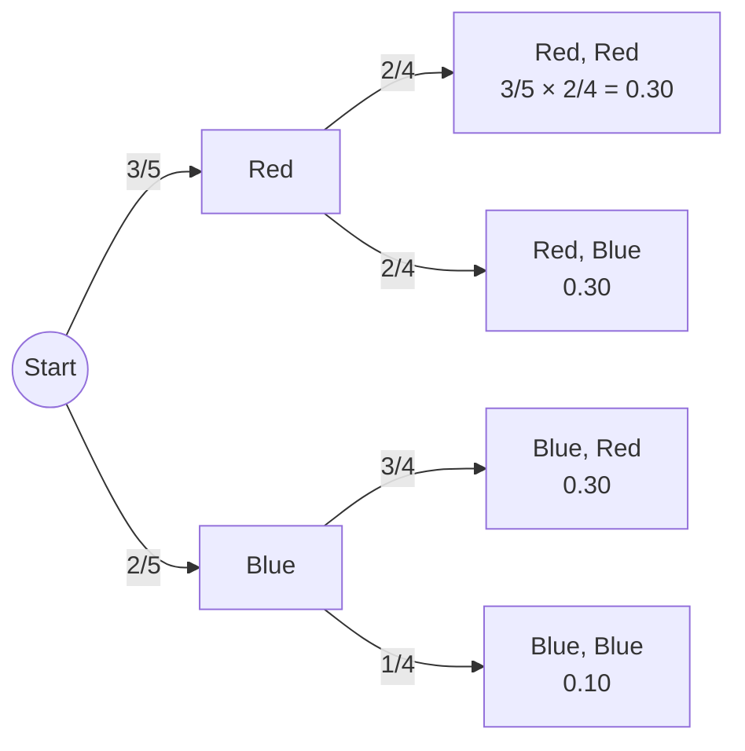

**In data science:**
- **Naive Bayes** assumes independence: P(spam | words) ∝ P(spam) × P(w₁|spam) × P(w₂|spam) × …
- **Funnel analysis:** P(purchase) = P(visit) × P(cart | visit) × P(buy | cart).
- **Language models** use the chain rule: P(w₁, w₂, w₃) = P(w₁) · P(w₂|w₁) · P(w₃|w₁,w₂).

---

## 97. PMF, PDF & CDF

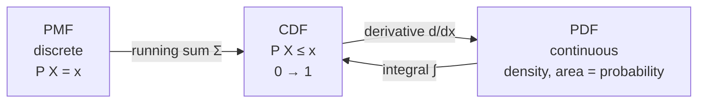

**PDF (bell) vs its CDF (S-curve) for a standard normal:**

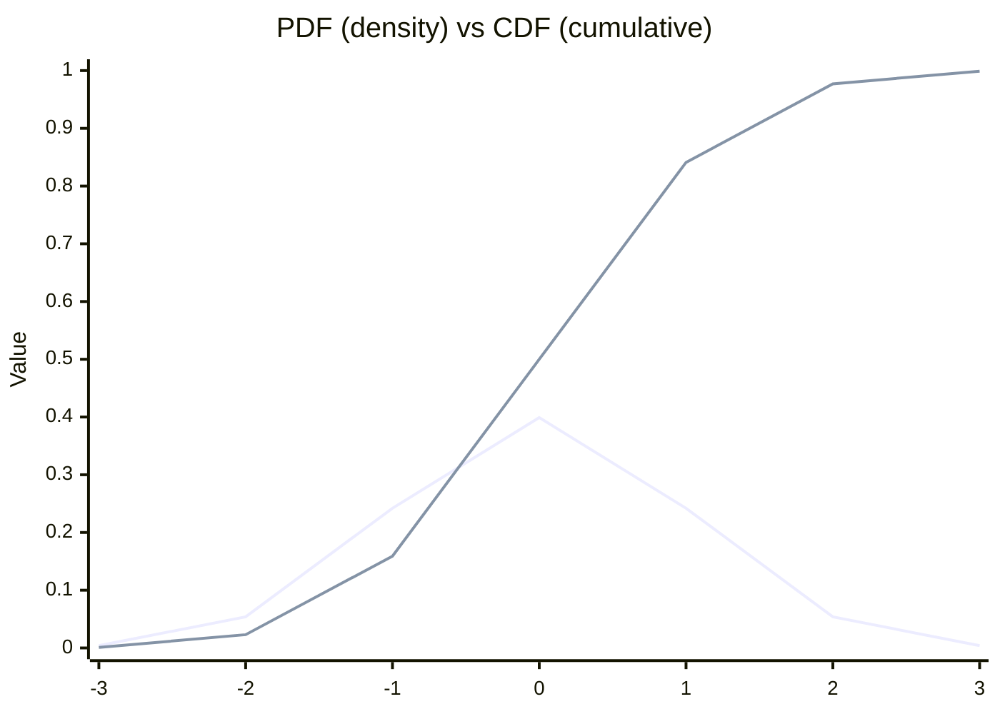

| | PMF | PDF | CDF |
|---|---|---|---|
| Data | Discrete | Continuous | Both |
| Gives | P(X = x) | Density (P(X = x) = 0) | P(X ≤ x) |

**In data science:** histograms and KDE plots estimate the PDF. The CDF gives **percentiles** ("90% of pages load < 2 s"). The **ECDF** and the **KS test** compare train vs production data (**drift detection**). **p-values** are CDF areas.

---

## 98. Types of Probability Distributions

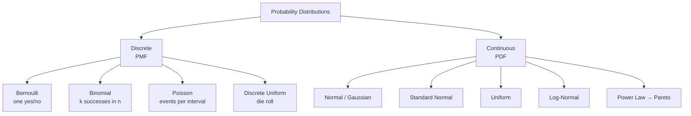

**Why it matters:** knowing a feature's distribution tells you the **transformation**, the **model/loss**, the **valid test**, and how to **simulate** data.

---

## 99. Bernoulli Distribution

One trial with two outcomes: **1 with probability p, 0 with probability 1 − p.**
Mean = p, Variance = p(1 − p)

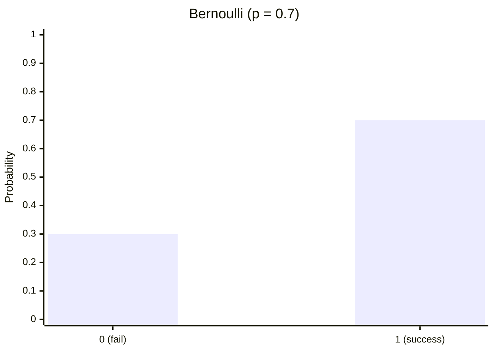

**In data science:**
- Every **binary target** is Bernoulli: churn, click, fraud, spam.
- **Logistic regression** predicts p.
- **Binary cross-entropy loss** = negative log-likelihood of a Bernoulli.

---

## 100. Binomial Distribution

Number of successes in **n independent Bernoulli trials**.
P(X = k) = C(n, k) · pᵏ · (1 − p)ⁿ⁻ᵏ, Mean = np, Variance = np(1 − p)

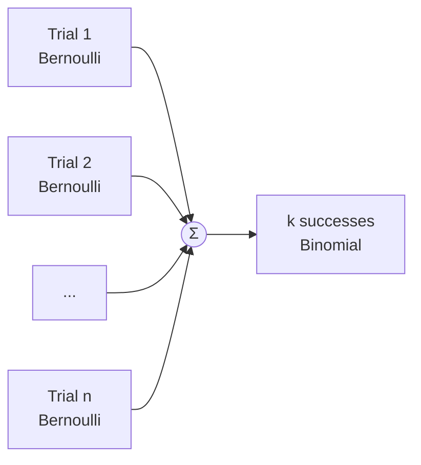

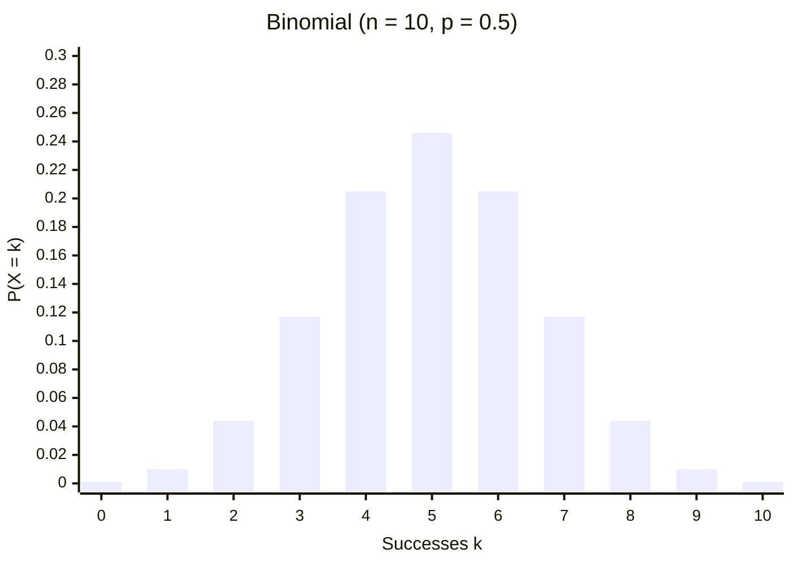

**In data science:** conversions out of n visitors, **A/B testing**, confidence intervals for CTR and accuracy, and checking whether 85/100 correct is better than chance.

---

## 101. Poisson Distribution

Number of events in a **fixed interval** at average rate λ.
P(X = k) = λᵏ e⁻λ / k!, **Mean = Variance = λ**

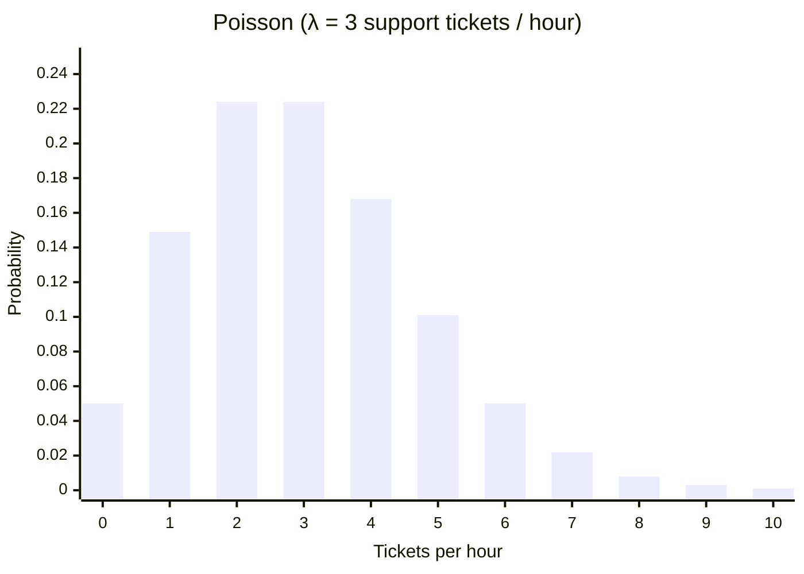

**In data science:**
- Hits per minute, tickets per hour, crashes per week.
- **Poisson regression** for count targets.
- **Anomaly detection:** λ = 5 logins/min but you see 40 → flag it.
- **Capacity planning** for servers and call agents.
- If variance ≫ mean (**overdispersion**), use the **Negative Binomial**.

---

## 102. Normal / Gaussian Distribution

**Empirical rule (68–95–99.7):**

```
                              ▄▄█▄▄
                           ▄█████████▄
                        ▄███████████████▄
                     ▄█████████████████████▄
               ▄▄▄███████████████████████████▄▄▄
     ──────┬──────┬──────┬──────┬──────┬──────┬──────
         μ−3σ   μ−2σ   μ−σ     μ     μ+σ   μ+2σ   μ+3σ
                       |←─ 68% ─→|
                |←────────── 95% ──────────→|
         |←────────────────── 99.7% ──────────────────→|
```

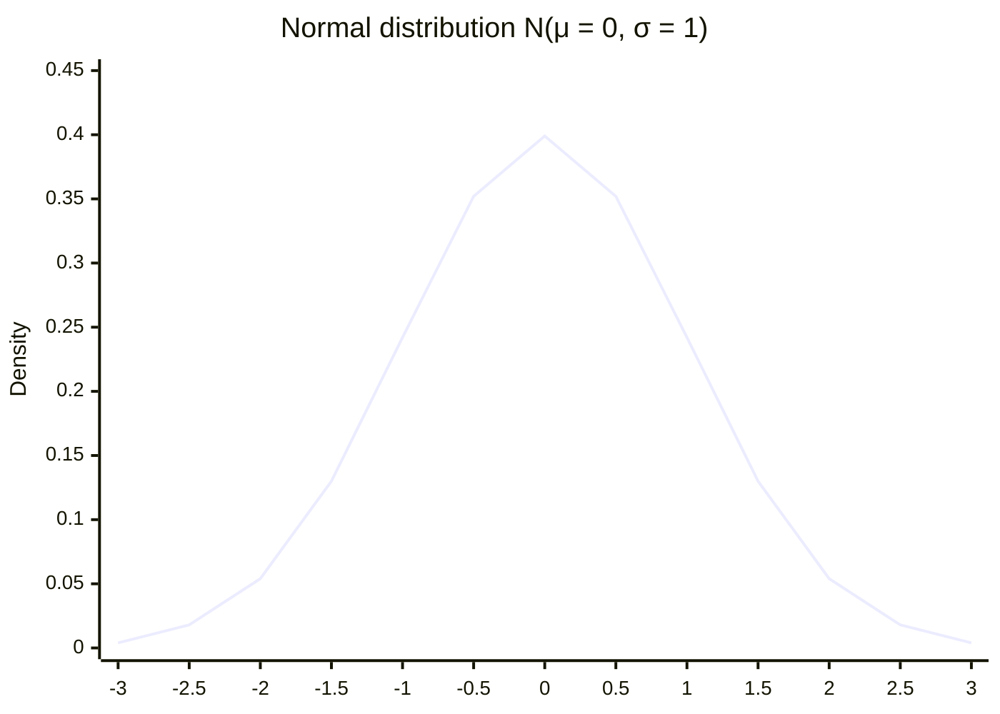

**In data science:** measurement errors and heights. **Linear regression residuals** are assumed normal, and **t-tests, z-tests, and ANOVA** assume normality. Gaussian Naive Bayes, LDA, and GMMs use it directly, and neural network weights are often initialized from it. Check normality with a **Q-Q plot** or **Shapiro-Wilk**.

---

## 103. Standard Normal Distribution & Z-Score

**Z = (x − μ) / σ** converts any normal distribution to **μ = 0, σ = 1**.

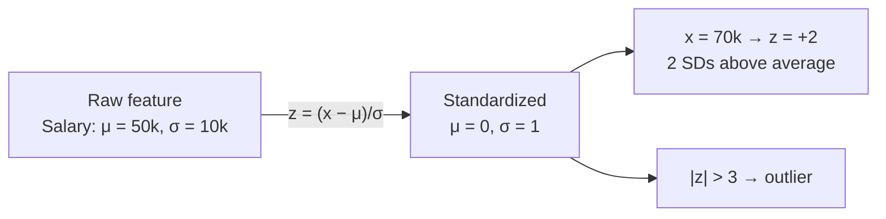

**Comparing different scales:**

| Subject | Score | Class mean | SD | Z | Verdict |
|---|---|---|---|---|---|
| Math | 80 | 65 | 10 | **+1.5** | ✅ Relatively better |
| English | 90 | 85 | 10 | +0.5 | |

**In data science:**
- **`StandardScaler`** is essential for KNN, SVM, PCA, regularized regression, and gradient descent.
- **Outlier detection:** |z| > 3.
- **z-tests** produce p-values.

---

## 104. Uniform Distribution

Every outcome is **equally likely**.
Continuous on [a, b]: Mean = (a + b)/2, Variance = (b − a)²/12

```mermaid
xychart-beta
    title "Continuous Uniform on [0, 5]: flat density = 1/5"
    x-axis ["0","1","2","3","4","5"]
    y-axis "Density" 0 --> 0.4
    line [0.2, 0.2, 0.2, 0.2, 0.2, 0.2]
```

**In data science:**
- Random sampling, shuffling, and **train/test splits**
- **Random search** for hyperparameters
- **Xavier/Glorot uniform** weight initialization
- **Monte Carlo simulation:** inverse-transform sampling turns uniform random numbers into any distribution
- Uninformative **Bayesian prior**

---

## 105. Log-Normal Distribution

X is log-normal if **log(X) is normal**. It is positive and right-skewed.

```mermaid
flowchart LR
    A["Log-normal data<br/>prices, income<br/>right-skewed 📈"] -- "np.log1p(x)" --> B["≈ Normal<br/>symmetric 🔔<br/>better for linear models"]
    B -- "np.expm1(pred)" --> A
```

```mermaid
xychart-beta
    title "Log-Normal (μ = 0, σ = 1)"
    x-axis "x" ["0.1","0.25","0.5","1","1.5","2","3","4","5","6"]
    y-axis "Density" 0 --> 0.7
    line [0.282, 0.610, 0.627, 0.399, 0.245, 0.157, 0.073, 0.038, 0.022, 0.013]
```

**In data science:** income, **house prices**, time on site, file sizes, and stock prices often look like this. A common pattern is to **predict log(price) and convert back**.

---

## 106. Power Law Distribution

**P(x) ∝ x⁻ᵅ**: a few values are huge and most are tiny. This creates a **heavy / long tail**.

```mermaid
xychart-beta
    title "Zipf's law: word frequency vs rank"
    x-axis "Rank" ["1","2","3","4","5","6","7","8","9","10"]
    y-axis "Frequency" 0 --> 110
    bar [100, 50, 33, 25, 20, 17, 14, 13, 11, 10]
```

```
 Linear scale: long tail            Log-log scale: STRAIGHT LINE = power law
 █                                  log(freq)
 █                                   ●
 █▄                                    ●
 ██▄▄                                    ●
 █████▄▄▄▄▄▄▄▄▄▄▄▄▄▄▄▄▄▄▄                  ●
 ← head →←──── long tail ────→               ●  log(rank)
```

**In data science:** word frequencies, follower counts, web traffic, e-commerce sales (the "long tail").

- The **mean is unstable** → use the **median**.
- **Extremes are real, not errors**, so don't blindly drop them as outliers.
- Recommendation systems must handle **popularity bias**.

---

## 107. Pareto Distribution

A specific power law behind the **80/20 rule**: about 80% of effects come from about 20% of causes.

```mermaid
pie showData
    title "Revenue share by customers"
    "Top 20% customers" : 80
    "Remaining 80% customers" : 20
```

```mermaid
xychart-beta
    title "Pareto PDF (xm = 1, α = 2)"
    x-axis "x" ["1","1.5","2","3","4","5","6"]
    y-axis "Density" 0 --> 2.1
    line [2.0, 0.593, 0.25, 0.074, 0.031, 0.016, 0.009]
```

**In data science:**
- **Customer segmentation:** focus retention on the top 20%.
- **Prioritization:** a few bugs cause most crashes, and a few SKUs drive most sales.
- **Feature importance:** a few features often carry most of the predictive power.
- Transform with **log** or **Box-Cox**.

---

## 108. Central Limit Theorem

Take many samples of size n from **any** population with finite variance → the **distribution of sample means approaches normal** as n grows (rule of thumb n ≥ 30).
Mean of sample means = μ, **Standard error = σ / √n**

```mermaid
flowchart LR
    P["Population<br/>ANY shape<br/>(skewed, uniform…)"] --> S1["Sample 1 → x̄₁"]
    P --> S2["Sample 2 → x̄₂"]
    P --> S3["Sample 3 → x̄₃"]
    P --> SK["Sample k → x̄ₖ"]
    S1 --> H["Histogram of x̄ values"]
    S2 --> H
    S3 --> H
    SK --> H
    H --> N["🔔 ≈ Normal<br/>mean = μ, SE = σ/√n"]
```

```
 Population (right-skewed)        Sample means (n = 30)
 █                                         ▄█▄
 ██▄                                     ▄█████▄
 ████▄▄                                ▄█████████▄
 ████████▄▄▄▄▄▄▄                    ▄▄███████████████▄▄
```

**In data science:**
- **Why stats works on messy data:** confidence intervals and t-tests remain valid on skewed data.
- **A/B testing:** order value is skewed, but the **average over thousands of users ≈ normal**.
- It is the intuition behind **bootstrapping**.
- ⚠️ It breaks for **extremely heavy-tailed power laws** with infinite variance.

---

## 109. Estimates

```mermaid
flowchart TD
    P["Population parameter<br/>μ, σ, p — UNKNOWN"] --> S[Draw sample]
    S --> PE["Point estimate<br/>x̄ = 3.2% conversion"]
    S --> IE["Interval estimate<br/>3.2% ± 0.4% (95% CI)"]
    PE --> Q{Good estimator?}
    IE --> Q
    Q --> U[Unbiased<br/>correct on average]
    Q --> C[Consistent<br/>closer as n grows]
    Q --> E[Efficient<br/>low variance]
```

**Unbiased vs biased, precise vs imprecise (🎯 = true value):**

```
  Unbiased + Precise ✅    Unbiased + Imprecise    Biased + Precise     Biased + Imprecise ❌
      ( ••🎯•• )             •   ( 🎯 )   •         ( 🎯 )  •••          ( 🎯 )      •
                               •        •                   ••              •    •   •
```

**In data science:**
- Report metrics with uncertainty: "accuracy **87% ± 2%**", not just "87%".
- **Model training is estimation:** regression coefficients and neural network weights are estimates, usually via **MLE** (Maximum Likelihood Estimation).
- **n − 1 in variance** (lesson 87) exists to make the estimator **unbiased**.

---

# 🧾 Final Cheat Sheet

### Which statistic?

| Question | Tool |
|---|---|
| Where is the center? | Mean (symmetric) · Median (skewed) · Mode (categorical) |
| How spread out? | SD / Variance (symmetric) · IQR (skewed / outliers) |
| What shape? | Histogram, KDE |
| Any outliers? | Box plot, IQR rule, \|z\| > 3 |
| Quick summary? | `df.describe()` |
| Two variables related? | Covariance (direction) · Correlation (direction + strength) |

### Which distribution?

```mermaid
flowchart TD
    Q{What does your data look like?} --> A{Discrete or continuous?}
    A -- Discrete --> B{What is counted?}
    B -- "One yes/no" --> BE[Bernoulli]
    B -- "Successes out of n" --> BI[Binomial]
    B -- "Events per interval" --> PO[Poisson]
    A -- Continuous --> C{Shape?}
    C -- "Symmetric bell" --> NO[Normal → z-score]
    C -- "Flat" --> UN[Uniform]
    C -- "Positive, right-skewed" --> LN[Log-Normal → log transform]
    C -- "Few giants, many small" --> PL[Power Law / Pareto]
```

### Python quick reference

```python
import numpy as np, pandas as pd, seaborn as sns
from scipy import stats

df.describe()                          # 5-number summary + mean, std
df['x'].mean(), df['x'].median(), df['x'].mode()
df['x'].var(), df['x'].std()           # ddof=1 (n − 1) in pandas
df['x'].quantile([0.25, 0.5, 0.75])    # quartiles
df.corr(method='pearson')              # or 'spearman'
sns.histplot(df['x'], kde=True)        # histogram + PDF estimate
sns.boxplot(x=df['x'])                 # box plot

stats.zscore(df['x'])                  # z-scores
stats.norm.cdf(1.96)                   # 0.975
stats.binom.pmf(k=3, n=10, p=0.5)      # binomial PMF
stats.poisson.pmf(k=2, mu=3)           # poisson PMF
stats.shapiro(df['x'])                 # normality test
np.log1p(df['price'])                  # fix right skew
```

---

*Lessons 82–109: Statistics & Probability for Data Science.*
