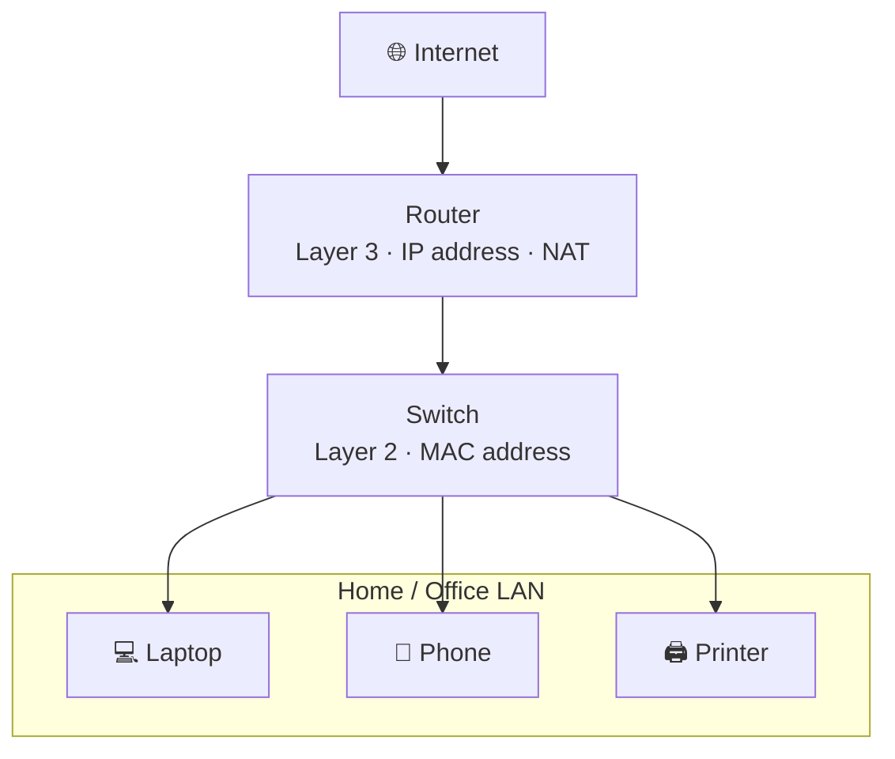
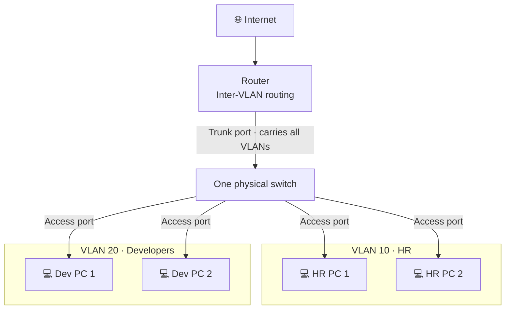

[⬅ Back to Home](Home.md)

# Internet → Router → Switch → LAN



## Simple text version

```
            +------------+
            |  Internet  |
            +------------+
                  |
            +------------+
            |   Router   |   Layer 3 - uses IP address, does NAT
            +------------+
                  |
            +------------+
            |   Switch   |   Layer 2 - uses MAC address
            +------------+
             /    |     \
   +--------+ +--------+ +---------+
   | Laptop | | Phone  | | Printer |    <- LAN (Local Area Network)
   +--------+ +--------+ +---------+
```

## How it works

| Device | Job |
|---|---|
| Internet | Huge network of networks, reached through your ISP |
| Router | Connects your LAN to the internet using IP addresses |
| Switch | Connects devices inside the LAN using MAC addresses |
| LAN | Your local devices: laptop, phone, printer |

---

# VLAN (Virtual LAN)

A **VLAN** splits **one physical switch into several separate networks** using software settings, with no extra cables or switches.

## Why we need it

Without VLANs, every device on the switch is in one LAN and can see every other device. In an office this causes problems:

- A guest on Wi‑Fi can reach the accounts team's computers (a security risk).
- Broadcast messages go to every device, which slows the network.
- Buying a separate switch for each team is expensive.

## VLAN diagram



## Simple text version

```
                  +------------+
                  |  Internet  |
                  +------------+
                        |
                  +------------+
                  |   Router   |   <- lets VLAN 10 and VLAN 20 talk (if allowed)
                  +------------+
                        |   Trunk port (carries all VLANs)
          +-------------------------------+
          |      One physical switch      |
          |   VLAN 10     |    VLAN 20    |
          +-------------------------------+
            /       \        /        \        Access ports
     +--------+ +--------+ +--------+ +--------+
     | HR PC1 | | HR PC2 | | Dev PC1| | Dev PC2|
     +--------+ +--------+ +--------+ +--------+
        VLAN 10 (HR)          VLAN 20 (Developers)
```

## How it works

- HR PCs can talk to each other directly.
- Dev PCs can talk to each other directly.
- HR and Dev **cannot** talk directly. Their traffic must go through the **router** (or a Layer 3 switch), where you can allow or block it.

## Key terms

| Term | Meaning |
|---|---|
| **VLAN ID** | A number from 1 to 4094 that names each VLAN (for example, VLAN 10) |
| **Access port** | A switch port that belongs to one VLAN; a normal PC plugs in here |
| **Trunk port** | A port that carries many VLANs on one cable (switch to switch, or switch to router) |
| **802.1Q tag** | A 4-byte label added to each Ethernet frame on a trunk so the other side knows its VLAN |
| **Inter-VLAN routing** | Letting different VLANs talk through a router ("router on a stick" uses one trunk cable) |

## Benefits

| Benefit | Why |
|---|---|
| Security | Teams are kept apart; guests can't reach office computers |
| Less broadcast traffic | Broadcasts stay inside their own VLAN |
| Lower cost | One switch does the job of many |
| Flexibility | Move a user to another network by changing a port setting, with no rewiring |

## OSI layer

A VLAN works at **Layer 2 (Data Link layer)**, the same as a switch, because it works on Ethernet frames and MAC addresses.

## Real-life example

A college uses one set of switches with:

| VLAN | Used for |
|---|---|
| VLAN 10 | Staff |
| VLAN 20 | Students |
| VLAN 30 | CCTV cameras |
| VLAN 40 | Guest Wi‑Fi |

The cables and switches are the same, but each group is on its own separate, safe network.

[⬅ Back to Home](Home.md)
