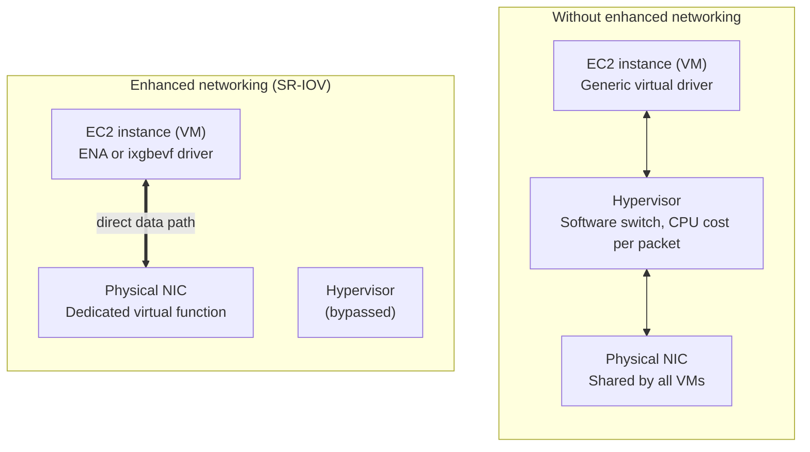
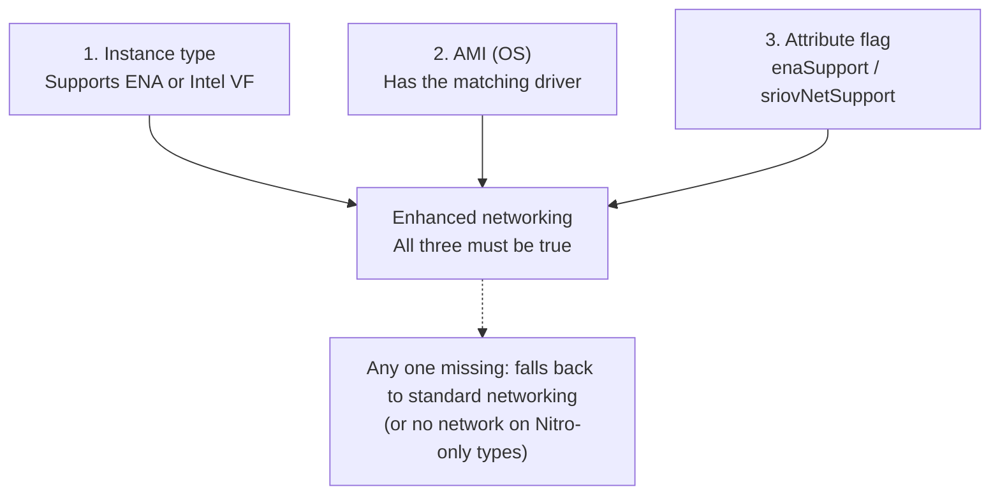
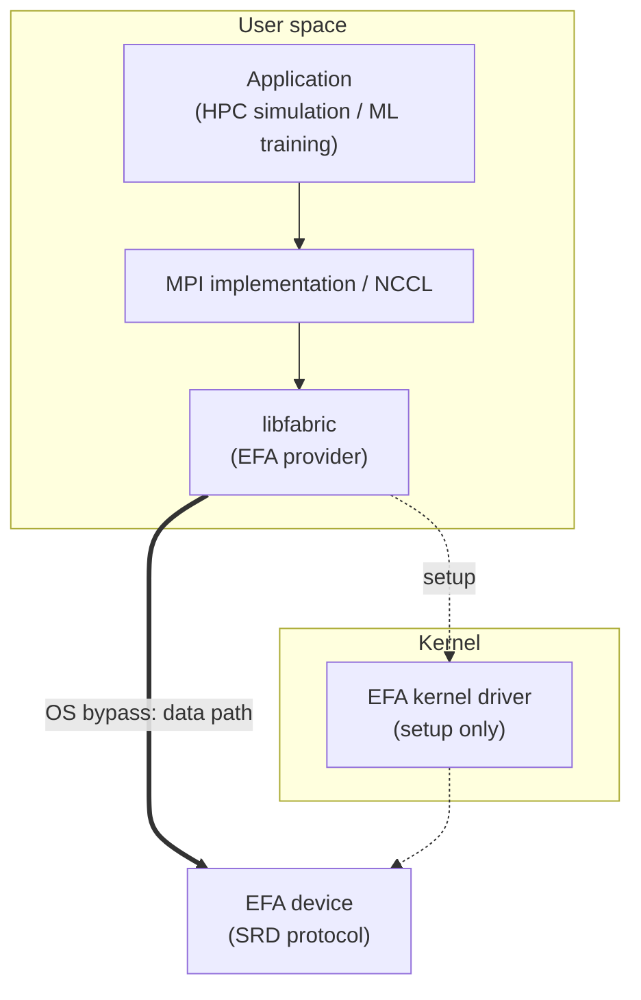
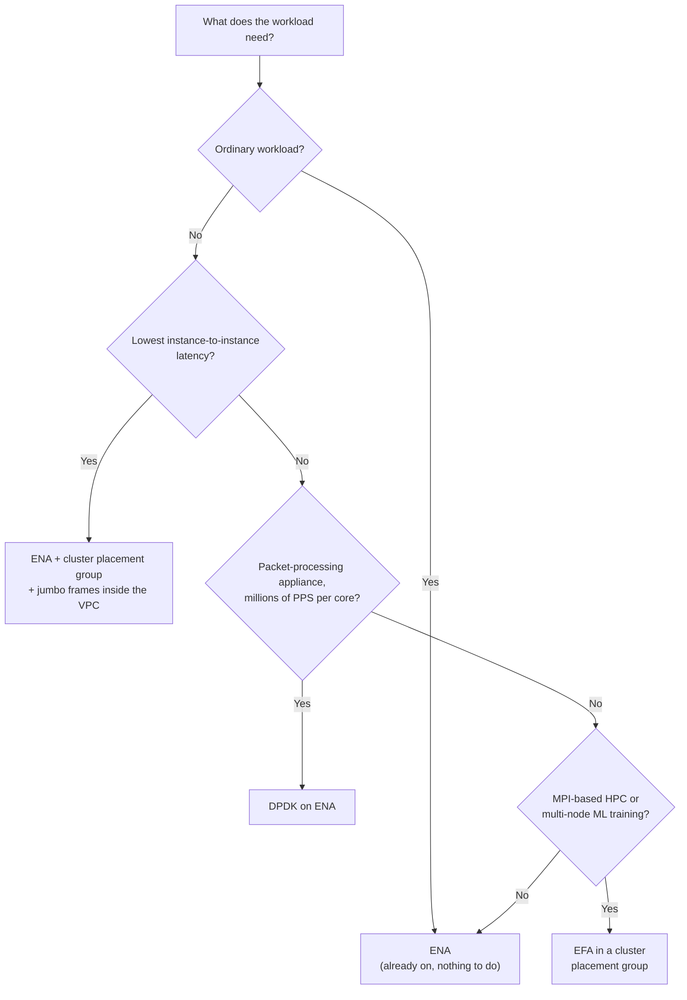

# EC2 Enhanced Networking Guide

**SR-IOV, ENA, Intel VF, DPDK and EFA explained**

A study guide covering how AWS EC2 instances get high-performance networking: what enhanced networking is, how SR-IOV and PCI passthrough make it work, what it requires, which instance types use which driver, how to verify it, and the next levels of tuning with DPDK and the Elastic Fabric Adapter (EFA).

> Companion to `network-performance-guide.md` (bandwidth, latency, jitter, throughput, PPS, MTU, ICMP, jumbo frames, placement groups, EBS-optimized instances) and `aws-bandwidth-limits-guide.md` (VPC, EC2, VPN, Direct Connect and Transit Gateway bandwidth limits).
>
> Diagrams use **Mermaid** (renders on GitHub, GitLab, Obsidian, VS Code with a Mermaid extension) and plain-text ASCII art.

---

## Table of Contents

1. [The Big Picture](#1-the-big-picture)
2. [What Is Enhanced Networking?](#2-what-is-enhanced-networking)
3. [SR-IOV and PCI Passthrough](#3-sr-iov-and-pci-passthrough)
4. [Prerequisites](#4-prerequisites)
5. [Supported Instance Types](#5-supported-instance-types)
6. [Verifying Enhanced Networking](#6-verifying-enhanced-networking)
7. [Default vs Intel VF vs ENA](#7-default-vs-intel-vf-vs-ena)
8. [Additional Tuning: DPDK](#8-additional-tuning-dpdk)
9. [EFA: Elastic Fabric Adapter](#9-efa-elastic-fabric-adapter)
10. [ENA vs DPDK vs EFA](#10-ena-vs-dpdk-vs-efa)
11. [Exam Cheat Sheet](#11-exam-cheat-sheet)
12. [Command Reference](#12-command-reference)

---

## 1. The Big Picture

Every EC2 instance is a virtual machine sharing a physical server and its network card with other VMs. The question this whole topic answers is: **how many software layers does each packet have to pass through on its way between your application and the wire?** Each layer removed means lower latency, more packets per second (PPS), less CPU spent on networking, and more consistent performance.

### How EC2 networking evolved

```
DEFAULT (Xen paravirtual, 'vif' driver)                              ~5 Gbps
┌──────────┐     ┌──────────────────────────┐     ┌─────────┐     ┌─────────┐
│ Instance │ ◄─► │ Xen virtualization layer │ ◄─► │ H/W NIC │ ◄─► │ Network │
└──────────┘     └──────────────────────────┘     └─────────┘     └─────────┘

ENHANCED NETWORKING: Intel 82599 VF ('ixgbevf' driver)          up to 10 Gbps
                 ┌ ─ ─ ─ ─ ─ ─ ─ ─ ─ ─ ─ ─ ─┐
                   Virtualization layer
                 │       (bypassed)          │
                 └ ─ ─ ─ ─ ─ ─ ─ ─ ─ ─ ─ ─ ─┘
┌──────────┐                                  ┌────────────────┐     ┌─────────┐
│ Instance │ ◄══════════════════════════════► │ Intel 82599 VF │ ◄═► │ Network │
└──────────┘                                  └────────────────┘     └─────────┘

ENHANCED NETWORKING: ENA ('ena' driver)                        up to 100 Gbps
                 ┌ ─ ─ ─ ─ ─ ─ ─ ─ ─ ─ ─ ─ ─┐
                   Virtualization layer
                 │       (bypassed)          │
                 └ ─ ─ ─ ─ ─ ─ ─ ─ ─ ─ ─ ─ ─┘
┌──────────┐                                  ┌────────────────┐     ┌─────────┐
│ Instance │ ◄══════════════════════════════► │      ENA       │ ◄═► │ Network │
└──────────┘                                  └────────────────┘     └─────────┘

─── = through the hypervisor (software)     ═══ = direct hardware path
```

### Four levels of optimization

Each level builds on the previous one:

| Level | What it removes from the packet path | Typical use |
|---|---|---|
| Default (Xen PV) | Nothing. Every packet goes through the hypervisor | Very old instance types only |
| Enhanced networking (ENA / Intel VF) | The **hypervisor** | Every modern workload (on by default) |
| DPDK on ENA | The hypervisor **and the OS kernel network stack** | Packet-processing appliances: firewalls, routers, load balancers |
| EFA | The hypervisor **and the OS kernel**, for HPC/ML communication libraries | Tightly coupled HPC (MPI), distributed ML training (NCCL) |

---

## 2. What Is Enhanced Networking?

Enhanced networking gives an EC2 instance near bare-metal network performance by letting it talk to the network hardware directly instead of going through the hypervisor's software switch.



### The problem it solves

Without enhanced networking, the hypervisor sits in the middle of every packet. Its software switch:

- uses host CPU for every packet, which limits **PPS**
- adds delay, which increases **latency**
- slows down when neighboring VMs get busy, causing **jitter** (the noisy-neighbor problem)

### The four key claims

| Claim | What it means |
|---|---|
| Over 1M PPS performance | Packets go straight to hardware, so the instance can process more than a million packets per second. Matters for small-packet workloads: DNS, gaming, trading, busy APIs. |
| Reduces instance-to-instance latency | Fewer software layers per packet. Combined with a cluster placement group, this gives the lowest latency possible between EC2 instances. |
| SR-IOV with PCI passthrough | The hardware mechanism that gets the hypervisor out of the data path and gives each VM its own hardware lane, so performance is consistent. |
| Enabled with ixgbevf or ENA | Two implementations, each needing its matching driver in the OS: Intel 82599 VF (`ixgbevf`) or Elastic Network Adapter (`ena`). |

> **Cost:** Enhanced networking is free. You only need a supported instance type, an AMI with the driver, and the enhanced networking attribute enabled (already set on modern AMIs).

---

## 3. SR-IOV and PCI Passthrough

SR-IOV and PCI passthrough are methods of **device virtualization** (letting many VMs share one physical device) that provide higher I/O performance and lower CPU utilization than software emulation.

| Approach | How it works | Result |
|---|---|---|
| Software emulation (old way) | The hypervisor pretends to be a network card and copies every packet in software | Slow; host CPU used for every packet |
| Hardware-assisted (SR-IOV + passthrough) | The hardware itself is shared; VMs talk to it directly | Fast; almost no CPU overhead |

### SR-IOV: one physical NIC, many vNICs

```
 ┌────────────┐   ┌────────────┐   ┌────────────┐   ┌────────────┐
 │ Hypervisor │   │    VM 1    │   │    VM 2    │   │    VM 3    │
 │ setup only │   │ sees a real│   │ sees a real│   │ sees a real│
 │            │   │    NIC     │   │    NIC     │   │    NIC     │
 └─────┬──────┘   └─────▲──────┘   └─────▲──────┘   └─────▲──────┘
       ┆ config         ║ data           ║ data           ║ data
 ┌─────┼────────────────╫────────────────╫────────────────╫──────┐
 │ ┌───▼────┐     ┌─────▼──────┐   ┌─────▼──────┐   ┌─────▼────┐ │
 │ │   PF   │     │    VF 1    │   │    VF 2    │   │   VF 3   │ │
 │ │ config │     │ data lane  │   │ data lane  │   │ data lane│ │
 │ └────────┘     └────────────┘   └────────────┘   └──────────┘ │
 │                One physical NIC (SR-IOV capable)              │
 └───────────────────────────────────────────────────────────────┘

   SR-IOV makes the slices (VFs); PCI passthrough hands each VF to one VM
```

**SR-IOV = Single Root I/O Virtualization**, a standard from PCI-SIG (the group behind PCI Express). "Single root" means one physical server; "I/O virtualization" means sharing an input/output device. An SR-IOV network card exposes two kinds of functions:

| Function | What it is | Who uses it |
|---|---|---|
| PF (Physical Function) | The full-featured device. It creates and configures VFs. | The hypervisor, for management only |
| VF (Virtual Function) | A lightweight slice of the card with its own queues and hardware data lane | Each VM gets its own |

Each VF looks like a separate network card (a **vNIC**). Because every VF has its own hardware queues, one VM's busy traffic doesn't slow another VM's. That is where the consistent performance comes from.

> **Analogy:** Software emulation is one toll booth (the hypervisor) that every car must pass through. SR-IOV builds a dedicated express lane for each VM.

### PCI passthrough: the VF appears physically attached

Network cards plug into a server's **PCI Express (PCIe)** bus. PCI passthrough takes a PCI device, or here a single VF, and assigns it directly to one VM:

- The guest OS sees what looks like a real network card plugged into its own motherboard.
- It loads a normal hardware driver (**ena** or **ixgbevf**) and talks to the card directly.
- The hypervisor is bypassed for all data traffic.

A hardware feature called the **IOMMU** (Intel VT-d / AMD-Vi) makes this safe: each VM can only access memory belonging to its own VF, so VMs can't read each other's data even though they share one card.

> **Note on "ENI":** Course slides sometimes say passthrough makes the ENI appear attached. Strictly, an **ENI (Elastic Network Interface)** is AWS's logical interface: private IP, security groups, MAC address. What is actually passed through is the **ENA device (a VF)** that carries that ENI's traffic. The ENI is the configuration; the ENA VF is the hardware.

### How they work together

```
SR-IOV          -> splits one NIC into many VFs   (make the slices)
PCI passthrough -> hands each VF to one VM        (deliver the slices)
Result          -> hypervisor bypassed, near bare-metal speed
```

| On its own | Limitation |
|---|---|
| PCI passthrough without SR-IOV | One whole physical card per VM, which doesn't scale |
| SR-IOV without passthrough | VFs exist, but VMs can't reach them directly |
| Both together | Many VMs, each with its own direct hardware lane |

### How AWS does it today: the Nitro System

On current-generation instances, networking runs on a dedicated **Nitro card** that presents ENA devices to each instance using SR-IOV-style hardware virtualization. The hypervisor is minimal and stays out of the data path, which is why enhanced networking is on by default for modern instances.

---

## 4. Prerequisites

Enhanced networking needs support from several places. If any one is missing, the instance silently falls back to slower standard networking.



### The two driver options

| | Option 1: Intel 82599 VF | Option 2: ENA |
|---|---|---|
| Max speed | Up to **10 Gbps** | Up to **100 Gbps** (some newer network-optimized types go higher) |
| Driver in the OS | `ixgbevf` | `ena` |
| Hardware | Intel 82599 card, split using SR-IOV | AWS-designed adapter (Nitro) |
| Instance types | Older generation (C3, C4, D2, I2, R3, M4 except m4.16xlarge) | All current generation |
| Status | Legacy | Current standard |

"ixgbe" is Intel's 10 Gb driver family; "vf" means the virtual-function version of it.

> **Exam trap:** Each instance type supports **either** ENA **or** Intel VF, never both, and you can't choose. The instance type decides. An m4.large needs `ixgbevf`; an m5.large needs `ena`. The AMI must contain the right driver for the instance type you launch.

### The three things to check

1. **Instance type** must support enhanced networking. Nearly every current-generation type supports ENA; very old types (T1, M1) support neither.
2. **AMI / operating system** must have the matching driver installed. Amazon Linux 2/2023, recent Ubuntu, RHEL and AWS Windows Server AMIs already include ENA. Old or custom AMIs may not.
3. **The attribute flag** must be on. This is the "flagged for enhanced networking" setting: `enaSupport = true` for ENA, or `sriovNetSupport = simple` for Intel VF. Modern AWS AMIs already have it set.

> **Common gotcha:** Launching a current-generation (Nitro) instance from an old custom AMI with no ENA driver can leave the instance unable to boot or with no network at all, because these types require ENA. Older Xen types without the driver just fall back to slow networking.

### Enabling it on an older instance

Stop the instance, install the driver inside the OS, then set the flag:

```bash
# ENA
aws ec2 modify-instance-attribute --instance-id i-xxxx --ena-support

# Intel VF
aws ec2 modify-instance-attribute --instance-id i-xxxx --sriov-net-support simple
```

Once enabled, it generally can't be turned off for that instance, so test on a copy or snapshot first.

---

## 5. Supported Instance Types

Course slides list examples like these. The rule to remember is simpler than the lists: **current generation = ENA; a handful of older generations = Intel VF.**

| Driver | Speed | Example instance families |
|---|---|---|
| ENA | Up to 100 Gbps | A1, C5, C5a, C5d, C5n, C6g, F1, G3, G4, H1, I3, I3en, P2, P3, R4, X1, X1e, **m4.16xlarge**, and all newer families (M5+, C5+, R5+, T3+, M6/M7/M8, C6/C7/C8...) |
| Intel 82599 VF | Up to 10 Gbps | C3, C4, D2, I2, R3, **M4 (except m4.16xlarge)** |

> **Remember m4.16xlarge:** It is the classic exception. All other M4 sizes use Intel VF, but m4.16xlarge uses ENA. This shows up in exam questions.

Some newer network-optimized types (for example c6in and c7gn) reach 200 Gbps, and large GPU instances reach far higher aggregate bandwidth using multiple EFA interfaces. To check any type:

```bash
aws ec2 describe-instance-types --instance-types m5.large \
  --query "InstanceTypes[].NetworkInfo.[EnaSupport,NetworkPerformance,EfaSupported]"
```

`EnaSupport` returns `required`, `supported` or `unsupported`.

---

## 6. Verifying Enhanced Networking

Inside a Linux instance, check which driver the network interface is actually using:

```bash
$ ethtool -i eth0
driver: ena          # ENA enhanced networking

$ ethtool -i eth0
driver: ixgbevf      # Intel VF enhanced networking

$ ethtool -i eth0
driver: vif          # NOT enhanced: old Xen paravirtual interface
```

On newer instances the interface may be named `ens5` instead of `eth0`; use `ip link` to list interfaces.

| ethtool shows | Meaning | Typical instance types |
|---|---|---|
| `driver: ixgbevf` | Intel VF enhanced networking (up to 10 Gbps) | C3, C4, D2, I2, R3, M4 (not m4.16xlarge) |
| `driver: ena` | ENA enhanced networking (up to 100 Gbps) | C5, F1, G3, P2, P3, R4, I3, X1, X1e, m4.16xlarge, all current generation |
| `driver: vif` | No enhanced networking | Old Xen instances without the driver or flag |

### Other checks

```bash
# Is the driver installed in the OS?
modinfo ena
modinfo ixgbevf

# Is the ENA flag set on the instance? (AWS CLI)
aws ec2 describe-instances --instance-ids i-xxxx \
  --query "Reservations[].Instances[].EnaSupport"

# Does the AMI have the ENA flag?
aws ec2 describe-images --image-ids ami-xxxx --query "Images[].EnaSupport"

# Intel VF flag
aws ec2 describe-instance-attribute --instance-id i-xxxx --attribute sriovNetSupport
```

---

## 7. Default vs Intel VF vs ENA

Three course diagrams show the same two servers talking, with progressively fewer layers in between (see the diagram in [Section 1](#how-ec2-networking-evolved)).

### EC2 networking: default (about 5 Gbps)

On older Xen-based instances without enhanced networking, the guest uses a **Xen paravirtual (PV)** network driver (`vif`). Each packet goes from the instance into the **virtualization layer** (hypervisor), which processes it in software and then hands it to the shared hardware NIC. The hypervisor's software work caps throughput (around 5 Gbps on the slide) and adds latency and jitter.

### Enhanced networking with Intel VF (up to 10 Gbps)

The virtualization layer is drawn dashed: it is **bypassed**. The instance's `ixgbevf` driver talks directly to an **82599 Virtual Function** on the hardware NIC, using SR-IOV. Speed rises to 10 Gbps, with much lower latency and CPU use.

### Enhanced networking with ENA (up to 100 Gbps)

Same bypass idea, but with AWS's own **Elastic Network Adapter** on the Nitro card, using the `ena` driver. It scales to 100 Gbps and is the default on every current-generation instance.

| | Default (Xen PV) | Intel 82599 VF | ENA |
|---|---|---|---|
| Driver | `vif` (netfront) | `ixgbevf` | `ena` |
| Hypervisor in data path? | Yes | No (bypassed) | No (bypassed) |
| Max speed | ~5 Gbps | 10 Gbps | 100 Gbps |
| Latency / jitter | Higher | Low | Lowest |
| Status | Obsolete | Legacy | Current standard |

---

## 8. Additional Tuning: DPDK

**DPDK (Data Plane Development Kit)**, originally from Intel and now an open-source Linux Foundation project, is a set of libraries and drivers for very fast packet processing in user space.

### Where DPDK fits

Enhanced networking removes the **hypervisor** overhead (between instance and host). But inside the instance, packets still go through the **OS kernel** network stack: system calls, memory copies between kernel and application, interrupts and context switches. DPDK removes that second layer of overhead.

| Technology | Removes overhead between... | Where |
|---|---|---|
| Enhanced networking / SR-IOV | The instance and the hypervisor | Host level |
| DPDK | The application and the network card, inside the guest OS (kernel bypass) | Inside the operating system |

### Packet path: standard kernel vs DPDK vs EFA

```
     STANDARD (kernel)            DPDK                       EFA (Linux)

   ┌────────────────────┐   ┌────────────────────┐   ┌────────────────────┐
   │    Application     │   │    Application     │   │    Application     │
   └─────────▲──────────┘   └─────────▲──────────┘   └─────────▲──────────┘
             │ syscalls,              ║                        ║
             │ copies,                ║                ┌───────▼────────────┐
             │ interrupts             ║                │    MPI / NCCL      │
             │                        ║                └─────────▲──────────┘
             │              ┌─────────▼──────────┐   ┌───────────▼────────┐
             │              │  DPDK + ENA PMD    │   │     libfabric      │
             │              │ (poll-mode driver) │   │   (EFA provider)   │
             │              └─────────▲──────────┘   └─────────▲──────────┘
 user space  │                        ║                        ║
 ─ ─ ─ ─ ─ ─ ┼ ─ ─ ─ ─ ─ ─ ─ ─ ─ ─ ─ ─ ║ ─ ─ ─ ─ ─ ─ ─ ─ ─ ─ ─ ─ ─║─ ─ ─ ─ ─ ─ ─
 kernel      │                        ║   ┌ ─ ─ ─ ─ ┐          ║  ┌ ─ ─ ─ ─ ─ ┐
   ┌─────────▼──────────┐             ║     Kernel             ║    EFA driver
   │ Kernel TCP/IP stack│             ║   │ bypassed │         ║  │ setup only │
   └─────────▲──────────┘             ║   └ ─ ─ ─ ─ ┘          ║  └ ─ ─ ─ ─ ─ ┘
   ┌─────────▼──────────┐             ║                        ║
   │  ENA kernel driver │             ║                        ║
   └─────────▲──────────┘             ║                        ║
   ┌─────────▼──────────┐   ┌─────────▼──────────┐   ┌─────────▼──────────┐
   │     ENA device     │   │     ENA device     │   │     EFA device     │
   └────────────────────┘   └────────────────────┘   └────────────────────┘

   │ = through the kernel        ║ = direct path (kernel bypassed)
```

### Packet processing without DPDK

The application asks the **kernel** to send or receive. The kernel's TCP/IP stack and the ENA kernel driver handle the packet, which then crosses the VF to the ENA device at up to 100 Gbps. Every packet costs syscalls, copies and interrupts. At millions of packets per second, this kernel work becomes the bottleneck.

### Packet processing with DPDK

DPDK moves the driver into **user space**. The ENA device is detached from the kernel and handed to DPDK's **ENA poll-mode driver (PMD)**. The application then reads and writes packets directly from the NIC's queues:

- **Kernel bypass:** no syscalls, no kernel TCP/IP stack, so lower latency.
- **Polling instead of interrupts:** dedicated CPU cores continuously poll the NIC queues, avoiding interrupt overhead.
- **Zero-copy and huge pages:** packets land in pre-allocated memory the application reads directly.
- **More control:** the application decides exactly how each packet is processed.
- **Lower CPU overhead per packet**, so far higher PPS per core.

> **Trade-offs:** DPDK cores run at 100% CPU even when idle (busy polling), you lose the kernel's TCP/IP stack and normal tools (the application must handle protocols itself), and the interface is no longer visible to the OS. It suits packet-processing appliances, not ordinary web apps.

### Typical DPDK use cases on EC2

- Virtual firewalls, routers and NAT appliances
- Software load balancers and packet brokers
- Telecom / 5G user-plane functions (network function virtualization)
- Packet capture, inspection and traffic generators

AWS supports DPDK on ENA through the ENA PMD included in DPDK (`net/ena`).

---

## 9. EFA: Elastic Fabric Adapter

**EFA is an ENA with added capabilities** for high-performance computing (HPC) and machine learning. It provides lower latency, higher throughput and more consistent performance for tightly coupled workloads where thousands of processes constantly exchange messages.

### Key points

- **EFA = ENA + OS bypass.** It still does everything ENA does (normal IP traffic), plus a special low-latency path.
- **OS bypass is Linux only.** On Windows, an EFA acts just like an ENA.
- HPC applications use **MPI** (Message Passing Interface), and ML training uses **NCCL**. Both talk to the **libfabric** API, which communicates directly with the EFA device, bypassing the OS kernel, to put packets on the network.
- The **EFA kernel driver** is used only for setup (creating queues, registering memory). Data never passes through the kernel.
- EFA uses AWS's **SRD (Scalable Reliable Datagram)** protocol, which sprays packets across many network paths and recovers from loss quickly, giving consistently low tail latency.

### The EFA software stack



| Layer | Space | Role |
|---|---|---|
| Application | User | Your HPC simulation or ML training job |
| MPI implementation / NCCL | User | Communication library: Open MPI, Intel MPI; NCCL with the aws-ofi-nccl plugin |
| libfabric | User | Open Fabrics Interfaces API with an EFA provider; talks to the device directly |
| EFA kernel driver | Kernel | Setup only; not in the data path |
| EFA device | Hardware | Puts packets on the network using SRD |

### Supported instances and requirements

The course slide names **c5n.18xlarge** and **p3dn.24xlarge** as examples. Many more support it today, mainly large compute-, network- and GPU-optimized sizes (HPC and P-series GPU families). Check with:

```bash
aws ec2 describe-instance-types \
  --filters Name=network-info.efa-supported,Values=true \
  --query "InstanceTypes[].InstanceType"
```

- Use a **cluster placement group** to get the lowest latency between nodes.
- The **security group** must allow all inbound and outbound traffic to and from itself (EFA nodes talk to each other on all ports).
- **EFA OS-bypass traffic is not routable**: nodes must be in the same subnet. Normal IP traffic over the EFA works like ENA.
- Install the EFA software (driver, libfabric, MPI) with the AWS **EFA installer**, or use an AMI that includes it (e.g. Deep Learning AMIs).
- Attach the EFA as a network interface of type `efa`, usually at launch:

```bash
aws ec2 run-instances --instance-type c5n.18xlarge ... \
  --placement "GroupName=my-cluster" \
  --network-interfaces "DeviceIndex=0,InterfaceType=efa,SubnetId=subnet-xxxx,Groups=sg-xxxx"

# Verify inside the instance
fi_info -p efa
```

---

## 10. ENA vs DPDK vs EFA

| | ENA | ENA + DPDK | EFA |
|---|---|---|---|
| What it is | Enhanced networking adapter | User-space packet library on ENA | ENA plus OS-bypass HPC interface |
| Bypasses hypervisor | Yes | Yes | Yes |
| Bypasses OS kernel | No | Yes | Yes (Linux, via libfabric) |
| App changes needed | None | Yes: app built on DPDK | Use MPI / NCCL with libfabric |
| Best for | Everything (default) | Packet appliances: firewalls, routers, LBs, NFV | Tightly coupled HPC, distributed ML training |
| Windows | Yes | Not typical | Acts as plain ENA |
| Cost | Free | Free (open source) | Free (supported types only) |

### Decision guide



1. Any normal workload: **ENA** (already on). Nothing to do.
2. Need lowest instance-to-instance latency: add a **cluster placement group** (and jumbo frames inside the VPC).
3. Building a packet-processing appliance that needs millions of PPS per core: **DPDK on ENA**.
4. Running MPI-based HPC or multi-node ML training: **EFA** in a cluster placement group.

---

## 11. Exam Cheat Sheet

| If the question mentions... | Answer |
|---|---|
| High PPS, low latency between instances, SR-IOV | Enhanced networking (ENA) |
| One NIC appears as many vNICs | SR-IOV virtual functions |
| Device appears physically attached to the guest | PCI passthrough |
| Up to 10 Gbps, ixgbevf, C3/C4/M4/R3/I2/D2 | Intel 82599 VF |
| Up to 100 Gbps, ena driver, current generation | Elastic Network Adapter (ENA) |
| m4.16xlarge | ENA (the M4 exception) |
| Check which driver is in use | `ethtool -i eth0` |
| `driver: vif` | Enhanced networking NOT active |
| Prerequisites | Supported instance type + AMI with driver + attribute flag (enaSupport / sriovNetSupport) |
| Kernel bypass for packet processing inside the OS | DPDK |
| HPC, MPI, OS bypass, libfabric | EFA |
| EFA on Windows | Behaves like ENA (no OS bypass) |
| Extra cost for enhanced networking | None |

### Key numbers

| Item | Value |
|---|---|
| Default Xen PV networking | ~5 Gbps |
| Intel 82599 VF | Up to 10 Gbps |
| ENA | Up to 100 Gbps (higher on some newer types) |
| Enhanced networking PPS | Over 1 million PPS |
| Single flow inside a cluster placement group | Up to 10 Gbps (5 Gbps outside) |

---

## 12. Command Reference

| Task | Command |
|---|---|
| Driver in use | `ethtool -i eth0` |
| ENA driver installed? | `modinfo ena` |
| Intel VF driver installed? | `modinfo ixgbevf` |
| Instance ENA flag | `aws ec2 describe-instances --instance-ids i-xxxx --query "Reservations[].Instances[].EnaSupport"` |
| AMI ENA flag | `aws ec2 describe-images --image-ids ami-xxxx --query "Images[].EnaSupport"` |
| Intel VF flag | `aws ec2 describe-instance-attribute --instance-id i-xxxx --attribute sriovNetSupport` |
| Enable ENA (stopped) | `aws ec2 modify-instance-attribute --instance-id i-xxxx --ena-support` |
| Enable Intel VF (stopped) | `aws ec2 modify-instance-attribute --instance-id i-xxxx --sriov-net-support simple` |
| Instance type network info | `aws ec2 describe-instance-types --instance-types <type> --query "InstanceTypes[].NetworkInfo"` |
| List EFA-capable types | `aws ec2 describe-instance-types --filters Name=network-info.efa-supported,Values=true` |
| Verify EFA | `fi_info -p efa` |
| Interface stats / drops | `ethtool -S eth0` |

> AWS instance capabilities and limits change over time. Confirm current values in the Amazon EC2 User Guide sections on enhanced networking, ENA and EFA.
