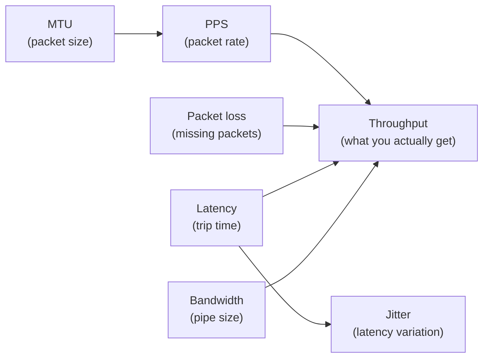
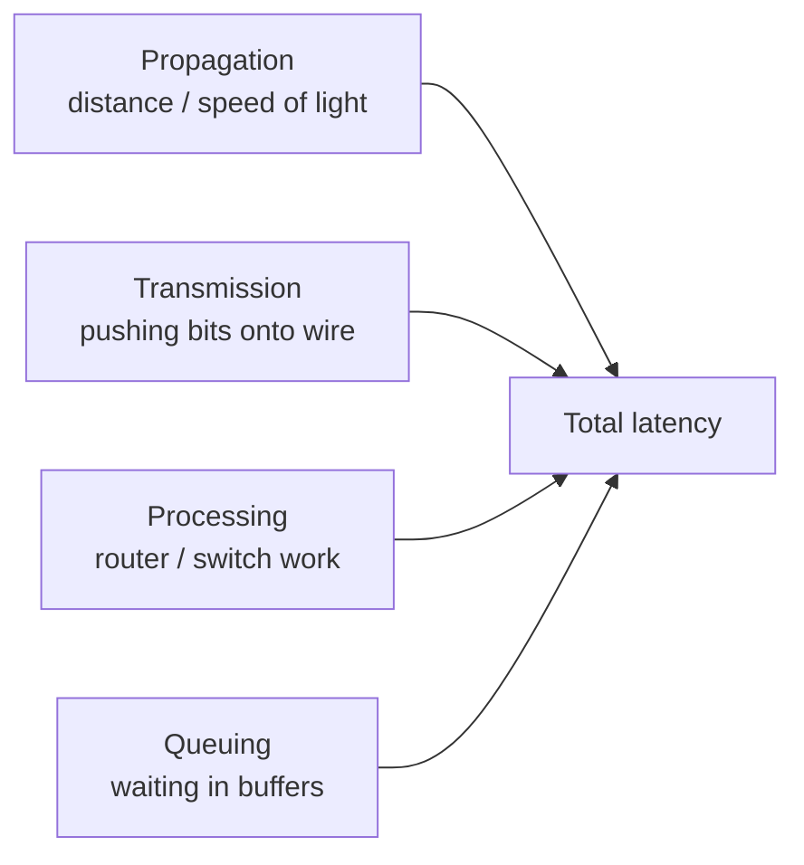
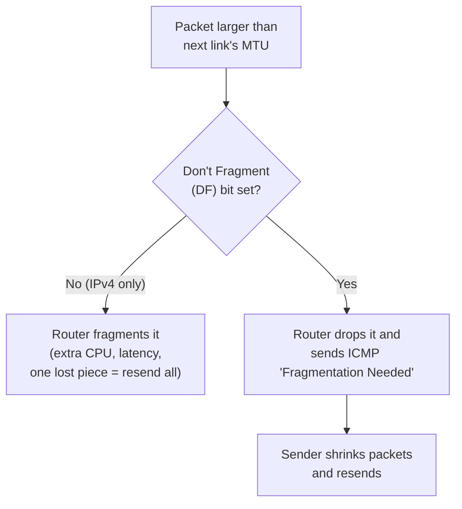
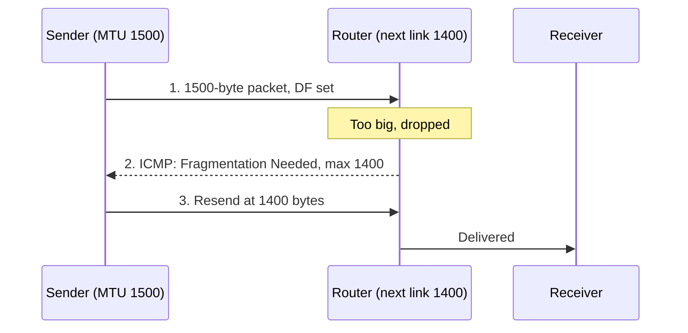
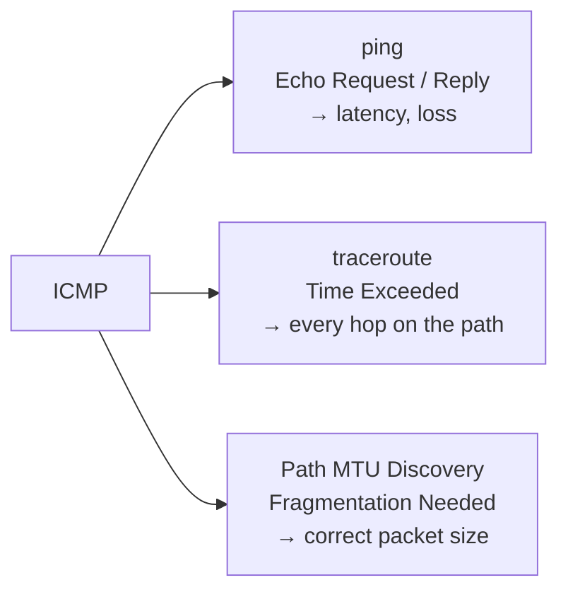
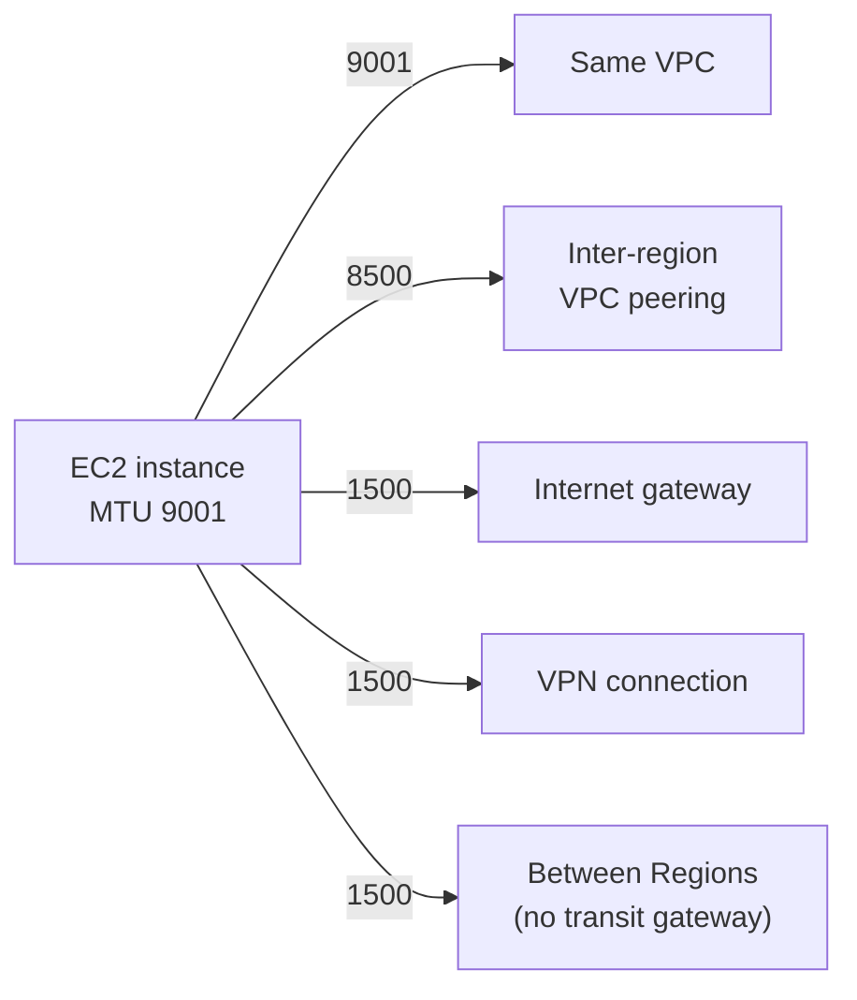
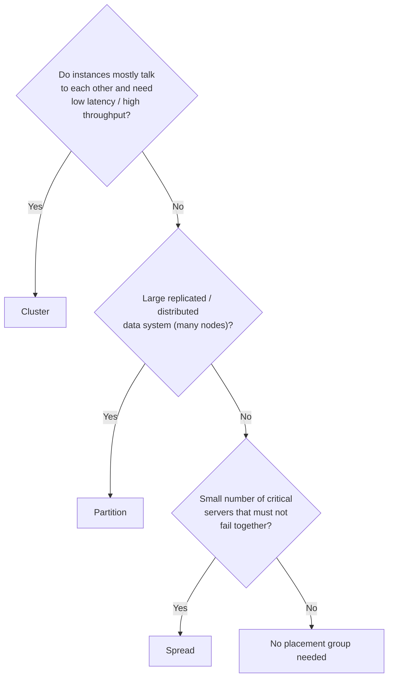
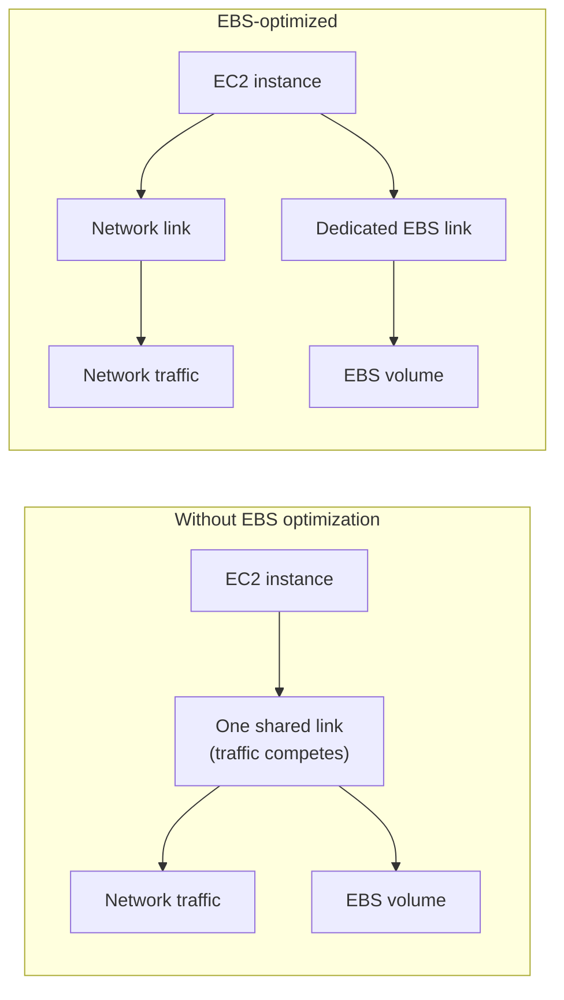
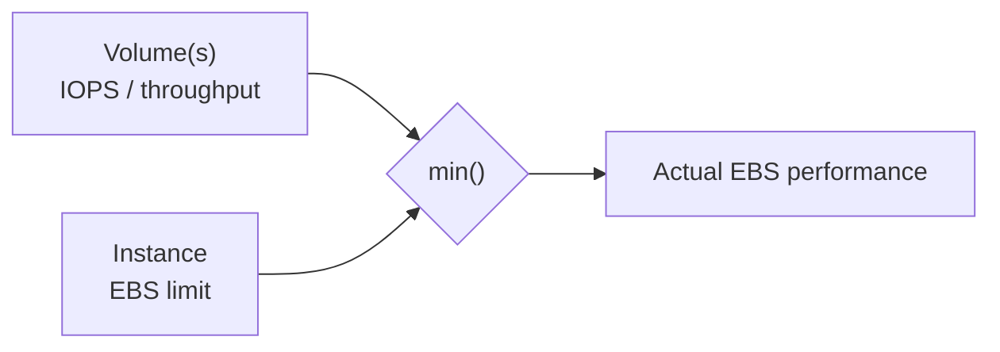

# Network Performance & AWS EC2 Networking Guide

A study guide covering core network performance metrics (bandwidth, latency, jitter, throughput, PPS), packet sizing (MTU, ICMP, jumbo frames), and how these apply in AWS EC2 (MTU settings, placement groups, EBS-optimized instances).

> Diagrams use **Mermaid** (renders on GitHub, GitLab, Obsidian, VS Code with a Mermaid extension, Notion, etc.) and plain-text ASCII art.

---

## Table of Contents

1. [How the Metrics Fit Together](#1-how-the-metrics-fit-together)
2. [Bandwidth](#2-bandwidth)
3. [Latency](#3-latency)
4. [Jitter](#4-jitter)
5. [Throughput](#5-throughput)
6. [PPS (Packets Per Second)](#6-pps-packets-per-second)
7. [MTU (Maximum Transmission Unit)](#7-mtu-maximum-transmission-unit)
8. [ICMP](#8-icmp)
9. [Jumbo Frames](#9-jumbo-frames)
10. [MTU in AWS EC2](#10-mtu-in-aws-ec2)
11. [EC2 Placement Groups](#11-ec2-placement-groups)
12. [EBS-Optimized Instances](#12-ebs-optimized-instances)
13. [Cheat Sheet](#13-cheat-sheet)
14. [Command Reference](#14-command-reference)
15. [Sources](#15-sources)

---

## 1. How the Metrics Fit Together



| Metric | Question it answers | Unit |
|---|---|---|
| Bandwidth | How big is the pipe? | bps (Mbps, Gbps) |
| Throughput | How much data actually flows? | bps |
| Latency | How long does the trip take? | ms |
| Jitter | How consistent is the trip time? | ms |
| Packet loss | How much goes missing? | % |
| PPS | How many packets are processed per second? | packets/s |
| MTU | How big can one packet be? | bytes |

**Highway analogy:** bandwidth is the number of lanes, latency is the length of the road, jitter is how unpredictable the traffic is, throughput is how many cars actually arrive per hour, and PPS is how many cars the toll booth can process.

---

## 2. Bandwidth

**Bandwidth** is the maximum amount of data a link *can* carry per second. It is a capacity, not a measurement of actual traffic.

- Measured in bits per second: Mbps, Gbps.
- Note: **bits vs bytes**. 1 Gbps = 125 MB/s (divide by 8).

### Bandwidth-Delay Product (BDP)

The amount of data "in flight" on a link at any moment:

```
BDP = Bandwidth × Round-trip time

Example: 100 Mbps × 50 ms = 5,000,000 bits ≈ 625 KB
```

If the TCP window is smaller than the BDP, the sender can't keep the pipe full, so a fast link over a long distance feels slow.

### Common causes of poor performance

- Congested links
- Wi-Fi interference
- Duplex mismatch
- ISP throttling
- Undersized TCP buffers
- A slow link somewhere in the path (bottleneck)

---

## 3. Latency

**Latency** is the time it takes data to travel from source to destination, in milliseconds. It's usually reported as **RTT (round-trip time)**, which is what `ping` shows.

### Where latency comes from



1. **Propagation delay:** light in fiber covers about 200 km per ms. New York to London (~5,600 km) is about 28 ms one way. This can't be optimized away.
2. **Transmission delay:** time to put the packet's bits on the wire. Higher on slow links.
3. **Processing delay:** routers and switches inspecting and forwarding packets.
4. **Queuing delay:** waiting in buffers on busy links. The most variable part and the main cause of lag spikes (bufferbloat).

### Typical RTT values

| Connection | Typical RTT |
|---|---|
| Local network (LAN) | < 1 ms |
| Same city | 5–20 ms |
| Cross-country (US) | 60–80 ms |
| Transatlantic | 70–100 ms |
| 4G / 5G mobile | 20–60 ms |
| Geostationary satellite | 600+ ms |
| Low-orbit satellite | 25–60 ms |

### Why it matters

- **Gaming / video calls:** < 50 ms feels great; > 150 ms is noticeable.
- **Web browsing:** a page load needs many round trips (DNS, TCP handshake, TLS, requests), so latency often matters more than bandwidth.
- **TCP throughput:** high latency slows TCP's ramp-up.

### How to reduce it

- Use wired instead of Wi-Fi
- Use servers / CDNs closer to users
- Enable QoS or SQM (fq_codel, CAKE) on the router to fix bufferbloat
- Avoid unnecessary VPN hops

---

## 4. Jitter

**Jitter** is the *variation* in latency between packets. Latency is how long the trip is; jitter is how consistent it is.

```
Packet:    1      2      3      4
Latency:  30ms   32ms   70ms   31ms
                         ^
                    jitter spike
```

Differences between consecutive packets: 2, 38, 39 ms, so average jitter ≈ 26 ms. RTP (used by VoIP) uses a smoothed running version of this (RFC 3550).

### Why it matters

| Affected | Symptom |
|---|---|
| VoIP / video calls | Choppy or robotic audio, frozen frames |
| Online gaming | Rubber-banding, inconsistent hit registration |
| Live streaming | Buffering |
| Downloads / browsing | Barely affected (TCP buffers and reorders) |

**Acceptable:** < 30 ms is fine for voice/video; > 50 ms usually causes problems.

### Causes and fixes

| Causes | Fixes |
|---|---|
| Congestion / bufferbloat | SQM / fq_codel on router |
| Wi-Fi interference | Wired connection |
| Packets taking different routes | QoS prioritizing voice/video |
| Overloaded routers | Don't saturate the link during calls |
| Mobile tower handoffs | Jitter buffers in apps |

---

## 5. Throughput

**Throughput** is the amount of data *actually delivered* per second.

| Term | Meaning |
|---|---|
| Bandwidth | Theoretical capacity |
| Throughput | Actual data rate, including headers |
| Goodput | Useful application data only (no headers, no retransmits) |

```
Bandwidth  ≥  Throughput  ≥  Goodput
```

### Why throughput < bandwidth

1. Protocol overhead (Ethernet + IP + TCP headers ≈ 3–5%)
2. Latency (TCP waits for acknowledgments)
3. Packet loss (retransmissions; TCP slows down)
4. Congestion from shared links
5. Bottleneck: the slowest link sets the limit
6. Device limits: CPU, disk, NIC, Wi-Fi radio

### Formula 1: window-limited throughput

```
Max throughput = TCP window size ÷ RTT

Example: 64 KB ÷ 0.1 s = 640 KB/s ≈ 5.2 Mbps
(even on a 1 Gbps link!)
```

### Formula 2: loss-limited throughput (Mathis formula)

```
Throughput ≈ (MSS ÷ RTT) × (1.22 ÷ √loss)

Example: MSS 1460 B, RTT 50 ms, 1% loss ≈ 2.9 Mbps
```

### How to improve throughput

- Reduce packet loss (fix Wi-Fi, cables, duplex mismatches)
- Enable TCP window scaling; increase buffer sizes on high-latency links
- Use parallel streams (`iperf3 -P 4`, multi-part downloads)
- Use modern congestion control (BBR)
- Find and upgrade the bottleneck link

---

## 6. PPS (Packets Per Second)

**PPS** is the number of packets a device or link processes per second. Each packet costs roughly the same processing (route lookup, firewall checks, memory copies) **regardless of size**, so PPS is often the real limit for routers, firewalls, and servers.

```
Same 1 Gbps of bandwidth:

Large packets (1500 B):  [████████] [████████] [████████]     ~81,000 pps   → easy
Small packets (64 B):    [█][█][█][█][█][█][█][█][█][█][█]   ~1,490,000 pps → hard
```

### Line-rate PPS formula

Each Ethernet frame carries 20 extra bytes on the wire (8 B preamble + 12 B inter-frame gap):

```
PPS = Link speed (bps) ÷ ((frame size + 20) × 8)

64-byte frames on 1 Gbps:
(64 + 20) × 8 = 672 bits  →  1,000,000,000 ÷ 672 ≈ 1,488,095 pps
```

| Link speed | 64-byte frames (max) | 1518-byte frames |
|---|---|---|
| 100 Mbps | 148,810 | 8,127 |
| 1 Gbps | 1.49 million | 81,274 |
| 10 Gbps | 14.88 million | 812,744 |
| 100 Gbps | 148.8 million | 8.13 million |

### Where PPS matters

- **Routers / firewalls:** vendors quote PPS ratings
- **DDoS attacks:** small-packet floods exhaust CPU without using much bandwidth
- **VoIP / gaming / DNS:** many small packets
- **Cloud VMs:** often have PPS limits separate from bandwidth caps

### How to improve PPS capacity

- NIC offloads (RSS spreads packets across CPU cores, checksum offload)
- Kernel bypass (DPDK, XDP)
- Interrupt coalescing, larger NIC ring buffers
- Hardware forwarding (ASICs)
- Simpler firewall rule sets
- Larger MTU (fewer packets for the same data)

---

## 7. MTU (Maximum Transmission Unit)

**MTU** is the largest packet, in bytes, that a link can carry in one piece. Standard Ethernet MTU = **1500 bytes**.

### Anatomy of a full-size packet

```
|<------------------- Ethernet frame = 1518 bytes ------------------->|
         |<--------------- MTU = 1500 bytes --------------->|
                         |<------ MSS = 1460 bytes ------->|
+--------+-------+-------+---------------------------------+---------+
|  Eth   |  IP   |  TCP  |        Payload (your data)      |   FCS   |
|  14 B  | 20 B  | 20 B  |            1460 B               |   4 B   |
+--------+-------+-------+---------------------------------+---------+
```

### MTU vs MSS

```
MSS = MTU − IP header (20) − TCP header (20)
    = 1500 − 20 − 20
    = 1460 bytes
```

- **MTU** = the whole IP packet (headers + data)
- **MSS** = only the TCP payload

### Common MTU values

| Network type | MTU |
|---|---|
| Standard Ethernet | 1500 |
| Jumbo frames | 9000 |
| AWS EC2 inside a VPC | 9001 |
| PPPoE (DSL / some fiber) | 1492 |
| GRE tunnel | 1476 |
| VXLAN | 1450 |
| WireGuard | 1420 |
| IPsec VPN | ~1400 (varies) |
| IPv6 minimum | 1280 |

Every tunnel or encapsulation adds headers and shrinks the space left for data.

### What happens when a packet is too big



IPv6 routers **never** fragment; the sender must size packets correctly.

### Path MTU Discovery (PMTUD)

The sender discovers the smallest MTU along the whole path:



### The MTU black hole

If a firewall blocks the ICMP "Fragmentation Needed" message, the sender never learns to shrink its packets:

- Small traffic works (ping, SSH login, part of a page)
- Large traffic hangs (big downloads, some HTTPS sites, file transfers over VPN)

**Fixes:**
- Allow ICMP type 3 code 4 (IPv4) and ICMPv6 type 2 "Packet Too Big"
- Use **MSS clamping** on the router or VPN so TCP packets fit from the start

### Testing path MTU

Ping payload = MTU − 28 (20 B IP header + 8 B ICMP header):

```bash
# Linux
ping -M do -s 1472 example.com

# Windows
ping -f -l 1472 example.com

# macOS
ping -D -s 1472 example.com
```

If 1472 works, path MTU = 1500. If it fails, lower the size until it works, then add 28.

### MTU and efficiency

| MTU | TCP/IPv4 payload efficiency |
|---|---|
| 576 | ~93% |
| 1500 | ~97% |
| 9000 | ~99.5% |

---

## 8. ICMP

**ICMP (Internet Control Message Protocol)** is the network's built-in messaging system. It doesn't carry application data; it carries **status and error reports** about delivering that data.

- Works at the network layer alongside IP
- Has no ports (unlike TCP/UDP)
- Each message is identified by a **type** and a **code**

### Common ICMP messages

| Type | Name | Meaning |
|---|---|---|
| 0 | Echo Reply | "Yes, I'm here" (ping reply) |
| 3 | Destination Unreachable | Can't deliver. **Code 4 = Fragmentation Needed** (MTU) |
| 5 | Redirect | "Use a better route" |
| 8 | Echo Request | "Are you there?" (what ping sends) |
| 11 | Time Exceeded | TTL ran out (used by traceroute) |

**ICMPv6** (for IPv6) uses type 2 **"Packet Too Big"** for MTU, and is also required for neighbor discovery, so it's even more essential.

### Tools built on ICMP



**How traceroute works:** it sends packets with TTL = 1, 2, 3, … Each router that decrements TTL to 0 drops the packet and replies with "Time Exceeded," revealing itself.

### Should you block ICMP?

Blocking all ICMP breaks MTU discovery and troubleshooting. Best practice:

| Action | ICMP types |
|---|---|
| **Allow** | Type 3 (especially code 4), type 11, ICMPv6 Packet Too Big |
| **Rate-limit / restrict** | Echo Request (type 8) from the internet |
| **Block** | Redirect (type 5) from untrusted sources |

---

## 9. Jumbo Frames

**Jumbo frames** are Ethernet frames with an MTU larger than 1500 bytes, typically **9000 bytes**.

```
Sending ~9000 bytes of data:

Standard MTU 1500 (6 packets):
[H|data][H|data][H|data][H|data][H|data][H|data]
  → 6 headers, 6 lookups, 6 interrupts

Jumbo MTU 9000 (1 packet):
[H|..................data..................]
  → 1 header, 1 lookup, 1 interrupt
```

### Numbers at 10 Gbps

| | Standard (1500) | Jumbo (9000) |
|---|---|---|
| Max packets per second | ~812,000 | ~138,000 |
| TCP payload efficiency | ~94.9% | ~99.1% |
| CPU / interrupt load | Higher | ~6× fewer packets |

### Benefits

- Lower CPU usage on servers, firewalls, switches (fewer packets → lower PPS)
- Slightly higher throughput (less header overhead)
- Faster bulk transfers (backups, storage, VM migration)

### The catch: every device must match

Every NIC, switch, and router interface in the path must support the same jumbo MTU. If one device is still at 1500, large packets are dropped, causing the same black-hole symptoms as in the MTU section.

**Jumbo frames are never used on the public internet.**

### Where they're used

- Storage networks (iSCSI, NFS, SMB, Ceph)
- Data center / cluster backbones
- Virtualization (vMotion, Hyper-V live migration)
- HPC and backup networks
- Cloud: AWS supports 9001 MTU inside a VPC

### Enable and test

```bash
# Linux: set MTU
sudo ip link set eth0 mtu 9000

# Test end to end (9000 − 28 = 8972)
ping -M do -s 8972 <other-server>

# Windows
ping -f -l 8972 <other-server>
```

If 8972 fails but 1472 works, something in the path is still at 1500. Switches often use 9216 to leave room for VLAN tags.

**Rule of thumb:** jumbo frames on isolated, fully controlled networks with heavy bulk traffic; 1500 everywhere else.

---

## 10. MTU in AWS EC2

MTU is set **inside the instance's operating system**, not in the AWS console or VPC settings. All EC2 instance types support 1500 MTU, and all current-generation types support jumbo frames (9001 MTU). Many Linux AMIs come up at 9001 by default.

### MTU limits by traffic path



| Traffic path | Max MTU |
|---|---|
| Within the same VPC | 9001 |
| Inter-region VPC peering | 8500 |
| Internet gateway | 1500 |
| VPN connections | 1500 |
| Between Regions (without transit gateway) | 1500 |
| Direct Connect | Supports jumbo frames (see AWS Direct Connect docs) |
| Transit Gateway, NAT gateway, Local Zones, Wavelength, Outposts | See each service's MTU docs |

### Check the MTU

```bash
# Linux (interface may be eth0 or ens5)
ip link show eth0
# look for "mtu 9001"

# Path MTU to a destination
tracepath amazon.com
# typically shows pmtu 9001 locally, then pmtu 1500 at the VPC gateway
```

```powershell
# Windows (ENA driver 2.1.0+): look for *JumboPacket (9015 = jumbo enabled)
Get-NetAdapterAdvancedProperty -Name "Ethernet*"
```

### Set the MTU (Linux)

Temporary:

```bash
sudo ip link set dev eth0 mtu 1500
```

Persistent:

**Amazon Linux 2023:** edit `/usr/lib/systemd/network/80-ec2.network` (or a custom `.network` file under `/run/systemd/network/`):

```ini
[Link]
MTUBytes=1500
```

**Amazon Linux 2:** add to `/etc/sysconfig/network-scripts/ifcfg-eth0`:

```
MTU=1500
```

Also update `/etc/dhcp/dhclient.conf` so DHCP doesn't override it (see the AWS guide for the exact `request` line).

**Ubuntu (netplan):** edit `/etc/netplan/50-cloud-init.yaml`:

```yaml
network:
  ethernets:
    ens5:
      mtu: 1500
```

Then run `sudo netplan apply`.

### Set the MTU (Windows, ENA driver 2.1.0+)

```powershell
# Enable jumbo frames
Set-NetAdapterAdvancedProperty -Name "Ethernet" -RegistryKeyword "*JumboPacket" -RegistryValue 9015

# Disable (back to standard)
Set-NetAdapterAdvancedProperty -Name "Ethernet" -RegistryKeyword "*JumboPacket" -RegistryValue 1514
```

(9015 / 1514 include the Ethernet header.)

### Best of both worlds: per-route MTU

Keep 9001 for VPC traffic, but cap internet-bound traffic at 1500:

```bash
sudo ip route replace default via <gateway-ip> dev eth0 mtu 1500
```

Alternatively, use multiple network interfaces (ENIs) with different MTUs and routes.

### Don't block ICMP

PMTUD needs ICMP "Fragmentation Needed" (type 3, code 4) and ICMPv6 "Packet Too Big" to reach the instance.

- Add an inbound security group rule for **ICMP – Destination Unreachable**
- Check **network ACLs** too: they can block ICMP even when the security group allows it

### When to change it

| Situation | MTU |
|---|---|
| Cluster workloads, instance-to-instance in a VPC | Keep 9001 |
| Mostly VPN, VPN appliance, or internet traffic with hangs on large transfers | Drop to 1500 (or use per-route MTU) |

---

## 11. EC2 Placement Groups

A **placement group** controls *where physically* AWS places your instances. Each rack has its own network and power, so a rack failure takes down everything on it.

```
CLUSTER                 PARTITION                    SPREAD
(packed for speed)      (rack groups)                (one per rack)

┌──────────────────┐    ┌────┐  ┌────┐  ┌────┐      ┌───┐ ┌───┐ ┌───┐ ┌───┐
│┌────┐┌────┐┌────┐│    │ ▣  │  │ ▣  │  │ ▣  │      │ ▣ │ │ ▣ │ │ ▣ │ │ ▣ │
││ ▣  ││ ▣  ││ ▣  ││    │ ▣  │  │ ▣  │  │ ▣  │      │   │ │   │ │   │ │   │
││ ▣  ││ ▣  ││ ▣  ││    │ ▣  │  │ ▣  │  │ ▣  │      │   │ │   │ │   │ │   │
││ ▣  ││ ▣  ││ ▣  ││    └────┘  └────┘  └────┘      └───┘ └───┘ └───┘ └───┘
││ ▣  ││ ▣  ││ ▣  ││      P1      P2      P3
│└────┘└────┘└────┘│
└──────────────────┘    Failure in one rack      Failure affects only
 High-bandwidth          affects one partition    one instance
 network segment

▣ = EC2 instance     box = physical rack
```

### Cluster: maximum network performance

- Instances packed into one Availability Zone in a high-bisection-bandwidth network segment
- Lowest latency, highest throughput and PPS; ideal for jumbo frames
- **Single-flow speed:** up to 10 Gbps inside a cluster placement group vs 5 Gbps outside
- Traffic to the internet / Direct Connect is limited to 5 Gbps
- **Cannot span multiple AZs** (single point of failure for the AZ)
- Throughput between two instances is limited by the slower one
- **Tips:** launch all instances in a single request, use the same instance type, and consider an On-Demand Capacity Reservation to avoid "insufficient capacity" errors
- **Use cases:** HPC, MPI, ML training, low-latency trading, tightly coupled big data

### Partition: large distributed systems

- Instances divided into partitions; **each partition has its own set of racks**
- Up to **7 partitions per AZ**; can span multiple AZs in a Region
- Instance count limited only by account limits
- You can see which partition each instance is in; topology-aware apps use this to place replicas on separate partitions
- **Use cases:** Kafka, Cassandra, Hadoop / HDFS, HBase

### Spread: a few critical instances

- Every instance on **distinct hardware** (separate racks)
- Max **7 running instances per AZ** (e.g., 21 across 3 AZs); use multiple spread groups for more
- Good for mixing instance types or launching over time
- Not supported for Dedicated Instances
- **Use cases:** primary/standby databases, domain controllers, small sets of critical servers

### Precision time (newer)

Places instances on hardware with direct access to high-precision time sources, for microsecond-accurate clock sync (distributed databases, financial timestamping). No extra charge.

### Comparison

| | Cluster | Partition | Spread |
|---|---|---|---|
| Goal | Speed | Contain failures | Maximum isolation |
| Placement | Close together | Groups of racks | One instance per rack |
| Multi-AZ | No | Yes | Yes |
| Limit | Capacity-bound | 7 partitions per AZ | 7 instances per AZ |
| Best for | HPC, ML training | Kafka, Cassandra, HDFS | Small critical sets |

### Decision guide



### CLI

```bash
# Create
aws ec2 create-placement-group --group-name my-cluster  --strategy cluster
aws ec2 create-placement-group --group-name my-kafka    --strategy partition --partition-count 3
aws ec2 create-placement-group --group-name my-critical --strategy spread

# Launch into a group
aws ec2 run-instances --image-id ami-xxxx --instance-type c7i.4xlarge \
  --count 4 --placement "GroupName=my-cluster"

# Move an existing (stopped) instance
aws ec2 modify-instance-placement --instance-id i-xxxx --group-name my-cluster
```

Console: **Launch instance → Advanced details → Placement group**. Placement groups are free; you pay only for instances.

---

## 12. EBS-Optimized Instances

EBS volumes are **network-attached storage**, so every disk read and write travels over the network. An **EBS-optimized instance** has a **dedicated path for EBS traffic**, separate from regular network traffic.



### Why it matters

Without it, a spike in application traffic can slow disk I/O (e.g., a database under load). With it, disk performance stays predictable.

AWS performance targets on EBS-optimized instances:
- **gp2 / gp3:** at least 90% of provisioned IOPS, 99% of the time in a year
- **io1 / io2:** at least 90% of provisioned IOPS, 99.9% of the time in a year

### Do you need to turn it on?

| Category | Action |
|---|---|
| **EBS-optimized by default** (essentially all current generation: m5–m8, c5–c8, r5+, t3/t4g…) | Nothing to do; can't disable |
| **Optional** (some older types) | Enable at or after launch; extra hourly fee |
| **Not supported** (very old types) | N/A |

### Baseline vs burst

Smaller instance sizes have a **baseline** EBS bandwidth and can **burst** to a maximum for **30 minutes at least once every 24 hours**. Larger sizes sustain their stated performance indefinitely.

Example (m7i family):

| Instance | Baseline bandwidth | Max bandwidth | Baseline IOPS | Max IOPS |
|---|---|---|---|---|
| m7i.large | 650 Mbps | 10,000 Mbps | 3,600 | 40,000 |
| m7i.2xlarge | 2,500 Mbps | 10,000 Mbps | 12,000 | 40,000 |
| m7i.8xlarge | 10,000 Mbps | sustained | 40,000 | sustained |
| m7i.48xlarge | 40,000 Mbps | sustained | 240,000 | sustained |

> **Trap:** a database on a small instance performs well in short tests, then slows sharply during a long job once the 30-minute burst is used up.

### The bottleneck rule

```
EBS performance = min( instance's EBS limit , total of attached volumes' limits )
```



- A 64,000-IOPS io2 volume on an `m7i.large` is wasted (instance caps at 3,600 baseline)
- A huge instance with one small gp3 volume (3,000 IOPS default) is limited by the volume
- Example from AWS: 80,000 IOPS on r6i.16xlarge needs 5 × 16,000-IOPS gp2 volumes, or 1 gp3 volume at 80,000 IOPS

Choose an instance with **more** dedicated EBS throughput than your application needs.

### Bandwidth weighting (newest families)

Some newer families (e.g., M8a, M8g, M8i, M9g and their C equivalents) let you shift an instance's bandwidth toward **networking** or toward **EBS**.

### CLI

```bash
# See an instance type's EBS limits
aws ec2 describe-instance-types --instance-types m7i.large \
  --query "InstanceTypes[].EbsInfo"

# Check a running instance
aws ec2 describe-instances --instance-ids i-xxxx \
  --query "Reservations[].Instances[].EbsOptimized"

# Enable on an older type (instance must be stopped)
aws ec2 modify-instance-attribute --instance-id i-xxxx --ebs-optimized

# Enable at launch
aws ec2 run-instances ... --ebs-optimized
```

### CloudWatch metrics to watch

| Metric | What it tells you |
|---|---|
| `EBSIOBalance%` / `EBSByteBalance%` | Burst credits left (0 = dropped to baseline) |
| `VolumeQueueLength` | Consistently high = I/O waiting |
| `VolumeReadOps` / `VolumeWriteOps` | Compare against instance's IOPS limit |

---

## 13. Cheat Sheet

### Metrics

| Metric | Measures | Unit | Good value (typical) |
|---|---|---|---|
| Bandwidth | Link capacity | bps | Depends on plan |
| Throughput | Actual delivered data | bps | Close to bandwidth |
| Latency | Travel time (RTT) | ms | < 50 ms for real-time apps |
| Jitter | Latency variation | ms | < 30 ms for voice/video |
| Packet loss | Missing packets | % | < 1% (ideally ~0%) |
| PPS | Packet processing rate | packets/s | Within device rating |
| MTU | Max packet size | bytes | 1500 (internet), 9000/9001 (DC/VPC) |

### Key numbers

| Item | Value |
|---|---|
| Ethernet MTU | 1500 B |
| TCP MSS (IPv4) | 1460 B |
| Full Ethernet frame | 1518 B |
| Jumbo MTU | 9000 B (AWS VPC: 9001) |
| Ping test payload | MTU − 28 (1472 / 8972) |
| Light in fiber | ~200 km per ms |
| 1 Gbps line rate (64-byte frames) | ~1.49 Mpps |
| ICMP Fragmentation Needed | Type 3, Code 4 |
| ICMPv6 Packet Too Big | Type 2 |
| EC2 cluster PG single flow | Up to 10 Gbps (5 Gbps outside) |
| Spread PG limit | 7 instances per AZ |
| Partition PG limit | 7 partitions per AZ |
| EBS burst window (smaller sizes) | 30 min per 24 h |

### Key formulas

```
BDP              = Bandwidth × RTT
Window-limited   = TCP window ÷ RTT
Loss-limited     ≈ (MSS ÷ RTT) × (1.22 ÷ √loss)
Line-rate PPS    = Link bps ÷ ((frame + 20) × 8)
MSS              = MTU − 40
EBS performance  = min(instance limit, volume limits)
```

---

## 14. Command Reference

| Task | Linux | Windows | macOS |
|---|---|---|---|
| Latency / loss | `ping host` | `ping host` | `ping host` |
| Path / hops | `mtr host`, `traceroute host` | `tracert host`, `pathping host` | `traceroute host` |
| Path MTU | `tracepath host` | `mturoute.exe host` | — |
| MTU test (DF) | `ping -M do -s 1472 host` | `ping -f -l 1472 host` | `ping -D -s 1472 host` |
| Interface MTU | `ip link show` | `netsh interface ipv4 show subinterface` | `ifconfig` |
| Set MTU | `sudo ip link set eth0 mtu 9000` | `netsh interface ipv4 set subinterface "Ethernet" mtu=9000` | `sudo ifconfig en0 mtu 9000` |
| Throughput test | `iperf3 -c server -P 4` | `iperf3 -c server -P 4` | `iperf3 -c server -P 4` |
| Jitter test | `iperf3 -c server -u` | `iperf3 -c server -u` | `iperf3 -c server -u` |
| PPS stats | `sar -n DEV 1`, `ip -s link` | Performance Monitor | `netstat -I en0 -w 1` |
| Live traffic | `nload`, `bmon`, `iftop` | Resource Monitor | Activity Monitor |

---

## 15. Sources

- [Network MTU for your EC2 instance – AWS](https://docs.aws.amazon.com/AWSEC2/latest/UserGuide/network_mtu.html)
- [Set the MTU for your EC2 instances – AWS](https://docs.aws.amazon.com/AWSEC2/latest/UserGuide/ec2-instance-mtu.html)
- [Placement strategies for your placement groups – AWS](https://docs.aws.amazon.com/AWSEC2/latest/UserGuide/placement-strategies.html)
- [Amazon EBS-optimized instance types – AWS](https://docs.aws.amazon.com/AWSEC2/latest/UserGuide/ebs-optimized.html)
- RFC 3550 (RTP jitter calculation), RFC 1191 (Path MTU Discovery), RFC 792 (ICMP), RFC 2544 (benchmarking methodology)

> AWS limits and instance figures change over time; check the AWS documentation above for current values.
