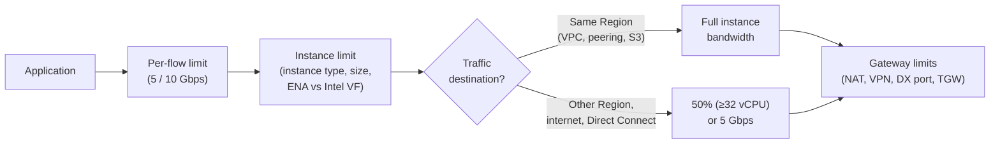
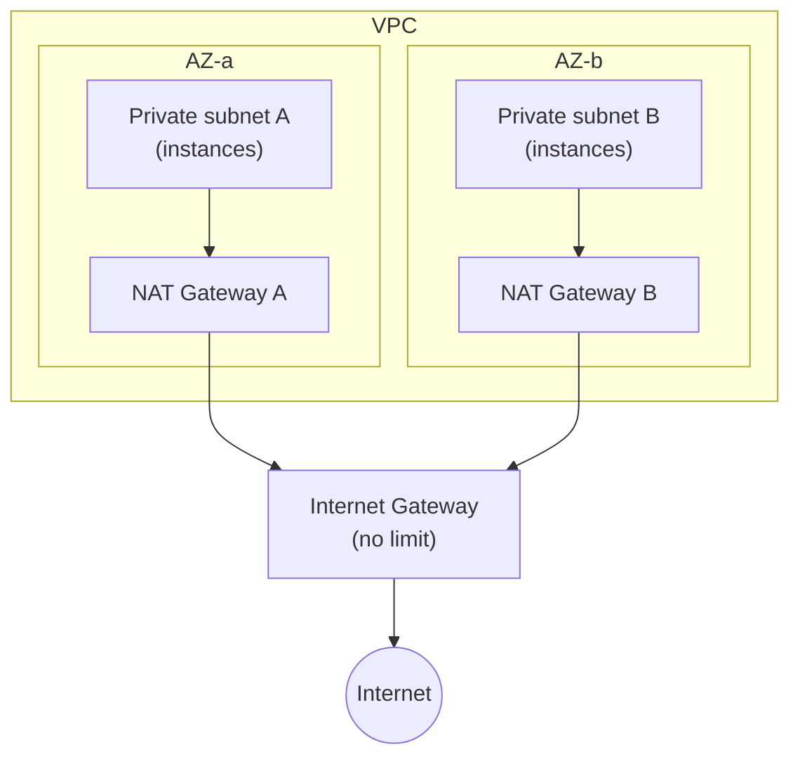
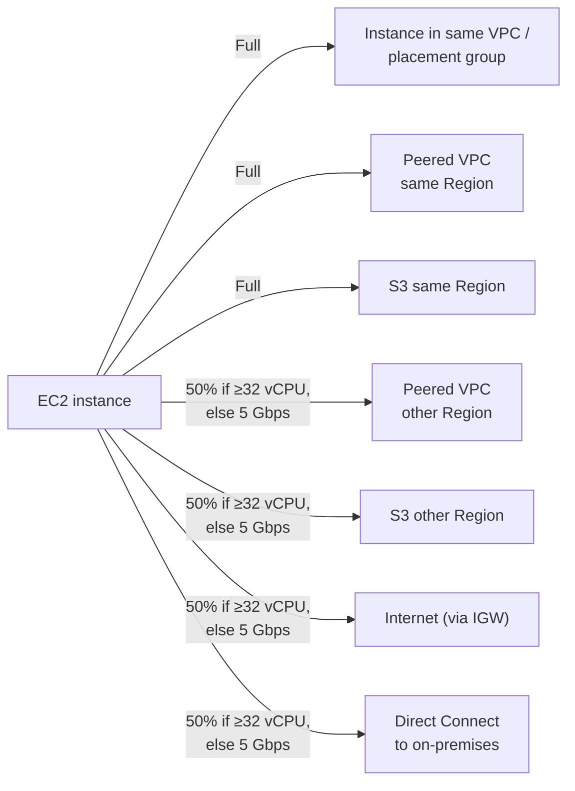
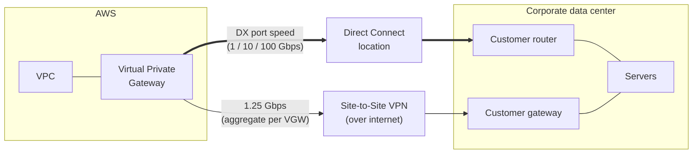
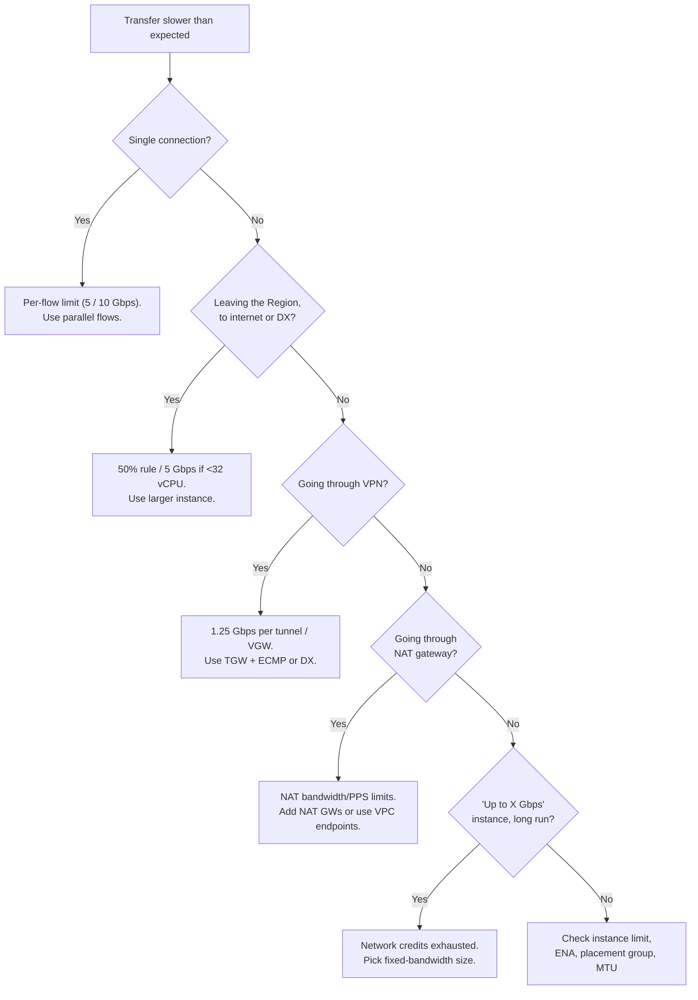

# AWS Network Bandwidth Limits: VPC, EC2, VPN, Direct Connect & Transit Gateway

A study guide explaining **where bandwidth limits exist in AWS networking, why they exist, and how to design around them.** It covers network flows, VPC component limits (Internet Gateway, NAT Gateway, VPC peering), EC2 instance bandwidth limits, maximum EC2 bandwidth with Intel VF and ENA, VPN / Direct Connect / Transit Gateway bandwidth, and network I/O credits.

> Diagrams use **Mermaid** (renders on GitHub, GitLab, Obsidian, VS Code with a Mermaid extension) and plain-text ASCII art.
>
> Numbers marked **(course)** come from the course slides. Where AWS has since changed a limit, the current value is shown with a **(current)** note. Always confirm in the AWS docs before designing around a number.

---

## Table of Contents

1. [Purpose: Why This Topic Matters](#1-purpose-why-this-topic-matters)
2. [Network Flows (the 5-Tuple)](#2-network-flows-the-5-tuple)
3. [VPC Bandwidth Limits](#3-vpc-bandwidth-limits)
4. [EC2 Bandwidth Limits by Destination](#4-ec2-bandwidth-limits-by-destination)
5. [EC2 Maximum Bandwidth: Intel VF vs ENA](#5-ec2-maximum-bandwidth-intel-vf-vs-ena)
6. [VPN and Direct Connect Bandwidth](#6-vpn-and-direct-connect-bandwidth)
7. [Transit Gateway VPN Bandwidth](#7-transit-gateway-vpn-bandwidth)
8. [Network Credits (Burst Bandwidth)](#8-network-credits-burst-bandwidth)
9. [Finding the Bottleneck: End-to-End View](#9-finding-the-bottleneck-end-to-end-view)
10. [How to Measure Bandwidth Correctly](#10-how-to-measure-bandwidth-correctly)
11. [Exam Cheat Sheet](#11-exam-cheat-sheet)
12. [Sources](#12-sources)

---

## 1. Purpose: Why This Topic Matters

When an application on AWS is "slow on the network," the cause is rarely the VPC itself. It is almost always one of these:

| Possible bottleneck | Example symptom |
|---|---|
| A **single flow** limit | One big file copy tops out at 5 Gbps on a 25 Gbps instance |
| The **instance** bandwidth limit | A small instance can't push more than its rated "up to X Gbps" |
| The **destination** of the traffic | Traffic to another Region or the internet only gets 50% (or 5 Gbps) |
| A **gateway** in the path | A VPN tunnel caps at 1.25 Gbps; a NAT gateway caps on bandwidth or PPS |
| **Burst credits** running out | Benchmarks look great for minutes, then drop sharply |

Knowing each limit lets you:

- **Design** architectures that meet throughput goals (pick the right instance, placement group, gateway, connection).
- **Troubleshoot** slow transfers by identifying which limit is being hit.
- **Benchmark** correctly (multiple flows, after credits are understood).
- **Answer exam questions** that hinge on these numbers.



**The rule:** your real throughput is the **smallest** limit along the whole path.

---

## 2. Network Flows (the 5-Tuple)

### What is a flow?

A **network flow** is one point-to-point connection, identified by five values (the **5-tuple**):

```
┌──────────┬───────────┬────────────┬──────────┬───────────┐
│ Protocol │ Source IP │ Source Port│ Dest IP  │ Dest Port │
├──────────┼───────────┼────────────┼──────────┼───────────┤
│   TCP    │ 10.0.1.5  │   49152    │ 10.0.2.8 │    443    │
└──────────┴───────────┴────────────┴──────────┴───────────┘
                One unique combination = one flow
```

Change any one of the five values (for example, a different source port) and it becomes a **different flow**.

### Why flows matter: per-flow limits

AWS limits bandwidth **per flow** as well as **per instance**. A single TCP connection is hashed onto one network path and one set of hardware queues, so it can't use the whole instance bandwidth.

```
Single flow (one TCP connection):
Instance (25 Gbps) ═══[ flow 1 ]═══════════════>  max 5 Gbps
                         (rest of the bandwidth unused)

Multiple flows (5 TCP connections):
Instance (25 Gbps) ═══[ flow 1 ]═══>  5 Gbps
                   ═══[ flow 2 ]═══>  5 Gbps
                   ═══[ flow 3 ]═══>  5 Gbps   = 25 Gbps total
                   ═══[ flow 4 ]═══>  5 Gbps
                   ═══[ flow 5 ]═══>  5 Gbps
```

### Purpose / takeaway

**Multiple flows let you scale network performance.** Ways to create more flows:

- Parallel connections (`iperf3 -P 8`, `aws s3 cp` with multipart / higher concurrency, `rclone --transfers`, `rsync` in parallel)
- Multi-threaded or multi-connection applications
- Several client instances instead of one

---

## 3. VPC Bandwidth Limits

### The key points

| Component | Bandwidth limit |
|---|---|
| **VPC itself** | No VPC-specific limit |
| **Internet Gateway (IGW)** | No limit (horizontally scaled, redundant) |
| **VPC peering** | No limit (no gateway in the path; same infrastructure as within a VPC) |
| **NAT Gateway** | **(course)** up to 45 Gbps per NAT gateway. **(current)** starts at 5 Gbps and automatically scales up to **100 Gbps**; 1M PPS scaling to 10M PPS |

```
                          ( Internet )
                               ▲
                               │  no limit
┌─ Region ─────────────────────┼─────────────────────────────┐
│ ┌─ VPC ──────────────── [Internet Gateway] ───────────────┐│
│ │ ┌─ Availability Zone ──────┼───────────────────────────┐││
│ │ │ ┌─ Public subnet ────────┼─────────────────────────┐ │││
│ │ │ │                  [NAT Gateway]                   │ │││
│ │ │ │          up to 100 Gbps (course: 45 Gbps)         │ │││
│ │ │ └────────────────────────▲─────────────────────────┘ │││
│ │ │ ┌─ Private subnet ───────┼─────────────────────────┐ │││
│ │ │ │              [EC2 instance B]                     │ │││
│ │ │ │                (private IP)                       │ │││
│ │ │ └───────────────────────────────────────────────────┘ │││
│ │ └───────────────────────────────────────────────────────┘││
│ └──────────────────────────▲───────────────────────────────┘│
└────────────────────────────┼────────────────────────────────┘
                             │  VPC peering: no limit
                     ┌───────┴───────┐
                     │  Other VPC    │
                     └───────────────┘
```

### Why there's no limit on IGW and peering

- **Internet Gateway** is not a single box. It's a horizontally scaled, highly available component of the VPC, so it doesn't become a bottleneck.
- **VPC peering** has no gateway or appliance in the path. Peered traffic travels over the same AWS network as traffic inside one VPC.

In both cases, the **limit you hit is the EC2 instance's own bandwidth** (see Section 4).

### NAT Gateway: the one that can bottleneck

A NAT gateway lets instances in **private subnets** reach the internet (outbound only). It is a managed service with real capacity limits:

| Limit | Value (current AWS docs) |
|---|---|
| Bandwidth | 5 Gbps, auto-scales up to **100 Gbps** |
| Packets per second | 1M PPS, auto-scales up to **10M PPS** (packets dropped beyond this) |
| Connections | 55,000 simultaneous connections **per unique destination** per IPv4 address (up to 8 IPs per NAT gateway) |

### Scaling beyond one NAT gateway



**Purpose:** use **multiple NAT gateways** (split subnets across them via route tables), ideally **one per AZ**. This:

- scales bandwidth and PPS beyond one gateway's limit
- improves availability (an AZ failure doesn't cut off other AZs)
- avoids cross-AZ data charges

**Also consider:** VPC **gateway endpoints** for S3 and DynamoDB, so that traffic bypasses the NAT gateway entirely (faster and cheaper).

---

## 4. EC2 Bandwidth Limits by Destination

An instance's available bandwidth **depends on**:

- instance family and generation (ENA vs Intel VF)
- instance size / **number of vCPUs**
- **traffic destination** (this section)
- number of flows (Section 2)
- placement group (Section 5)

### The rule

| Traffic destination | Bandwidth available |
|---|---|
| **Within the same Region**: same VPC, peered VPC in the same Region, S3 / AWS services in the same Region | **Full** network bandwidth of the instance |
| **To other Regions, an Internet Gateway, or Direct Connect** | **Up to 50%** of the instance bandwidth if it's a **current-generation instance with at least 32 vCPUs**; **otherwise limited to 5 Gbps** |

### Diagram

```
                                  ( Internet )
                                       ▲
                                       │  50% or 5 Gbps
┌─ VPC (Region A) ─────────────── [ IGW ] ───────────────────────┐
│ ┌─ Availability Zone ────────────────┼───────────────────────┐ │
│ │ ┌─ Placement Group ──────────────────────────┐             │ │      ┌──────┐
│ │ │                                            │  Full within region │  S3  │
│ │ │  [EC2] ◄═══════ Full ═══════► [EC2]  ◄═════════════════════════► │      │
│ │ │    ▲ ▲                                     │  50% other region   │      │
│ │ └────┼─┼─────────────────────────────────────┘ ◄═════════════════► └──────┘
│ └──────┼─┼───────────────────────────────────────────────────┘ │
└────────┼─┼─────────────────────────────────────────────────────┘
         │ │  Peering connection
         │ └── Full (peer VPC in the SAME Region)
         └──── 50% (peer VPC in ANOTHER Region)
┌─ Peered VPC ───────────────────────────────────────────────────┐
│                         [EC2]                                  │
└────────────────────────────────────────────────────────────────┘
```



### Worked examples

| Instance | Rated bandwidth | Same Region | Internet / other Region / DX |
|---|---|---|---|
| 8 vCPU, "up to 12.5 Gbps" | 12.5 Gbps | up to 12.5 Gbps | **5 Gbps** (fewer than 32 vCPUs) |
| 48 vCPU, 50 Gbps | 50 Gbps | 50 Gbps | **25 Gbps** (50%) |
| 96 vCPU, 100 Gbps | 100 Gbps | 100 Gbps | **50 Gbps** (50%) |

### Purpose / takeaway

- Keep heavy data transfers **inside the Region** when possible (and use VPC endpoints for S3).
- For big internet or cross-Region transfers, a **large instance (≥32 vCPUs)** is needed to exceed 5 Gbps.
- Placement in the same Region is "full speed"; a **cluster placement group** adds the higher per-flow limit (Section 5).

---

## 5. EC2 Maximum Bandwidth: Intel VF vs ENA

### Limits by enhanced networking type

| | Intel 82599 VF | AWS ENA |
|---|---|---|
| **Aggregate** (all flows) | **10 Gbps** | **100 Gbps** with multiple flows (within a VPC, a peered VPC, or to S3 via VPC endpoint, same Region) |
| **Per flow, inside a cluster placement group** | 5 Gbps | **10 Gbps** |
| **Per flow, outside a placement group** | 5 Gbps | **5 Gbps** |
| To internet / other Region | 50% or 5 Gbps | 50% or 5 Gbps |

### Diagram: EC2 max bandwidth with ENA

```
                                      ( Internet )
                                           ▲
                                           │ 50% or 5 Gbps
┌─ VPC ──────────────────────────────── [ IGW ] ──────────────────────┐
│ ┌─ Availability Zone 1 ──────────────────┼────────────────────────┐ │
│ │ ┌─ Placement Group ───────────────────────────────┐             │ │   ┌──────┐
│ │ │ [EC2] ◄════ Up to 100 Gbps ════► [EC2] ◄════════ Up to 100 Gbps ═══►│  S3  │
│ │ │   ▲   (10 Gbps per flow)                        │  (VPC endpoint)    └──────┘
│ │ └───┼─────────────────────────────────────────────┘             │ │
│ └─────┼───────────────────────────────────────────────────────────┘ │
│ ┌─ Availability Zone 2 ─────────────────────────────────────────────┐ │
│ │     │ Up to 100 Gbps (5 Gbps per flow, outside placement group)  │ │
│ │     ▼                                                            │ │
│ │   [EC2]                                                          │ │
│ └──────────────────────────────────────────────────────────────────┘ │
└──────────────────────────────────────────────────────────────────────┘
```

### Why per-flow limits differ inside a placement group

In a **cluster placement group**, instances sit in the same high-bisection-bandwidth network segment, close together. Each flow travels a shorter, less congested path, so AWS allows **10 Gbps per flow** instead of 5 Gbps.

### Beyond 100 Gbps

- **(course)** AWS **P4d** instances deployed in **EC2 UltraClusters** provide **400 Gbps** networking (using EFA).
- **(current)** newer GPU instances go much further (multiple EFA interfaces, into the Tbps range), and some network-optimized types (e.g., c6in, c7gn) offer 200 Gbps.
- **(current)** **ENA Express** (uses AWS's SRD protocol) raises single-flow bandwidth to up to 25 Gbps between supported instances in the same AZ.

### Purpose / takeaway

To get close to the instance's maximum:

1. Use an **ENA** instance (all current generation).
2. Put tightly coupled instances in a **cluster placement group** (10 Gbps per flow).
3. Use **multiple flows** to reach the aggregate (100 Gbps needs at least 10 parallel flows at 10 Gbps each).
4. Keep traffic **in-Region**, and use **VPC endpoints** for S3.

---

## 6. VPN and Direct Connect Bandwidth

### Site-to-Site VPN on a Virtual Private Gateway (VGW)

| Limit | Value |
|---|---|
| Per VGW, traffic from AWS to on-premises | **1.25 Gbps aggregate** (course) |
| Multiple VPN connections on the same VGW | Share that **aggregate** limit (adding connections doesn't add bandwidth) |
| Per VPN tunnel (current docs) | Standard tunnel up to **1.25 Gbps** / 140,000 PPS; **large bandwidth tunnel** option up to **5 Gbps** / 400,000 PPS |

### AWS Direct Connect (DX)

| Limit | Value |
|---|---|
| DX bandwidth | Defined by the **port speed** you choose (e.g., 1, 10, 100 Gbps dedicated; hosted connections from 50 Mbps) |
| DX on a Virtual Private Gateway | Throughput is bound by the **physical DX port** itself, not the VGW |

### Diagram



### VPN vs Direct Connect

| | Site-to-Site VPN | Direct Connect |
|---|---|---|
| Path | Encrypted IPsec over the public internet | Private dedicated fiber to AWS |
| Bandwidth | 1.25 Gbps per tunnel / per VGW aggregate | Port speed (up to 100 Gbps; can aggregate with LAG) |
| Latency / consistency | Variable (internet) | Low and consistent |
| Setup time | Minutes | Weeks (physical provisioning) |
| Cost | Low | Higher (port hours + data transfer) |
| Encryption | Built in | Not by default (add MACsec or VPN over DX) |

### Purpose / takeaway

- A **VPN on a VGW** is a hard ~1.25 Gbps ceiling, no matter how many connections you add. To go faster, use **Transit Gateway with ECMP** (Section 7) or **Direct Connect**.
- **Direct Connect** bandwidth = the port you pay for. Choose the port speed for your peak needs.
- A common pattern: **DX for primary bandwidth, VPN as an encrypted backup.**

---

## 7. Transit Gateway VPN Bandwidth

A **Transit Gateway (TGW)** is a regional hub that connects many VPCs, VPNs and Direct Connect gateways. Unlike a VGW, it supports **ECMP (Equal-Cost Multi-Path)**, which spreads traffic across multiple VPN tunnels.

| Limit | Value |
|---|---|
| Per VPN tunnel | **1.25 Gbps** (standard tunnel) |
| Total VPN bandwidth through TGW | **50 Gbps** (course) by aggregating many tunnels with ECMP |
| ECMP requirement | VPN connections must use **dynamic routing (BGP)**; static routing doesn't support ECMP |

```
                     ┌──────────────────────────┐
  VPC A ─────────────┤                          │   Tunnel 1  1.25 Gbps
                     │                          ├────────────────────────┐
  VPC B ─────────────┤     Transit Gateway      │   Tunnel 2  1.25 Gbps  │
                     │   (ECMP across tunnels)  ├────────────────────┐   │
  VPC C ─────────────┤                          │   Tunnel 3  1.25 Gbps  │
                     │                          ├────────────────┐   │   │
                     └──────────────────────────┘   ...          ▼   ▼   ▼
                                                       Customer gateway(s)
                     Total = N tunnels × 1.25 Gbps (up to the TGW VPN limit)
```

**Note:** ECMP balances **flows**, not packets. A single flow still uses only one tunnel (max 1.25 Gbps). You need many flows to use many tunnels (Section 2 again).

### VGW vs TGW for VPN bandwidth

| | Virtual Private Gateway | Transit Gateway |
|---|---|---|
| VPN bandwidth | 1.25 Gbps aggregate | 1.25 Gbps per tunnel, aggregated with ECMP (up to 50 Gbps per course) |
| ECMP | No | Yes (with BGP) |
| Connects | One VPC | Thousands of VPCs, VPNs, DX gateways |

### Purpose / takeaway

**Need more than 1.25 Gbps of VPN bandwidth?** Terminate VPNs on a **Transit Gateway**, create **multiple VPN connections with BGP**, enable **ECMP**, and make sure traffic uses **multiple flows**.

---

## 8. Network Credits (Burst Bandwidth)

### How it works

Some instance families (the course names **R4** and **C5**; today, most current-generation sizes rated "**up to X Gbps**") use a **network I/O credit mechanism**, similar to burstable CPU credits:

```
Bandwidth
   ▲
   │   ┌────────┐ ← burst ("up to 10 Gbps") while credits last
   │   │        │
   │   │        │
   │   │        └───────────────────── baseline (guaranteed)
   │───┘
   │  (credits accumulate while usage is below baseline)
   └──────────────────────────────────────────────────► Time
```

- Instances earn credits while running **below** their baseline bandwidth.
- During peaks, they spend credits to run **well above** baseline (up to the "up to" figure).
- When credits run out, bandwidth drops back to **baseline**.

### Why AWS does this

Most applications **don't need high network performance constantly**. Bursting gives smaller, cheaper instances high peak bandwidth when they need it, without paying for that bandwidth all the time.

### The benchmarking trap


**Purpose / takeaway:** before benchmarking an instance that uses network credits:

- Consider the **accumulated credits**. A short test on an idle instance measures the **burst**, not the **sustained** rate.
- Run **long tests** (long enough to drain credits) to see the real baseline.
- For sustained high throughput, pick sizes **without** "up to" (fixed bandwidth, usually the larger sizes).
- Watch the ENA allowance metrics for throttling: `ethtool -S eth0 | grep allowance` (e.g., `bw_in_allowance_exceeded`, `bw_out_allowance_exceeded`, `pps_allowance_exceeded`).

---

## 9. Finding the Bottleneck: End-to-End View

Your throughput is the **minimum** of every limit in the path:

```
Achieved throughput = min(
    per-flow limit × number of flows,
    instance bandwidth (and burst credits),
    destination rule (full / 50% / 5 Gbps),
    gateway limits (NAT, VPN, DX port, TGW),
    the other end's limits
)
```

### Quick troubleshooting flow



### Design checklist

| Goal | Do this |
|---|---|
| Max instance-to-instance speed | ENA + cluster placement group + jumbo frames (9001 MTU) + multiple flows |
| Fast S3 transfers | Same Region + S3 gateway endpoint + parallel/multipart transfers |
| Fast internet egress from private subnets | Large instance (≥32 vCPU) + multiple NAT gateways (one per AZ) |
| High-bandwidth hybrid connectivity | Direct Connect at the right port speed (or TGW + ECMP VPN) |
| Predictable sustained bandwidth | Instance sizes with fixed (not "up to") bandwidth |

---

## 10. How to Measure Bandwidth Correctly

```bash
# On the receiving instance
iperf3 -s

# On the sending instance: single flow (shows the per-flow limit)
iperf3 -c <receiver-private-ip> -t 30

# Multiple flows (shows the aggregate limit)
iperf3 -c <receiver-private-ip> -P 16 -t 60

# Long test to drain network credits (sustained baseline)
iperf3 -c <receiver-private-ip> -P 8 -t 1800
```

```bash
# Check an instance type's rated network performance
aws ec2 describe-instance-types --instance-types c5.large m6i.32xlarge \
  --query "InstanceTypes[].[InstanceType,VCpuInfo.DefaultVCpus,NetworkInfo.NetworkPerformance]" \
  --output table

# Check whether the ENA is throttling you (counters increasing = limit hit)
ethtool -S eth0 | grep -E "allowance_exceeded"
```

Tips:
- Use **private IPs** inside the VPC (public IPs route via the IGW and fall under the 50% / 5 Gbps rule).
- Make sure security groups allow the iperf port (5201 by default).
- Test both directions (`iperf3 -R` reverses).

---

## 11. Exam Cheat Sheet

| Topic | Key fact |
|---|---|
| Network flow | 5-tuple: protocol, source IP, source port, destination IP, destination port |
| Scaling performance | Use **multiple flows** |
| VPC | No VPC-specific bandwidth limit |
| Internet Gateway | No limit |
| VPC peering | No limit |
| NAT Gateway | (course) up to 45 Gbps; (current) 5 Gbps scaling to 100 Gbps; use multiple NAT GWs to scale further |
| EC2 within Region | Full instance bandwidth |
| EC2 to other Region / IGW / DX | Up to 50% if current gen with ≥32 vCPUs, otherwise 5 Gbps |
| Intel 82599 VF | 10 Gbps aggregate, 5 Gbps per flow |
| ENA per flow | 10 Gbps inside cluster placement group, 5 Gbps outside |
| ENA aggregate | 100 Gbps with multiple flows (VPC, peered VPC, S3 via endpoint, same Region) |
| P4d UltraClusters | 400 Gbps networking |
| VPN on VGW | 1.25 Gbps aggregate per VGW (AWS → on-premises); more connections share the limit |
| Direct Connect | Bandwidth = chosen port speed; on a VGW, bound by the physical DX port |
| Transit Gateway VPN | 1.25 Gbps per tunnel, 50 Gbps total (course) via ECMP + BGP |
| Network credits | R4, C5 (and "up to" sizes) burst above baseline using credits; account for credits when benchmarking |

---

## 12. Sources

- [NAT gateway basics – Amazon VPC User Guide](https://docs.aws.amazon.com/vpc/latest/userguide/nat-gateway-basics.html)
- [Site-to-Site VPN quotas – AWS Site-to-Site VPN User Guide](https://docs.aws.amazon.com/vpn/latest/s2svpn/vpn-limits.html)
- [Amazon EC2 instance network bandwidth – Amazon EC2 User Guide](https://docs.aws.amazon.com/AWSEC2/latest/UserGuide/ec2-instance-network-bandwidth.html)
- [Placement strategies – Amazon EC2 User Guide](https://docs.aws.amazon.com/AWSEC2/latest/UserGuide/placement-strategies.html)
- [Transit Gateway quotas – Amazon VPC Transit Gateways](https://docs.aws.amazon.com/vpc/latest/tgw/transit-gateway-quotas.html)
- Course slides: VPC/EC2 bandwidth limits, EC2 maximum bandwidth, VPN and DX bandwidth, Network Credits

> AWS limits change over time. Numbers marked **(course)** reflect the training material; check the AWS documentation above for current values before designing a production system.

---

**Related guides:** `network-performance-guide.md` (bandwidth, latency, jitter, throughput, PPS, MTU, ICMP, jumbo frames, placement groups, EBS-optimized) and `EC2-Enhanced-Networking-Guide.docx` (SR-IOV, ENA, Intel VF, DPDK, EFA).
