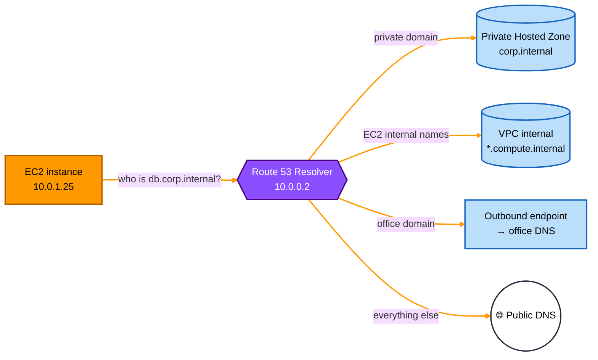
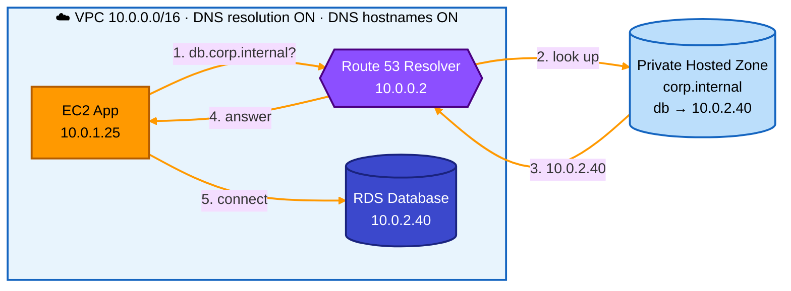
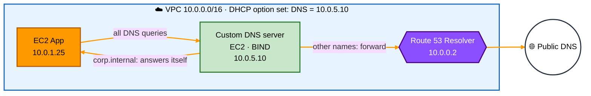
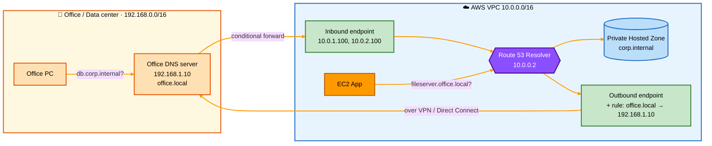

[⬅ Back to Aa](Aa.md) · [⬅ Back to AWS VPC](aws-vpc.md)

# AWS VPC DNS (Route 53 Resolver, DHCP Option Sets, Hybrid DNS)

> Tip: on GitHub, click the **☰ outline button** at the top right of this file to see all topics and jump to any one.

## 1. DNS Refresher

**DNS (Domain Name System)** is the internet's **phonebook**: it turns a **name** into an **IP address**.

```
You type:   google.com
DNS says:   142.250.183.14
Browser then connects to 142.250.183.14
```

| Term | Meaning | Example |
|---|---|---|
| **Domain name** | Human-friendly name | `app.example.com` |
| **DNS resolver** | The server your computer asks to find the IP | Your ISP's DNS, `8.8.8.8`, or AWS's Route 53 Resolver |
| **Hosted zone** | A container holding the DNS records for one domain | `example.com` |
| **A record** | Name → IPv4 address | `app.example.com → 10.0.1.25` |
| **AAAA record** | Name → IPv6 address | `app.example.com → 2600:1f18::25` |
| **CNAME record** | Name → another name | `www.example.com → app.example.com` |
| **Port** | DNS uses port **53** (UDP, and TCP for big answers) | — |

Inside a VPC, servers also need DNS: to reach AWS services (`s3.amazonaws.com`), the internet (`github.com`), and each other (`db.internal.example.com`).

## 2. Amazon VPC DNS Server (Route 53 Resolver)

Every VPC comes with a **built-in DNS server** provided by AWS, called the **Amazon DNS server**, **AmazonProvidedDNS** or **Route 53 Resolver**. You don't create or manage it; it's just there.

### 2.1 Where the DNS server lives

You can reach it at these addresses from any instance in the VPC:

| Address | Meaning |
|---|---|
| **VPC CIDR base + 2** | For VPC `10.0.0.0/16`, the DNS server is **`10.0.0.2`** (this is why AWS reserves the `.2` address; see [aws-vpc.md](aws-vpc.md)) |
| **`169.254.169.253`** | Same DNS server, at a special address that works in **every** VPC |
| **`fd00:ec2::253`** | IPv6 address of the same server (on Nitro instances) |

Instances get this DNS server **automatically** through DHCP (see section 3), so you normally don't configure anything.

### 2.2 What the Route 53 Resolver can answer

| Question from the instance | Answered from |
|---|---|
| `ip-10-0-1-25.ap-south-1.compute.internal` (another instance's private name) | VPC's own internal records |
| `db.corp.internal` (your private domain) | A **Route 53 Private Hosted Zone** linked to the VPC (section 4) |
| `onprem.company.local` (a name in your office network) | Forwarded to your office DNS by a **Resolver outbound endpoint** (section 6) |
| `google.com`, `s3.amazonaws.com` | **Public DNS** on the internet |

### 2.3 The two VPC DNS settings

Each VPC has two DNS switches (**VPC → Actions → Edit VPC settings**):

| Setting | What it does | Default (default VPC) | Default (new custom VPC) |
|---|---|---|---|
| **enableDnsSupport** ("DNS resolution") | Turns the Amazon DNS server (`.2`) **on or off** for the VPC | ✅ On | ✅ On |
| **enableDnsHostnames** ("DNS hostnames") | Gives instances with a public IP a **public DNS name** | ✅ On | ❌ Off (on if you use the "VPC and more" wizard) |

- **Both must be ON** to use **Private Hosted Zones** (section 4).
- If `enableDnsSupport` is off, instances must use your own DNS server.

### 2.4 EC2 DNS names

Every instance gets automatic DNS names:

| Name type | Example | Resolves to |
|---|---|---|
| **Private DNS name** (in `us-east-1`) | `ip-10-0-1-25.ec2.internal` | Private IP `10.0.1.25` |
| **Private DNS name** (other regions) | `ip-10-0-1-25.ap-south-1.compute.internal` | Private IP `10.0.1.25` |
| **Public DNS name** (needs a public IP + DNS hostnames ON) | `ec2-54-210-12-7.ap-south-1.compute.amazonaws.com` | **Inside the VPC:** private IP. **From the internet:** public IP |

The public DNS name giving different answers inside and outside the VPC is a small example of **split-horizon DNS**: traffic between instances stays on private IPs, which is faster and avoids data charges.

### 2.5 How an instance's DNS query flows



### 2.6 Key limits

- Each instance (ENI) can send up to **1,024 DNS packets per second** to the Resolver. Busy apps should cache DNS answers.
- The Resolver only answers queries from **inside the VPC** (or through Resolver endpoints). Your office computers can't use `10.0.0.2` directly.

## 3. VPC DHCP Option Sets

### 3.1 What is DHCP?

**DHCP (Dynamic Host Configuration Protocol)** automatically gives a device its network settings when it joins a network: IP address, DNS server, domain name and more. Your home router does this for your phone and laptop.

In a VPC, AWS runs DHCP for you. A **DHCP option set** is the list of settings AWS hands to every instance in the VPC.

### 3.2 What's in a DHCP option set

| Option | Meaning | Default value |
|---|---|---|
| **domain-name-servers** | Which DNS server(s) instances should use (up to 4) | `AmazonProvidedDNS` (the Route 53 Resolver) |
| **domain-name** | Domain added to short names (so `db` becomes `db.<domain>`) | `ec2.internal` in `us-east-1`; `<region>.compute.internal` elsewhere |
| **ntp-servers** | Time servers (up to 4) | None (instances use Amazon Time Sync at `169.254.169.123`) |
| **netbios-name-servers** / **netbios-node-type** | For old Windows networks | None |
| **ipv6-address-preferred-lease-time** | How long IPv6 leases last | Default AWS value |

### 3.3 Rules

- Each VPC uses **exactly one** DHCP option set at a time. One option set can be shared by **many VPCs** in the same region.
- An option set **can't be edited** after creation. To change something: **create a new option set → associate it with the VPC**.
- Instances pick up new settings when they **renew their DHCP lease** (a few hours) or when you **reboot** them. Nothing breaks immediately.
- You can also set the VPC to **"No DHCP option set"**; then instances get no DNS settings at all (rarely wanted).

### 3.4 When would you change it?

| Scenario | New DHCP option set |
|---|---|
| Use your **own DNS server** (e.g. Active Directory) | `domain-name-servers = 10.0.5.10, 10.0.6.10` |
| Use **your company's domain** for short names | `domain-name = corp.example.com` |
| Use **your own time servers** | `ntp-servers = 10.0.5.20` |

**Warning:** if you replace `AmazonProvidedDNS` with your own DNS server, instances **stop asking** the Route 53 Resolver directly. Your DNS server must **forward** AWS names (like `*.amazonaws.com` and `*.compute.internal`) to `10.0.0.2`, or those names will stop working.

## 4. Hands-on Scenarios

The next sections cover the two hands-on exercises and the hybrid DNS setup:

| Scenario | Who answers private names? | Section |
|---|---|---|
| **A.** VPC DNS with a **Route 53 Private Hosted Zone** | Route 53 Resolver + Private Hosted Zone (fully managed) | 5 |
| **B.** VPC DNS with a **custom DNS server** | Your own DNS server on EC2, set through a DHCP option set | 6 |
| **C.** **Hybrid DNS** with Resolver endpoints | Route 53 Resolver talking to your office DNS | 7 |

## 5. Hands-on: VPC DNS with Route 53 Private Hosted Zone

### 5.1 What is a Private Hosted Zone?

A **Private Hosted Zone (PHZ)** is a Route 53 hosted zone that is **only visible inside the VPCs you associate with it**. The internet can't see it.

**Use it to give friendly names to private resources:**

```
db.corp.internal     → 10.0.2.40   (database)
api.corp.internal    → 10.0.2.55   (internal API)
cache.corp.internal  → 10.0.3.12   (Redis)
```

Apps connect to `db.corp.internal` instead of a hard-coded IP. If the database moves, you update one DNS record, not every app.

### 5.2 Steps

1. **Check the VPC settings:** turn **DNS resolution** and **DNS hostnames** both **ON**.
2. **Route 53 → Hosted zones → Create hosted zone**
   - Domain name: `corp.internal`
   - Type: **Private hosted zone**
   - Associate it with your **VPC** (you can add more VPCs, even from other regions or accounts).
3. **Create records** in the zone, for example an **A record** `db.corp.internal → 10.0.2.40`.
4. **Test** from an EC2 instance in the VPC:
   ```bash
   nslookup db.corp.internal
   # or
   dig db.corp.internal
   ```
   You should see `10.0.2.40`, answered by `10.0.0.2`.
5. **Test from outside** the VPC (e.g. your laptop): the name should **not** resolve, which proves it's private.

### 5.3 Diagram



### 5.4 Good to know

- **Split-horizon DNS:** you can have a **public** hosted zone and a **private** hosted zone with the **same name** (e.g. `example.com`). Inside the VPC, the private one wins; on the internet, the public one is used.
- A PHZ costs a small monthly fee per zone plus a fee per million queries.

## 6. Hands-on: VPC DNS with a Custom DNS Server

### 6.1 When you need your own DNS server

- Your company already uses **Active Directory DNS** or **BIND**.
- You need DNS features Route 53 doesn't offer.
- A requirement says all DNS must go through your own server (e.g. for logging).

### 6.2 Steps

1. **Launch an EC2 instance** in the VPC to be the DNS server, e.g. `10.0.5.10`. Install DNS software such as **BIND** or **Unbound**.
2. **Configure it:**
   - Add your own zone, e.g. `corp.internal` with `db → 10.0.2.40`.
   - **Forward everything else to the Amazon DNS server `10.0.0.2`**, so AWS and internet names keep working.
3. **Security Group of the DNS server:** allow **UDP and TCP port 53** from the VPC CIDR (`10.0.0.0/16`).
4. **Create a new DHCP option set:**
   - `domain-name-servers = 10.0.5.10`
   - `domain-name = corp.internal`
5. **Associate** the new option set with the VPC.
6. **Reboot** (or wait for lease renewal) on the other instances, then check:
   ```bash
   cat /etc/resolv.conf     # should show nameserver 10.0.5.10
   dig db.corp.internal     # should return 10.0.2.40
   dig google.com           # should still work (forwarded to 10.0.0.2)
   ```

### 6.3 Diagram



### 6.4 Private Hosted Zone vs custom DNS server

| | Private Hosted Zone | Custom DNS server |
|---|---|---|
| Managed by | AWS | You (patching, backups, scaling) |
| High availability | Built in | You must run at least 2 servers in different AZs |
| Setup | Simple | More work (EC2 + DNS software + DHCP option set) |
| Flexibility | Standard record types | Anything your DNS software supports |
| Best for | Most AWS workloads | Existing Active Directory / special requirements |

## 7. Route 53 Resolver Endpoints (Hybrid DNS)

### 7.1 The problem

With a **hybrid** setup (office / data center connected to AWS by **Site-to-Site VPN** or **Direct Connect**):

- Office computers want to resolve **AWS private names** (`db.corp.internal` in a Private Hosted Zone). ❌ They can't reach `10.0.0.2`.
- AWS instances want to resolve **office names** (`fileserver.office.local`). ❌ The Route 53 Resolver doesn't know them.

**Resolver endpoints** solve both. They are **ENIs with private IPs** in your VPC subnets that act as doors for DNS queries.

### 7.2 Inbound vs outbound endpoints

| | Inbound endpoint | Outbound endpoint |
|---|---|---|
| Direction | **Office → AWS** | **AWS → Office** |
| Lets | Office DNS servers ask the Route 53 Resolver about AWS names | The Route 53 Resolver forward queries to office DNS servers |
| Setup on office side | On office DNS, add a **conditional forwarder**: `corp.internal → inbound endpoint IPs` | — |
| Setup on AWS side | Create the endpoint (IPs in 2+ subnets / AZs) | Create the endpoint **+ a forwarding rule**, e.g. `office.local → 192.168.1.10`, and associate the rule with the VPC |

### 7.3 Diagram



**Colour guide:** 🟧 light orange = office side · 🟩 green = Resolver endpoints · 🟪 purple = Route 53 Resolver · 🟦 blue = Private Hosted Zone

### 7.4 Good to know

- Place each endpoint's IPs in **at least 2 AZs** for high availability.
- Endpoints need a **Security Group** allowing **DNS (TCP/UDP 53)** from the right sources.
- The office and AWS must already be connected by **VPN or Direct Connect**; endpoints only handle DNS, not the network link.
- **Forwarding rules** can be **shared** with other accounts using AWS RAM, and one rule can be associated with many VPCs.
- Endpoints are charged **per ENI per hour**, plus per query.

## 8. Quick Summary

- **Route 53 Resolver (AmazonProvidedDNS)** = built-in DNS server of every VPC, at **VPC base + 2** (e.g. `10.0.0.2`) or `169.254.169.253`.
- **enableDnsSupport** = turns the built-in DNS server on; **enableDnsHostnames** = gives instances public DNS names. Both ON for Private Hosted Zones.
- **EC2 private DNS name** = `ip-10-0-1-25.<region>.compute.internal`; **public DNS name** resolves to the private IP inside the VPC.
- **DHCP option set** = settings (DNS servers, domain name, NTP) handed to instances; one per VPC; can't be edited, only replaced.
- **Private Hosted Zone** = Route 53 zone visible only inside associated VPCs; easiest way to name private resources.
- **Custom DNS server** = your own DNS on EC2, set via a DHCP option set; must forward AWS names to `.2`.
- **Inbound Resolver endpoint** = office → AWS DNS queries.
- **Outbound Resolver endpoint + forwarding rule** = AWS → office DNS queries.

---

[⬅ Back to Aa](Aa.md) · [⬅ Back to AWS VPC](aws-vpc.md)
