[⬅ Back to Aa](Aa.md) · [⬅ Back to AWS VPC](aws-vpc.md)

# AWS VPC DNS (Route 53 Resolver, DHCP Option Sets, Hybrid DNS)

> Tip: on GitHub, click the **☰ outline button** at the top right of this file to see all topics and jump to any one.

## 1. DNS Refresher

**DNS (Domain Name System)** is the internet's **phonebook**: it turns a **name** into an **IP address**.

```
You type:   google.com
DNS says:   142.250.183.14
Browser then connects to 142.250.183.14
```

| Term | Meaning | Example |
|---|---|---|
| **Domain name** | Human-friendly name | `app.example.com` |
| **DNS resolver** | The server your computer asks to find the IP | Your ISP's DNS, `8.8.8.8`, or AWS's Route 53 Resolver |
| **Hosted zone** | A container holding the DNS records for one domain | `example.com` |
| **A record** | Name → IPv4 address | `app.example.com → 10.0.1.25` |
| **AAAA record** | Name → IPv6 address | `app.example.com → 2600:1f18::25` |
| **CNAME record** | Name → another name | `www.example.com → app.example.com` |
| **Port** | DNS uses port **53** (UDP, and TCP for big answers) | — |

Inside a VPC, servers also need DNS: to reach AWS services (`s3.amazonaws.com`), the internet (`github.com`), and each other (`db.internal.example.com`).

## 2. Amazon VPC DNS Server (Route 53 Resolver)

Every VPC comes with a **built-in DNS server** provided by AWS, called the **Amazon DNS server**, **AmazonProvidedDNS** or **Route 53 Resolver**. You don't create or manage it; it's just there.

### 2.1 Where the DNS server lives

You can reach it at these addresses from any instance in the VPC:

| Address | Meaning |
|---|---|
| **VPC CIDR base + 2** | For VPC `10.0.0.0/16`, the DNS server is **`10.0.0.2`** (this is why AWS reserves the `.2` address; see [aws-vpc.md](aws-vpc.md)) |
| **`169.254.169.253`** | Same DNS server, at a special address that works in **every** VPC |
| **`fd00:ec2::253`** | IPv6 address of the same server (on Nitro instances) |

Instances get this DNS server **automatically** through DHCP (see section 3), so you normally don't configure anything.

### 2.2 What the Route 53 Resolver can answer

| Question from the instance | Answered from |
|---|---|
| `ip-10-0-1-25.ap-south-1.compute.internal` (another instance's private name) | VPC's own internal records |
| `db.corp.internal` (your private domain) | A **Route 53 Private Hosted Zone** linked to the VPC (section 4) |
| `onprem.company.local` (a name in your office network) | Forwarded to your office DNS by a **Resolver outbound endpoint** (section 6) |
| `google.com`, `s3.amazonaws.com` | **Public DNS** on the internet |

### 2.3 The two VPC DNS settings

Each VPC has two DNS switches (**VPC → Actions → Edit VPC settings**):

| Setting | What it does | Default (default VPC) | Default (new custom VPC) |
|---|---|---|---|
| **enableDnsSupport** ("DNS resolution") | Turns the Amazon DNS server (`.2`) **on or off** for the VPC | ✅ On | ✅ On |
| **enableDnsHostnames** ("DNS hostnames") | Gives instances with a public IP a **public DNS name** | ✅ On | ❌ Off (on if you use the "VPC and more" wizard) |

- **Both must be ON** to use **Private Hosted Zones** (section 4).
- If `enableDnsSupport` is off, instances must use your own DNS server.

### 2.4 EC2 DNS names

Every instance gets automatic DNS names:

| Name type | Example | Resolves to |
|---|---|---|
| **Private DNS name** (in `us-east-1`) | `ip-10-0-1-25.ec2.internal` | Private IP `10.0.1.25` |
| **Private DNS name** (other regions) | `ip-10-0-1-25.ap-south-1.compute.internal` | Private IP `10.0.1.25` |
| **Public DNS name** (needs a public IP + DNS hostnames ON) | `ec2-54-210-12-7.ap-south-1.compute.amazonaws.com` | **Inside the VPC:** private IP. **From the internet:** public IP |

The public DNS name giving different answers inside and outside the VPC is a small example of **split-horizon DNS**: traffic between instances stays on private IPs, which is faster and avoids data charges.

### 2.5 How an instance's DNS query flows

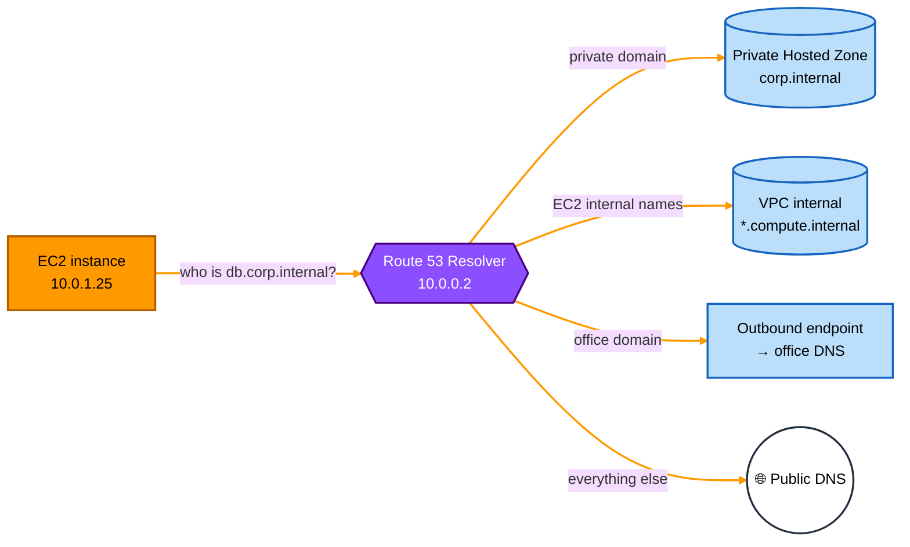

### 2.6 Key limits

- Each instance (ENI) can send up to **1,024 DNS packets per second** to the Resolver. Busy apps should cache DNS answers.
- The Resolver only answers queries from **inside the VPC** (or through Resolver endpoints). Your office computers can't use `10.0.0.2` directly.

## 3. VPC DHCP Option Sets

### 3.1 What is DHCP?

**DHCP (Dynamic Host Configuration Protocol)** automatically gives a device its network settings when it joins a network: IP address, DNS server, domain name and more. Your home router does this for your phone and laptop.

In a VPC, AWS runs DHCP for you. A **DHCP option set** is the list of settings AWS hands to every instance in the VPC.

### 3.2 What's in a DHCP option set

| Option | Meaning | Default value |
|---|---|---|
| **domain-name-servers** | Which DNS server(s) instances should use (up to 4) | `AmazonProvidedDNS` (the Route 53 Resolver) |
| **domain-name** | Domain added to short names (so `db` becomes `db.<domain>`) | `ec2.internal` in `us-east-1`; `<region>.compute.internal` elsewhere |
| **ntp-servers** | Time servers (up to 4) | None (instances use Amazon Time Sync at `169.254.169.123`) |
| **netbios-name-servers** / **netbios-node-type** | For old Windows networks | None |
| **ipv6-address-preferred-lease-time** | How long IPv6 leases last | Default AWS value |

### 3.3 Rules

- Each VPC uses **exactly one** DHCP option set at a time. One option set can be shared by **many VPCs** in the same region.
- An option set **can't be edited** after creation. To change something: **create a new option set → associate it with the VPC**.
- Instances pick up new settings when they **renew their DHCP lease** (a few hours) or when you **reboot** them. Nothing breaks immediately.
- You can also set the VPC to **"No DHCP option set"**; then instances get no DNS settings at all (rarely wanted).

### 3.4 When would you change it?

| Scenario | New DHCP option set |
|---|---|
| Use your **own DNS server** (e.g. Active Directory) | `domain-name-servers = 10.0.5.10, 10.0.6.10` |
| Use **your company's domain** for short names | `domain-name = corp.example.com` |
| Use **your own time servers** | `ntp-servers = 10.0.5.20` |

**Warning:** if you replace `AmazonProvidedDNS` with your own DNS server, instances **stop asking** the Route 53 Resolver directly. Your DNS server must **forward** AWS names (like `*.amazonaws.com` and `*.compute.internal`) to `10.0.0.2`, or those names will stop working.

## 4. Hands-on Scenarios

The next sections cover the two hands-on exercises and the hybrid DNS setup:

| Scenario | Who answers private names? | Section |
|---|---|---|
| **A.** VPC DNS with a **Route 53 Private Hosted Zone** | Route 53 Resolver + Private Hosted Zone (fully managed) | 5 |
| **B.** VPC DNS with a **custom DNS server** | Your own DNS server on EC2, set through a DHCP option set | 6 |
| **C.** **Hybrid DNS** with Resolver endpoints | Route 53 Resolver talking to your office DNS | 7 |

## 5. Hands-on: VPC DNS with Route 53 Private Hosted Zone

### 5.1 What is a Private Hosted Zone?

A **Private Hosted Zone (PHZ)** is a Route 53 hosted zone that is **only visible inside the VPCs you associate with it**. The internet can't see it.

**Use it to give friendly names to private resources:**

```
db.corp.internal     → 10.0.2.40   (database)
api.corp.internal    → 10.0.2.55   (internal API)
cache.corp.internal  → 10.0.3.12   (Redis)
```

Apps connect to `db.corp.internal` instead of a hard-coded IP. If the database moves, you update one DNS record, not every app.

### 5.2 Steps

1. **Check the VPC settings:** turn **DNS resolution** and **DNS hostnames** both **ON**.
2. **Route 53 → Hosted zones → Create hosted zone**
   - Domain name: `corp.internal`
   - Type: **Private hosted zone**
   - Associate it with your **VPC** (you can add more VPCs, even from other regions or accounts).
3. **Create records** in the zone, for example an **A record** `db.corp.internal → 10.0.2.40`.
4. **Test** from an EC2 instance in the VPC:
   ```bash
   nslookup db.corp.internal
   # or
   dig db.corp.internal
   ```
   You should see `10.0.2.40`, answered by `10.0.0.2`.
5. **Test from outside** the VPC (e.g. your laptop): the name should **not** resolve, which proves it's private.

### 5.3 Diagram

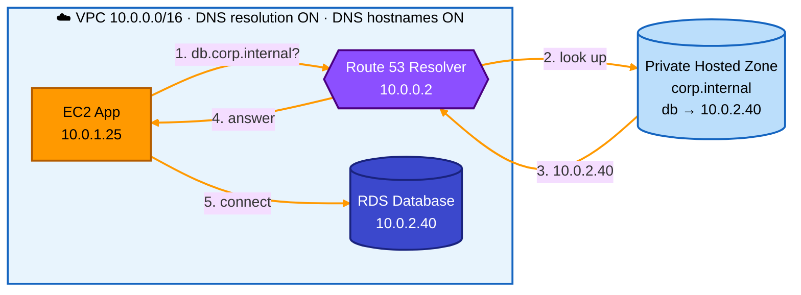

### 5.4 Good to know

- **Split-horizon DNS:** you can have a **public** hosted zone and a **private** hosted zone with the **same name** (e.g. `example.com`). Inside the VPC, the private one wins; on the internet, the public one is used.
- A PHZ costs a small monthly fee per zone plus a fee per million queries.

## 6. Hands-on: VPC DNS with a Custom DNS Server

### 6.1 When you need your own DNS server

- Your company already uses **Active Directory DNS** or **BIND**.
- You need DNS features Route 53 doesn't offer.
- A requirement says all DNS must go through your own server (e.g. for logging).

### 6.2 Steps

1. **Launch an EC2 instance** in the VPC to be the DNS server, e.g. `10.0.5.10`. Install DNS software such as **BIND** or **Unbound**.
2. **Configure it:**
   - Add your own zone, e.g. `corp.internal` with `db → 10.0.2.40`.
   - **Forward everything else to the Amazon DNS server `10.0.0.2`**, so AWS and internet names keep working.
3. **Security Group of the DNS server:** allow **UDP and TCP port 53** from the VPC CIDR (`10.0.0.0/16`).
4. **Create a new DHCP option set:**
   - `domain-name-servers = 10.0.5.10`
   - `domain-name = corp.internal`
5. **Associate** the new option set with the VPC.
6. **Reboot** (or wait for lease renewal) on the other instances, then check:
   ```bash
   cat /etc/resolv.conf     # should show nameserver 10.0.5.10
   dig db.corp.internal     # should return 10.0.2.40
   dig google.com           # should still work (forwarded to 10.0.0.2)
   ```

### 6.3 Diagram

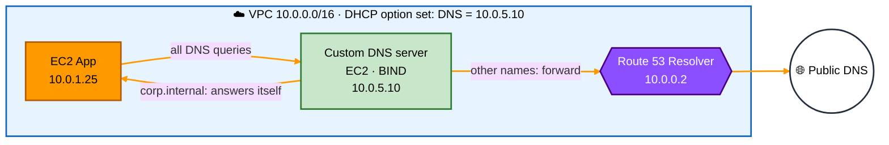

### 6.4 Private Hosted Zone vs custom DNS server

| | Private Hosted Zone | Custom DNS server |
|---|---|---|
| Managed by | AWS | You (patching, backups, scaling) |
| High availability | Built in | You must run at least 2 servers in different AZs |
| Setup | Simple | More work (EC2 + DNS software + DHCP option set) |
| Flexibility | Standard record types | Anything your DNS software supports |
| Best for | Most AWS workloads | Existing Active Directory / special requirements |

## 7. Route 53 Resolver Endpoints (Hybrid DNS)

### 7.1 The problem

With a **hybrid** setup (office / data center connected to AWS by **Site-to-Site VPN** or **Direct Connect**):

- Office computers want to resolve **AWS private names** (`db.corp.internal` in a Private Hosted Zone). ❌ They can't reach `10.0.0.2`.
- AWS instances want to resolve **office names** (`fileserver.office.local`). ❌ The Route 53 Resolver doesn't know them.

**Resolver endpoints** solve both. They are **ENIs with private IPs** in your VPC subnets that act as doors for DNS queries.

### 7.2 Inbound vs outbound endpoints

| | Inbound endpoint | Outbound endpoint |
|---|---|---|
| Direction | **Office → AWS** | **AWS → Office** |
| Lets | Office DNS servers ask the Route 53 Resolver about AWS names | The Route 53 Resolver forward queries to office DNS servers |
| Setup on office side | On office DNS, add a **conditional forwarder**: `corp.internal → inbound endpoint IPs` | — |
| Setup on AWS side | Create the endpoint (IPs in 2+ subnets / AZs) | Create the endpoint **+ a forwarding rule**, e.g. `office.local → 192.168.1.10`, and associate the rule with the VPC |

### 7.3 Diagram

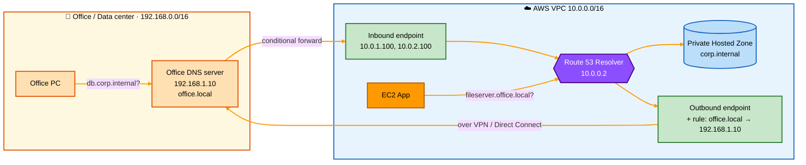

**Colour guide:** 🟧 light orange = office side · 🟩 green = Resolver endpoints · 🟪 purple = Route 53 Resolver · 🟦 blue = Private Hosted Zone

### 7.4 Good to know

- Place each endpoint's IPs in **at least 2 AZs** for high availability.
- Endpoints need a **Security Group** allowing **DNS (TCP/UDP 53)** from the right sources.
- The office and AWS must already be connected by **VPN or Direct Connect**; endpoints only handle DNS, not the network link.
- **Forwarding rules** can be **shared** with other accounts using AWS RAM, and one rule can be associated with many VPCs.
- Endpoints are charged **per ENI per hour**, plus per query.

## 8. Quick Summary

- **Route 53 Resolver (AmazonProvidedDNS)** = built-in DNS server of every VPC, at **VPC base + 2** (e.g. `10.0.0.2`) or `169.254.169.253`.
- **enableDnsSupport** = turns the built-in DNS server on; **enableDnsHostnames** = gives instances public DNS names. Both ON for Private Hosted Zones.
- **EC2 private DNS name** = `ip-10-0-1-25.<region>.compute.internal`; **public DNS name** resolves to the private IP inside the VPC.
- **DHCP option set** = settings (DNS servers, domain name, NTP) handed to instances; one per VPC; can't be edited, only replaced.
- **Private Hosted Zone** = Route 53 zone visible only inside associated VPCs; easiest way to name private resources.
- **Custom DNS server** = your own DNS on EC2, set via a DHCP option set; must forward AWS names to `.2`.
- **Inbound Resolver endpoint** = office → AWS DNS queries.
- **Outbound Resolver endpoint + forwarding rule** = AWS → office DNS queries.

---


# VPC DNS, DHCP Option Sets & Route 53 Resolver

A study guide for **how DNS works inside an AWS VPC**: the Amazon DNS server (Route 53 Resolver), what it resolves and in what order, private hosted zones, VPC-assigned hostnames, DHCP option sets, the VPC DNS attributes, and Route 53 Resolver endpoints for hybrid (on-premises ↔ AWS) DNS. The last sections cover **advanced topics**: resolver rules and precedence, centralized DNS architectures, multi-account sharing, limits, DNS Firewall, query logging and troubleshooting.

> Diagrams use **Mermaid** (renders on GitHub, GitLab, Obsidian, VS Code with a Mermaid extension) and plain-text ASCII art.
>
> Examples use VPC `10.10.0.0/16` in `ap-south-1` (Mumbai), matching the course slides. AWS documentation now calls the service **Route 53 VPC Resolver**; this guide uses the course name, Route 53 Resolver.

---

## Table of Contents

**Part 1 — Fundamentals**
1. [Why DNS Matters in a VPC](#1-why-dns-matters-in-a-vpc)
2. [The Amazon DNS Server (Route 53 Resolver)](#2-the-amazon-dns-server-route-53-resolver)
3. [What the Resolver Answers, and in What Order](#3-what-the-resolver-answers-and-in-what-order)
4. [Route 53 Private Hosted Zones](#4-route-53-private-hosted-zones)
5. [VPC DNS: AWS-Assigned Hostnames](#5-vpc-dns-aws-assigned-hostnames)
6. [Public DNS](#6-public-dns)

**Part 2 — How Instances Find the DNS Server**
7. [DHCP Option Sets](#7-dhcp-option-sets)
8. [DHCP Option Sets: How It Works on the Instance](#8-dhcp-option-sets-how-it-works-on-the-instance)
9. [Changing the DHCP Option Set](#9-changing-the-dhcp-option-set)
10. [VPC DNS Attributes](#10-vpc-dns-attributes)

**Part 3 — Hybrid DNS**
11. [The Hybrid DNS Problem](#11-the-hybrid-dns-problem)
12. [Route 53 Resolver Endpoints](#12-route-53-resolver-endpoints)
13. [Inbound Endpoint: On-Premises → AWS](#13-inbound-endpoint-on-premises--aws)
14. [Outbound Endpoint: AWS → On-Premises](#14-outbound-endpoint-aws--on-premises)

**Part 4 — Advanced**
15. [Resolver Rules and Precedence](#15-resolver-rules-and-precedence)
16. [Centralized DNS for Multi-VPC / Multi-Account](#16-centralized-dns-for-multi-vpc--multi-account)
17. [Limits and Quotas](#17-limits-and-quotas)
18. [Security and Observability](#18-security-and-observability)
19. [Common Pitfalls](#19-common-pitfalls)
20. [Troubleshooting Toolkit](#20-troubleshooting-toolkit)
21. [Exam Cheat Sheet](#21-exam-cheat-sheet)
22. [Sources](#22-sources)

---

# Part 1 — Fundamentals

## 1. Why DNS Matters in a VPC

Applications almost never connect to raw IP addresses. They connect to names: `db.example.internal`, `s3.ap-south-1.amazonaws.com`, `api.partner.com`. Every one of those names must be translated into an IP address first. If DNS breaks, the network can be perfectly healthy and still **nothing works**.

Inside a VPC, DNS has to answer three very different kinds of names:

| Kind of name | Example | Who owns the answer |
|---|---|---|
| Your own private names | `app1.example.internal` | You, in a **Route 53 private hosted zone** |
| AWS-generated instance names | `ip-10-10-0-15.ap-south-1.compute.internal` | AWS, automatically (**VPC DNS**) |
| Everything on the internet | `google.com`, `sqs.ap-south-1.amazonaws.com` | The **public DNS** system |

AWS gives every VPC one DNS server that handles all three. Understanding it, and how instances are told to use it, is the purpose of this guide.

---

## 2. The Amazon DNS Server (Route 53 Resolver)

Every VPC comes with a **default DNS server**, called the **Amazon DNS server**, **AmazonProvidedDNS**, or **Route 53 Resolver**. You don't create it, pay for it, or manage it.

### Where it lives

It is reachable at three addresses from inside the VPC:

| Address | Example (VPC `10.10.0.0/16`) | Notes |
|---|---|---|
| **VPC base + 2** | `10.10.0.2` | The primary CIDR's network address plus two. This is why AWS reserves the `.2` address |
| **169.254.169.253** | `169.254.169.253` | Link-local virtual IP; same in every VPC |
| **fd00:ec2::253** | `fd00:ec2::253` | IPv6 link-local equivalent (Nitro instances) |

```
┌─ VPC 10.10.0.0/16 ──────────────────────────────────────────────────┐
│                                                                     │
│  ┌─ Subnet 10.10.0.0/24 ─┐          ┌─ Subnet 10.10.1.0/24 ─┐       │
│  │   [EC2] 10.10.0.15    │          │   [EC2] 10.10.1.20    │       │
│  └───────────┬───────────┘          └───────────┬───────────┘       │
│              │ DNS query (UDP/TCP 53)           │                   │
│              ▼                                  ▼                   │
│  ┌ ─ ─ ─ ─ ─ ─ ─ ─ ─ ─ ─ ─ ─ ─ ─ ─ ─ ─ ─ ─ ─ ─ ─ ─ ─ ─ ─ ─ ─ ┐     │
│     Route 53 DNS Resolver                                           │
│  │  10.10.0.2 (VPC + 2)   also at 169.254.169.253            │     │
│   ─ ─ ─ ─ ─ ┬ ─ ─ ─ ─ ─ ─ ─ ┬ ─ ─ ─ ─ ─ ─ ─ ─ ┬ ─ ─ ─ ─ ─ ─ ─ ─      │
└─────────────┼────────────────┼──────────────────┼───────────────────┘
              ▼                ▼                  ▼
      ① Private hosted   ② VPC DNS         ③ Public DNS
         zone             (compute.internal)   (internet, recursive)
```

### Key facts

- It resolves requests from **Route 53 private hosted zones**, **VPC internal DNS**, and **forwards everything else to public DNS** (including Route 53 public hosted zones).
- It is **only accessible from within the VPC**. On-premises networks and peered VPCs **cannot** send queries to `10.10.0.2`. This one fact is the reason Resolver endpoints exist (Part 3).
- It is a **recursive resolver**: it does the full lookup work (root → TLD → authoritative) for public names on the instance's behalf, and caches results.
- The `.2` address is "VPC base + 2" of the **primary** CIDR. If you add secondary CIDRs, the resolver stays at the primary CIDR's `.2`. AWS also reserves `.2` in each subnet, but you should point at the VPC-level address (or 169.254.169.253).

> **Why the 169.254.169.253 address exists:** it is the same in every VPC, so AMIs, containers and scripts can hard-code one DNS address that works anywhere, without knowing the VPC's CIDR.

---

## 3. What the Resolver Answers, and in What Order

When an instance asks "what is the IP for this name?", the resolver checks its sources in a fixed order:

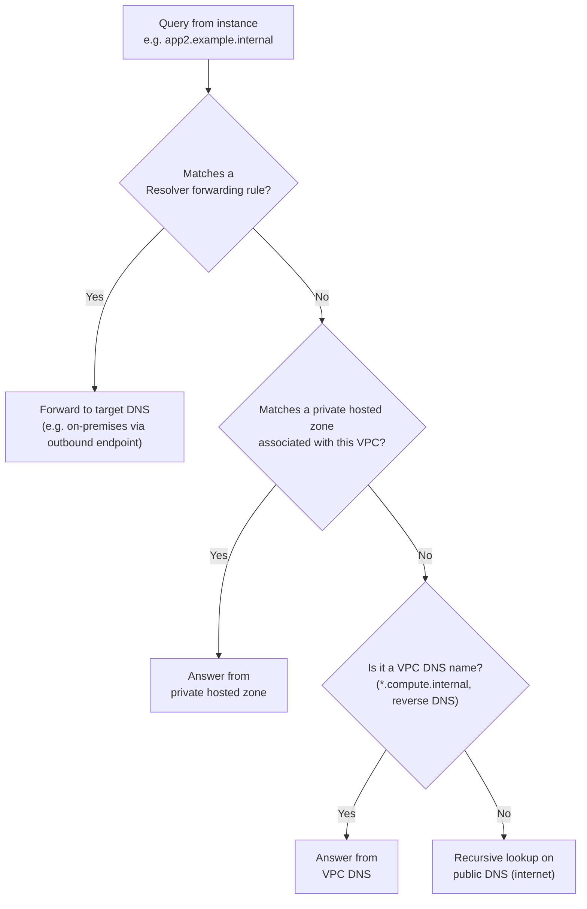

| Order | Source | Example names |
|---|---|---|
| 0 | **Resolver forwarding rules** (if you created any; see Part 4) | `corp.local` → on-premises DNS |
| 1 | **Route 53 private hosted zones** associated with the VPC | `app1.example.internal` |
| 2 | **VPC DNS** (AWS-generated names, reverse lookups) | `ip-10-10-0-15.ap-south-1.compute.internal` |
| 3 | **Public DNS** (recursive) | `google.com`, `s3.ap-south-1.amazonaws.com` |

The course slides show steps 1 → 2 → 3. Step 0 only applies once you add Resolver rules, which override the other sources for their domain.

> **Important consequence:** a private hosted zone **shadows** public DNS for its domain. If you create a private zone `example.com` but only add `app1` to it, then from inside that VPC `www.example.com` returns **NXDOMAIN**, even if it exists publicly. The resolver doesn't fall through to public DNS for a domain it holds a private zone for. This is called **split-horizon DNS**, and it catches many people out.

---

## 4. Route 53 Private Hosted Zones

A **private hosted zone (PHZ)** is a container of DNS records that only answers queries from the VPCs you associate with it. It lets you give your resources friendly, stable names.

### Step by step (course example)

1. **Create a private hosted zone** `example.internal` and associate it with the VPC.
2. **Create record sets** pointing to EC2 instances' private IPs.
3. **Query from within the VPC.**

| Record name | Type | Value |
|---|---|---|
| `example.internal` | NS | `ns-1536.awsdns-00.co.uk.` … (created automatically) |
| `example.internal` | SOA | `ns-1536.awsdns-00.co.uk. …` (created automatically) |
| `app1.example.internal` | A | `10.10.0.15` |
| `app2.example.internal` | A | `10.10.1.20` |

### The query flow

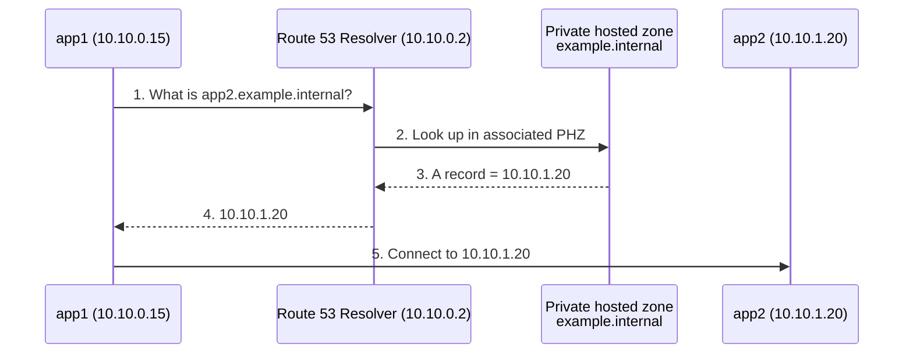

### Why use a private hosted zone

- **Stable names:** if `app2` is replaced, update one record instead of every config file that holds the IP.
- **Meaningful names:** `orders-db.prod.internal` instead of `ip-10-10-1-20…`.
- **Private:** the zone can't be queried from the internet.
- **Alias records:** point names at AWS resources (load balancers, VPC endpoints) whose IPs change.
- **Split-horizon:** the same name (`api.example.com`) can resolve to private IPs inside the VPC and public IPs outside.

### Requirements

- The VPC must have **both** `enableDnsSupport` and `enableDnsHostnames` set to **true** (Section 10).
- The zone must be **associated** with every VPC that should see it. Association is per VPC, including peered VPCs. Peering alone does **not** share private zones.
- Associating a zone with a VPC in **another account** needs an authorization step (`create-vpc-association-authorization` in the zone owner's account, then `associate-vpc-with-hosted-zone` in the VPC owner's account), or a **Route 53 Profile** (Section 16).

---

## 5. VPC DNS: AWS-Assigned Hostnames

Even without any hosted zone, every instance gets an AWS-generated private DNS name that the resolver can answer.

### Internal (private) DNS names

| Region | Format | Example |
|---|---|---|
| us-east-1 | `ip-<private-ipv4>.ec2.internal` | `ip-10-10-0-15.ec2.internal` |
| All other Regions | `ip-<private-ipv4>.<region>.compute.internal` | `ip-10-10-0-15.ap-south-1.compute.internal` |

The dots in the IP become dashes. These names resolve to the **private IP** and work only from inside the VPC (and from connected VPCs whose resolvers can reach this VPC's names, such as peered VPCs with DNS resolution enabled on the peering).

```
ip-10-10-0-15.ap-south-1.compute.internal  ->  10.10.0.15
ip-10-10-1-20.ap-south-1.compute.internal  ->  10.10.1.20
```

> The course slide lists `ip-10-10-0-20…` as the second example name; the instance in the diagram is `10.10.1.20`, so the matching name is `ip-10-10-1-20…`.

### External (public) DNS names

Only if the instance has a **public IP** and the VPC has `enableDnsHostnames = true`:

| Region | Format | Example |
|---|---|---|
| us-east-1 | `ec2-<public-ipv4>.compute-1.amazonaws.com` | `ec2-3-80-1-2.compute-1.amazonaws.com` |
| Other Regions | `ec2-<public-ipv4>.<region>.compute.amazonaws.com` | `ec2-13-232-1-2.ap-south-1.compute.amazonaws.com` |

**Advanced detail:** the public DNS name resolves to the **public IP from outside** the VPC, but to the **private IP from inside** the VPC (and from peered VPCs with DNS resolution enabled). That keeps instance-to-instance traffic on the private network even when apps use the public name.

### IP-based vs resource-based names (advanced)

Newer VPCs and subnets can choose a hostname type:

| Hostname type | Format | Notes |
|---|---|---|
| **IP name** (classic) | `ip-10-10-0-15.ap-south-1.compute.internal` | Derived from the private IPv4 address. IPv4 only |
| **Resource name (RBN)** | `i-0123456789abcdef0.ap-south-1.compute.internal` | Derived from the instance ID. Works for IPv6-only and dual-stack subnets, and can return A and/or AAAA records |

The hostname type is set per subnet (and can be overridden per instance at launch).

---

## 6. Public DNS

For anything that isn't private or VPC-internal, the resolver performs a normal **recursive** lookup on the internet:

- Public websites: `google.com`, `amazon.com`
- **AWS service endpoints**: `sqs.ap-south-1.amazonaws.com`, `s3.ap-south-1.amazonaws.com`
- Domains hosted with any registrar or DNS provider (GoDaddy, Hostinger, Domain.com, **Route 53 public hosted zones**, and so on)

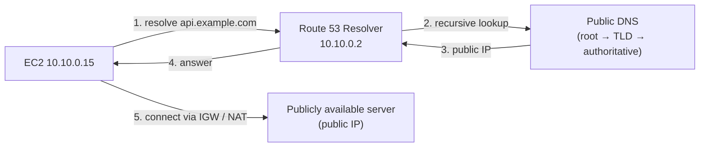

Two separate things are needed to reach an internet server from a private instance: **DNS resolution** (the resolver does it, no internet route required) and a **network path** (Internet Gateway, or NAT gateway for private subnets). An instance in a private subnet with no NAT can still *resolve* `google.com`; it just can't *connect* to it.

> **Advanced: VPC endpoints and private DNS.** When you create an interface VPC endpoint with "private DNS" enabled, AWS adds a hidden private zone so that the normal public name (`sqs.ap-south-1.amazonaws.com`) resolves to the **endpoint's private IPs** inside your VPC. Same name, private path. This relies on the same precedence rules from Section 3 and needs both VPC DNS attributes set to true.

---

# Part 2 — How Instances Find the DNS Server

## 7. DHCP Option Sets

An instance doesn't magically know that `10.10.0.2` is its DNS server. It learns this at boot through **DHCP (Dynamic Host Configuration Protocol)**.

When an instance starts, it sends a DHCP request. The DHCP response's **options field** carries configuration parameters such as:

| DHCP option | Purpose | VPC default |
|---|---|---|
| `domain-name-servers` | Which DNS servers to use (up to 4) | `AmazonProvidedDNS` (= the Route 53 Resolver) |
| `domain-name` | Domain suffix for hostnames and search | `ec2.internal` (us-east-1) or `<region>.compute.internal` |
| `ntp-servers` | Time servers (up to 4) | Amazon Time Sync Service (169.254.169.123) is used by default |
| `netbios-name-servers` | Windows NetBIOS name servers | Not set |
| `netbios-node-type` | Windows NetBIOS resolution method (2 recommended) | Not set |
| `ipv6-address-preferred-lease-time` | DHCPv6 lease renewal | 140 seconds |

In AWS, this bundle of settings is called a **DHCP option set**. AWS **automatically creates and associates a default DHCP option set** with every new VPC:

```
DHCP option set (default)
├── domain-name         = ap-south-1.compute.internal
└── domain-name-servers = AmazonProvidedDNS
```

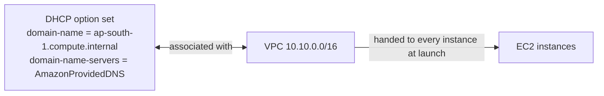

### Why you'd create a custom DHCP option set

| Scenario | What to set |
|---|---|
| Company naming convention | `domain-name = corp.internal` |
| Instances must use Active Directory / custom DNS | `domain-name-servers = 10.10.5.10, 10.10.6.10` |
| Use both AD and Amazon DNS | `domain-name-servers = 10.10.5.10, AmazonProvidedDNS` (careful: clients don't merge answers; see Section 19) |
| Windows domain join with NetBIOS | `netbios-name-servers`, `netbios-node-type = 2` |
| Internal NTP servers required by policy | `ntp-servers = …` |

---

## 8. DHCP Option Sets: How It Works on the Instance

When the instance boots, the DHCP client applies the option set in two visible ways.

### 1. It sets the hostname

```
[ec2-user@ip-10-10-0-211 ~]$ hostname
ip-10-10-0-211.ap-south-1.compute.internal
```

The `ip-10-10-0-211` part comes from the private IP; the `.ap-south-1.compute.internal` part comes from the option set's `domain-name`.

### 2. It writes the resolver configuration (`/etc/resolv.conf`)

```
[ec2-user@ip-10-10-0-211 ~]$ cat /etc/resolv.conf
; generated by /usr/sbin/dhclient-script
search ap-south-1.compute.internal
options timeout:2 attempts:5
nameserver 10.10.0.2
```

| Line | Comes from | Meaning |
|---|---|---|
| `search ap-south-1.compute.internal` | `domain-name` | Short names get this suffix appended: `ping ip-10-10-1-20` tries `ip-10-10-1-20.ap-south-1.compute.internal` |
| `nameserver 10.10.0.2` | `domain-name-servers = AmazonProvidedDNS` | All queries go to the VPC + 2 resolver |
| `options timeout:2 attempts:5` | Amazon Linux defaults | Wait 2 s per try, up to 5 tries |

> **Modern distros:** on systems using `systemd-resolved` (Amazon Linux 2023, recent Ubuntu), `/etc/resolv.conf` often shows `nameserver 127.0.0.53`, a local stub. Use `resolvectl status` to see the real upstream server (still `10.10.0.2`).

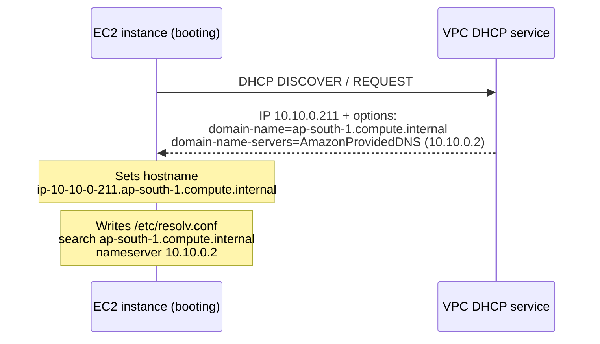

---

## 9. Changing the DHCP Option Set

### Attaching a new option set (course example)

```
DHCP option set (old)                       DHCP option set (new)
domain-name  = ap-south-1.corp.internal     domain-name  = finance.internal
name-servers = AmazonProvidedDNS            name-servers = AmazonProvidedDNS
        ✗ detached                                   ✓ associated with VPC

┌─ VPC 10.10.0.0/16 ──────────────────────────────────────────────────┐
│  Subnet A 10.10.0.0/24                    Subnet B 10.10.1.0/24      │
│   [EC2] ip-10-10-0-24.ap-south-1.corp.internal                       │
│                                           [EC2] ip-10-10-1-33.ap-south-1.corp.internal
│   [EC2] new instance → gets finance.internal                         │
│                                                                      │
│   Existing instances switch to finance.internal on their next       │
│   DHCP lease renewal (can take hours) or when you renew manually.    │
└──────────────────────────────────────────────────────────────────────┘
```

### Good to know

| Rule | Details |
|---|---|
| **Immutable** | Once created, a DHCP option set **cannot be modified**. Create a new one and associate it with the VPC |
| **One per VPC** | A VPC has **exactly one** option set at a time (one option set can be shared by many VPCs) |
| **No option set** | A VPC can be set to "no DHCP options". On older Xen instances, no DNS server is configured, so they **can't resolve names** (and in practice can't reach the internet by name). Nitro instances fall back to `169.254.169.253` |
| **Propagation** | Running instances pick up the new set automatically, but this **may take a few hours** (at DHCP lease renewal). New instances get it immediately |
| **Force a refresh** | Renew the DHCP lease from the OS (see below), or reboot |
| **No downtime** | Changing the association doesn't restart instances or change IPs |

### Refresh commands

```bash
# Amazon Linux 2 / dhclient-based systems
sudo dhclient -r eth0      # release the lease
sudo dhclient eth0         # request a new lease (picks up new options)

# systemd-networkd (Amazon Linux 2023)
sudo networkctl renew eth0     # or: sudo systemctl restart systemd-networkd

# Ubuntu (netplan)
sudo netplan apply

# Windows
ipconfig /renew
```

> The course slide shows only `sudo dhclient -r eth0`. On its own, `-r` **releases** the lease; you then need `sudo dhclient eth0` to obtain a new one. Be careful running a release over SSH on the instance's primary interface: you can cut off your own session. Prefer one combined command or the Session Manager console.

### CLI

```bash
# Create a new option set
aws ec2 create-dhcp-options --dhcp-configurations \
  "Key=domain-name,Values=finance.internal" \
  "Key=domain-name-servers,Values=AmazonProvidedDNS"

# Associate it with the VPC
aws ec2 associate-dhcp-options --dhcp-options-id dopt-xxxx --vpc-id vpc-xxxx

# Set the VPC to "no DHCP options"
aws ec2 associate-dhcp-options --dhcp-options-id default --vpc-id vpc-xxxx   # 'default' = none

# See which set a VPC uses
aws ec2 describe-vpcs --vpc-ids vpc-xxxx --query "Vpcs[].DhcpOptionsId"
```

---

## 10. VPC DNS Attributes

Two VPC-level switches control the Amazon DNS server's behavior.

### `enableDnsSupport` (console: **DNS resolution**)

| | |
|---|---|
| Default | **True** |
| Purpose | Decides whether DNS resolution through the Amazon DNS server is supported in the VPC |
| If true | Instances can query the AWS DNS server at `169.254.169.253` / VPC + 2 |
| If false | The Amazon DNS server doesn't answer; instances need another DNS server |

### `enableDnsHostnames` (console: **DNS hostnames**)

| | |
|---|---|
| Default | **False** for VPCs you create; **True** for the default VPC |
| Depends on | Does nothing unless `enableDnsSupport = true` |
| If true | Instances with a public IP get a **public DNS hostname**, and the resolver answers the Amazon-provided private hostnames |

### Combined behavior

| `enableDnsSupport` | `enableDnsHostnames` | Result |
|---|---|---|
| true | true | Full functionality: public hostnames, private hostnames resolve, **private hosted zones work**, interface endpoint private DNS works |
| true | false | Public names resolve; no public hostnames assigned; **private hosted zones don't work** |
| false | true / false | Amazon DNS server not available to instances |

> **Exam rule:** if you use custom DNS domain names in a **Route 53 private hosted zone**, you **must set both attributes to true**. The same applies to **interface VPC endpoints with private DNS**.

```bash
# Each attribute must be changed in a separate call
aws ec2 modify-vpc-attribute --vpc-id vpc-xxxx --enable-dns-support "{\"Value\":true}"
aws ec2 modify-vpc-attribute --vpc-id vpc-xxxx --enable-dns-hostnames "{\"Value\":true}"

# Check current values
aws ec2 describe-vpc-attribute --vpc-id vpc-xxxx --attribute enableDnsSupport
aws ec2 describe-vpc-attribute --vpc-id vpc-xxxx --attribute enableDnsHostnames
```

---

# Part 3 — Hybrid DNS

## 11. The Hybrid DNS Problem

Many companies connect their data center to AWS with **Site-to-Site VPN** or **Direct Connect (DX)**. The network path exists, but DNS has two gaps:

| Direction | Question | Why it fails by default |
|---|---|---|
| **On-premises → AWS** | An on-prem server asks "what is `app1.example.internal`?" (a private hosted zone name) | The VPC + 2 resolver is **only reachable from inside the VPC**. On-prem DNS servers can't send it queries over VPN/DX |
| **AWS → on-premises** | An EC2 instance asks "what is `erp.corp.local`?" (a name on the corporate DNS) | The Route 53 Resolver doesn't know `corp.local`; it tries public DNS and gets NXDOMAIN |

Before 2018, the workaround was to run your own DNS forwarder EC2 instances (BIND, Unbound, Windows DNS) in the VPC. That meant patching, scaling and making them highly available yourself. **Route 53 Resolver endpoints** replace those instances with a managed service.

---

## 12. Route 53 Resolver Endpoints

- AWS officially named the ".2 DNS resolver" **Route 53 Resolver**.
- It provides **inbound** and **outbound** Resolver endpoints.
- Each endpoint provisions **ENIs (elastic network interfaces) in your VPC**, which are reachable over **VPN or DX**.
- **Inbound** → on-premises DNS forwards requests to the Route 53 Resolver.
- **Outbound** → conditional forwarders from AWS to on-premises.

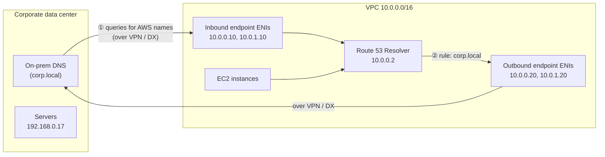

### Endpoint essentials

| Property | Value |
|---|---|
| IP addresses per endpoint | **Minimum 2** (AWS requires at least two, in different AZs, for availability); **maximum 6** per endpoint (quota) |
| Capacity | Up to **10,000 UDP queries per second per IP address** (can be as low as ~1,500 QPS with connection-tracked security groups or through a load balancer) |
| Security group | Each endpoint has a security group. Inbound endpoints must **allow inbound TCP and UDP 53** from on-prem DNS servers; outbound endpoints must **allow outbound TCP and UDP 53** to the target DNS servers |
| Protocols | DNS over UDP/TCP 53 (Do53); **DNS over HTTPS (DoH)** is also supported on endpoints |
| Cost | Charged **per ENI per hour** plus **per million queries**. Two ENIs is the minimum footprint, so it is not free like the .2 resolver |
| Direction | One endpoint is either inbound **or** outbound. Use one of each for two-way resolution |

---

## 13. Inbound Endpoint: On-Premises → AWS

**Purpose:** let on-premises clients resolve names that only AWS knows: **private hosted zones**, VPC DNS names (`*.compute.internal`), interface endpoint private DNS names.

```
         Public DNS        Public/Private hosted zone
            (●)                    ⛉
                                   │ (associated with VPC)
┌─ Corporate data center ─┐        │       ┌─ VPC 10.0.0.0/16 ─────────────────────────────┐
│                          │        │       │                                              │
│  [Server]    [DNS        │        │       │   Route 53 DNS Resolver    Private subnet A   │
│ 192.168.0.17  Forwarder] │  VPN/DX│       │   10.0.0.2 (VPC + 2)       [EC2] 10.0.0.11    │
│      │        ▲    │     │ ◄════════════► │        ▲                   [ENI] Inbound      │
│      └────────┘    └──── conditional ─────────────► (10.0.0.10) ───────┘                  │
│   ① query     ② forward "example.internal" to       ③ endpoint hands query               │
│   app1.example.internal    10.0.0.10 / 10.0.1.10       to Route 53 Resolver              │
│                          │                │        Private subnet B                      │
│                          │                │        [EC2] 10.0.1.22                        │
│                          │                │        [ENI] Inbound (10.0.1.10)              │
└──────────────────────────┘                └──────────────────────────────────────────────┘
```

### Flow

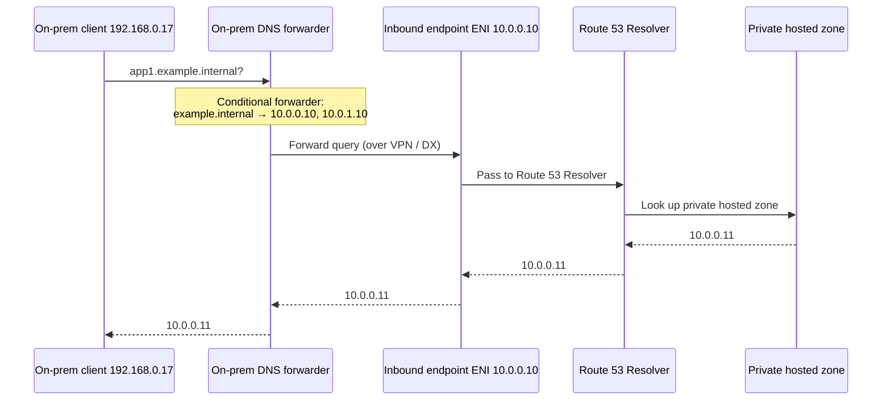

### Setup steps

1. Create an **inbound endpoint** in the VPC, with IPs in **at least two AZs** and a security group allowing TCP/UDP 53 from the on-prem DNS servers.
2. Note the endpoint IP addresses (for example `10.0.0.10`, `10.0.1.10`).
3. On the **on-premises DNS server**, create a **conditional forwarder**: `example.internal` (and any other AWS zones) → the endpoint IPs.
4. Make sure the VPN/DX routing and firewalls allow on-prem DNS servers to reach the endpoint IPs on port 53.

```bash
aws route53resolver create-resolver-endpoint \
  --name onprem-to-aws \
  --direction INBOUND \
  --creator-request-id inbound-2026-10-02 \
  --security-group-ids sg-xxxx \
  --ip-addresses SubnetId=subnet-aaaa,Ip=10.0.0.10 SubnetId=subnet-bbbb,Ip=10.0.1.10
```

> **Why not just forward to 10.0.0.2?** Traffic arriving from outside the VPC (VPN, DX, peering, Transit Gateway) can't reach the .2 resolver. The inbound endpoint ENIs are normal VPC IPs that *can* be reached, and they hand queries to the resolver on the inside.

---

## 14. Outbound Endpoint: AWS → On-Premises

**Purpose:** let EC2 instances resolve names that only the corporate DNS knows (for example `corp.local`, Active Directory domains, internal mainframe names), using **conditional forwarding**.

```
┌─ Corporate data center ─┐                  ┌─ VPC 10.0.0.0/16 ─────────────────────────────┐
│                          │                  │  Private subnet A                             │
│ [Server]       [DNS]     │                  │   [EC2] 10.0.0.11 ──① query erp.corp.local ─┐ │
│ 192.168.0.17     ▲       │                  │                                             │ │
│                  │       │                  │   Route 53 DNS Resolver  ◄──────────────────┘ │
│                  │       │      VPN/DX      │   10.0.0.2 (VPC + 2)                          │
│                  └───────────◄════════════════ ③ ── [ENI] Outbound ◄── ② rule matches     │
│   ④ answers from on-prem  │                  │       (10.0.0.20)       "corp.local":        │
│   DNS, returned the same  │                  │                         conditional forward  │
│   way back                │                  │  Private subnet B                             │
│                          │                  │   [EC2] 10.0.1.22   [ENI] Outbound (10.0.1.20)│
└──────────────────────────┘                  └───────────────────────────────────────────────┘
```

### Flow

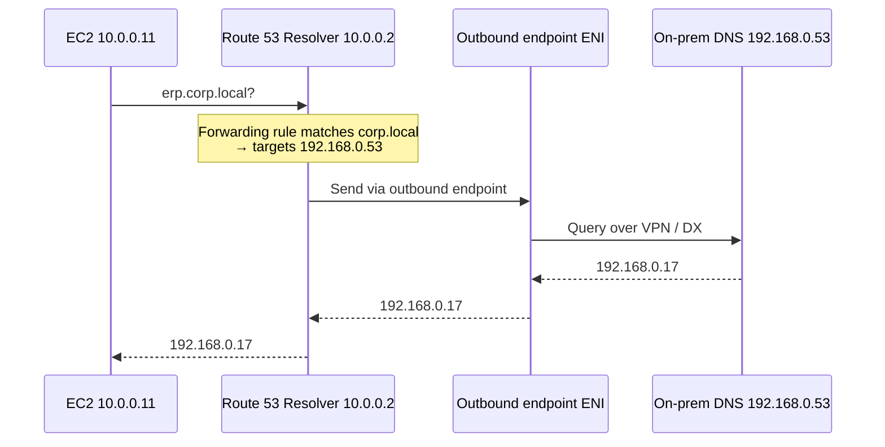

### Setup steps

1. Create an **outbound endpoint** with IPs in at least two AZs; its security group must allow **outbound** TCP/UDP 53 to the on-prem DNS servers.
2. Create a **forwarding rule**: domain `corp.local` → target IPs `192.168.0.53`, `192.168.1.53`, using that outbound endpoint.
3. **Associate the rule with the VPC(s)** whose instances should use it.
4. Make sure routes and firewalls let the endpoint ENIs reach the on-prem DNS servers on port 53.

```bash
aws route53resolver create-resolver-endpoint \
  --name aws-to-onprem \
  --direction OUTBOUND \
  --creator-request-id outbound-2026-10-02 \
  --security-group-ids sg-yyyy \
  --ip-addresses SubnetId=subnet-aaaa SubnetId=subnet-bbbb

aws route53resolver create-resolver-rule \
  --name corp-local \
  --rule-type FORWARD \
  --domain-name corp.local \
  --resolver-endpoint-id rslvr-out-xxxx \
  --target-ips Ip=192.168.0.53,Port=53 Ip=192.168.1.53,Port=53 \
  --creator-request-id rule-corp-local

aws route53resolver associate-resolver-rule \
  --resolver-rule-id rslvr-rr-xxxx --vpc-id vpc-xxxx
```

### Inbound vs outbound at a glance

| | Inbound endpoint | Outbound endpoint |
|---|---|---|
| Direction of queries | On-premises **→** AWS | AWS **→** on-premises |
| Who sends queries to it | On-prem DNS servers (conditional forwarders) | The Route 53 Resolver, when a forwarding rule matches |
| Needs Resolver rules? | No | **Yes** (forwarding rules decide what goes out) |
| Security group | Allow **inbound** 53 from on-prem | Allow **outbound** 53 to on-prem |
| Typical names | `*.example.internal` (PHZ), `*.compute.internal`, VPC endpoint names | `corp.local`, AD domains, internal legacy names |

---

# Part 4 — Advanced

## 15. Resolver Rules and Precedence

### Rule types

| Rule type | What it does | Created by |
|---|---|---|
| **Forward** | Sends queries for a domain (and its subdomains) to target IPs via an outbound endpoint | You |
| **System** | Tells the resolver to answer a domain **itself** (PHZ / VPC DNS / public), overriding a broader forward rule | You (or AWS for built-in names) |
| **Recursive** | The built-in "everything else": resolve via public DNS | AWS (auto-defined) |
| **Delegation** (newer) | Follows the DNS delegation chain and only forwards when the authoritative name servers match | You |

### Most specific domain wins

When several rules could match, the resolver uses the one with the **longest (most specific) domain name**.

```
Rules associated with the VPC:
  FORWARD  corp.local            → on-prem DNS
  SYSTEM   aws.corp.local        → answer locally (e.g. a PHZ named aws.corp.local)

Query                         Matching rule        Result
──────────────────────────    ──────────────────   ─────────────────────────────
erp.corp.local                corp.local           forwarded to on-prem
db.aws.corp.local             aws.corp.local       answered by Route 53 (PHZ)
google.com                    (built-in recursive) public DNS
```

**Use case:** forward the whole corporate domain on-premises, but carve out a subdomain that lives in a Route 53 private hosted zone.

### Forwarding rules beat private hosted zones

If a forwarding rule and a private hosted zone cover the same name, the **forwarding rule wins** (it is step 0 in Section 3). A rule for `example.internal` silently stops your PHZ `example.internal` from being used in that VPC. Use a **system rule** for the subdomain you want answered locally.

### Sharing rules across accounts

Resolver rules can be shared with other accounts through **AWS Resource Access Manager (RAM)**. Accounts that receive a shared rule associate it with their own VPCs, but the queries still flow through the **owner's outbound endpoint**. This avoids building endpoints in every account (see Section 16).

---

## 16. Centralized DNS for Multi-VPC / Multi-Account

Building inbound and outbound endpoints in every VPC is expensive (2+ ENIs each) and hard to manage. The standard enterprise pattern is a **central DNS (shared services) VPC**.

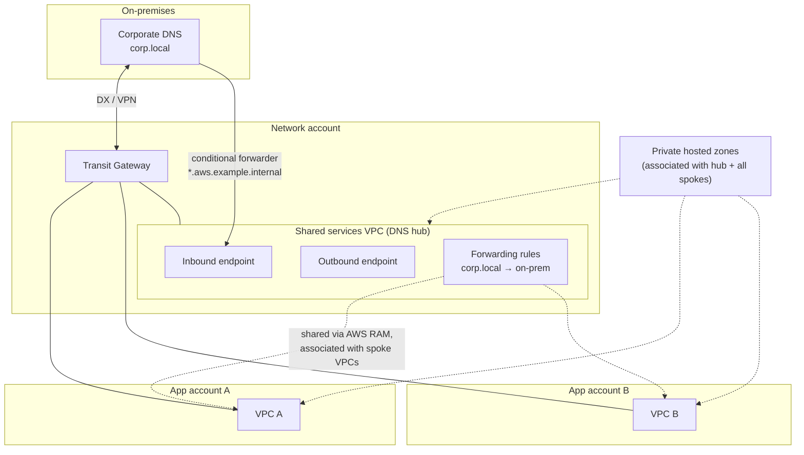

### How it works

| Piece | Role |
|---|---|
| **DNS hub VPC** | Holds the only inbound and outbound endpoints |
| **Transit Gateway / DX** | Network path between on-prem, the hub and the spoke VPCs |
| **Outbound rules shared via RAM** | Spoke VPCs associate the shared `corp.local` rule; their own .2 resolver sends matching queries out through the **hub's** outbound endpoint (no endpoints in spokes) |
| **Private hosted zones associated with all VPCs** | Every spoke can resolve AWS private names locally; the hub must also be associated so the **inbound** endpoint can answer on-prem queries for them |
| **On-prem conditional forwarders** | Point AWS domains at the hub's inbound endpoint IPs |

### Route 53 Profiles (newer, simpler)

A **Route 53 Profile** bundles DNS configuration (private hosted zone associations, Resolver rules, DNS Firewall rule groups, some VPC endpoint DNS settings) into one object you share through RAM and associate with many VPCs. Instead of associating dozens of zones and rules with every VPC, you associate one profile. Profiles support up to **1,000 VPC associations** each (compared with **300 VPCs per private hosted zone**).

### Peered VPCs and DNS

- Private hosted zones are **not** shared through peering. Associate the zone with the peer VPC explicitly.
- To resolve the other VPC's **public DNS hostnames to private IPs**, enable **DNS resolution support** on the peering connection (both sides).

---

## 17. Limits and Quotas

| Limit | Value | Why it matters |
|---|---|---|
| Packets per second **per ENI** to link-local services (Amazon DNS server, IMDS, Amazon Time Sync, Windows licensing) | **1,024 PPS**, **cannot be increased** | Chatty apps (microservices, Kubernetes nodes) can hit this. Symptoms: intermittent DNS timeouts. Fix: **local DNS caching** (nscd, dnsmasq, systemd-resolved, NodeLocal DNSCache) |
| UDP queries per second per endpoint IP | Up to **10,000** (as low as ~1,500 with connection tracking / NLB) | Add IPs to the endpoint (up to 6) for more capacity |
| IP addresses per Resolver endpoint | **6** (min 2) | |
| Resolver endpoints per Region | **4 per account** (adjustable quota) | Another reason to centralize |
| Resolver rules per Region | **1,000** per account | |
| Rule ↔ VPC associations per Region | **2,000** per account | |
| Target IPs per rule | **6** | |
| VPCs per private hosted zone | **300** (use Route 53 Profiles beyond this) | |
| DNS servers in a DHCP option set | **4** | |

> **The 1,024 PPS limit is a classic hidden bottleneck.** It counts *packets*, not queries, and is per network interface. A busy instance that looks up the same names thousands of times per second will see random resolution failures even though nothing is "down." Caching at the instance turns thousands of identical queries into a few per TTL.

---

## 18. Security and Observability

### Route 53 Resolver DNS Firewall

Filters DNS queries that leave your VPCs through the resolver:

- **Block lists** (known malware/C2 domains; AWS managed domain lists available) and **allow lists** (walled-garden: only approved domains resolve).
- Actions: **ALLOW**, **BLOCK** (NXDOMAIN, NODATA or custom response) or **ALERT** (log only).
- Helps stop **DNS-based data exfiltration**: if an instance can't resolve attacker domains, it can't tunnel data out through DNS queries.
- Rule groups can be shared via RAM and managed centrally with **AWS Firewall Manager**.
- Choose **fail-open** (availability first) or **fail-closed** (security first) if the firewall can't evaluate a query.

### Resolver query logging

- Logs every DNS query made from associated VPCs (and through inbound endpoints): query name, type, response code, answers, source instance.
- Destinations: **CloudWatch Logs**, **S3**, or **Kinesis Data Firehose**.
- Uses: security investigations (which instance looked up a malicious domain?), troubleshooting NXDOMAINs, auditing.
- **Amazon GuardDuty** also analyzes VPC DNS logs to detect threats (crypto-mining, C2 callbacks, exfiltration).

### DNSSEC

- **Validation:** the Route 53 Resolver can **validate DNSSEC signatures** on public responses (enable per VPC).
- **Signing:** Route 53 can **sign public hosted zones** with DNSSEC. Private hosted zones are not signed.

### Endpoint security

- Lock inbound endpoint security groups to the **on-prem DNS servers' IPs only**, not `0.0.0.0/0`.
- Prefer stateless-friendly rules (allow both directions for port 53) to avoid connection-tracking limits lowering endpoint QPS.

---

## 19. Common Pitfalls

| Pitfall | What happens | Fix |
|---|---|---|
| `enableDnsHostnames = false` in a new VPC | Private hosted zone names don't resolve; interface endpoint private DNS can't be enabled | Set both DNS attributes to true |
| Private zone named like a public domain (`example.com`) | Split-horizon: public records missing from the PHZ return NXDOMAIN inside the VPC | Use a dedicated internal domain (`example.internal`) or a subdomain, or copy needed public records into the PHZ |
| Custom DHCP DNS servers (AD) with no forwarding to AWS | Instances lose PHZ, VPC DNS and endpoint private DNS resolution | Configure AD DNS to forward AWS domains (or everything) to the .2 resolver / inbound endpoint |
| Listing `AD-DNS, AmazonProvidedDNS` in the option set and expecting merged answers | Clients use the first server that **answers**; an NXDOMAIN from AD isn't retried on the second server | Make one resolver authoritative for routing (AD forwards to AWS, or Resolver rules forward to AD) |
| On-prem DNS forwarding to `10.x.x.2` | Queries time out (the .2 resolver isn't reachable from outside the VPC) | Use an **inbound endpoint** |
| PHZ not associated with the hub VPC | On-prem queries via the inbound endpoint get NXDOMAIN | Associate every zone on-prem needs with the endpoint's VPC |
| Forwarding rule for the same domain as a PHZ | The PHZ is ignored in that VPC | Use a system rule for the subdomain, or rename |
| Endpoint security group missing TCP 53 | Large responses (truncated UDP → TCP retry) fail | Allow **both UDP and TCP** 53 |
| New DHCP option set "not working" | Running instances still hold the old lease | Wait for renewal, renew manually, or reboot |
| Heavy DNS traffic from containers/microservices | Intermittent timeouts (1,024 PPS per ENI) | Local DNS cache; reduce lookups; spread load |
| Peered VPC can't resolve your instances' private names | Peering doesn't share DNS by default | Enable DNS resolution on the peering; associate PHZs with the peer VPC |

---

## 20. Troubleshooting Toolkit

### On the instance

```bash
# Which DNS server and search domain is the instance using?
cat /etc/resolv.conf
resolvectl status                 # systemd-resolved systems
hostname -f                       # full hostname from DHCP domain-name

# Query through the default resolver
dig app1.example.internal
dig +short ip-10-10-0-15.ap-south-1.compute.internal

# Query a specific server explicitly
dig @10.10.0.2 app1.example.internal          # VPC + 2
dig @169.254.169.253 app1.example.internal    # link-local address
dig @10.0.0.10 app1.example.internal          # inbound endpoint IP (from on-prem)

# Test TCP fallback (large answers)
dig +tcp app1.example.internal

# Reverse lookup
dig -x 10.10.0.15

# Watch DNS traffic
sudo tcpdump -ni eth0 port 53

# Check for link-local PPS throttling (ENA counter increases when the 1,024 PPS limit is hit)
ethtool -S eth0 | grep linklocal_allowance_exceeded
```

### From the AWS CLI

```bash
# VPC DNS attributes and option set
aws ec2 describe-vpc-attribute --vpc-id vpc-xxxx --attribute enableDnsSupport
aws ec2 describe-vpc-attribute --vpc-id vpc-xxxx --attribute enableDnsHostnames
aws ec2 describe-dhcp-options --dhcp-options-ids dopt-xxxx

# Which private hosted zones are associated with a VPC?
aws route53 list-hosted-zones-by-vpc --vpc-id vpc-xxxx --vpc-region ap-south-1

# Resolver endpoints, rules and associations
aws route53resolver list-resolver-endpoints
aws route53resolver list-resolver-rules
aws route53resolver list-resolver-rule-associations

# Test how Route 53 would answer a record in a hosted zone
aws route53 test-dns-answer --hosted-zone-id Zxxxx \
  --record-name app1.example.internal --record-type A
```

### Decision path

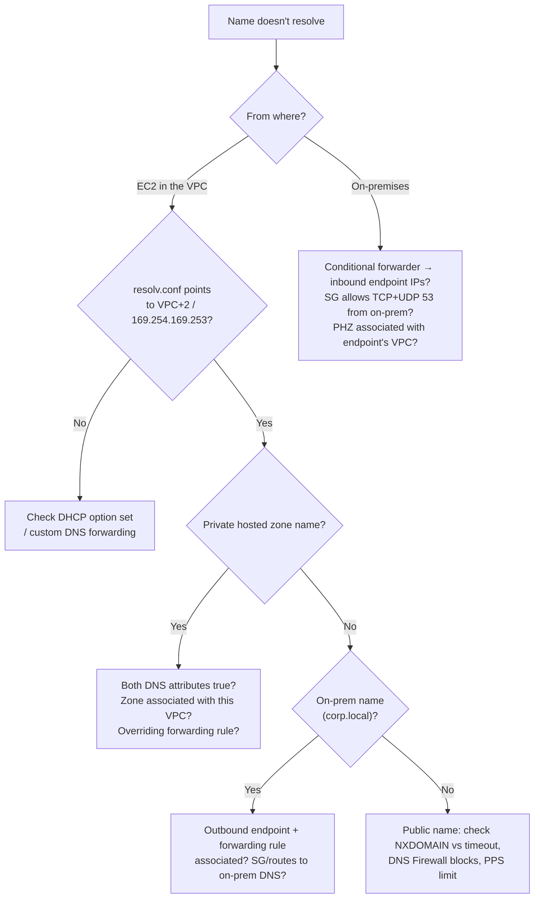

---

## 21. Exam Cheat Sheet

| Topic | Key fact |
|---|---|
| Default VPC DNS server | Route 53 Resolver / AmazonProvidedDNS |
| Addresses | **VPC base + 2** (e.g. 10.10.0.2), **169.254.169.253**, fd00:ec2::253 |
| Reachable from | **Inside the VPC only** (not on-prem, not peered VPCs) |
| Resolution order | Forwarding rules → private hosted zones → VPC DNS → public DNS |
| Private hosted zone requires | `enableDnsSupport` **and** `enableDnsHostnames` = true; zone associated with the VPC |
| Internal hostname | `ip-<private-ip>.ec2.internal` (us-east-1), `ip-<private-ip>.<region>.compute.internal` (others) |
| Public hostname | `ec2-<public-ip>.compute-1.amazonaws.com` (us-east-1), `ec2-<public-ip>.<region>.compute.amazonaws.com` (others); needs a public IP + `enableDnsHostnames` |
| How instances learn DNS settings | **DHCP option set** (default: `domain-name-servers = AmazonProvidedDNS`, `domain-name = <region>.compute.internal`) |
| DHCP option set effects | Sets the **hostname** and **/etc/resolv.conf** (`search`, `nameserver 10.x.0.2`) |
| Modify a DHCP option set? | **No** — create a new one and associate it |
| Option sets per VPC | **One** |
| VPC with no option set | Instances (Xen) have no DNS server → can't resolve names / reach internet by name |
| New option set takes effect | Automatically, may take **hours**; renew DHCP lease (`dhclient`) to force |
| `enableDnsSupport` | Default **true**; enables queries to 169.254.169.253 / VPC+2 |
| `enableDnsHostnames` | Default **false** (custom VPC), **true** (default VPC); needs DnsSupport; assigns public hostnames |
| On-prem → resolve AWS private names | **Inbound** Resolver endpoint + on-prem conditional forwarder |
| AWS → resolve on-prem names | **Outbound** Resolver endpoint + **forwarding rule** associated with the VPC |
| Endpoint ENIs | Min 2 IPs (multi-AZ), max 6; ~10,000 QPS per IP; reachable over VPN / DX |
| Share rules across accounts | **AWS RAM** |
| Rule matching | Most specific domain wins; system rules carve out subdomains |
| Link-local PPS limit | **1,024 PPS per ENI**, not adjustable → use local DNS caching |
| Block malicious domains | Route 53 Resolver **DNS Firewall** |
| Log DNS queries | Resolver **query logging** (CloudWatch Logs / S3 / Firehose) |

---

## 22. Sources

- [Amazon DNS server – Amazon VPC User Guide](https://docs.aws.amazon.com/vpc/latest/userguide/AmazonDNS-concepts.html)
- [DHCP option sets – Amazon VPC User Guide](https://docs.aws.amazon.com/vpc/latest/userguide/DHCPOptionSetConcepts.html)
- [What is Route 53 VPC Resolver? – Amazon Route 53 Developer Guide](https://docs.aws.amazon.com/Route53/latest/DeveloperGuide/resolver.html)
- [Forwarding outbound DNS queries to your network – Amazon Route 53 Developer Guide](https://docs.aws.amazon.com/Route53/latest/DeveloperGuide/resolver-forwarding-outbound-queries.html)
- [Quotas on Amazon Route 53 – Amazon Route 53 Developer Guide](https://docs.aws.amazon.com/Route53/latest/DeveloperGuide/DNSLimitations.html)
- Course slides: Amazon DNS Server – Route 53 Resolver, DHCP Option Sets, VPC DNS Attributes, Route 53 Resolver Endpoints (Stephane Maarek, Chetan Agrawal)

> AWS quotas and features change over time. Confirm current values in the AWS documentation before designing a production system.

---

**Related guides:** `network-performance-guide.md`, `ec2-enhanced-networking-guide.md`, `aws-bandwidth-limits-guide.md`.

[⬅ Back to Aa](Aa.md) · [⬅ Back to AWS VPC](aws-vpc.md)
