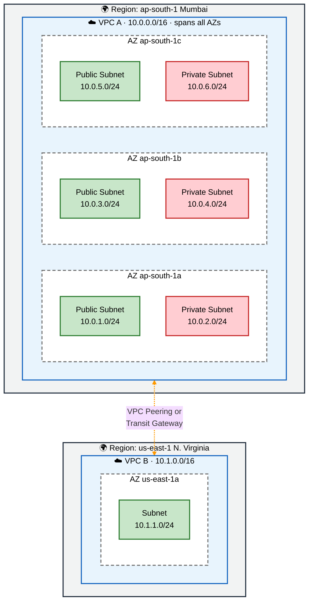
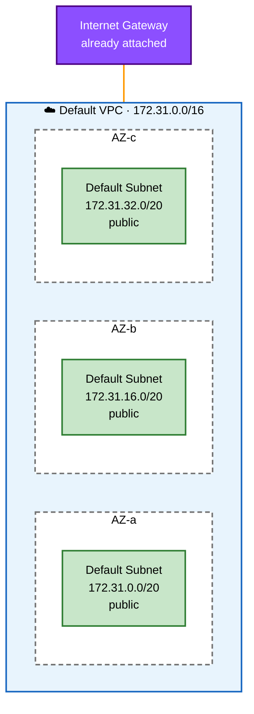
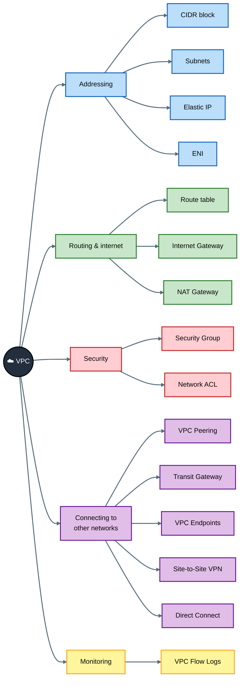
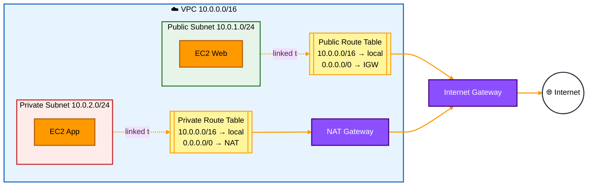
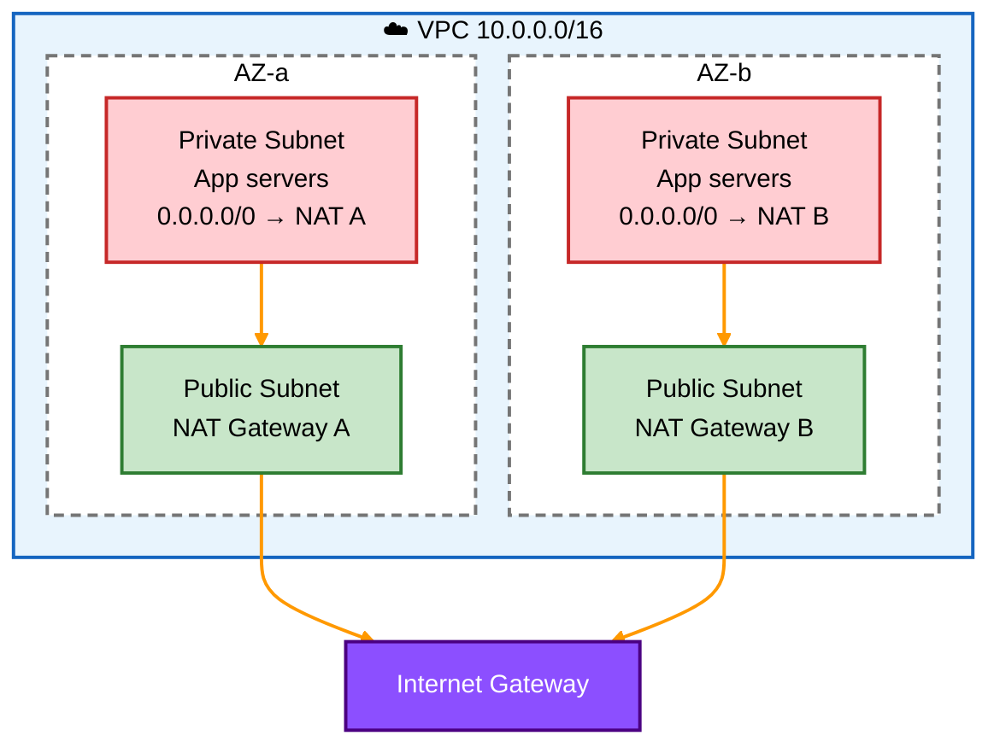
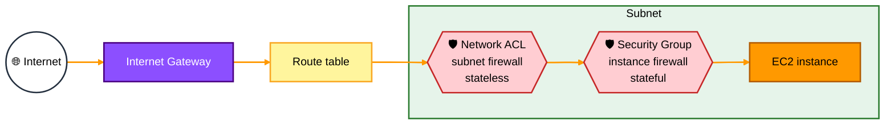
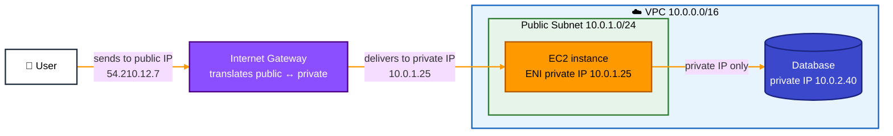
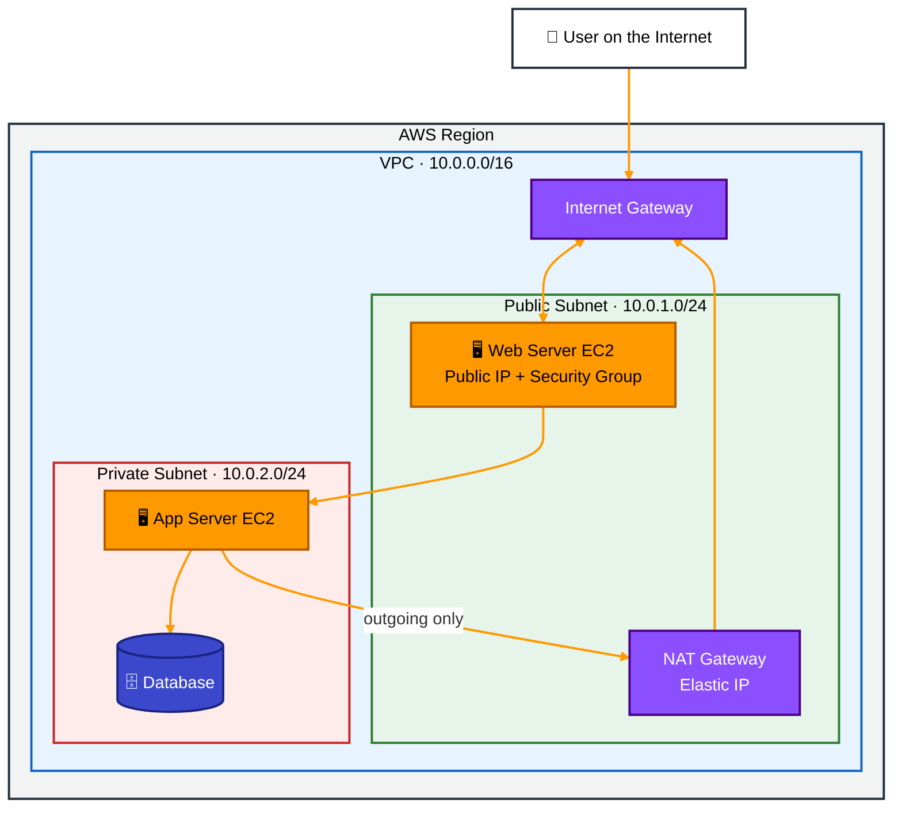
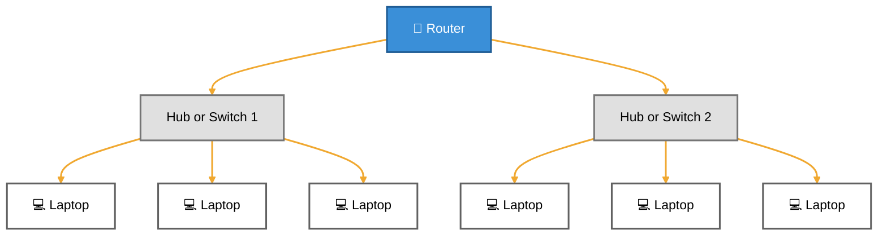
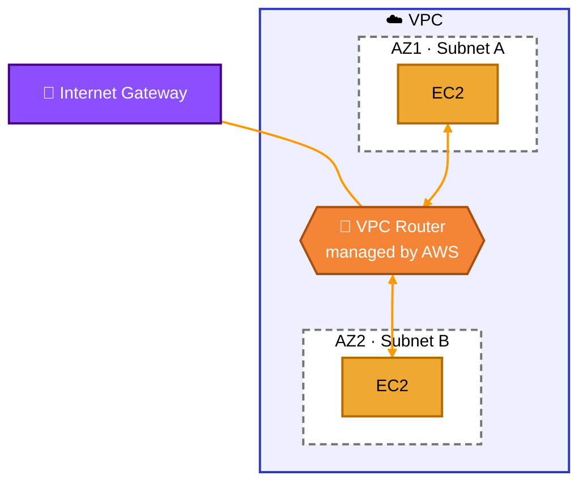

[⬅ Back to Aa](Aa.md)

# AWS VPC (Virtual Private Cloud)

> Tip: on GitHub, click the **☰ outline button** at the top right of this file to see all topics and jump to any one.

## 1. What is a VPC?

A **VPC (Virtual Private Cloud)** is your own **private network inside AWS**. It is like having your own LAN in the cloud.

Think of it like this:

| Your home / office | AWS |
|---|---|
| Your home LAN | VPC |
| Rooms in the house | Subnets |
| Router | Route table + Internet Gateway |
| Main door to the street | Internet Gateway |
| Security guard at each door | Security Group / Network ACL |

- Your EC2 servers, databases and other resources live **inside** the VPC.
- It is **isolated**: other AWS customers cannot see or reach your VPC.
- **You** control the IP address range, subnets, routing and security.
- Every AWS account gets a **default VPC** in each region, but for real projects you usually create your own.

### 1.1 VPC scope: Regions and Availability Zones

To understand where a VPC "lives", you first need two AWS terms:

| Term | Meaning | Example |
|---|---|---|
| **Region** | A geographic area in the world where AWS has data centers | `ap-south-1` (Mumbai), `us-east-1` (N. Virginia) |
| **Availability Zone (AZ)** | One or more separate data centers inside a region, with their own power and networking | `ap-south-1a`, `ap-south-1b`, `ap-south-1c` |

Each region has several AZs (usually 3 or more). They are far enough apart that a fire or power cut in one doesn't affect the others, but close enough to be connected by very fast, low-delay links.

**The scope rules:**

| Resource | Scope | What it means |
|---|---|---|
| **VPC** | **One region** | A VPC covers **all the AZs** in its region, but it **cannot** stretch into another region |
| **Subnet** | **One AZ** | Each subnet lives in exactly one AZ and cannot span two |
| **EC2 instance** | **One subnet** (so one AZ) | A server is placed in a subnet and stays in that AZ |
| **Internet Gateway** | Whole VPC | One IGW serves every subnet in every AZ of the VPC |
| **Route table / Security Group** | Whole VPC | Can be used by subnets or servers in any AZ of that VPC |



**Colour guide:** grey box = region · blue box = VPC · dashed box = AZ · 🟩 green = public subnet · 🟥 red = private subnet

**Key points:**

- **One VPC, many AZs:** VPC A covers all three Mumbai AZs, so you can spread servers across them. If `ap-south-1a` goes down, servers in `1b` and `1c` keep running. This is called **high availability**.
- **Best practice:** create at least one public and one private subnet **in each AZ** you use, as in the diagram.
- **One VPC, one region:** VPC A (Mumbai) and VPC B (N. Virginia) are completely separate networks. To connect them, you use **VPC Peering** or a **Transit Gateway**. Their CIDR ranges must not overlap (`10.0.0.0/16` and `10.1.0.0/16` are fine).
- **Many VPCs per region:** you can create several VPCs in one region, for example separate ones for dev, test and production. AWS sets a default limit of 5 VPCs per region, which you can ask to increase.
- **Traffic between AZs** in the same VPC works automatically through the built-in VPC router (the `local` route).

### 1.2 Default VPC

AWS creates a **default VPC** in **every region** of your account automatically, so you can launch an EC2 instance straight away without setting up any networking.

**What the default VPC comes with:**

| Part | Default setting |
|---|---|
| CIDR | `172.31.0.0/16` (65,536 IPs), the same in every region |
| Subnets | One **default subnet in each AZ**, each a `/20` (4,096 IPs), e.g. `172.31.0.0/20`, `172.31.16.0/20`, `172.31.32.0/20` |
| Subnet type | **All subnets are public** |
| Auto-assign public IPv4 | **On**, so every new instance gets a public IP |
| Internet Gateway | Already created and attached |
| Main route table | `172.31.0.0/16 → local` and `0.0.0.0/0 → IGW` |
| Security Group | A **default SG**: allows all inbound traffic from other members of the same SG, and all outbound |
| Network ACL | A **default NACL**: allows **all** inbound and outbound traffic |
| DNS | DNS hostnames and DNS resolution both turned on |



**Default VPC vs custom VPC:**

| | Default VPC | Custom VPC |
|---|---|---|
| Created by | AWS, automatically | You |
| CIDR | Always `172.31.0.0/16` | You choose |
| Subnets | One public subnet per AZ | You design public and private subnets |
| Internet access | Ready out of the box | Only if you add an IGW and routes |
| Good for | Learning, quick tests | Real projects and production |

**Important points:**

- Because every subnet is public and every instance gets a public IP, the default VPC is **not recommended for production**. Databases and backend servers should be in private subnets.
- Every default VPC uses the **same CIDR** (`172.31.0.0/16`), so default VPCs in different regions or accounts **overlap** and **cannot be peered** with each other.
- If you **delete** the default VPC, you can create a new one from the VPC console (**Actions → Create default VPC**). You can't turn an existing custom VPC into the default one.
- You can have only **one default VPC per region**.

## 2. VPC Building Blocks

A VPC is made of several **building blocks**. You can group them into four jobs:

| Group | Building blocks | Job |
|---|---|---|
| 🟦 **Addressing** | CIDR block, Subnets, IP addresses (Private, Public, Elastic IP), Elastic Network Interface (ENI) | Give the network and servers their IP addresses |
| 🟩 **Routing & internet** | Route table, Internet Gateway, Egress-only Internet Gateway, NAT Gateway | Decide where traffic goes and connect to the internet |
| 🟥 **Security** | Security Group, Network ACL | Allow or block traffic |
| 🟪 **Connecting to other networks** | VPC Peering, Transit Gateway, VPC Endpoints, Site-to-Site VPN, Direct Connect | Connect to other VPCs, AWS services or your office |
| 🟨 **Monitoring** | VPC Flow Logs | Record who talked to whom |



Each building block is explained below.

### 2.1 VPC Addressing (CIDR)

Every VPC and every subnet needs a **range of IP addresses**. AWS uses **CIDR notation** to describe these ranges.

#### What is CIDR?

**CIDR (Classless Inter-Domain Routing)** writes an IP range as `IP address / number`, for example `10.0.0.0/16`.

- An IPv4 address has **32 bits**, written as 4 numbers (octets) from 0 to 255: `10.0.0.0`.
- The number after `/` (the **prefix**) says **how many bits are fixed** (the network part).
- The remaining bits are free and can change: these are the **host addresses**.

**Formula:** number of IP addresses = **2^(32 − prefix)**

```
10.0.0.0/16
|-----| |-----|
 fixed   free
16 bits  16 bits  → 2^16 = 65,536 addresses (10.0.0.0 to 10.0.255.255)

10.0.1.0/24
|--------| |--|
  fixed    free
  24 bits  8 bits → 2^8 = 256 addresses (10.0.1.0 to 10.0.1.255)
```

**Rule to remember:** a **smaller** number after `/` means a **bigger** network.

#### Common CIDR sizes

| CIDR | Total IPs | Usable in an AWS subnet | Typical use |
|---|---|---|---|
| `/16` | 65,536 | — | Whole VPC (the largest AWS allows) |
| `/20` | 4,096 | 4,091 | Large subnet |
| `/24` | 256 | 251 | Normal subnet (most common) |
| `/26` | 64 | 59 | Small subnet |
| `/28` | 16 | 11 | Smallest AWS allows |
| `/32` | 1 | — | One single IP (used in Security Group rules) |
| `/0` | All | — | `0.0.0.0/0` = the whole internet |

#### Private IP ranges (RFC 1918)

Use one of these ranges for your VPC. They are reserved for private networks and never used on the public internet:

| Range | CIDR | Size |
|---|---|---|
| `10.0.0.0` – `10.255.255.255` | `10.0.0.0/8` | Biggest; most used in AWS |
| `172.16.0.0` – `172.31.255.255` | `172.16.0.0/12` | Medium; the **default VPC** uses `172.31.0.0/16` |
| `192.168.0.0` – `192.168.255.255` | `192.168.0.0/16` | Smallest; common in home networks |

#### AWS rules for VPC CIDR

- The VPC CIDR must be between **`/16`** (65,536 IPs) and **`/28`** (16 IPs).
- You **cannot change** the main (primary) CIDR after creating the VPC, but you can **add secondary CIDR blocks** later (up to 5 by default).
- **Plan ahead:** do not overlap with other VPCs or your office network, or you won't be able to connect them with Peering, Transit Gateway or VPN.
- Optionally, you can add an **IPv6** block. AWS gives the VPC a `/56`, and each subnet gets a `/64`.

#### Splitting a VPC into subnets

Each subnet takes a **part** of the VPC's range. Subnets in the same VPC must **not overlap**.

Example: VPC `10.0.0.0/16` split into `/24` subnets across 2 AZs:

| Subnet | CIDR | AZ | Type |
|---|---|---|---|
| Public-A | `10.0.1.0/24` | ap-south-1a | Public |
| Public-B | `10.0.2.0/24` | ap-south-1b | Public |
| Private-A | `10.0.11.0/24` | ap-south-1a | Private |
| Private-B | `10.0.12.0/24` | ap-south-1b | Private |

Here the VPC still has room for about 250 more `/24` subnets.

#### 5 reserved IPs in every subnet

AWS keeps **5 addresses** in every subnet for itself. For `10.0.1.0/24`:

| Address | Used for |
|---|---|
| `10.0.1.0` | Network address |
| `10.0.1.1` | VPC router |
| `10.0.1.2` | Amazon DNS server |
| `10.0.1.3` | Reserved for future use |
| `10.0.1.255` | Broadcast address (AWS doesn't support broadcast, so it's blocked) |

So a `/24` has 256 − 5 = **251 usable IPs**, and the smallest subnet (`/28`) has only 16 − 5 = **11**.

#### Extending VPC address space (secondary CIDR blocks)

What if your VPC runs out of IP addresses? You **can't change** the primary CIDR, but you can **add secondary CIDR blocks** to the same VPC.

```
Before:  VPC  10.0.0.0/16   (primary)          → almost full
After:   VPC  10.0.0.0/16   (primary)
              10.1.0.0/16   (secondary, added) → new subnets can use this range
```

**How it works:**

1. Go to **VPC → Actions → Edit CIDRs → Add new IPv4 CIDR**.
2. AWS **automatically adds a `local` route** for the new CIDR to every route table in the VPC, so old and new subnets can talk to each other.
3. Create **new subnets** from the new range. Existing subnets can't be resized; a subnet's CIDR is fixed once created.

**Rules and limits:**

| Rule | Detail |
|---|---|
| Number of CIDRs | Up to **5 IPv4 CIDRs** per VPC by default (primary + 4 secondary); you can request up to 50 |
| Size | Each secondary CIDR is also `/16` to `/28` |
| No overlap | It must not overlap the VPC's other CIDRs, or any peered VPC / connected network you route to |
| Range restrictions | Some mixes aren't allowed, e.g. if the primary CIDR is from `10.0.0.0/8`, you generally can't add a range from `172.16.0.0/12` or `192.168.0.0/16`. Check the AWS "IPv4 CIDR block association restrictions" table |
| Popular choice | `100.64.0.0/10` (the shared "carrier-grade NAT" range) is often added for large systems such as EKS pods |
| Removing | You can remove a secondary CIDR only if **no subnets** use it; the primary CIDR can never be removed |

**Also good to know:** you can also add up to **5 IPv6 CIDRs** to a VPC. For large companies, **Amazon VPC IPAM** (IP Address Manager) helps plan and track CIDRs across many VPCs and accounts so they never overlap.

### 2.2 Subnets

A **subnet** is a smaller part of the VPC's IP range. Each subnet lives in **one Availability Zone (AZ)**, which is one data center area.

| Type | Meaning | Used for |
|---|---|---|
| **Public subnet** | Has a route to the **Internet Gateway** | Web servers, load balancers, bastion hosts |
| **Private subnet** | **No** direct route to the internet | Databases, backend app servers |

- Example: `10.0.1.0/24` (public) and `10.0.2.0/24` (private), each with 256 addresses.
- AWS reserves **5 IP addresses** in every subnet, so a `/24` gives you 251 usable IPs.

### 2.3 VPC Route Tables

A **route table** is a list of rules (**routes**) that tells the built-in VPC router **where to send traffic** leaving a subnet.

#### Parts of a route

Each route has two parts:

| Part | Meaning | Example |
|---|---|---|
| **Destination** | Where the traffic is going (a CIDR range) | `0.0.0.0/0`, `10.0.0.0/16`, `10.1.0.0/16` |
| **Target** | Where to send it next | `local`, `igw-xxxx`, `nat-xxxx`, `pcx-xxxx` |

#### Main route table vs custom route table

| | Main route table | Custom route table |
|---|---|---|
| Created | Automatically with every VPC | By you |
| Used by | Every subnet **not** linked to another table | Only the subnets you link to it |
| Best practice | Keep it private (no internet route) | Create one for public subnets, one for private |

**Association rules:**
- Each subnet is linked to **exactly one** route table at a time.
- One route table can be linked to **many** subnets.
- If you don't link a subnet to anything, it uses the **main** route table.

#### The `local` route

Every route table automatically has a **local** route for the VPC's own CIDR, for example `10.0.0.0/16 → local`.

- It lets **all subnets in the VPC talk to each other**, even across AZs.
- You **cannot delete** it.

#### Public vs private subnet route tables

**Public route table** (linked to public subnets):

| Destination | Target | Meaning |
|---|---|---|
| `10.0.0.0/16` | local | Traffic inside the VPC stays inside |
| `0.0.0.0/0` | `igw-xxxx` (Internet Gateway) | Everything else goes to the internet |

**Private route table** (linked to private subnets):

| Destination | Target | Meaning |
|---|---|---|
| `10.0.0.0/16` | local | Traffic inside the VPC stays inside |
| `0.0.0.0/0` | `nat-xxxx` (NAT Gateway) | Outgoing internet traffic goes through NAT |

> `0.0.0.0/0` means "any IP address", in other words, the whole internet. It's called the **default route**.

**Key idea:** a subnet is "public" or "private" **only because of its route table**. If its route table sends `0.0.0.0/0` to an Internet Gateway, it's public. Otherwise, it's private.

#### Common targets

| Target | Prefix | Sends traffic to |
|---|---|---|
| `local` | — | Other subnets in the same VPC |
| Internet Gateway | `igw-` | The internet (two-way) |
| NAT Gateway | `nat-` | The internet (outgoing only) |
| Egress-only Internet Gateway | `eigw-` | The internet over IPv6 (outgoing only) |
| VPC Peering connection | `pcx-` | Another VPC |
| Transit Gateway | `tgw-` | The Transit Gateway hub |
| Virtual Private Gateway | `vgw-` | Your office through VPN or Direct Connect |
| Gateway VPC Endpoint | `vpce-` | S3 or DynamoDB privately |
| Network interface | `eni-` | A specific appliance, like a firewall server |

#### How the router picks a route: longest prefix match

If traffic matches **more than one** route, the router picks the **most specific** one (the one with the biggest number after `/`).

Example route table:

| Destination | Target |
|---|---|
| `10.0.0.0/16` | local |
| `10.1.0.0/16` | `pcx-1234` (peering to another VPC) |
| `0.0.0.0/0` | `igw-5678` |

| Traffic going to | Matching routes | Chosen | Why |
|---|---|---|---|
| `10.0.2.15` | `10.0.0.0/16`, `0.0.0.0/0` | **local** | `/16` is more specific than `/0` |
| `10.1.5.20` | `10.1.0.0/16`, `0.0.0.0/0` | **pcx-1234** | `/16` is more specific than `/0` |
| `8.8.8.8` | only `0.0.0.0/0` | **igw-5678** | Only one match |

#### Route table diagram



**Colour guide:** 🟨 yellow = route tables · 🟪 purple = gateways · 🟩 green = public subnet · 🟥 red = private subnet

### 2.4 Internet Gateway (IGW)

The **Internet Gateway** is the **main door** between your VPC and the internet.

- You attach **one** IGW to a VPC.
- It allows traffic **in both directions**: internet → VPC and VPC → internet.
- It is fully managed by AWS: highly available and scales automatically.
- It translates a server's **private IP** to its **public IP** (a kind of NAT), similar to your home router.
- It is **free**; you only pay for the data transfer.

#### Egress-only Internet Gateway (IPv6)

An **Egress-only Internet Gateway (EIGW)** is like an Internet Gateway, but **only for IPv6** and **only for outgoing traffic**.

**Why it's needed:** every IPv6 address in AWS is **public**, and there's no NAT for IPv6. So if a private server has an IPv6 address and you route it to a normal Internet Gateway, anyone on the internet could reach it. The EIGW solves this.

| | Internet Gateway | NAT Gateway | Egress-only IGW |
|---|---|---|---|
| IP version | IPv4 and IPv6 | IPv4 | **IPv6 only** |
| Outgoing (server → internet) | ✅ | ✅ | ✅ |
| Incoming (internet → server starts connection) | ✅ | ❌ | ❌ |
| Replies to outgoing requests | ✅ | ✅ | ✅ (it's **stateful**) |
| Cost | Free | Per hour + per GB | Free (only data transfer) |

**Route in the private subnet's route table:**

| Destination | Target | Meaning |
|---|---|---|
| `0.0.0.0/0` | `nat-xxxx` | IPv4 internet traffic goes out through NAT |
| `::/0` | `eigw-xxxx` | IPv6 internet traffic goes out through the EIGW |

> `::/0` is the IPv6 version of `0.0.0.0/0`, meaning "all IPv6 addresses".

### 2.5 NAT Gateway

**NAT** stands for **Network Address Translation**. A **NAT Gateway** lets servers in a **private subnet** reach the internet **only for outgoing traffic**, for example to download software updates or call an outside API.

#### How a NAT Gateway works

1. The private server (e.g. `10.0.11.20`) sends a request to the internet.
2. Its route table sends `0.0.0.0/0` to the **NAT Gateway**.
3. The NAT Gateway **replaces the source IP** with its own **Elastic IP** and sends the request out through the **Internet Gateway**.
4. The reply comes back to the NAT Gateway, which remembers the request and passes the reply to the right private server.
5. Nobody on the internet can **start** a connection to the private server.

#### Key facts

| Feature | Detail |
|---|---|
| Where it lives | In a **public subnet**, in **one AZ** (a "zonal" NAT Gateway) |
| IP address | Needs an **Elastic IP** (public type) |
| Managed by | AWS; no servers to patch |
| Bandwidth | Starts at 5 Gbps and scales automatically up to 100 Gbps |
| Connections | About 55,000 simultaneous connections to each unique destination per IP; add more Elastic IPs if you need more |
| Security Groups | ❌ Can't attach one; control traffic with NACLs and the private servers' SGs |
| Cost | Charged **per hour** and **per GB processed** (a common surprise on AWS bills) |
| IPv6 | ❌ Not for IPv6; use an Egress-only IGW instead |

#### Public vs private NAT Gateway

| Type | Uses Elastic IP? | Goes to | Used for |
|---|---|---|---|
| **Public** (default) | Yes | Internet (through IGW) | Private servers downloading updates |
| **Private** | No | Other VPCs or your office (through TGW / VGW) | Connecting networks with overlapping IP ranges |

#### NAT Gateway vs NAT instance

Before NAT Gateway existed, people ran a **NAT instance**: an ordinary EC2 server configured to do NAT.

| | NAT Gateway | NAT instance |
|---|---|---|
| Managed by | AWS | You (patching, scaling, failover) |
| Availability | Redundant inside its AZ | Single server; you build failover yourself |
| Bandwidth | Up to 100 Gbps | Depends on instance size |
| Security Group | Not supported | Supported |
| Setup | Easy | Must **disable source/destination check** on the instance |
| Cost | Higher | Can be cheaper for small traffic |

AWS recommends the **NAT Gateway** for almost all cases.

#### NAT Gateway high availability

A zonal NAT Gateway is **redundant inside its own AZ**, but if that **whole AZ fails**, the NAT Gateway fails too.

**❌ Bad design: one NAT Gateway for all AZs**

```
   AZ-a                          AZ-b
+----------------------+     +----------------------+
| Public: NAT GW       |     | Public: (none)       |
| Private: App-A ------+---- | Private: App-B       |
+----------------------+  \  +----------------------+
                           \______ App-B also uses the NAT in AZ-a
If AZ-a fails, App-B loses internet too. It also pays cross-AZ data charges.
```

**✅ Good design: one NAT Gateway in each AZ**



- Put **one NAT Gateway in the public subnet of each AZ**.
- Give each AZ's private subnets **their own route table** pointing to the NAT Gateway **in the same AZ**.
- If one AZ fails, the other AZs keep their internet access, and you avoid cross-AZ data charges.
- The downside: you pay for several NAT Gateways.

#### Regional NAT Gateway (new, re:Invent 2025)

In **November 2025**, AWS launched the **Regional NAT Gateway**. Instead of one NAT Gateway per AZ, you create **one NAT Gateway for the whole VPC**, and AWS spreads it across AZs for you.

| | Zonal NAT Gateway (classic) | Regional NAT Gateway (new) |
|---|---|---|
| Scope | One AZ | Whole VPC, across AZs |
| Needs a public subnet? | Yes, one in each AZ | **No**; it isn't placed in a subnet |
| High availability | You build it: one NAT per AZ + separate route tables | **Automatic**: expands to AZs where you have workloads |
| Route tables | One private route table per AZ | One route to the regional NAT is enough |
| Elastic IPs | You assign them | **Automatic** (AWS adds IPs as connections grow) or **manual** (you choose IPs per AZ) |
| Connectivity type | Public or private | Public only (private not supported yet) |
| Limits | — | Up to 5 per VPC; 5 Gbps per AZ, scaling to 100 Gbps |

**Things to know:**
- When a workload appears in a new AZ, the Regional NAT Gateway **expands to that AZ** automatically. This usually takes 15–20 minutes (up to 60). Until then, that AZ's traffic is handled by the NAT in another AZ.
- It comes with an **AWS-managed route table** that sends traffic to the VPC's Internet Gateway.
- Big benefit: **simpler design** and no need for public subnets just to host NAT Gateways.

**Sources:** [AWS What's New: NAT Gateway regional availability](https://aws.amazon.com/about-aws/whats-new/2025/11/aws-nat-gateway-regional-availability) · [AWS blog: Introducing Amazon VPC Regional NAT Gateway](https://aws.amazon.com/blogs/networking-and-content-delivery/introducing-amazon-vpc-regional-nat-gateway)

### 2.6 Security Group (SG)

A **Security Group** is a **virtual firewall around each resource**, such as an EC2 instance. Strictly, it's attached to the resource's **ENI** (network card).

#### Rules

Each rule has:

| Field | Example |
|---|---|
| **Type / Protocol** | SSH (TCP), HTTPS (TCP), ICMP, All traffic |
| **Port range** | `22`, `443`, `1024-65535` |
| **Source** (inbound) / **Destination** (outbound) | An IP range (`203.0.113.5/32`), `0.0.0.0/0`, or **another Security Group** |
| **Description** | "SSH from office" |

**Example web server Security Group:**

| Direction | Type | Port | Source / Destination | Why |
|---|---|---|---|---|
| Inbound | HTTPS | 443 | `0.0.0.0/0` | Anyone can open the website |
| Inbound | HTTP | 80 | `0.0.0.0/0` | Redirect to HTTPS |
| Inbound | SSH | 22 | `203.0.113.5/32` | Only admin's IP can log in |
| Outbound | All traffic | All | `0.0.0.0/0` | Server can reach anything (default) |

#### How Security Groups behave

- **Allow rules only.** You can't write a "deny" rule. Anything not allowed is **blocked**.
- **Stateful.** If an inbound request is allowed, the reply goes out automatically, even if outbound rules would block it (and the reverse).
- **All rules are checked together.** There is no order; if any rule allows the traffic, it's allowed.
- **Default for a new SG:** **no inbound** rules (everything in is blocked) and **all outbound** allowed.
- **Default SG of a VPC:** allows inbound from other members of the **same SG**, and all outbound.
- Changes take effect **immediately**.
- An SG belongs to **one VPC**, and one ENI can have several SGs (5 by default). One SG can be used by many instances.

#### Referencing other Security Groups (very useful)

Instead of IP addresses, a rule can allow traffic **from another Security Group**. For example:

```
 [ Load Balancer ]  SG: sg-alb   (allows 443 from 0.0.0.0/0)
        |
        v
 [ Web servers ]    SG: sg-web   (allows 80 from sg-alb only)
        |
        v
 [ Database ]       SG: sg-db    (allows 3306 from sg-web only)
```

Even if web servers are added or their IPs change, the rules still work, and the database can **only** be reached by the web servers.

### 2.7 Network ACL (NACL)

A **Network ACL** is a **firewall for the whole subnet**. It checks traffic **entering and leaving the subnet**, before it reaches any Security Group.

#### Rules

Each rule has a **rule number**, **type**, **protocol**, **port range**, **source/destination** and **ALLOW or DENY**.

**Example NACL for a public subnet:**

**Inbound rules**

| Rule # | Type | Port | Source | Allow / Deny |
|---|---|---|---|---|
| 90 | All traffic | All | `198.51.100.0/24` | ❌ DENY (block a bad IP range) |
| 100 | HTTPS | 443 | `0.0.0.0/0` | ✅ ALLOW |
| 110 | SSH | 22 | `203.0.113.5/32` | ✅ ALLOW |
| 120 | Custom TCP | 1024–65535 | `0.0.0.0/0` | ✅ ALLOW (replies to the server's own outgoing requests) |
| * | All traffic | All | `0.0.0.0/0` | ❌ DENY (always last; can't be removed) |

**Outbound rules**

| Rule # | Type | Port | Destination | Allow / Deny |
|---|---|---|---|---|
| 100 | HTTPS | 443 | `0.0.0.0/0` | ✅ ALLOW |
| 120 | Custom TCP | 1024–65535 | `0.0.0.0/0` | ✅ ALLOW (replies to users) |
| * | All traffic | All | `0.0.0.0/0` | ❌ DENY |

#### How NACLs behave

- **Rules are checked in number order, lowest first.** The **first matching rule wins** and the rest are skipped. Leave gaps (100, 110, 120) so you can insert rules later.
- **Allow and deny rules.** This is the only way in a VPC to **block a specific IP**.
- **Stateless.** Replies are **not** allowed automatically. You must add rules for both the request and the reply.
- **Ephemeral ports.** When a user connects to your server on port 443, the reply goes back to a random high port on the user's computer (usually `1024–65535`). So the **outbound** rules must allow those ports.
- **Default NACL** (created with the VPC): **allows all** inbound and outbound traffic.
- **Custom NACL** (one you create): **denies all** traffic until you add rules.
- Each subnet is linked to **exactly one** NACL; one NACL can be linked to many subnets.

#### Security Group vs Network ACL

| | Security Group | Network ACL |
|---|---|---|
| Works on | Each instance (ENI) | Whole subnet |
| Rules | Allow only | Allow **and** deny |
| State | **Stateful** (replies allowed automatically) | **Stateless** (replies need their own rule) |
| Rule order | All rules checked together | Checked in number order; first match wins |
| Default (new one you create) | Blocks all inbound, allows all outbound | Blocks everything |
| Typical use | Main firewall for each server | Extra layer; blocking specific IPs |

#### Where each firewall checks traffic



Incoming traffic passes the **NACL first** (at the subnet edge), then the **Security Group** (at the instance). Both must allow it.

### 2.8 IP Addresses: IPv4 vs IPv6, Private vs Public vs Elastic IP

#### IPv4 vs IPv6

| | IPv4 | IPv6 |
|---|---|---|
| Size | 32 bits | 128 bits |
| Written as | 4 decimal numbers with dots | 8 groups of hex numbers with colons |
| Example | `54.210.12.7` | `2600:1f18:4a3:6f00:1234:5678:9abc:def0` |
| Total addresses | About 4.3 billion (running out) | About 340 undecillion (practically unlimited) |
| In an AWS VPC | **Always on** (required) | **Optional**; you turn it on |
| VPC / subnet size | `/16` to `/28`, you choose | VPC gets a `/56`, each subnet a `/64`, AWS assigns |
| Private or public? | Private (`10.x`) and public both exist | AWS IPv6 addresses are **all public** (globally unique) |
| Cost | Public IPv4 is charged | IPv6 addresses are free |

**IPv6 note:** since every IPv6 address is public, you can't use a NAT Gateway to hide private servers. Instead, use an **Egress-only Internet Gateway**: it allows outgoing IPv6 traffic but blocks anyone on the internet from starting a connection, just like NAT does for IPv4.

#### Private IP

- Every EC2 instance **always** gets a **private IPv4** from its subnet's range, for example `10.0.1.25`.
- Used for talking **inside the VPC** (web server → database).
- **Not reachable** from the internet.
- The primary private IP **stays the same** for the whole life of the instance, even when you stop and start it. It's released only when the instance is terminated.

#### Public IP

- A **public IPv4** is taken from Amazon's pool, for example `54.210.12.7`, so the instance can be **reached from the internet**.
- You get one automatically if the subnet's **"Auto-assign public IPv4"** setting is on, or if you tick it when launching.
- It **changes** every time you **stop and start** the instance, and is lost when the instance is terminated.
- The instance itself doesn't know its public IP: its operating system only sees the private IP. The **Internet Gateway** translates public ↔ private.

#### Elastic IP (EIP)

- A **static (fixed) public IPv4** that you **allocate to your account** and keep until you release it.
- You **associate** it with an instance or ENI. It stays the same through stop and start.
- You can **move it** to another instance in seconds, for example to a backup server if the main one fails.
- It belongs to **one region**. The default limit is **5 Elastic IPs per region**, and you can ask for more.
- **Cost:** AWS charges for **all** public IPv4 addresses (about $0.005 per hour each), whether the Elastic IP is in use or not. Release Elastic IPs you don't need.

#### Private vs Public vs Elastic IP

| | Private IP | Public IP | Elastic IP |
|---|---|---|---|
| Example | `10.0.1.25` | `54.210.12.7` | `3.110.45.200` |
| Reachable from the internet? | ❌ No | ✅ Yes | ✅ Yes |
| Where it comes from | Your subnet's CIDR | Amazon's pool, automatically | Amazon's pool, allocated to **your account** |
| After stop / start | Stays the same | **Changes** | Stays the same |
| After terminate | Released | Released | Stays in your account |
| Can move to another instance? | Only on an extra ENI | No | Yes |
| Cost | Free | Charged | Charged |
| Used for | Communication inside the VPC | Simple temporary internet access | Servers needing a fixed address (DNS records, allow-lists) |

#### How the IPs work together



- The **user** only knows the **public IP** (or Elastic IP).
- The **Internet Gateway** swaps it for the instance's **private IP** before delivering the traffic.
- Inside the VPC, the web server reaches the database using **private IPs only**.

#### Bring Your Own IP (BYOIP)

**BYOIP** lets you bring **public IP addresses your company already owns** into AWS and use them there, for example as Elastic IPs.

**Why companies do it:**
- **Customers or partners have allow-listed your IPs** in their firewalls, and changing IPs would break those connections.
- **IP reputation:** your IPs have a good email / security reputation built up over years.
- **Smooth migration:** move apps from your data center to AWS **without changing** their public IPs.

**How it works (overview):**

1. Your IP range must be registered with a **Regional Internet Registry** (RIR) such as ARIN, RIPE or APNIC, in your company's name.
2. In the RIR, create a **ROA (Route Origin Authorization)** that allows Amazon's network numbers (ASNs **16509** and **14618**) to announce your range.
3. **Provision** the range in AWS. AWS checks that you own it.
4. **Advertise** the range from AWS, so internet traffic for those IPs now arrives at AWS.
5. **Allocate Elastic IPs from your own pool** and attach them to instances, NAT Gateways or load balancers, just like normal Elastic IPs.

**Main rules:**

| | IPv4 | IPv6 |
|---|---|---|
| Smallest range you can bring | `/24` | `/48` (advertised publicly), or `/56` (not advertised) |
| Where it can be used | One region at a time | One region at a time |
| Requirement | You must own the range and have a clean history for it | Same |

### 2.9 Elastic Network Interface (ENI)

An **ENI** is a **virtual network card**, just like the network card in your laptop. Every EC2 instance talks to the network **through its ENIs**.

#### What an ENI holds

| Attribute | Detail |
|---|---|
| **Primary private IPv4** | One, from the subnet's range; never changes |
| **Secondary private IPv4s** | Optional; more private IPs on the same card (e.g. to host several websites) |
| **Elastic IP** | Optional; one per private IP |
| **Public IPv4** | Optional; auto-assigned to the primary ENI only |
| **IPv6 addresses** | Optional; one or more |
| **Security Groups** | One or more (SGs are attached to ENIs, not directly to instances) |
| **MAC address** | Fixed; stays with the ENI |
| **Source/destination check** | On by default; see below |

#### Primary vs secondary ENI

| | Primary ENI (`eth0`) | Secondary ENI (`eth1`, `eth2`…) |
|---|---|---|
| Created | Automatically with the instance | By you |
| Detach? | ❌ Can't be detached | ✅ Can be detached and moved |
| Deleted with instance? | Yes (by default) | No (by default) |

**Rules:**
- An ENI lives in **one subnet**, so **one AZ**. It can only be attached to an instance in the **same AZ**.
- An instance can have ENIs in **different subnets** of the same AZ (e.g. one in a public subnet, one in a private management subnet).
- How many ENIs and IPs an instance can have **depends on the instance type**: bigger instances allow more.
- Attach while the instance is running (**hot attach**), stopped (**warm**), or at launch (**cold**).

#### Common uses

1. **Fast failover:** move a secondary ENI (with its private IP, Elastic IP and MAC) from a failed server to a standby server. Clients keep using the same IP.
2. **Separate networks:** one ENI for public web traffic, another in a private subnet for admin / management traffic, each with different Security Groups.
3. **MAC-based software licenses:** licenses tied to a MAC address keep working after moving the ENI to a new instance.
4. **Network appliances:** firewalls, proxies and NAT instances with several network cards.

#### Source/destination check

By default, an ENI **drops traffic that isn't addressed to it** or isn't sent by it. For instances that **forward traffic for others**, like a **NAT instance** or a **firewall appliance**, you must **turn off** the source/destination check.

#### AWS-managed (requester-managed) ENIs

Many AWS services create ENIs **inside your subnets** automatically, for example **NAT Gateways**, **load balancers**, **RDS databases**, **Lambda functions in a VPC** and **Interface VPC Endpoints**. You'll see them in the console, but AWS manages them, and they use IPs from your subnets. This is one reason to leave free IPs in every subnet.

### 2.10 VPC Peering

**VPC Peering** is a **private, direct connection between two VPCs**, so their servers can talk using private IPs.

- It works across **accounts** and across **regions**.
- The two VPCs' CIDR ranges **must not overlap**.
- It is **not transitive**: if A is peered with B and B with C, A **cannot** reach C through B. You need a separate A–C peering.
- You must add routes for the other VPC's range in both route tables.

### 2.11 Transit Gateway (TGW)

A **Transit Gateway** is a **central hub** that connects **many VPCs and on-premises networks** in one place.

- Without it, 10 VPCs that all need to talk would need 45 separate peering connections. With a TGW, each VPC connects **once** to the hub.
- It **is transitive**: anything attached to the hub can reach anything else, if the routes allow it.
- It is a regional service; TGWs in different regions can be peered with each other.

```
   Without Transit Gateway            With Transit Gateway
   (many peering links)               (one hub)

   VPC-A ---- VPC-B                   VPC-A     VPC-B
     |  \    /  |                         \     /
     |   \  /   |                        +-------+
     |    \/    |                        |  TGW  |---- Office (VPN)
     |    /\    |                        +-------+
     |   /  \   |                         /     \
   VPC-C ---- VPC-D                   VPC-C     VPC-D
```

### 2.12 VPC Endpoints

A **VPC Endpoint** lets servers in your VPC reach **AWS services** (like S3 or DynamoDB) **privately**, without going over the internet and without an Internet Gateway or NAT Gateway.

| Type | Works with | How it works | Cost |
|---|---|---|---|
| **Gateway endpoint** | S3 and DynamoDB only | Adds a route in your route table | Free |
| **Interface endpoint** (AWS PrivateLink) | Most AWS services | Creates an ENI with a private IP in your subnet | Charged per hour and per GB |

**Benefit:** more secure (traffic never leaves the AWS network) and can save NAT Gateway costs.

### 2.13 Site-to-Site VPN and Direct Connect

These connect your **office or data center** (on-premises) to your VPC.

| | Site-to-Site VPN | Direct Connect (DX) |
|---|---|---|
| What it is | Encrypted tunnel over the **public internet** | A **dedicated private cable** from your data center to AWS |
| Setup time | Minutes | Weeks (a physical line is installed) |
| Speed | Up to about 1.25 Gbps per tunnel, varies with the internet | Steady, from 1 Gbps up to 100 Gbps |
| Cost | Low | High |
| AWS side | Virtual Private Gateway or Transit Gateway | Direct Connect location, then VGW or TGW |

Many companies use Direct Connect as the main link and a VPN as the backup.

### 2.14 VPC Flow Logs

**VPC Flow Logs** record information about the **IP traffic** going in and out of your VPC, subnets or ENIs.

- Each record shows source IP, destination IP, ports, protocol, bytes, and whether the traffic was **ACCEPTED** or **REJECTED**.
- Logs are sent to **CloudWatch Logs**, **S3** or **Kinesis Data Firehose**.
- Used for **troubleshooting** ("why can't my server connect?") and **security checks** ("who tried to reach my database?").
- They record the traffic details (metadata), not the actual content of the data.

## 3. VPC Diagram



**Colour guide:** 🟩 green box = public subnet · 🟥 red box = private subnet · 🟦 blue box = VPC · 🟪 purple = gateways · 🟧 orange = servers · orange lines = traffic flow

### Simple text version

```
                     +----------------------+
                     |  Internet (users)    |
                     +----------------------+
                                |
+-------------------------------|------------------------------------+
|  VPC  10.0.0.0/16             |                                    |
|                     +----------------------+                       |
|                     |  Internet Gateway    |   <- main door        |
|                     +----------------------+                       |
|                        |               ^                           |
|   +--------------------|---------------|-------------------+       |
|   |  PUBLIC SUBNET  10.0.1.0/24        |                   |       |
|   |   +----------------+      +----------------+           |       |
|   |   |  Web Server    |      |  NAT Gateway   |           |       |
|   |   |  (public IP)   |      |  (Elastic IP)  |           |       |
|   |   +----------------+      +----------------+           |       |
|   +-----------|----------------------^---------------------+       |
|               |                      |  outgoing only              |
|   +-----------|----------------------|---------------------+       |
|   |  PRIVATE SUBNET  10.0.2.0/24     |                     |       |
|   |   +----------------+      +----------------+           |       |
|   |   |  App Server    |----->|   Database     |           |       |
|   |   +----------------+      +----------------+           |       |
|   +--------------------------------------------------------+       |
+--------------------------------------------------------------------+
```

## 4. How a VPC Connects to the Internet

For a server to be reachable from the internet, **all four** of these must be true:

1. An **Internet Gateway** is attached to the VPC.
2. The subnet's **route table** has `0.0.0.0/0 → Internet Gateway` (this makes it a public subnet).
3. The server has a **public IP** or an **Elastic IP**.
4. The **Security Group** (and Network ACL) allows the traffic, for example port 80/443.

If any one is missing, the server cannot be reached from the internet.

### 4.1 Incoming: a user opens your website

1. The user types your website address. **DNS** (for example, Route 53) returns your server's **public IP**.
2. The request travels across the **internet** to AWS and reaches your **Internet Gateway**.
3. The IGW translates the **public IP → private IP** (for example, `10.0.1.25`) and sends the request into the VPC.
4. The **Network ACL** checks whether the subnet allows the traffic.
5. The **Security Group** checks whether the server allows port 443.
6. The **web server** receives the request and asks the **app server** in the private subnet for data. The app server reads from the **database**.
7. The reply goes back the same way: server → IGW (private IP → public IP) → internet → user.

### 4.2 Outgoing: a private server downloads an update

1. The **app server** (private subnet, no public IP) wants to download a software update.
2. Its route table sends `0.0.0.0/0` traffic to the **NAT Gateway**.
3. The NAT Gateway replaces the private IP with its own **Elastic IP** and sends the request through the **Internet Gateway**.
4. The reply comes back to the NAT Gateway, which passes it to the app server.
5. Nobody on the internet can **start** a connection to the app server, so it stays protected.

## 5. Traditional IT Network vs AWS VPC

A VPC is built on the same ideas as a normal office network. The difference is that in AWS, you don't buy or wire any hardware: AWS runs the switches and routers for you, and you control them with settings.

### 5.1 Traditional (physical) network



- A physical **router** connects different network segments.
- Each **hub or switch** connects the laptops in its own segment.
- You buy, cable and configure all of this hardware yourself.

### 5.2 AWS VPC



- The **VPC** (blue box) is the whole private network, like the whole office network.
- **Subnet A** and **Subnet B** are like the two switch segments. Each subnet sits in its own **Availability Zone** (AZ1, AZ2), so if one data center fails, the other keeps running.
- The **VPC router** is built in and managed by AWS. You never see it as a device; you control it through **route tables**. It lets EC2 in Subnet A talk to EC2 in Subnet B automatically (the `local` route).
- The **Internet Gateway** on the edge of the VPC is the door to the internet, like the internet connection on an office router.

### 5.3 Side-by-side comparison

| Traditional network | AWS VPC | Job |
|---|---|---|
| Whole office LAN | VPC | Your private network |
| Hub / switch segment | Subnet (in one AZ) | Groups servers in one network |
| Physical router | VPC router + route table | Decides where traffic goes |
| Router's internet port / modem | Internet Gateway | Door to the internet |
| Router NAT | NAT Gateway | Lets private devices go out, blocks incoming |
| Router firewall | Security Group / NACL | Allows or blocks traffic |
| Laptops / PCs | EC2 instances | The machines doing the work |
| Private IP `192.168.x.x` | Private IP `10.0.x.x` | Address inside the network |
| You buy and wire hardware | AWS manages everything | Who runs the equipment |

## 6. Quick Summary

- **VPC** = your private network in AWS; it lives in **one region** and covers **all its AZs**.
- **Default VPC** = ready-made VPC in every region (`172.31.0.0/16`, all subnets public); fine for learning, not for production.
- **CIDR** = way of writing an IP range; `/16` = 65,536 IPs, `/24` = 256 IPs; smaller number = bigger network.
- **Secondary CIDR** = extra IP range added to a VPC that runs out of addresses.
- **Subnet** = a smaller part of the VPC, public or private, in **exactly one** Availability Zone; AWS keeps 5 IPs in each.
- **Route table** = rules that decide where traffic goes; each subnet uses exactly one; the most specific route wins.
- **Internet Gateway** = two-way door between the VPC and the internet.
- **Egress-only Internet Gateway** = outgoing-only door for IPv6.
- **NAT Gateway** = one-way door so private servers can go out but nobody can come in; use one per AZ for high availability, or the new **Regional NAT Gateway**.
- **Security Group** = stateful, allow-only firewall for each instance; can reference other SGs.
- **Network ACL** = stateless firewall for each subnet with allow and deny rules, checked in number order.
- **Private IP** = inside-only address that never changes; **Public IP** = internet address that changes on stop/start; **Elastic IP** = fixed public IP that doesn't change.
- **IPv4 vs IPv6** = IPv4 is 32-bit and always on; IPv6 is 128-bit, optional, free and always public.
- **BYOIP** = bring your company's own public IP range to AWS.
- **ENI** = virtual network card; holds IPs, MAC and Security Groups; a secondary ENI can move between instances in the same AZ.
- **VPC Peering** = private link between two VPCs (not transitive).
- **Transit Gateway** = central hub connecting many VPCs and offices.
- **VPC Endpoint** = private access to AWS services like S3 without the internet.
- **Site-to-Site VPN / Direct Connect** = connect your office to the VPC (over the internet / by a private line).
- **VPC Flow Logs** = record of traffic for troubleshooting and security.

---

[⬅ Back to Aa](Aa.md)
