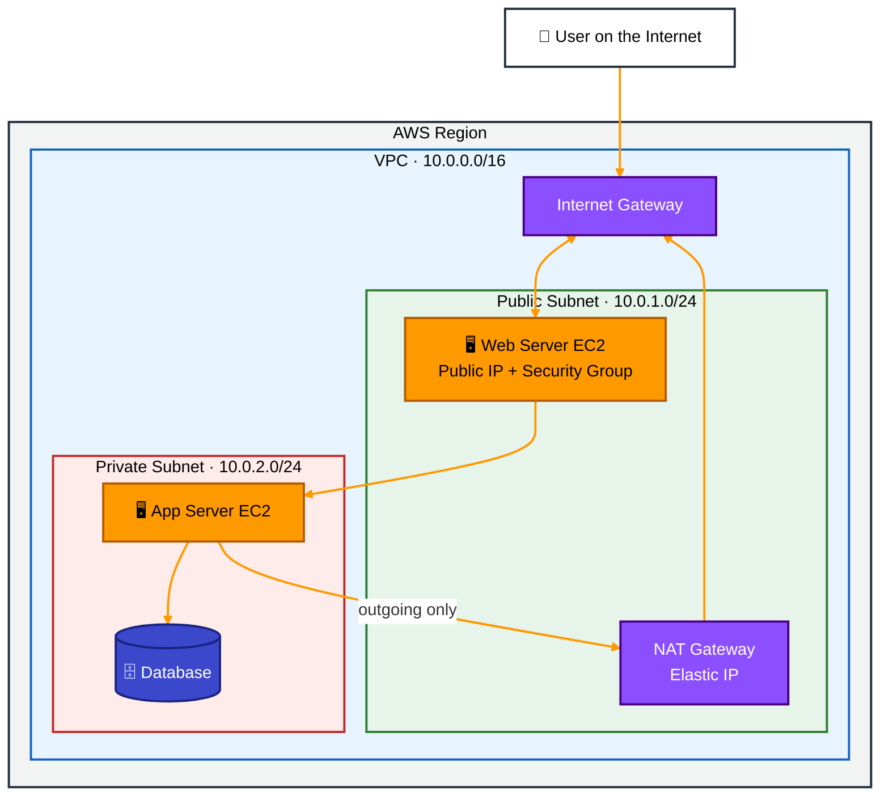
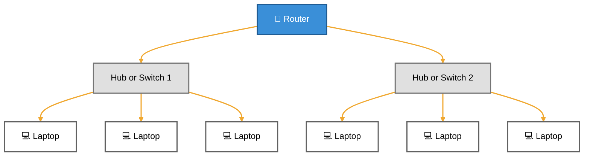
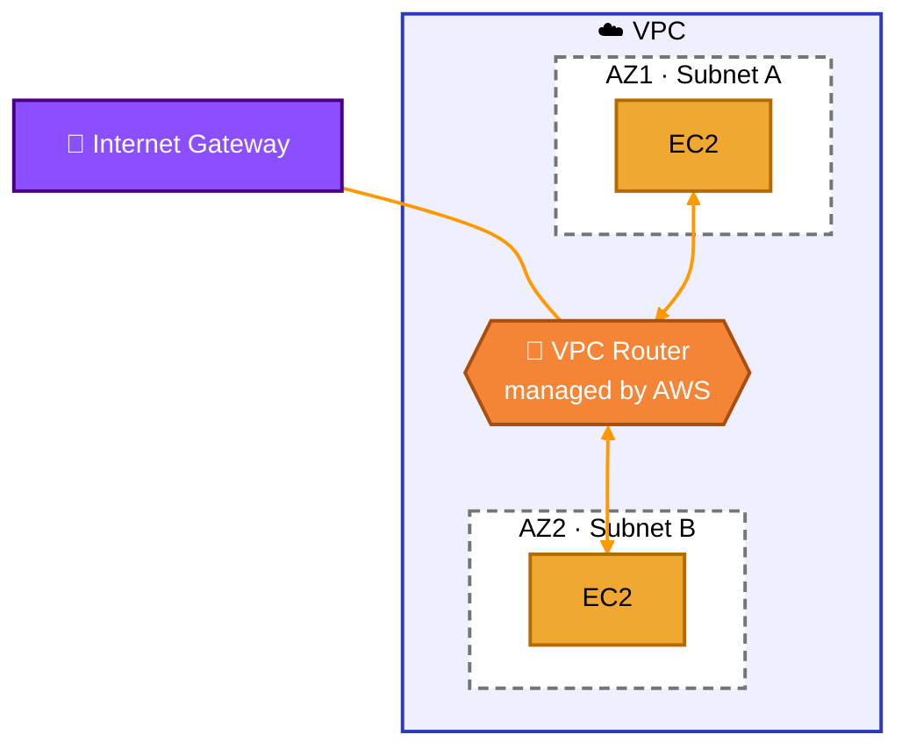

[⬅ Back to Aa](Aa.md)

# AWS VPC (Virtual Private Cloud)

> Tip: on GitHub, click the **☰ outline button** at the top right of this file to see all topics and jump to any one.

## 1. What is a VPC?

A **VPC (Virtual Private Cloud)** is your own **private network inside AWS**. It is like having your own LAN in the cloud.

Think of it like this:

| Your home / office | AWS |
|---|---|
| Your home LAN | VPC |
| Rooms in the house | Subnets |
| Router | Route table + Internet Gateway |
| Main door to the street | Internet Gateway |
| Security guard at each door | Security Group / Network ACL |

- Your EC2 servers, databases and other resources live **inside** the VPC.
- It is **isolated**: other AWS customers cannot see or reach your VPC.
- **You** control the IP address range, subnets, routing and security.
- Every AWS account gets a **default VPC** in each region, but for real projects you usually create your own.

## 2. Main Parts of a VPC

### 2.1 CIDR block (IP address range)

When you create a VPC, you choose a range of private IP addresses using **CIDR notation**.

- Example: `10.0.0.0/16` gives **65,536** IP addresses (`10.0.0.0` to `10.0.255.255`).
- AWS allows VPC sizes from `/16` (biggest) to `/28` (smallest, 16 addresses).
- Use private ranges: `10.0.0.0/8`, `172.16.0.0/12` or `192.168.0.0/16`.

### 2.2 Subnets

A **subnet** is a smaller part of the VPC's IP range. Each subnet lives in **one Availability Zone (AZ)**, which is one data center area.

| Type | Meaning | Used for |
|---|---|---|
| **Public subnet** | Has a route to the **Internet Gateway** | Web servers, load balancers, bastion hosts |
| **Private subnet** | **No** direct route to the internet | Databases, backend app servers |

- Example: `10.0.1.0/24` (public) and `10.0.2.0/24` (private), each with 256 addresses.
- AWS reserves **5 IP addresses** in every subnet, so a `/24` gives you 251 usable IPs.

### 2.3 Route table

A **route table** is a list of rules that says **where network traffic should go**. Each subnet is linked to one route table.

**Public subnet route table:**

| Destination | Target | Meaning |
|---|---|---|
| `10.0.0.0/16` | local | Traffic inside the VPC stays inside |
| `0.0.0.0/0` | `igw-xxxx` (Internet Gateway) | Everything else goes to the internet |

**Private subnet route table:**

| Destination | Target | Meaning |
|---|---|---|
| `10.0.0.0/16` | local | Traffic inside the VPC stays inside |
| `0.0.0.0/0` | `nat-xxxx` (NAT Gateway) | Outgoing internet traffic goes through NAT |

> `0.0.0.0/0` means "any IP address", in other words, the whole internet.

### 2.4 Internet Gateway (IGW)

The **Internet Gateway** is the **main door** between your VPC and the internet.

- You attach **one** IGW to a VPC.
- It allows traffic **in both directions**: internet → VPC and VPC → internet.
- It is fully managed by AWS: highly available and scales automatically.
- It translates a server's **private IP** to its **public IP** (a kind of NAT), similar to your home router.

### 2.5 NAT Gateway

A **NAT Gateway** lets servers in a **private subnet** reach the internet **only for outgoing traffic**, for example to download software updates.

- It sits in a **public subnet** and uses an **Elastic IP** (a fixed public IP).
- The internet **cannot start** a connection to your private servers through it.
- This keeps databases and backend servers safe but still able to update.

### 2.6 Security Group (SG)

A **Security Group** is a **firewall for each server** (EC2 instance).

- You write **allow rules** only, for example "allow port 443 from anywhere" or "allow port 22 only from my IP".
- It is **stateful**: if a request is allowed in, the reply is automatically allowed out.

### 2.7 Network ACL (NACL)

A **Network ACL** is a **firewall for the whole subnet**.

- It has both **allow** and **deny** rules, checked in number order.
- It is **stateless**: you must allow both the request and the reply separately.

| | Security Group | Network ACL |
|---|---|---|
| Works on | Each server (instance) | Whole subnet |
| Rules | Allow only | Allow and deny |
| State | Stateful | Stateless |
| Rule order | All rules checked | Checked in number order |

## 3. VPC Diagram



**Colour guide:** 🟩 green box = public subnet · 🟥 red box = private subnet · 🟦 blue box = VPC · 🟪 purple = gateways · 🟧 orange = servers · orange lines = traffic flow

### Simple text version

```
                     +----------------------+
                     |  Internet (users)    |
                     +----------------------+
                                |
+-------------------------------|------------------------------------+
|  VPC  10.0.0.0/16             |                                    |
|                     +----------------------+                       |
|                     |  Internet Gateway    |   <- main door        |
|                     +----------------------+                       |
|                        |               ^                           |
|   +--------------------|---------------|-------------------+       |
|   |  PUBLIC SUBNET  10.0.1.0/24        |                   |       |
|   |   +----------------+      +----------------+           |       |
|   |   |  Web Server    |      |  NAT Gateway   |           |       |
|   |   |  (public IP)   |      |  (Elastic IP)  |           |       |
|   |   +----------------+      +----------------+           |       |
|   +-----------|----------------------^---------------------+       |
|               |                      |  outgoing only              |
|   +-----------|----------------------|---------------------+       |
|   |  PRIVATE SUBNET  10.0.2.0/24     |                     |       |
|   |   +----------------+      +----------------+           |       |
|   |   |  App Server    |----->|   Database     |           |       |
|   |   +----------------+      +----------------+           |       |
|   +--------------------------------------------------------+       |
+--------------------------------------------------------------------+
```

## 4. How a VPC Connects to the Internet

For a server to be reachable from the internet, **all four** of these must be true:

1. An **Internet Gateway** is attached to the VPC.
2. The subnet's **route table** has `0.0.0.0/0 → Internet Gateway` (this makes it a public subnet).
3. The server has a **public IP** or an **Elastic IP**.
4. The **Security Group** (and Network ACL) allows the traffic, for example port 80/443.

If any one is missing, the server cannot be reached from the internet.

### 4.1 Incoming: a user opens your website

1. The user types your website address. **DNS** (for example, Route 53) returns your server's **public IP**.
2. The request travels across the **internet** to AWS and reaches your **Internet Gateway**.
3. The IGW translates the **public IP → private IP** (for example, `10.0.1.25`) and sends the request into the VPC.
4. The **Network ACL** checks whether the subnet allows the traffic.
5. The **Security Group** checks whether the server allows port 443.
6. The **web server** receives the request and asks the **app server** in the private subnet for data. The app server reads from the **database**.
7. The reply goes back the same way: server → IGW (private IP → public IP) → internet → user.

### 4.2 Outgoing: a private server downloads an update

1. The **app server** (private subnet, no public IP) wants to download a software update.
2. Its route table sends `0.0.0.0/0` traffic to the **NAT Gateway**.
3. The NAT Gateway replaces the private IP with its own **Elastic IP** and sends the request through the **Internet Gateway**.
4. The reply comes back to the NAT Gateway, which passes it to the app server.
5. Nobody on the internet can **start** a connection to the app server, so it stays protected.

## 5. Traditional IT Network vs AWS VPC

A VPC is built on the same ideas as a normal office network. The difference is that in AWS, you don't buy or wire any hardware: AWS runs the switches and routers for you, and you control them with settings.

### 5.1 Traditional (physical) network



- A physical **router** connects different network segments.
- Each **hub or switch** connects the laptops in its own segment.
- You buy, cable and configure all of this hardware yourself.

### 5.2 AWS VPC



- The **VPC** (blue box) is the whole private network, like the whole office network.
- **Subnet A** and **Subnet B** are like the two switch segments. Each subnet sits in its own **Availability Zone** (AZ1, AZ2), so if one data center fails, the other keeps running.
- The **VPC router** is built in and managed by AWS. You never see it as a device; you control it through **route tables**. It lets EC2 in Subnet A talk to EC2 in Subnet B automatically (the `local` route).
- The **Internet Gateway** on the edge of the VPC is the door to the internet, like the internet connection on an office router.

### 5.3 Side-by-side comparison

| Traditional network | AWS VPC | Job |
|---|---|---|
| Whole office LAN | VPC | Your private network |
| Hub / switch segment | Subnet (in one AZ) | Groups servers in one network |
| Physical router | VPC router + route table | Decides where traffic goes |
| Router's internet port / modem | Internet Gateway | Door to the internet |
| Router NAT | NAT Gateway | Lets private devices go out, blocks incoming |
| Router firewall | Security Group / NACL | Allows or blocks traffic |
| Laptops / PCs | EC2 instances | The machines doing the work |
| Private IP `192.168.x.x` | Private IP `10.0.x.x` | Address inside the network |
| You buy and wire hardware | AWS manages everything | Who runs the equipment |

## 6. Quick Summary

- **VPC** = your private network in AWS.
- **Subnet** = a smaller part of the VPC, public or private, in one Availability Zone.
- **Route table** = rules that decide where traffic goes.
- **Internet Gateway** = two-way door between the VPC and the internet.
- **NAT Gateway** = one-way door so private servers can go out but nobody can come in.
- **Security Group** = stateful firewall for each server.
- **Network ACL** = stateless firewall for each subnet.

---

[⬅ Back to Aa](Aa.md)
