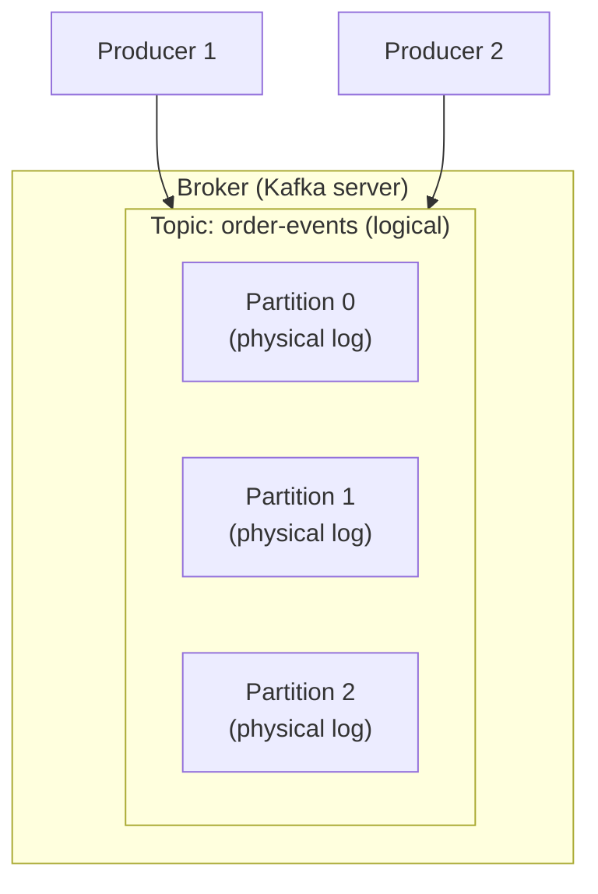
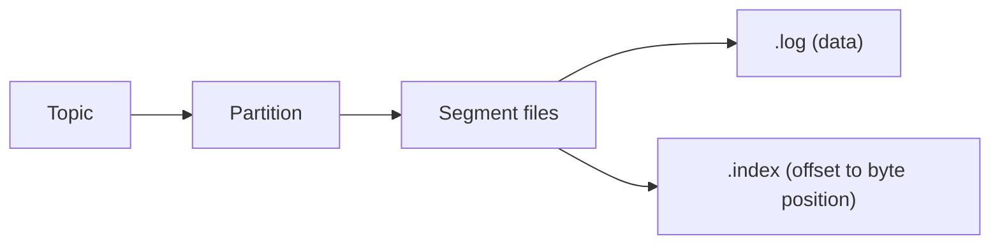
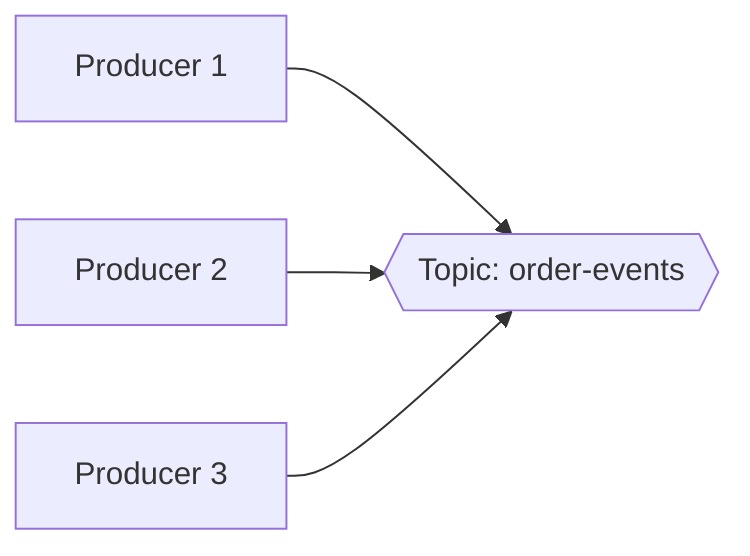
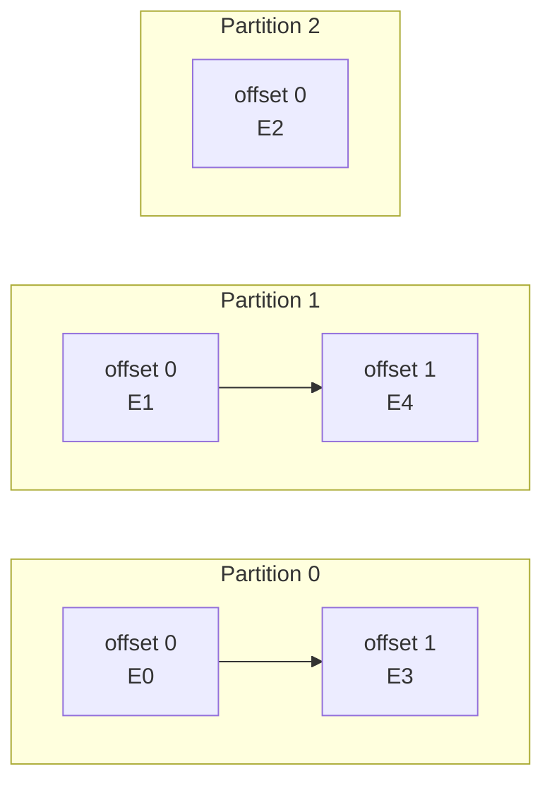
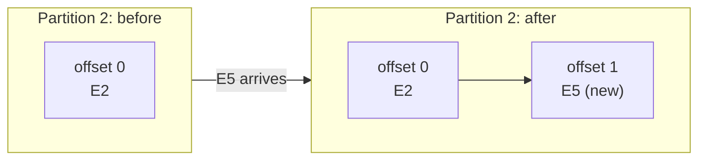
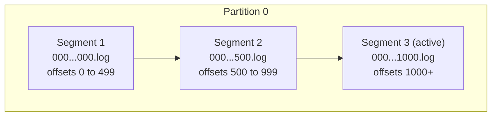
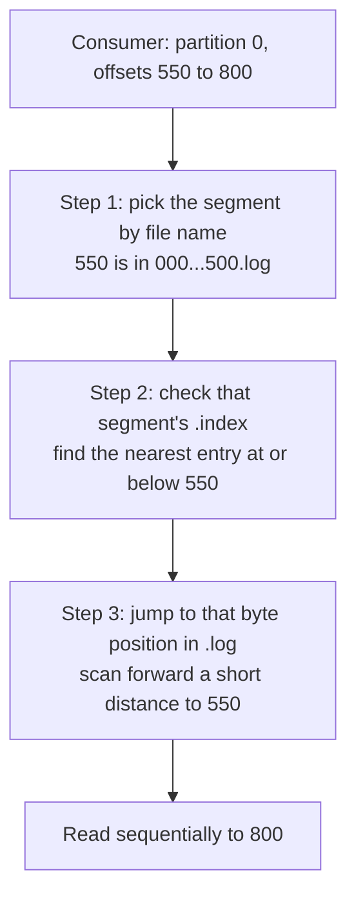
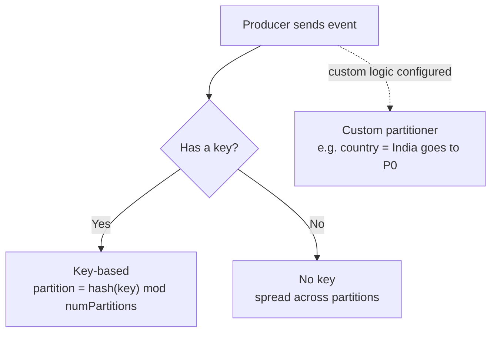
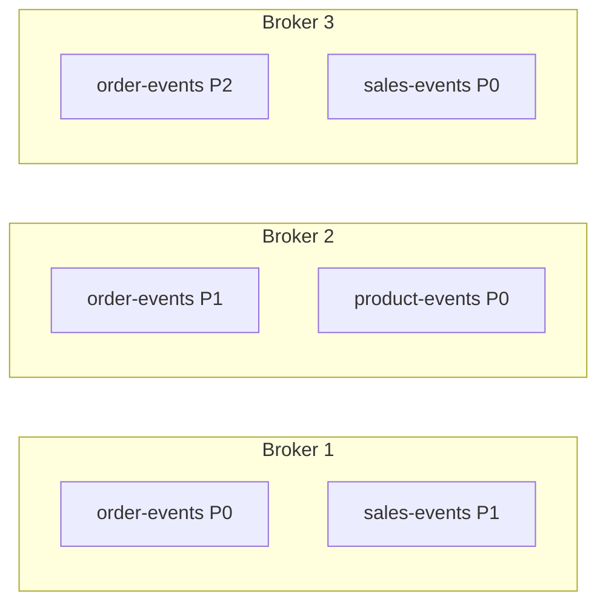

# Kafka Internals, Part 1: Producer, Topic, Partition, Broker

> Event-driven architecture series. The introduction covered EDA, pub/sub vs streaming, and the advantages and challenges of EDA.
> This part starts **Kafka** in depth: how it stores data before we write any producer or consumer code.
> **Part 2** covers consumers and consumer groups.

---

## Table of contents

1. [What is Kafka](#1-what-is-kafka)
2. [Big picture](#2-big-picture)
3. [Producer](#3-producer)
4. [Topic](#4-topic)
5. [Partition](#5-partition)
6. [Offsets and ordering](#6-offsets-and-ordering)
7. [Append-only log](#7-append-only-log)
8. [Segments](#8-segments)
9. [Index files](#9-index-files)
10. [Worked example of index entries](#10-worked-example-of-index-entries)
11. [How a producer picks a partition](#11-how-a-producer-picks-a-partition)
12. [Broker](#12-broker)
13. [Summary](#13-summary)

---

## 1. What is Kafka

A common interview question. A good one-line answer:

> **Kafka is a distributed event streaming platform that lets you publish events, store them durably, and subscribe to (consume) them.**

| Capability | Meaning |
|---|---|
| **Publish** | Producers write events to Kafka |
| **Store** | Events are kept on disk, so they can be **replayed** later (this is what "streaming" means) |
| **Subscribe** | Consumers read events at their own pace |

---

## 2. Big picture

How the pieces in this part fit together, from the outside in:





**Topic** (logical folder) → **partition** (physical log) → **segments** (chunks of the log) → **.log + .index** files on disk.

---

## 3. Producer

A **producer** is an application that **publishes events to Kafka**.

- It sends each event to a **topic**.
- It **does not know or care who consumes** the event. Producers and consumers are fully decoupled.

---

## 4. Topic

A **topic** is a **category or folder** that events are published to.

- It is a **logical grouping** of events, for example `order-events`, `sales-events`, `product-events`.
- The topic itself doesn't physically hold the data. Its **partitions** do.
- **Many producers can write to the same topic.**



---

## 5. Partition

> A partition is a **physical, ordered, append-only log** that is part of a topic. A topic can have **many** partitions.

The three words in that definition each mean something specific.

| Property | Meaning |
|---|---|
| **Physical** | Events are actually **stored on disk** inside the partition. |
| **Ordered** | Every event gets a sequential **offset**, and consumers read in offset order. |
| **Append-only** | New events are only ever **added to the end**. Existing records are never modified. |

On disk, the topic is a folder and each partition is its own directory with its own log:

```text
order-events/              <- topic (logical)
├── order-events-0/        <- partition 0 (its own log)
├── order-events-1/        <- partition 1
└── order-events-2/        <- partition 2
```

---

## 6. Offsets and ordering

When an event arrives at a partition, Kafka assigns it the **next offset** from that partition's counter and appends it to the log.

- **Each partition keeps its own independent offset counter.** Offset 1 in partition 0 has nothing to do with offset 1 in partition 1.
- Consumers read **sequentially by offset**. A consumer asks for a range, such as "offsets 100 to 200 from partition 0". It can't jump around as 32, then 42, then 52.



> Real Kafka offsets start at **0**. The lecture example numbered them from 1; the idea is the same.

### Ordering guarantee

| Scope | Guaranteed? | Why |
|---|---|---|
| **Within one partition** | ✅ Yes | Events are written sequentially and read in increasing offset order. In partition 0, E3 (offset 1) definitely came after E0 (offset 0). |
| **Across partitions (globally)** | ❌ No | Each partition has its own counter. You can't tell whether E4 (partition 1) happened before or after E0 (partition 0). |

**Key interview point:** Kafka guarantees order **per partition, not per topic**.

---

## 7. Append-only log

Say the topic currently looks like this, and a new event **E5** arrives for **partition 2**:



Partition 2 computes its next offset (1) and **appends** E5 to the end of its log file. Nothing that was already written changes.

---

## 8. Segments

A partition is **not one giant log file**. It is split into smaller **segment** files.

Each segment file is **named after the first offset it contains**:

```text
order-events-0/                      <- partition 0
├── 00000000000000000000.log         <- offsets 0 to 499
├── 00000000000000000500.log         <- offsets 500 to 999
└── 00000000000000001000.log         <- offsets 1000 onward (active segment, still being written)
```



### Why split into segments?

A consumer might ask: "**Read partition 0, offsets 550 to 800.**"

- **One big file:** Kafka would have to scan a huge file sequentially. Slow and wasteful.
- **Segments:** from the file names alone, Kafka knows offset 550 lives in `000...500.log`, so it **jumps straight to that segment** and only reads that one.

Segment size is configurable (`log.segment.bytes`, default **1 GB**). Segments also make retention easy: Kafka deletes old data by removing whole old segment files.

---

## 9. Index files

Even a 1 GB segment is slow to scan from the top. So each segment has an **index file** next to it that maps **offset → byte position** in the `.log` file.

```text
00000000000000000000.log      <- the actual events
00000000000000000000.index    <- offset to byte-position lookup
```

Example index for one segment:

| Offset | Byte position in .log |
|---|---|
| 0 | 0 |
| 150 | 4,200 |
| 300 | 8,750 |
| 450 | 13,100 |

### It is a sparse index

Kafka does **not** index every offset. That would make the index almost as big as the log. Instead it adds one entry **every N bytes** written, set by `index.interval.bytes` (default **4096**).

### Lookup for offset 550 to 800, two levels



1. **Segment** by name → skips most of the partition.
2. **Index** inside the segment → skips most of the segment.

This saves memory (small index) and makes lookups fast.

---

## 10. Worked example of index entries

Configuration:

| Setting | Value |
|---|---|
| Segment size | 1 GB |
| `index.interval.bytes` | 4096 bytes |

Events written to partition 0, segment `000...000.log`:

| Offset | Event size | Starts at byte | Bytes written so far |
|---|---|---|---|
| 0 | 300 | 0 | 300 |
| 1 | 500 | 300 | 800 |
| 2 | 1,000 | 800 | 1,800 |
| 3 | 2,000 | 1,800 | 3,800 |
| 4 | 500 | 3,800 | **4,300** |

After offset 4, bytes written (4,300) **exceed** the 4,096-byte interval, so Kafka adds one index entry:

```text
.index
offset 4  ->  byte position 3800
```

The counter then resets, and the next entry is added after roughly another 4 KB of data.

---

## 11. How a producer picks a partition

Three strategies:



### 1. Key-based partitioning

```text
partition = hash(key) % number_of_partitions
```

With 3 partitions:

| Event | Key (orderId) | Calculation | Partition |
|---|---|---|---|
| E0 | 123 | hash(123) % 3 | 1 |
| E1 | 456 | hash(456) % 3 | 2 |
| E2 | 789 | hash(789) % 3 | 0 |

**All events with the same key always go to the same partition**, so they stay **in order** relative to each other. This is how you get per-entity ordering (for example, all events for one order).

### 2. No key (round robin)

If you publish without a key, Kafka spreads events across partitions: E0 → P0, E1 → P1, E2 → P2, then back to P0.

> Modern Kafka clients (2.4+) use a **sticky partitioner** for keyless events: they fill a batch for one partition, then move to the next. The goal is the same, an even spread, but with better batching than strict one-by-one round robin.

### 3. Custom partitioning

You write your own logic, for example:

| Condition | Partition |
|---|---|
| `country == "India"` | P0 |
| `country == "US"` | P1 |

This will be implemented in code in a later part.

---

## 12. Broker

A **broker** is a **single Kafka server instance**. It **stores the data and serves clients** (producers and consumers). The partitions physically live on brokers.

> **A broker stores *some* partitions of *some* topics.**

A Kafka setup usually has many topics, each with several partitions:

| Topic | Partitions |
|---|---|
| `order-events` | P0, P1, P2 |
| `sales-events` | P0, P1 |
| `product-events` | P0, P1, P2 |

One broker does **not** hold all of these. It holds a subset, for example `order-events` P0 and `sales-events` P1.



**Important:** topics and partitions are **distributed across multiple brokers**. How that works (the Kafka **cluster**, replication, leaders) is covered when we discuss clusters.

---

## 13. Summary

| Concept | One-liner |
|---|---|
| **Kafka** | Distributed event streaming platform: publish, store, subscribe |
| **Producer** | Publishes events to a topic; doesn't care who consumes |
| **Topic** | Logical category or folder of events; many producers can write to it |
| **Partition** | Physical, ordered, append-only log inside a topic |
| **Offset** | Sequential ID per partition; each partition has its own counter |
| **Ordering** | Guaranteed **within** a partition, **not across** partitions |
| **Segment** | Partition log split into chunks named by starting offset; jump straight to the right one |
| **Index** | Sparse offset → byte-position map per segment (`index.interval.bytes`) |
| **Partitioning** | Key hash, no key (round robin / sticky), or custom |
| **Broker** | One Kafka server; stores *some* partitions of *some* topics |

**Next, Part 2:** consumers and consumer groups.
