# Kafka Internals, Part 2: Consumers, Consumer Groups, Offsets, Cluster and Replication

> Event-driven architecture series.
> **Part 1** covered producer, topic, partition, segments, index files and broker.
> This part covers **consumers and consumer groups**, **offset storage and commit strategies**, the **Kafka cluster**, and **leader and follower replicas**.
> **Part 3** covers the **controller**: who decides which broker hosts which partition and which replica is the leader.

---

## Table of contents

1. [Where we are](#1-where-we-are)
2. [Consumer and consumer group](#2-consumer-and-consumer-group)
3. [Rule 1 one partition per consumer within a group](#3-rule-1-one-partition-per-consumer-within-a-group)
4. [Rule 2 different groups can read the same partition](#4-rule-2-different-groups-can-read-the-same-partition)
5. [Consumer count vs partition count](#5-consumer-count-vs-partition-count)
6. [Offsets are tracked per group not per consumer](#6-offsets-are-tracked-per-group-not-per-consumer)
7. [Where offsets are stored](#7-where-offsets-are-stored)
8. [Committing an offset step by step](#8-committing-an-offset-step-by-step)
9. [Recovering after a consumer crash](#9-recovering-after-a-consumer-crash)
10. [Offset commit strategies](#10-offset-commit-strategies)
11. [Kafka cluster](#11-kafka-cluster)
12. [Replication factor](#12-replication-factor)
13. [Leader and follower partitions](#13-leader-and-follower-partitions)
14. [How a producer finds the right broker](#14-how-a-producer-finds-the-right-broker)
15. [Leader failover](#15-leader-failover)
16. [Summary](#16-summary)

---

## 1. Where we are

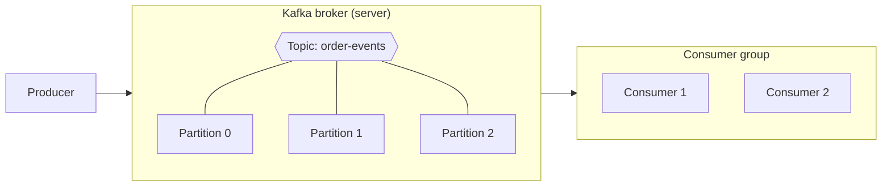

| Done in Part 1 | New in Part 2 |
|---|---|
| Producer, topic, partition, segments, index, broker | Consumer, consumer group, offset storage, commit strategies, cluster, leader and follower |

---

## 2. Consumer and consumer group

- A **consumer** is an application that **reads events** from Kafka.
- Every consumer belongs to a **consumer group**, identified by a `group.id`, for example `notification-group` or `analytics-group`.
- A group represents **one logical subscriber**. The consumers inside it **share the work** of reading the topic.
- You can create as many groups as you want. Each group gets **its own full copy of the stream**.

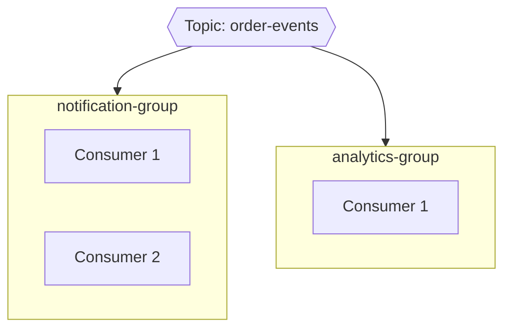

---

## 3. Rule 1 one partition per consumer within a group

> **Within one group, a partition is read by only one consumer.**
> Two consumers in the same group can never read the same partition at the same time.

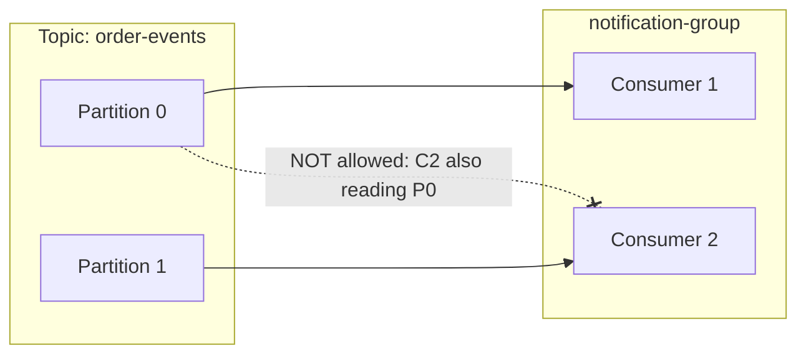

This is what keeps **ordering within a partition** intact: only one consumer in the group processes that partition's events, in offset order.

---

## 4. Rule 2 different groups can read the same partition

> **Consumers in different groups can read the same partition.**
> Each group reads independently and keeps its own progress.

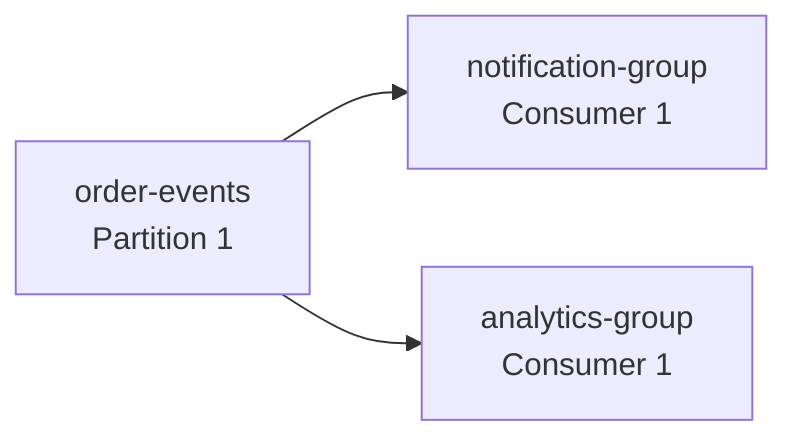

The notification service and the analytics service both receive **every** event from partition 1, without interfering with each other.

---

## 5. Consumer count vs partition count

How partitions are shared out inside **one** group depends on how many consumers it has.

### Consumers equal to partitions: one to one

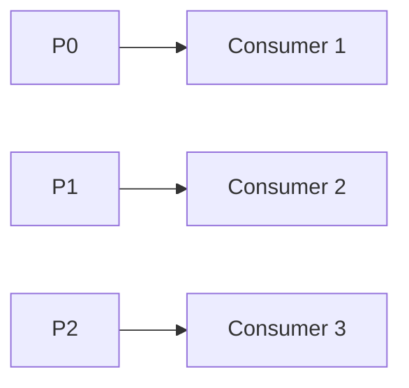

### Consumers fewer than partitions: some consumers take several

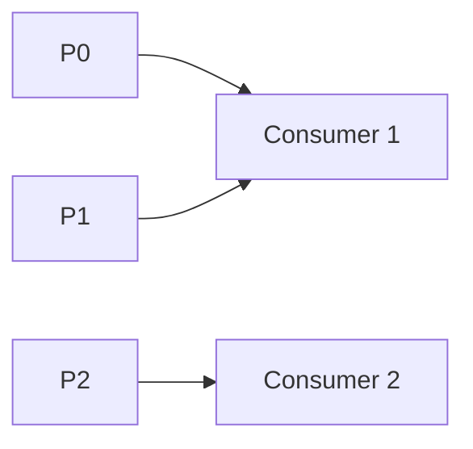

### Consumers more than partitions: extra consumers sit idle

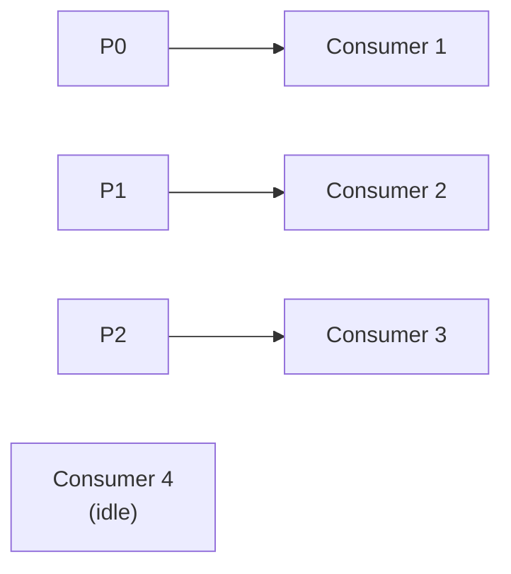

| Situation | Result |
|---|---|
| Consumers = partitions | Each consumer reads exactly one partition |
| Consumers < partitions | Some consumers read more than one partition |
| Consumers > partitions | Extra consumers get **no** partition and stay idle |

**Takeaway:** the partition count is the **maximum parallelism** for a single group. Adding a 4th consumer to a 3-partition topic doesn't speed anything up. The idle one does act as a standby, though: if another consumer dies, it can take over.

---

## 6. Offsets are tracked per group not per consumer

Each consumer group records, **for every topic and partition it reads**, how far it has processed.

```text
(group, topic, partition)                  -> committed offset
(notification-group, order-events, P0)     -> 500
(notification-group, order-events, P1)     -> 300
(analytics-group,    order-events, P0)     -> 120
```

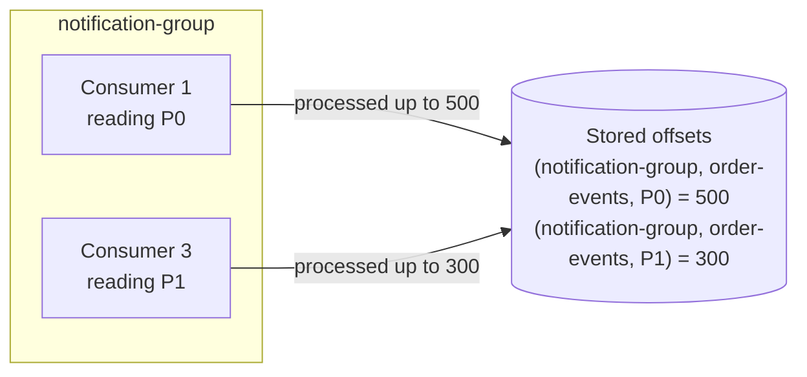

### Why per group, not per consumer?

Consumers come and go. If the key were "consumer 1", a replacement consumer couldn't find the progress. Because the key is the **group**, any consumer in that group that takes over the partition can look up where to resume.

---

## 7. Where offsets are stored

Kafka's core strength is **topic plus partition**, and it uses that same mechanism for its own bookkeeping. Offsets are stored in an **internal topic** that Kafka creates automatically:

```text
__consumer_offsets      (default: 50 partitions)
```

You didn't create it, but it shows up in any Kafka UI as soon as the server starts. **All consumer groups** store their committed offsets here.

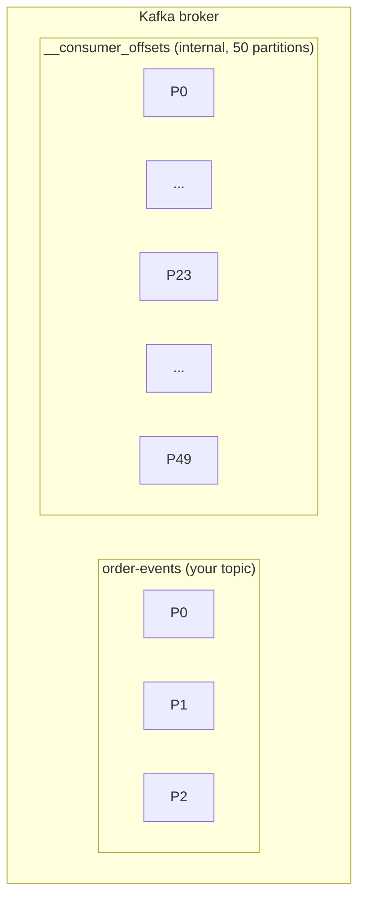

### Which of the 50 partitions?

Each group's offsets always go to **one fixed partition** of `__consumer_offsets`:

```text
partition = hash(group.id) % 50
```

For example, `hash("notification-group") % 50 = 23`, so **partition 23** holds every offset that `notification-group` commits. The same input always produces the same partition, so the group always knows where to look.

---

## 8. Committing an offset step by step

Example: consumer 1 in `notification-group` has processed `order-events` partition 0 up to offset 500.

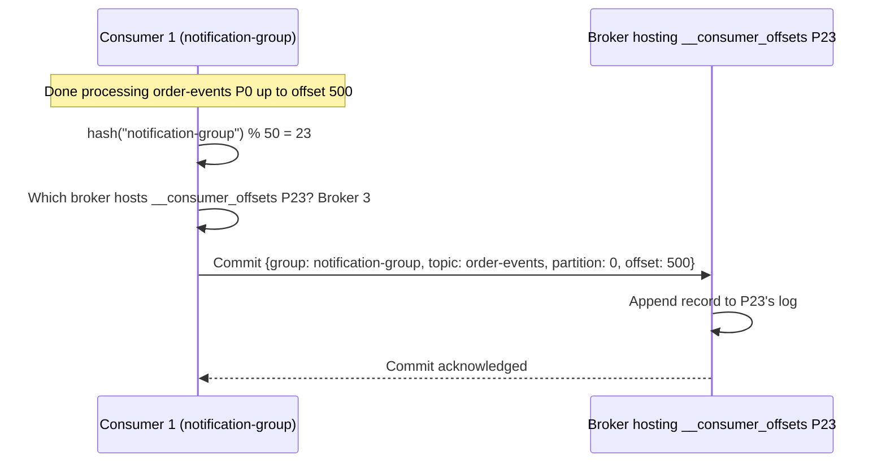

### Why compute the partition at all?

With several brokers, **no broker holds every partition**. For example:

| Broker | `__consumer_offsets` partitions it hosts |
|---|---|
| Broker 2 | P0 to P20 |
| Broker 3 | P21 to P49 |

The consumer must know which partition (23) it needs so it can talk to the broker that hosts it (broker 3). That broker is known as the group's **group coordinator**.

> **Detail:** strictly, Kafka stores the **next offset to read** (501 in this example), not the last one processed. The idea is the same.

---

## 9. Recovering after a consumer crash

Consumer 1 crashes. Consumer 2 in the same group is assigned partition 0 and needs to know where to start.

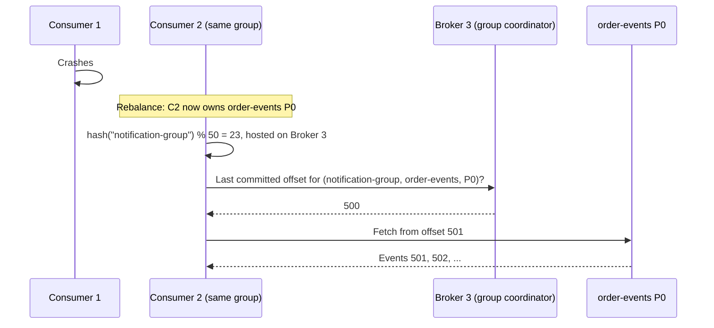

Nothing is lost and nothing is skipped, because the progress belongs to the **group**, not to the consumer that crashed.

---

## 10. Offset commit strategies

When should a consumer commit? This decides whether you **lose** events or **re-process** them after a crash.

### Strategy 1: auto commit (risky)

```text
enable.auto.commit = true
auto.commit.interval.ms = 5000      # commit every 5 seconds
```

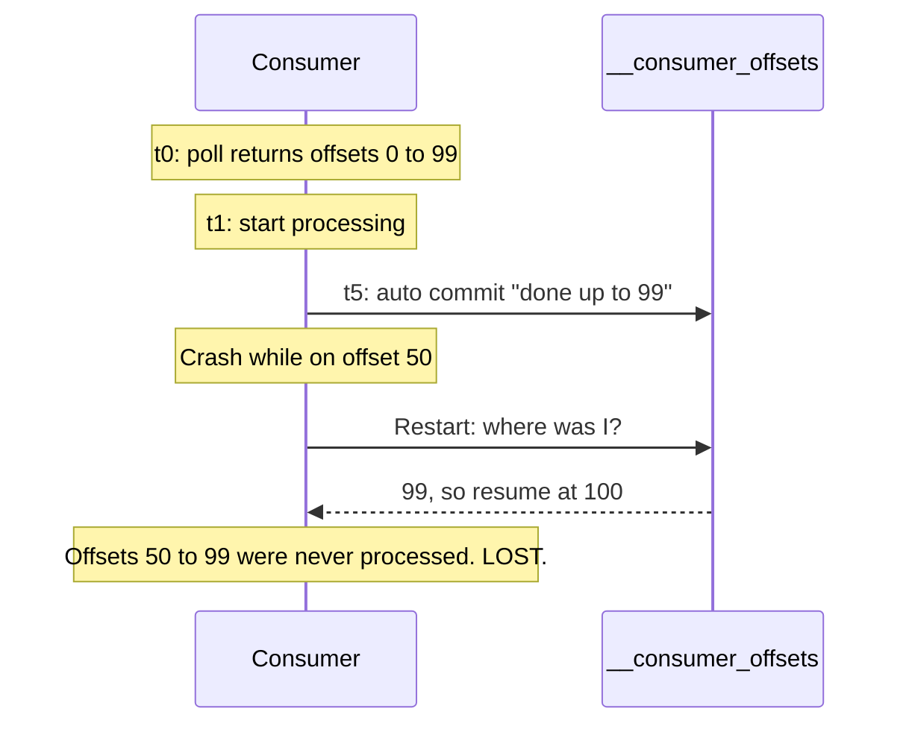

The commit is driven by a **timer**, not by your processing. If the commit happens before processing finishes and the consumer then crashes, the remaining events are skipped.

> **Detail:** the Java client actually performs auto commit inside `poll()`. In a simple loop that fully processes each batch before polling again, this is usually safe. The loss risk shows up when processing is handed off to other threads or done asynchronously, because the offsets get committed before the work is really finished.

### Strategy 2: manual commit after each batch (recommended)

```text
enable.auto.commit = false
```

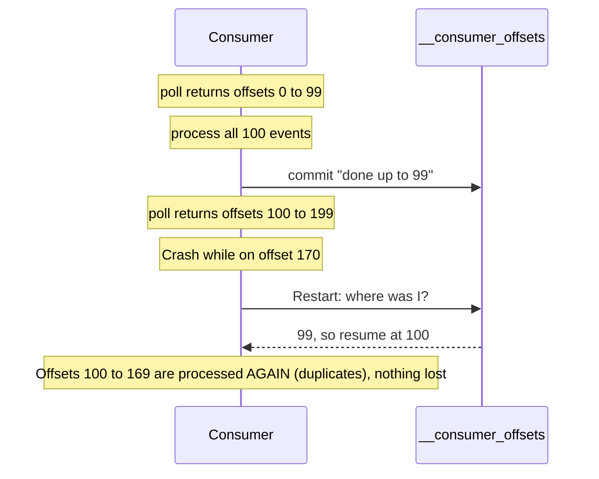

You commit **only after the whole batch is processed**. A crash causes **re-processing** of part of a batch, never loss. This is **at-least-once** delivery, so make your consumers **idempotent** (safe to run twice) to handle the duplicates.

### Strategy 3: manual commit after every event (not recommended)

Committing after each event means one network call to the broker per event. Kafka is used for high volumes, so this hurts throughput badly. Choose a **sensible batch size** for your business instead.

### Comparison

| Strategy | On crash | Throughput | Use |
|---|---|---|---|
| Auto commit (timer) | Can **lose** events | High | Only when occasional loss is acceptable |
| Manual, per batch | May **duplicate** some events | High | ✅ Recommended default |
| Manual, per event | Minimal duplicates | Low | Rarely worth it |

---

## 11. Kafka cluster

> A **Kafka cluster** is a group of brokers working together to provide **scalability**, **fault tolerance** and **high availability**.

| Property | Meaning |
|---|---|
| **Scalability** | Load is spread across many servers |
| **Fault tolerance** | Keeps working even if a broker fails |
| **High availability** | No single point of failure |

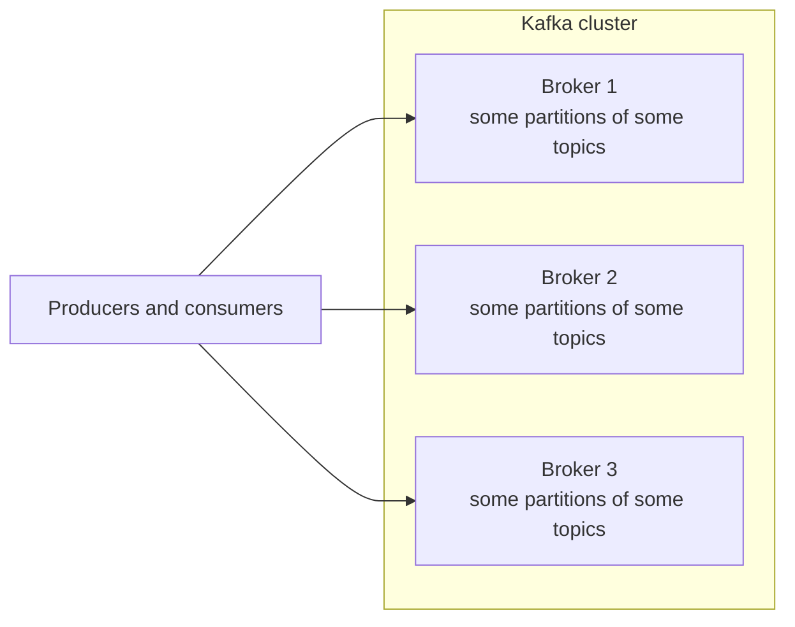

Each broker handles part of the requests, which is where the scalability comes from. Fault tolerance and high availability come from **replication**, covered next.

---

## 12. Replication factor

When you create a topic you choose a **replication factor**: how many copies of **each partition** Kafka keeps.

Example: topic `order-events`, **3 partitions**, **replication factor 2**.

| Partition | Copies | Roles |
|---|---|---|
| P0 | 2 | 1 leader + 1 follower |
| P1 | 2 | 1 leader + 1 follower |
| P2 | 2 | 1 leader + 1 follower |
| **Total** | **6 replicas** | **3 leaders + 3 followers** |

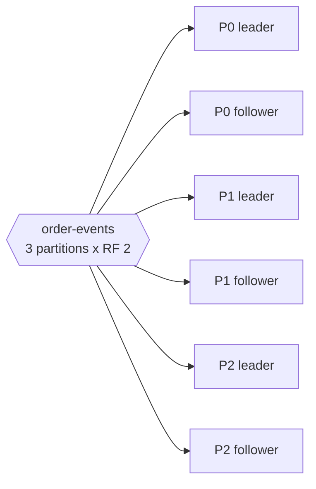

Copies of the same partition are always placed on **different brokers**. Otherwise one broker failure would wipe out both copies. Production clusters commonly use a replication factor of **3**.

---

## 13. Leader and follower partitions

The 6 replicas spread across 3 brokers like this:

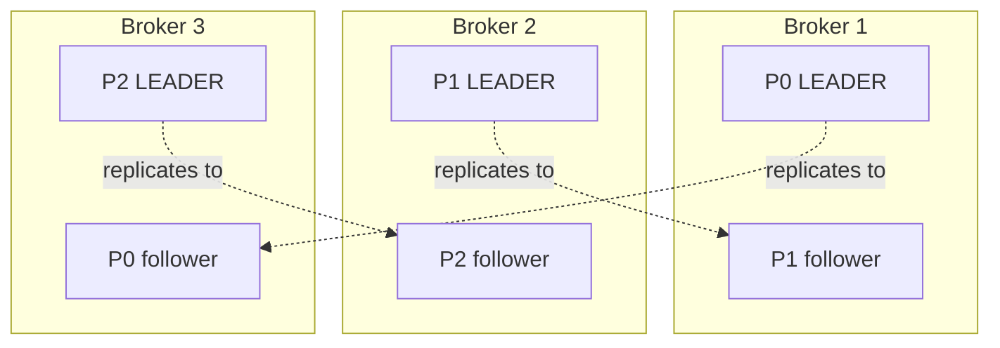

| Broker | Leader of | Follower of |
|---|---|---|
| Broker 1 | P0 | P1 |
| Broker 2 | P1 | P2 |
| Broker 3 | P2 | P0 |

No broker holds everything, and every broker is the leader for something, so the load is shared.

### Responsibilities

| Leader | Follower |
|---|---|
| Handles **all writes** from producers | Copies data from the leader |
| Handles **reads** from consumers | Stays in sync with the leader |
| Maintains the partition log | Is ready to **become leader** if the leader fails |
| Coordinates with its followers | Does **not** serve producers |

> **Detail:** since Kafka 2.4, consumers can optionally be configured to read from a follower in the same rack or data center (to save network cost). By default, and in this series, the leader serves all reads and writes.

---

## 14. How a producer finds the right broker

The producer first picks the partition (Part 1), then sends to **whichever broker hosts that partition's leader**.

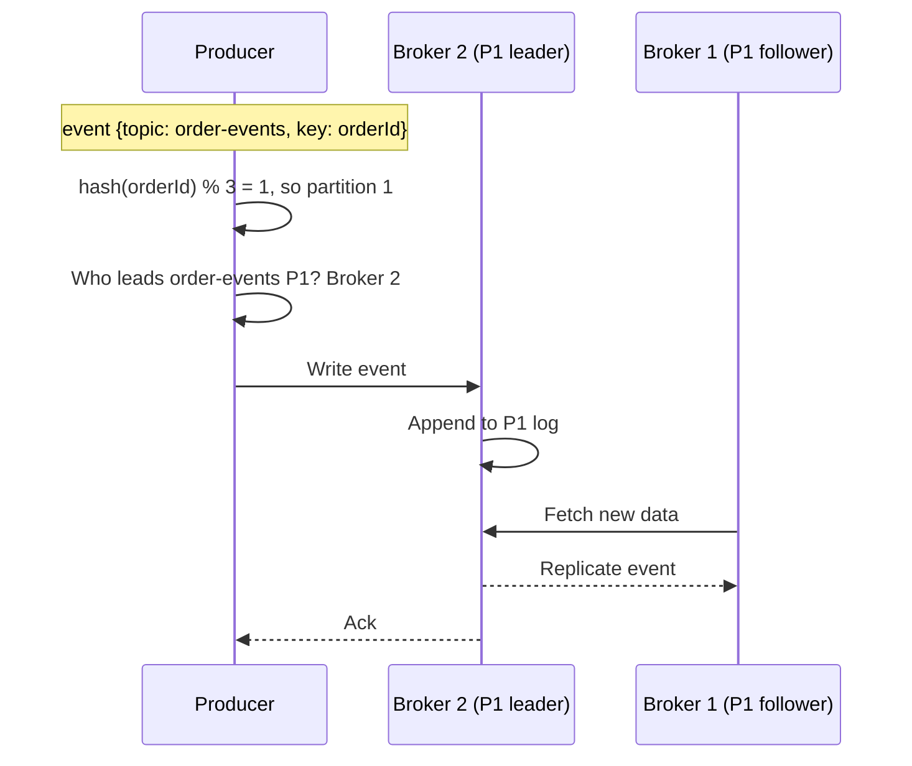

This is the same pattern the consumer used for offset commits in section 8: **work out the partition, find its leader, talk to that broker.**

---

## 15. Leader failover

Followers are standbys. If the leader's broker dies, an in-sync follower is promoted.

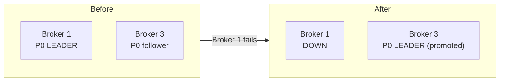

Producers and consumers simply switch to the new leader on broker 3, and the cluster keeps running. This is how Kafka has **no single point of failure**.

### Open question for Part 3

Who decides:

- which broker hosts which partition replica,
- which replica is the leader and which are followers, and
- which follower gets promoted when a leader fails?

That is the job of the **controller**, covered in Part 3.

---

## 16. Summary

| Concept | One-liner |
|---|---|
| **Consumer** | Application that reads events |
| **Consumer group** | Set of consumers sharing a topic; one logical subscriber, identified by `group.id` |
| **Rule 1** | In one group, each partition is read by only one consumer |
| **Rule 2** | Different groups can read the same partition independently |
| **Parallelism limit** | More consumers than partitions means some sit idle |
| **Offset tracking** | Stored per (group, topic, partition), not per consumer |
| **`__consumer_offsets`** | Internal topic, 50 partitions by default; group's partition = `hash(group.id) % 50` |
| **Auto commit** | Timer-based; can lose events |
| **Manual batch commit** | Commit after processing; may duplicate, never loses. Recommended |
| **Cluster** | Group of brokers: scalability, fault tolerance, high availability |
| **Replication factor** | Number of copies of each partition, always on different brokers |
| **Leader** | Handles reads and writes for a partition |
| **Follower** | Replicates the leader; takes over if it fails |

**Next, Part 3:** the **controller**.
