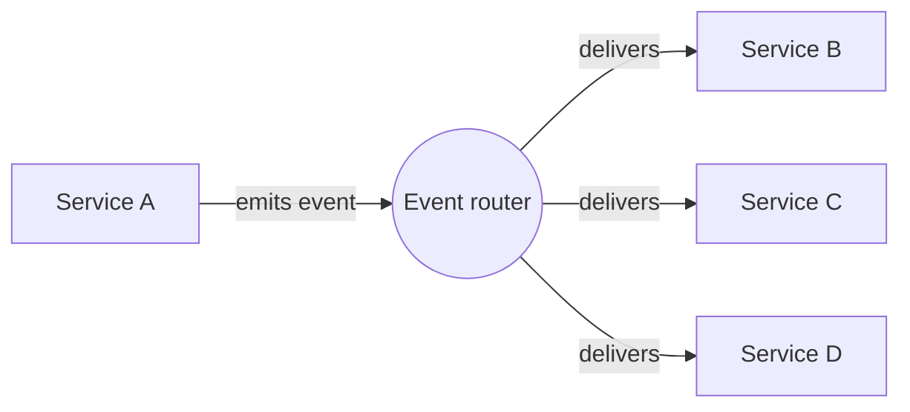
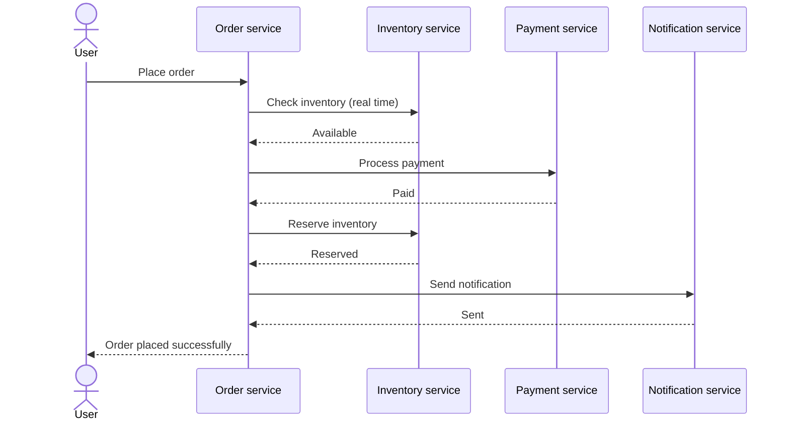
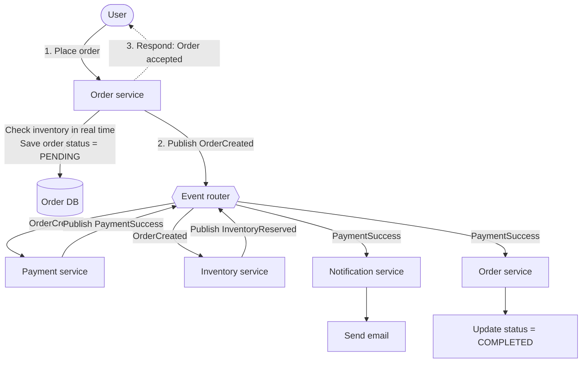
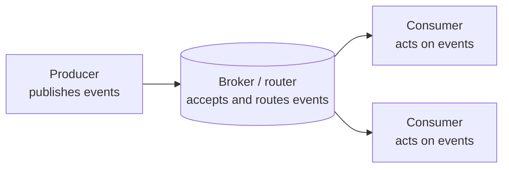
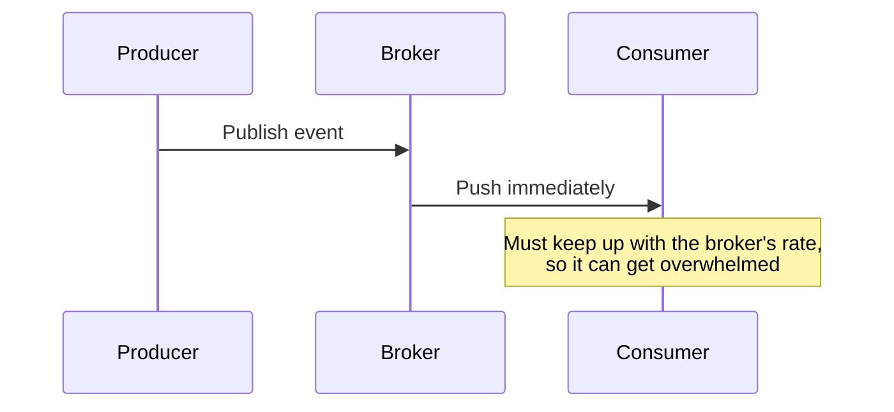
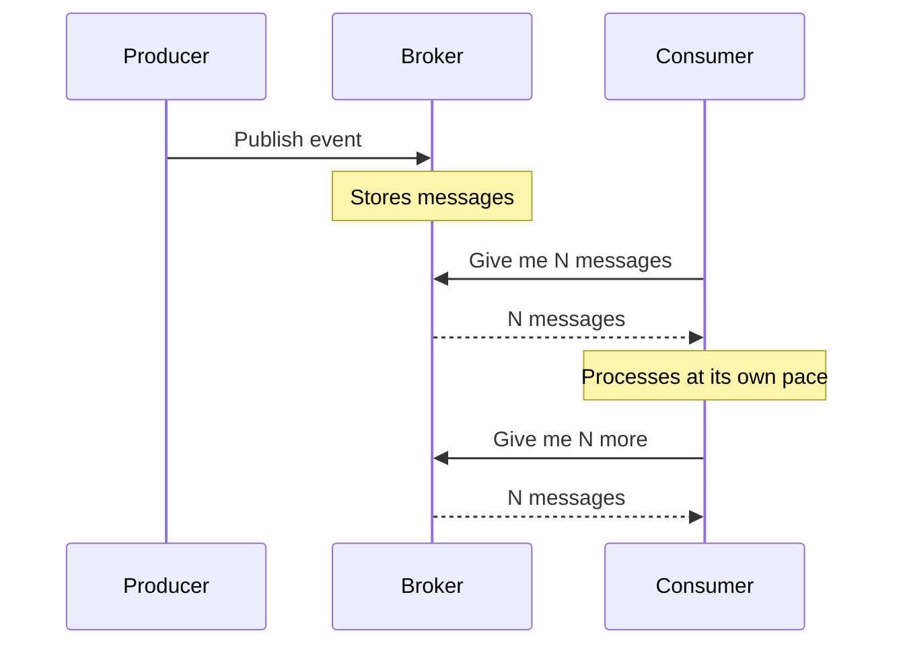
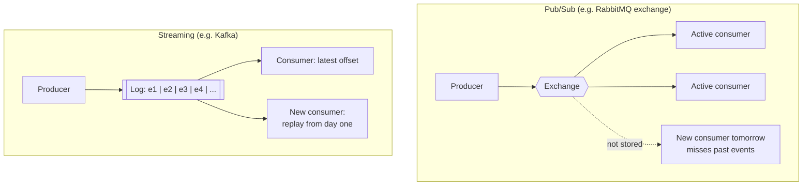
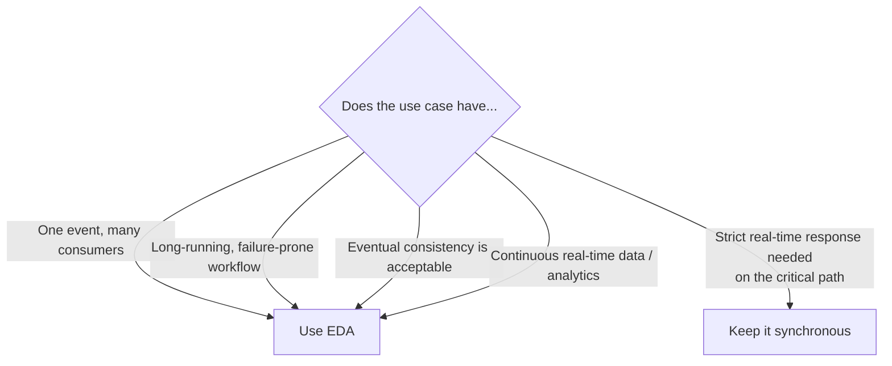

# Event-Driven Architecture (EDA): Introduction

> Distributed microservices, part: **asynchronous communication**
> This note covers the fundamentals of EDA. A deep dive into a specific event router (most likely **Kafka**) comes next.

---

## Table of contents

1. [What is EDA?](#1-what-is-eda)
2. [Event vs command vs query](#2-event-vs-command-vs-query)
3. [The problem: synchronous REST chains](#3-the-problem-synchronous-rest-chains)
4. [The same flow with EDA](#4-the-same-flow-with-eda)
5. [Advantages of EDA](#5-advantages-of-eda)
6. [Key components](#6-key-components)
7. [How events move: push vs pull](#7-how-events-move-push-vs-pull)
8. [EDA models: pub/sub vs streaming](#8-eda-models-pubsub-vs-streaming)
9. [Challenges of EDA](#9-challenges-of-eda)
10. [When to use EDA](#10-when-to-use-eda)
11. [Summary](#11-summary)

---

## 1. What is EDA?

**Event-driven architecture** is a system design style in which services **do not call each other directly**. Instead:

- a service **emits an event**, and
- other services **react** to that event.

No two services talk to each other directly. They interact only through events.

### What is an event?

An event is **a fact that something happened in the past**.

| Property | Meaning |
|---|---|
| **Immutable** | Once created it can't be changed. It already happened. |
| **Past tense** | Describes *what happened* (`OrderCreated`), not *what to do*. |
| **Self-contained** | Carries all the information needed to understand it. |

---

## 2. Event vs command vs query

| Type | Example | Meaning |
|---|---|---|
| **Event** | `OrderCreated` | A fact: something already happened |
| **Command** | `PlaceOrder` | An instruction: do something |
| **Query** | `GetOrderDetails` | A request: fetch some data |

---

## 3. The problem: synchronous REST chains

Example services: **User, Order, Payment, Inventory, Notification**.

In a REST-based setup, the Order service orchestrates every step itself, and the user waits until **all** of them finish.

### Problems with this approach

| # | Problem | Explanation |
|---|---|---|
| 1 | **Availability** | Every service must be up at the same time. If Inventory is down, the whole request fails. |
| 2 | **Latency accumulation** | Total latency = `t1 + t2 + t3 + t4`. Every hop adds up. |
| 3 | **Cascading failure** | One slow service drags down the rest. If Inventory can handle only 5 of 10 requests, the 5 failures cascade back through Payment and Order. |
| 4 | **Tight coupling** | Order must know how to call Payment, Inventory and Notification, and what each returns. |
| 5 | **Scaling issues** | Scaling Payment from 100 to 1,000 req/min doesn't help if Inventory still handles only 100. The other 900 fail. |

These problems get worse with **long-running flows** that involve many services, which is exactly where EDA is widely used in industry.

> The order flow here is only an example to contrast REST with EDA, not a real production order flow.

---

## 4. The same flow with EDA

An **event router** (Kafka, RabbitMQ, etc.; kept generic here) sits between the services.

### Step by step

**Synchronous (critical path)**
1. User places an order.
2. Order service checks inventory **in real time**.
3. If available, it saves the order with status **`PENDING`**.
4. It publishes an **`OrderCreated`** event to the router.
5. It immediately responds to the user: **"Order accepted"**.

**Asynchronous and parallel (non-critical path)**

6. The router pushes `OrderCreated` to every interested service (Payment and Inventory). It doesn't tell them *what to do*, only *what happened*.
7. Payment processes the payment and publishes **`PaymentSuccess`**. Inventory reserves stock and publishes **`InventoryReserved`**.
8. The router forwards `PaymentSuccess` to interested services:
   - **Notification** sends the email.
   - **Order** updates the status to **`COMPLETED`**.

The event router acts as a **mediator (broker)**: services publish, the router delivers to whoever is interested.

---

## 5. Advantages of EDA

Most of the disadvantages of the synchronous chain become advantages here.

| Advantage | Why |
|---|---|
| **Loose coupling** | No direct dependency between services. |
| **Independent scalability** | Scale Payment as much as you like. It just consumes more events. |
| **Better resilience** | A temporary failure (say, Inventory) doesn't take down the system. Orders are still accepted, and pending events are processed once the service recovers. |
| **Replay** | Old events can be reprocessed. |
| **Lower latency** | The user gets a response in about 1 s instead of waiting about 5 s, and downstream work runs in parallel. |

---

## 6. Key components

| Component | Role |
|---|---|
| **Producer** | The service that publishes an event |
| **Broker (router)** | Accepts events and passes them to interested consumers |
| **Consumer** | The service that consumes and acts on events |

---

## 7. How events move: push vs pull

### Push model

### Pull model

| | Push | Pull |
|---|---|---|
| Who controls the rate | Broker | Consumer |
| Risk | Consumer overload | Slightly higher latency |

Some brokers support push, some pull, some both. The details depend on the framework (Kafka, RabbitMQ, etc.) and are covered separately.

---

## 8. EDA models: pub/sub vs streaming

| | Pub/Sub | Streaming |
|---|---|---|
| Delivery | Sent to **active** consumers, then forgotten | **Appended to a log** |
| Storage | Not stored | Retained forever or for a set period (3 days, 7 days, ...) |
| Replay / history | No | Yes |
| New consumer | Doesn't get earlier messages | Can start from the **latest offset** or **from the beginning** |
| Example | RabbitMQ (exchange) | Kafka |

---

## 9. Challenges of EDA

EDA is not perfect. These challenges come up in almost every high-level design discussion, and each one needs an industry-standard solution (covered in later topics).

| Challenge | Description |
|---|---|
| **Eventual consistency** | Reading right after a write may return stale data. It becomes correct after some time. |
| **Duplicate events** | Routers typically guarantee **at-least-once** delivery, so duplicates are normal and must be handled. |
| **Ordering problems** | Producer sends `e1, e2`, consumer receives `e2, e1`. If unhandled, this can **corrupt the database**. |
| **Schema evolution** | Changing or removing a field in the event schema can crash every consumer. Versioning is required. |
| **Debugging complexity** | Tracing across async, parallel hops is hard. Needs distributed tracing. |
| **Poison messages** | One bad message that no one can consume can block the router or queue. |
| **Operational overhead** | You must monitor **consumer lag** (for example, 5 events/min published vs 1/min consumed), queue health, throughput, partitions, size, and more. |

Without a proper understanding, these challenges can create more trouble than the benefits EDA brings.

---

## 10. When to use EDA

1. **One event, multiple consumers.** For example, `OrderCreated` is needed by Inventory, Payment, Notification and Analytics. Order shouldn't call them all.
2. **Long-running business workflows.** Order, payment, shipment, delivery: many steps, slow, failure-prone. Split it into a **critical path** (real-time, synchronous) and a **non-critical path** (async via events). A few extra seconds on the non-critical path is fine.
3. **Eventual consistency is acceptable.** A strong hint that EDA fits.
4. **Real-time analytics.** Data arrives continuously and is processed continuously by consumers.

---

## 11. Summary

- In EDA, services **communicate through events, not direct calls**.
- An event is an **immutable, past-tense, self-contained fact**.
- Core pieces: **producer, broker, consumer**.
- Events move by **push** or **pull**. Models are **pub/sub** (no history) or **streaming** (log with replay).
- Benefits: loose coupling, independent scaling, resilience, replay, lower latency.
- Costs: eventual consistency, duplicates, ordering, schema evolution, debugging, poison messages, operational overhead.
- Keep the **critical path synchronous** and move the **non-critical path to events**.

**Next:** a deep dive into a specific event router, **Kafka**.
