# 🧠 Phase 0: Redis Mental Model & Ecosystem

> **Who this is for:** beginners who have maybe used Redis as "that cache thing" and want a real, senior-level mental model before writing any code.
>
> **How to read this:** go top to bottom. Each section has a 🎯 *goal*, a plain-English explanation, a diagram, and a ✅ *check yourself* box at the end. Diagrams use **Mermaid**; they render on GitHub, GitLab, Obsidian, and VS Code (with a Mermaid extension).

---

## 📚 Table of Contents

0. [The Big Picture (read this first)](#0-the-big-picture-read-this-first)
1. [What Redis Really Is](#1-what-redis-really-is)
2. [Three Roles: Primary DB vs Cache vs Message Broker](#2-three-roles-primary-db-vs-cache-vs-message-broker)
3. [When NOT to Use Redis](#3-when-not-to-use-redis)
4. [Version History That Matters](#4-version-history-that-matters)
5. [Licensing & Forks](#5-licensing--forks)
6. [The Alternatives Landscape](#6-the-alternatives-landscape)
7. [The RESP Protocol](#7-the-resp-protocol)
8. [🎓 Senior Check: Valkey vs Redis, Memcached vs Redis](#8--senior-check)
9. [Glossary](#9-glossary)
10. [Final Revision Sheet](#10-final-revision-sheet)

---

## 0. The Big Picture (read this first)

Before details, hold this one picture in your head:

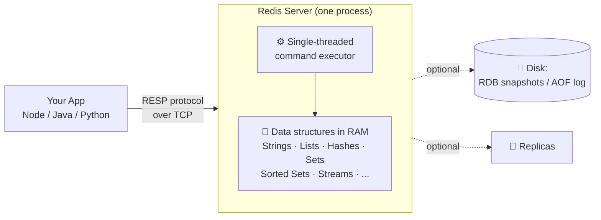

Four ideas carry you through this whole phase:

| # | Idea | Why it matters |
|---|---|---|
| 1 | Data lives in **RAM** | That's why it's fast, and why size is limited |
| 2 | Redis stores **data structures**, not just strings | That's why it's more than a cache |
| 3 | Commands execute **one at a time** | Every command is atomic; one slow command blocks everyone |
| 4 | Clients talk to it with a **tiny text protocol (RESP)** | That's why there are clients in every language |

---

## 1. What Redis Really Is

🎯 **Goal:** stop thinking "Redis = cache". Start thinking "Redis = a server that holds data structures in memory."

### 1.1 The name

**Redis = RE**mote **DI**ctionary **S**erver. A dictionary (a hash map, key → value) that lives on a **remote** server you talk to over the network.

### 1.2 "Data structure server": what does that mean?

In a normal cache (like Memcached), the value is just a **blob of bytes**. If you want to add one item to a list, you must:

1. download the whole list,
2. change it in your app,
3. upload the whole list back.

In Redis, the **value has a type**, and the server knows how to operate on it. You just say `RPUSH mylist item`. The server does the work **in place**.

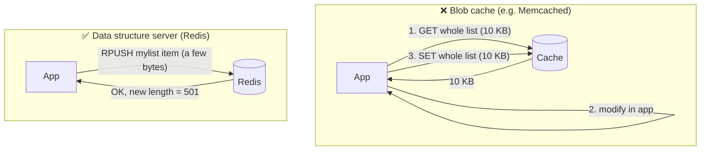

Benefits: less network traffic, and **no race condition** (two apps can't overwrite each other's change, because the server applies each command atomically).

### 1.3 The data types (your toolbox)

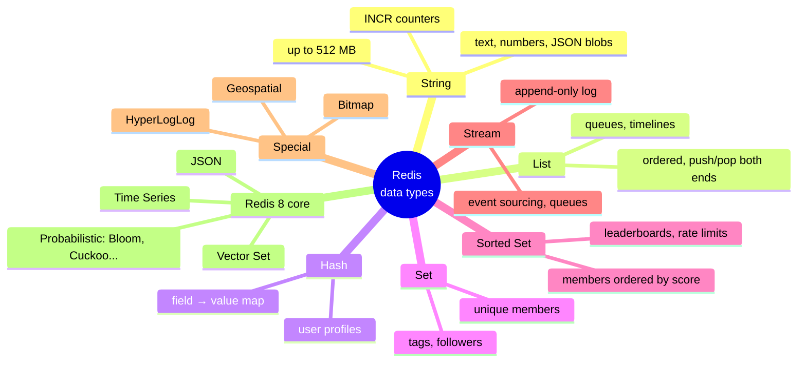

| Type | Think of it as | Example command | Real use |
|---|---|---|---|
| String | a variable | `SET page:views 0` / `INCR page:views` | counters, cached HTML |
| List | a linked list / deque | `LPUSH jobs job1` / `BRPOP jobs 0` | simple job queue |
| Hash | an object / dict | `HSET user:1 name Asha age 22` | user profile |
| Set | a mathematical set | `SADD tags:post1 redis db` | unique tags |
| Sorted Set | a set with ranking | `ZADD board 500 "asha"` | leaderboard |
| Stream | Kafka-lite log | `XADD orders * id 42` | event pipeline |

### 1.4 Why is it so fast?

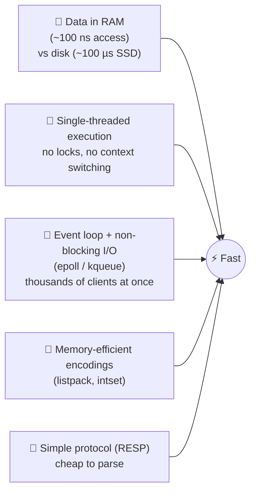

### 1.5 The single-threaded event loop (very important)

Redis executes commands **one at a time** on a main thread. Many clients connect, but the event loop serves them in turn, very quickly.

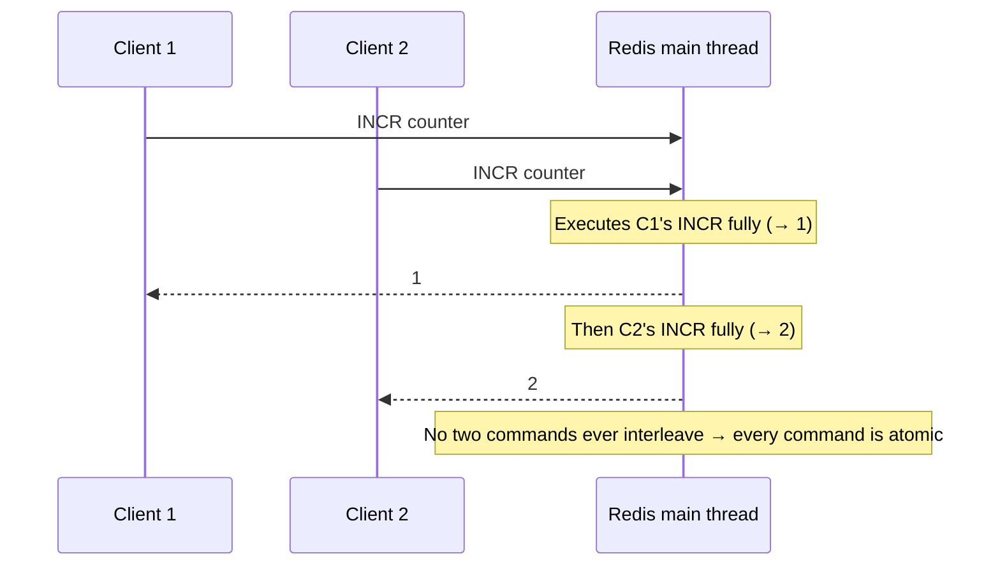

**Two consequences every beginner must remember:**

1. ✅ **Atomicity for free:** `INCR` from 1,000 servers never loses a count.
2. ⚠️ **One slow command blocks everyone:** `KEYS *` on 10 million keys freezes all clients. Use `SCAN` instead.

> 💡 Since 6.0, Redis can use extra **I/O threads** for reading/writing network sockets, but **command execution is still single-threaded**. Keep that distinction clear.

### 1.6 Is it really "in-memory only"?

Data is **served** from RAM, but Redis can **persist** to disk:

| Mechanism | How it works | Trade-off |
|---|---|---|
| **RDB** (snapshot) | Saves the full dataset to a file every N minutes | Compact, fast restart; can lose the last few minutes |
| **AOF** (append-only file) | Logs every write command | Safer (lose ≤ ~1s with `appendfsync everysec`); bigger files |
| **RDB + AOF** | Both | Common production choice |
| **None** | Pure cache | Fastest; all data lost on restart |

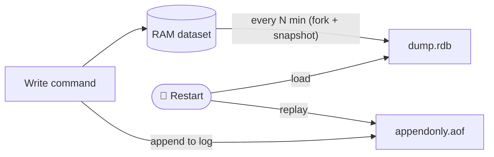

✅ **Check yourself**
- Why is `RPUSH` better than "GET list, modify, SET list"?
- Why does `KEYS *` hurt production, but `INCR` from many servers is safe?

---

## 2. Three Roles: Primary DB vs Cache vs Message Broker

🎯 **Goal:** know the three jobs Redis can do and what each one demands.

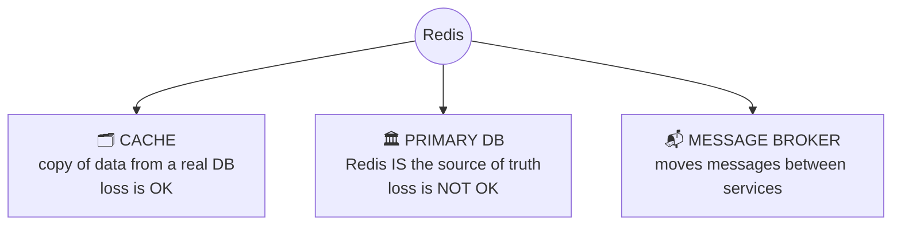

### 2.1 Role 1: Cache (most common)

Redis holds a **copy** of data whose real home is Postgres/MongoDB/etc. If Redis dies, you rebuild from the DB. Slower for a while, but nothing is lost.

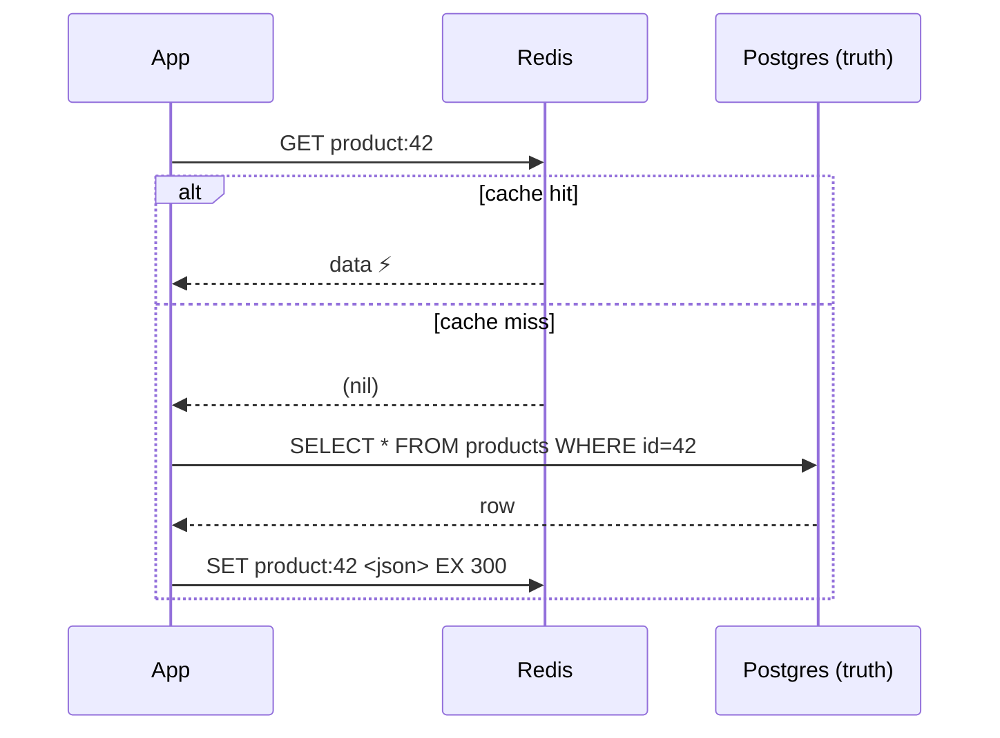

This pattern is called **cache-aside** (lazy loading). Settings that matter: `maxmemory` and an **eviction policy** such as `allkeys-lru` or `allkeys-lfu`.

### 2.2 Role 2: Primary database

Redis **is** the source of truth. Good fits: session stores, leaderboards, rate-limit counters, real-time feature flags, shopping carts. You must then turn on persistence (AOF), replication, and plan backups.

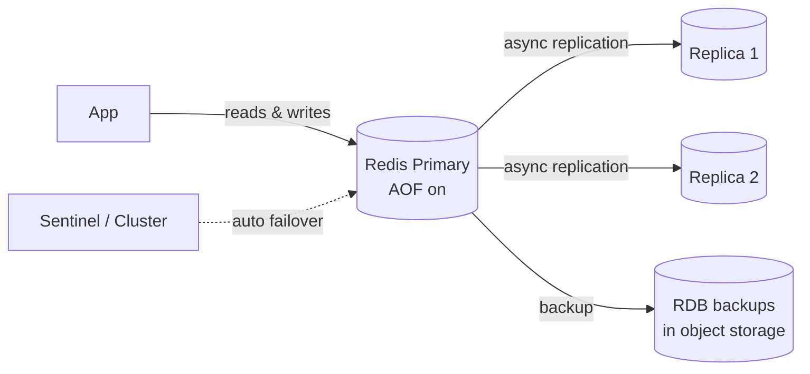

> ⚠️ Replication is **asynchronous** by default: a write acknowledged by the primary can be lost if the primary crashes before replicas receive it. Remember this for Section 3.

### 2.3 Role 3: Message broker

Redis gives you **three** messaging tools. Beginners mix them up, so here's the comparison:

| Tool | Delivery | Stored? | If consumer is offline | Best for |
|---|---|---|---|---|
| **Pub/Sub** | fire-and-forget, to all subscribers | ❌ No | message is **lost** | live notifications, chat typing indicators |
| **List** (`LPUSH`/`BRPOP`) | each item to **one** worker | ✅ Yes | waits in list | simple job queues |
| **Stream** (`XADD`/`XREADGROUP`) | consumer groups, acknowledgements, replay | ✅ Yes | waits; can be re-delivered | reliable event processing |

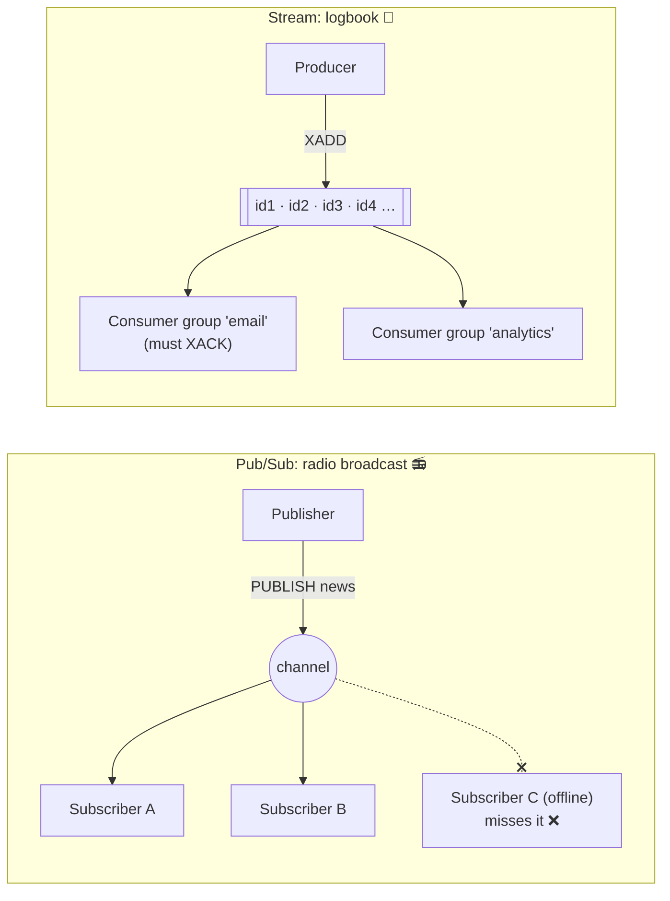

Analogy: **Pub/Sub** is a live radio show: if you weren't listening, you missed it. A **Stream** is a logbook: you can read from where you left off.

✅ **Check yourself**
- If Redis crashes, which role loses the least? (Cache.)
- Why is Pub/Sub a bad choice for "send an order confirmation email"?

---

## 3. When NOT to Use Redis

🎯 **Goal:** be the engineer who says "no" for the right reasons.

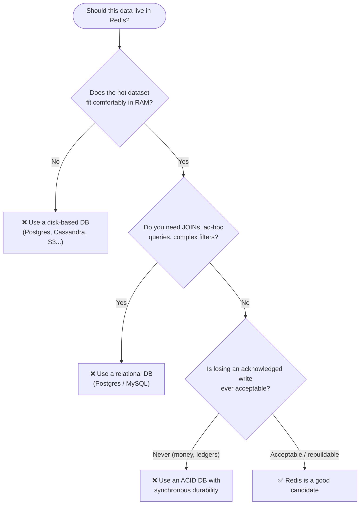

### 3.1 Dataset bigger than RAM

RAM costs far more per GB than disk. Storing 2 TB of rarely-read data in Redis wastes money. Also, when memory is full Redis either **evicts** keys (cache mode) or **rejects writes** (`noeviction` → OOM errors).

> Rule of thumb: plan memory at **dataset × ~1.5–2** to leave room for overhead, fragmentation, and the copy-on-write cost of `fork()` during snapshots.

### 3.2 Complex relational queries

Redis has no `JOIN`, no `GROUP BY`, no query planner. You look things up **by key**. If you want "all orders over ₹500 from users in Pune, last week, grouped by category", you'd have to hand-build indexes for every query. That's a relational DB's job.

> 📝 Redis 8 includes a Query Engine (search/indexing on Hashes and JSON), which narrows the gap for search use cases, but it is still not a relational database.

### 3.3 Strong durability (financial ledgers)

Why money and Redis don't mix well as the **source of truth**:

```mermaid
sequenceDiagram
    participant App
    participant P as Primary
    participant R as Replica
    App->>P: DEBIT account 100
    P-->>App: OK ✅ (acknowledged)
    Note over P,R: Replication is async; not yet sent
    P--xP: 💥 Primary crashes
    Note over R: Replica promoted to primary
    R-->>App: Balance: debit missing! ❌
```

- Async replication can lose acknowledged writes on failover.
- `appendfsync everysec` (the usual setting) can lose up to ~1 second of writes.
- `appendfsync always` is safer but much slower, and still doesn't give multi-node consensus.
- `WAIT` makes the primary wait for replicas, but it does **not** turn Redis into a strongly consistent database.

**Use Redis next to the ledger, not as the ledger:** cache balances for display, rate-limit transactions, hold idempotency keys, but write the money movement to Postgres (or similar) in an ACID transaction.

✅ **Check yourself**
- Your boss wants to "move all 5 TB of logs to Redis for speed." What do you say?

---

## 4. Version History That Matters

🎯 **Goal:** know *which version introduced what*, so you can read docs, debug old servers, and answer "can we use X on our version?"

### 4.1 Timeline

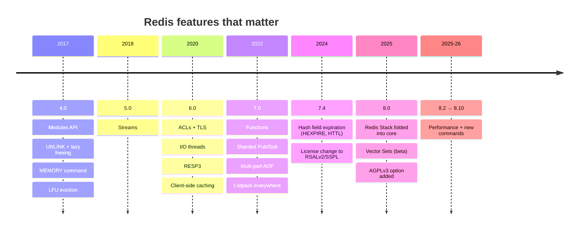

> 📅 As of October 2026, the newest Redis Open Source line is **8.10** (GA July 2026), with 8.8, 8.6, 8.4 and 8.2 still receiving security patches. Always check the release notes before upgrading.

### 4.2 Redis 4.0: "Operations got grown-up"

| Feature | What it means for you |
|---|---|
| **Modules** | Load C plugins that add new data types/commands (this is how RedisJSON, RediSearch were born). |
| **`UNLINK`** | Like `DEL`, but frees memory in a **background thread**. Deleting a 10M-member set with `DEL` blocks Redis; `UNLINK` doesn't. |
| **Lazy freeing** | Config flags (`lazyfree-lazy-eviction`, etc.) plus `FLUSHALL ASYNC` free memory in the background. |
| **`MEMORY` command** | `MEMORY USAGE key`, `MEMORY STATS`, `MEMORY DOCTOR`: find what's eating RAM. |
| **LFU eviction** | `allkeys-lfu` / `volatile-lfu`: evict **least frequently** used keys, not just least recently used. |

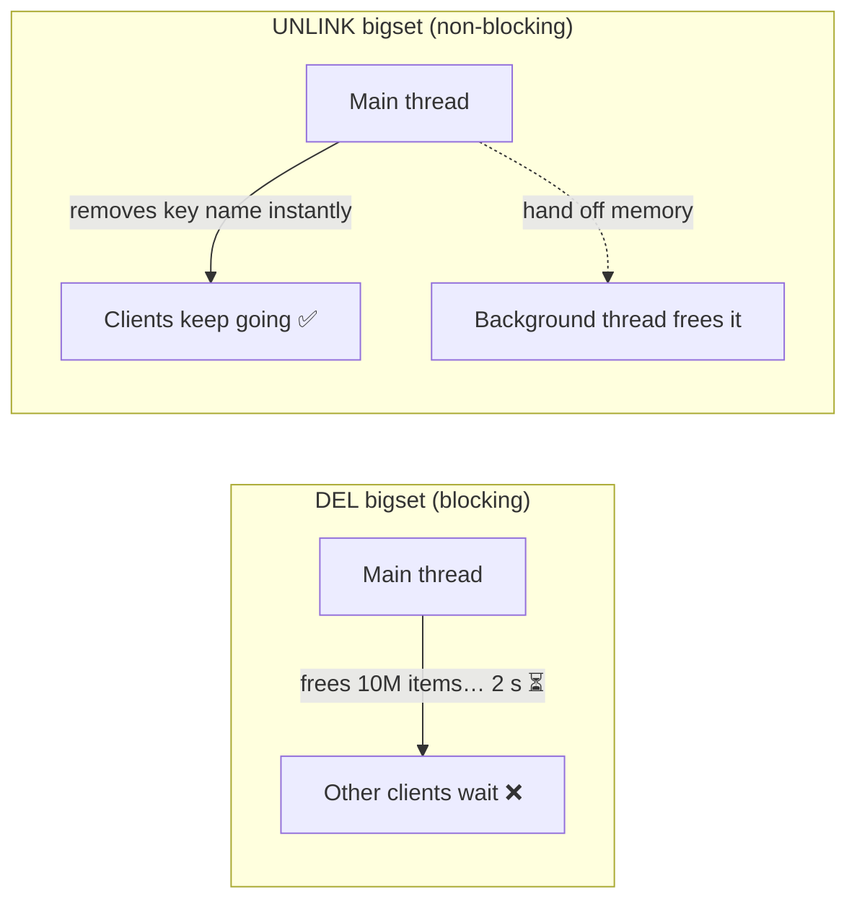

**LRU vs LFU in one example:** a key read 10,000 times yesterday but not in the last minute. LRU may evict it (not *recent*); LFU keeps it (very *frequent*).

### 4.3 Redis 5.0: Streams

A persistent, append-only log with **consumer groups** (Kafka-like ideas, Redis-sized).

```
XADD orders * user 7 total 450      → "1728460000000-0"   (auto ID = time-sequence)
XGROUP CREATE orders billing $ MKSTREAM
XREADGROUP GROUP billing worker-1 COUNT 10 STREAMS orders >
XACK orders billing 1728460000000-0
```

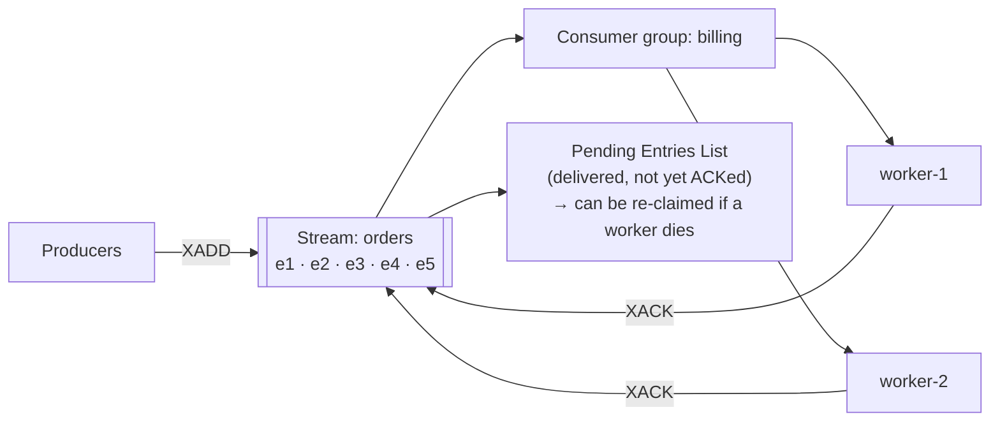

### 4.4 Redis 6.0: Security & networking

| Feature | Explanation |
|---|---|
| **ACLs** | Multiple users with permissions: `ACL SETUSER reporter on >pass ~report:* +get`. Before 6.0, there was one shared password for everything. |
| **TLS** | Encrypted connections (needed for compliance and cross-network traffic). |
| **I/O threads** | Extra threads read/write sockets in parallel; execution stays single-threaded. |
| **RESP3** | New protocol version with richer types (maps, sets, booleans…). See Section 7. |
| **Client-side caching** | The server tells clients when a key they cached locally has changed (`CLIENT TRACKING`). |

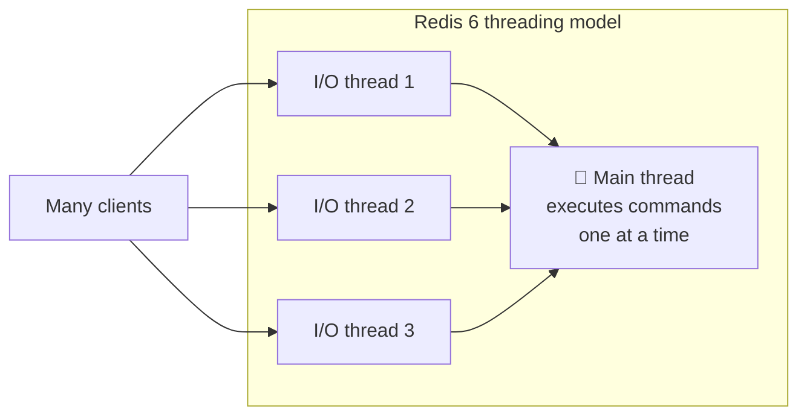

**Client-side caching** (a cache in front of your cache):

```mermaid
sequenceDiagram
    participant App as App (local in-process cache)
    participant R as Redis
    App->>R: CLIENT TRACKING ON
    App->>R: GET user:1
    R-->>App: "Asha"  (App stores it locally)
    Note over App: Next reads served from app memory: 0 network hops
    Note over R: Someone else runs SET user:1 "Ravi"
    R-->>App: 🔔 invalidate user:1
    Note over App: Drops local copy; next read goes to Redis
```

### 4.5 Redis 7.0: Programmability & internals

| Feature | Explanation |
|---|---|
| **Redis Functions** | Server-side Lua code that's **named, versioned, persisted and replicated** (`FUNCTION LOAD`, `FCALL`). Improves on `EVAL` scripts, which were ephemeral blobs the app had to keep re-sending. |
| **Sharded Pub/Sub** | `SPUBLISH`/`SSUBSCRIBE`: in Cluster, a message goes only to the shard that owns the channel, instead of being broadcast to **every** node. |
| **Multi-part AOF** | AOF split into a *base* file + *incremental* files + a *manifest*. Rewrites are simpler and safer. |
| **Listpack everywhere** | The old compact encoding `ziplist` was fully replaced by `listpack` (fixes a cascading-update weakness). |

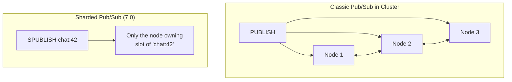

**Multi-part AOF directory:**

```
appendonlydir/
├── appendonly.aof.1.base.rdb    ← snapshot base
├── appendonly.aof.1.incr.aof    ← changes since base
├── appendonly.aof.2.incr.aof
└── appendonly.aof.manifest      ← lists which files to load, in order
```

### 4.6 Redis 7.4: Per-field expiration on Hashes

Before 7.4, TTL worked only on **whole keys**. Now each **field** of a Hash can expire on its own.

```
HSET session:42 token abc csrf xyz name Asha
HEXPIRE session:42 60 FIELDS 1 csrf     → csrf expires in 60 s
HTTL    session:42 FIELDS 1 csrf        → 58
HPERSIST session:42 FIELDS 1 csrf       → remove the TTL
```

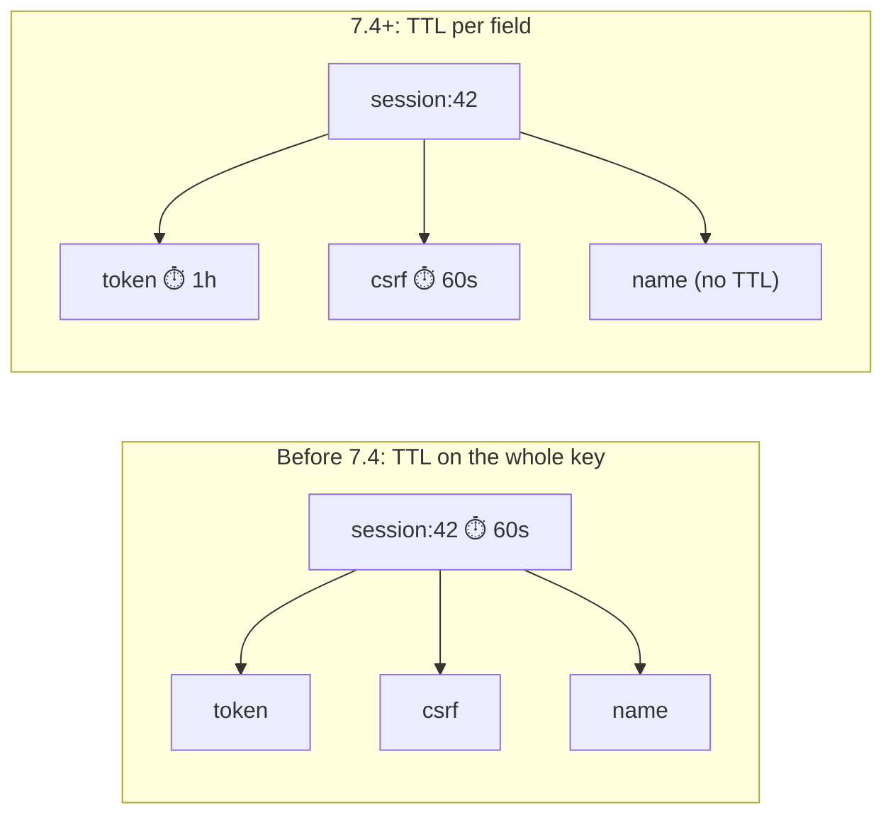

(Valkey added hash field expiration in **9.0**, Oct 2025.)

### 4.7 Redis 8.x: "Batteries included"

- **Redis Stack folded into core:** JSON, Query Engine (search/secondary indexing), Time Series, and probabilistic types (Bloom filter, Cuckoo filter, Count-min sketch, Top-K, t-digest) ship in Redis Open Source itself. No separate "Redis Stack" install.
- **Vector Sets:** a new native data type (created by Redis's original author, antirez) for similarity search on embeddings: `VADD`, `VSIM`. Useful for AI/RAG apps.
- **Performance work:** many commands got faster, plus better replication and memory efficiency.
- **New hash commands** such as `HGETEX`, `HSETEX`, `HGETDEL`.

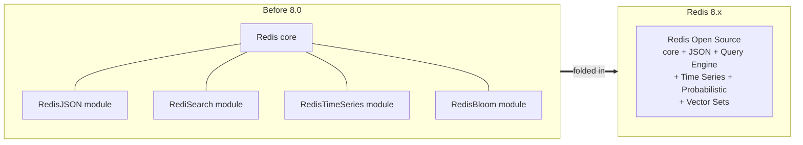

✅ **Check yourself**
- Your company runs Redis 5. Can you use ACLs? (No, 6.0+.) Hash field TTLs? (No, 7.4+.)
- Why is `UNLINK` usually better than `DEL` for big keys?

---

## 5. Licensing & Forks

🎯 **Goal:** understand *what you are legally allowed to run* and why the ecosystem split. This is a real interview and real-job topic.

### 5.1 License basics (beginner version)

| License | Type | In plain words |
|---|---|---|
| **BSD-3-Clause** | Permissive open source | Do almost anything, including selling a hosted service. Keep the copyright notice. |
| **AGPLv3** | Copyleft, OSI open source | You can use it freely, but if you **modify** it and let users interact with it **over a network**, you must share your modified source. |
| **SSPLv1** | Source-available (not OSI-approved) | If you offer it **as a service**, you must open-source your *whole* service stack. Aimed at cloud providers. |
| **RSALv2** | Source-available | Use it freely, but you **can't** offer it as a competing managed database service. |

### 5.2 What happened

```mermaid
timeline
    title Redis licensing story
    2009–2024 : Redis is BSD-3 licensed
              : everyone, including clouds, can host it
    Mar 2024  : Redis Ltd announces switch (from 7.4)
              : to dual RSALv2 / SSPLv1
              : no longer OSI open source
    Mar–Apr 2024 : Community forks Redis 7.2.4
                 : → Valkey, under the Linux Foundation (BSD-3)
                 : backed by AWS, Google, Oracle, Ericsson, Snap...
    2024–2025 : Major clouds move managed offerings to Valkey
              : (e.g. AWS ElastiCache / MemoryDB, Google Memorystore)
    May 2025  : Redis 8.0 adds AGPLv3 as a third option
              : Redis is OSI open source again
    2025–2026 : Two healthy lines
              : Redis 8.x (RSALv2 / SSPLv1 / AGPLv3)
              : Valkey 8.x / 9.x (BSD-3)
```

```mermaid
flowchart TB
    R72["Redis ≤ 7.2.x<br/>BSD-3 ✅"] --> R74["Redis 7.4<br/>RSALv2 / SSPLv1"]
    R74 --> R8["Redis 8.x<br/>RSALv2 / SSPLv1 / AGPLv3"]
    R72 --> V["Valkey 7.2 → 8.x → 9.x<br/>BSD-3 ✅<br/>(Linux Foundation)"]
```

### 5.3 "Can my company deploy this?": a decision guide

> ⚖️ This is general information, not legal advice. Your company's legal team has the final word.

```mermaid
flowchart TD
    Start([Which Redis-like server can we run?]) --> A{Are we offering Redis itself<br/>as a hosted product to customers?}
    A -->|Yes| A1["Redis 8 under RSALv2/SSPL: ❌ restricted<br/>Redis 8 under AGPLv3: possible, but must<br/>publish modifications<br/>Valkey (BSD): ✅ free to do"]
    A -->|"No, internal backend use"| B{Does our policy ban<br/>AGPL / SSPL / source-available?}
    B -->|Yes| B1["Use Valkey (BSD)<br/>or Redis ≤ 7.2 (BSD, aging)"]
    B -->|No| B2["Redis 8 or Valkey both fine.<br/>Pick on features, support, cost."]
    Start --> C{Using a managed cloud service?}
    C -->|Yes| C1["The provider handles licensing.<br/>You choose the engine it offers."]
```

**Key takeaways:**
- Most companies using Redis **internally** as a backend component are not affected by RSAL/SSPL's "as a service" restrictions.
- Many enterprises have a **blanket policy** against AGPL and SSPL; those teams typically choose Valkey.
- Old Redis ≤ 7.2.x remains BSD, but it won't receive new features.

✅ **Check yourself**
- Why did the cloud providers care so much about the 2024 change, more than a typical startup did?

---

## 6. The Alternatives Landscape

🎯 **Goal:** know what else speaks "Redis", and the trade-offs.

### 6.1 The family tree

```mermaid
flowchart TB
    Memc["Memcached (2003)<br/>simple multi-threaded cache"]
    Redis["Redis (2009)"]
    Redis -->|"fork 2019"| KeyDB["KeyDB<br/>multi-threaded fork<br/>(Snap)"]
    Redis -->|"fork 2024"| Valkey["Valkey<br/>Linux Foundation"]
    Redis -. "compatible rewrite" .-> Dragonfly["DragonflyDB<br/>new engine, C++"]
    Redis -. "compatible rewrite" .-> Garnet["Garnet<br/>Microsoft Research, C#/.NET"]
```

**"Drop-in replacement"** = it speaks the RESP protocol and the same commands, so your existing client library and code work unchanged. Usually you change only the connection URL. (Always test: newer or niche commands may differ.)

### 6.2 Comparison table

| | **Redis 8** | **Valkey** | **KeyDB** | **DragonflyDB** | **Memcached** | **Garnet** |
|---|---|---|---|---|---|---|
| Origin | original | fork of Redis 7.2.4 | fork of Redis (2019) | ground-up rewrite | separate project | ground-up rewrite (Microsoft) |
| License | RSALv2 / SSPLv1 / AGPLv3 | BSD-3 | BSD-3 | BSL 1.1 (source-available) | BSD | MIT |
| Threading | single-thread exec + I/O threads | single-thread exec + much-improved I/O threads | multi-threaded | multi-threaded, shared-nothing | multi-threaded | multi-threaded |
| Data structures | full + JSON/Search/TS/Vector | full core types | Redis-compatible (older baseline) | most Redis types | **strings only** | most common types |
| Persistence | RDB + AOF | RDB + AOF | RDB + AOF | snapshots | ❌ none | checkpoints + log |
| Replication / cluster | ✅ | ✅ (atomic slot migration in 9.0) | ✅ (active replication) | ✅ replication; own scaling model | ❌ (client-side sharding) | ✅ |
| Typical reason to pick | newest features, vendor support | open license, cloud default | multi-threading on older stack | max throughput on one big machine | dead-simple, huge caches | .NET shops, research-grade perf |

> 📝 Notes: KeyDB's development pace has slowed in recent years; check activity before adopting. Feature sets and licenses change, so re-check before a production decision.

### 6.3 The big trade-off: threading

```mermaid
flowchart LR
    subgraph Single["Single-threaded exec (Redis / Valkey)"]
        direction TB
        S1["1 core executes commands"]
        S2["Scale by adding shards (Cluster)"]
        S3["✅ simple, predictable, atomic"]
    end
    subgraph Multi["Multi-threaded (Dragonfly / KeyDB / Memcached / Garnet)"]
        direction TB
        M1["many cores execute commands"]
        M2["Scale up on one big machine"]
        M3["✅ higher per-node throughput<br/>⚠️ more complex internals"]
    end
```

- **Scale out** (Redis/Valkey Cluster): many smaller nodes, each using ~1 core for execution.
- **Scale up** (Dragonfly etc.): one big node using all cores. Fewer nodes to operate, but a bigger blast radius if it dies.

### 6.4 Memory efficiency

Every key in Redis has overhead (the dictionary entry, object header, expiry info). With hundreds of millions of tiny keys, that overhead can exceed the data itself. Valkey 8.x reworked its internal hash table to cut per-key overhead; Dragonfly and Memcached use their own allocators. If you store **many tiny keys**, benchmark memory, not just speed.

✅ **Check yourself**
- What does "drop-in replacement" mean, and why should you still run tests?

---

## 7. The RESP Protocol

🎯 **Goal:** understand what actually travels over the wire between your app and Redis.

### 7.1 What is RESP?

**RESP = REdis Serialization Protocol.** It's how clients and the server talk over TCP (default port **6379**). It is:

- **Text-based and human-readable**, so you can debug it by eye.
- **Prefix-typed**: the **first byte** tells you the type.
- **Length-prefixed**: strings say their length first, so they're **binary-safe** (can contain any bytes, even `\r\n`) and fast to parse.
- **Line-terminated** with `\r\n` (CRLF).

### 7.2 RESP2 types (5 of them)

| First byte | Type | Example on the wire | Meaning |
|---|---|---|---|
| `+` | Simple String | `+OK\r\n` | "OK" |
| `-` | Error | `-ERR unknown command\r\n` | an error |
| `:` | Integer | `:1000\r\n` | 1000 |
| `$` | Bulk String | `$5\r\nhello\r\n` | "hello" (5 bytes) |
| `*` | Array | `*2\r\n$3\r\nfoo\r\n$3\r\nbar\r\n` | ["foo", "bar"] |

Null in RESP2 is a hack: `$-1\r\n` (null bulk string) or `*-1\r\n` (null array).

### 7.3 A full round trip

You run `SET name Asha`. The client sends **an array of bulk strings**:

```
*3\r\n          ← array of 3 elements
$3\r\nSET\r\n   ← bulk string, length 3: "SET"
$4\r\nname\r\n  ← bulk string, length 4: "name"
$4\r\nAsha\r\n  ← bulk string, length 4: "Asha"
```

Server replies:

```
+OK\r\n
```

```mermaid
sequenceDiagram
    participant App as Your code
    participant Lib as Client library
    participant R as Redis
    App->>Lib: redis.set("name", "Asha")
    Lib->>R: *3 $3 SET $4 name $4 Asha
    R-->>Lib: +OK
    Lib-->>App: "OK"
    App->>Lib: redis.get("name")
    Lib->>R: *2 $3 GET $4 name
    R-->>Lib: $4 Asha
    Lib-->>App: "Asha"
```

### 7.4 Why it's simple (and fast) to parse

```mermaid
flowchart TD
    Read[Read 1st byte] --> T{Which type?}
    T -->|"+ or -"| L["Read until \r\n → done"]
    T -->|":"| I["Read number until \r\n → done"]
    T -->|"$"| B["Read length N<br/>then read exactly N bytes<br/>(no scanning!) + skip \r\n"]
    T -->|"*"| A["Read count K<br/>then parse K more elements<br/>(recursively)"]
```

- No need to search for the end of a string: the length says exactly how many bytes to read.
- A parser fits in about a hundred lines, which is why Redis clients exist for nearly every language.

### 7.5 RESP3 (Redis 6+): richer types

RESP2 forced clients to *guess*: is this array a list, or a map flattened as key, value, key, value? RESP3 says explicitly.

| First byte | RESP3 type | Example | Why it helps |
|---|---|---|---|
| `_` | Null | `_\r\n` | one clean null |
| `#` | Boolean | `#t\r\n` | true booleans |
| `,` | Double | `,3.14\r\n` | real floats (RESP2 sent them as strings) |
| `(` | Big number | `(3492890328409238509324850943850943825024385\r\n` | huge integers |
| `!` | Bulk error | `!21\r\nSYNTAX invalid syntax\r\n` | binary-safe errors |
| `=` | Verbatim string | `=15\r\ntxt:Some string\r\n` | text with a format hint |
| `%` | Map | `%2\r\n+name\r\n+Asha\r\n+age\r\n:22\r\n` | `HGETALL` returns a real map |
| `~` | Set | `~2\r\n+a\r\n+b\r\n` | `SMEMBERS` returns a real set |
| `\|` | Attribute | metadata attached to a reply | extra info without breaking the reply |
| `>` | Push | out-of-band message | Pub/Sub & invalidation messages on the **same** connection |

**Switching:** a client sends `HELLO 3` after connecting. Without that, the server speaks RESP2, so old clients keep working.

```mermaid
flowchart LR
    subgraph R2["RESP2: HGETALL user:1"]
        A2["*4<br/>name · Asha · age · 22<br/>(client must know it's a map)"]
    end
    subgraph R3["RESP3: HGETALL user:1"]
        A3["%2<br/>name → Asha<br/>age → 22<br/>(explicitly a map)"]
    end
```

**Why push (`>`) matters:** in RESP2, a connection in Pub/Sub mode can't run normal commands, so client-side caching needed a **second** connection for invalidations. RESP3 push messages let one connection carry both normal replies and invalidations.

```mermaid
sequenceDiagram
    participant C as Client (RESP3)
    participant R as Redis
    C->>R: HELLO 3
    R-->>C: %7 server info map
    C->>R: CLIENT TRACKING ON
    C->>R: GET user:1
    R-->>C: $4 Asha
    Note over R: another client changes user:1
    R-->>C: >2 invalidate [user:1]   ← push, same connection
    C->>R: GET user:2
    R-->>C: $4 Ravi                ← normal reply continues
```

### 7.6 Pipelining: why the protocol design speeds you up

Because every reply is self-describing, a client can send many commands **without waiting** and read all replies afterwards. That saves network round trips (remember the latency lesson from the first notes).

```mermaid
sequenceDiagram
    participant C as Client
    participant R as Redis
    Note over C,R: Without pipelining: 3 round trips
    C->>R: INCR a
    R-->>C: :1
    C->>R: INCR b
    R-->>C: :1
    C->>R: INCR c
    R-->>C: :1
    Note over C,R: With pipelining: 1 round trip
    C->>R: INCR a / INCR b / INCR c
    R-->>C: :2 / :2 / :2
```

### 7.7 Try it yourself

```bash
# Talk raw RESP to a local Redis (or Valkey) server
printf '*3\r\n$3\r\nSET\r\n$4\r\nname\r\n$4\r\nAsha\r\n' | nc localhost 6379
# → +OK

# Or use redis-cli and switch protocols
redis-cli
127.0.0.1:6379> HELLO 3
127.0.0.1:6379> HSET user:1 name Asha age 22
127.0.0.1:6379> HGETALL user:1     # shows as a map in RESP3
```

✅ **Check yourself**
- How does a parser know where a bulk string ends, even if it contains `\r\n`?
- What does `HELLO 3` do, and what happens if an old client never sends it?

---

## 8. 🎓 Senior Check

> **Question:** *Why would you choose Valkey over Redis, or Memcached over Redis, for a specific system?*

A senior answer doesn't say "X is better." It says: **"for *this* system, given *these* constraints, X fits because…"** and names what you give up.

### 8.1 Choosing Valkey over Redis

```mermaid
flowchart TD
    Q([Valkey or Redis?]) --> L{Does legal/policy forbid<br/>AGPL, SSPL or source-available?}
    L -->|Yes| V1[✅ Valkey: BSD-3]
    L -->|No| H{Are we building a hosted<br/>DB/cache product for customers?}
    H -->|Yes| V2[✅ Valkey: no service restriction]
    H -->|No| M{On a managed cloud where<br/>Valkey is the default / cheaper?}
    M -->|Yes| V3[✅ Valkey: lower cost, same API]
    M -->|No| F{Need Redis 8-only features?<br/>Query Engine, JSON, Vector Sets,<br/>Redis Enterprise active-active}
    F -->|Yes| R1[✅ Redis 8 / Redis Cloud]
    F -->|No| E["Either works.<br/>Decide on support, team skill, benchmarks."]
```

**Pick Valkey when:**
1. **Licensing:** company policy bans AGPL/SSPL, or you embed/redistribute the server in your product. BSD-3 removes the question.
2. **Hosting it as a service:** you're a platform offering managed caches to your customers.
3. **Cloud cost/default:** your provider's managed service runs Valkey and prices it lower.
4. **Governance:** you want a vendor-neutral project (Linux Foundation, many companies contributing) rather than a single-vendor roadmap.
5. **Performance on your workload:** Valkey 8/9 invested heavily in I/O threading, memory efficiency and cluster resharding (atomic slot migration). Benchmark *your* workload.

**Pick Redis when:**
1. You need **Redis 8 core features**: Query Engine, JSON, Time Series, Vector Sets for AI search.
2. You want **commercial support** and enterprise features from Redis Ltd (e.g. active-active geo-replication in Redis Enterprise/Cloud).
3. Your usage is internal and legal is comfortable with the licenses.

**Trade-off to say out loud:** the two projects are diverging. Commands added after 7.2 may differ, so "drop-in" is safest for core commands. Test migrations.

**Example answer:**
> "For our multi-tenant SaaS platform where we expose a managed cache to customers, I'd pick **Valkey**: BSD-3 means no service-restriction risk, our cloud prices it lower, and we only use core data structures. If we were building a RAG feature needing vector search plus JSON documents in the same store, I'd evaluate **Redis 8**, accept the license after legal review, and gain fewer moving parts."

### 8.2 Choosing Memcached over Redis

```mermaid
flowchart TD
    Q([Memcached or Redis?]) --> A{Only need GET/SET of<br/>opaque blobs with TTL?}
    A -->|No: need lists, sets, counters,<br/>streams, Lua, persistence| R[✅ Redis / Valkey]
    A -->|Yes| B{Need persistence,<br/>replication or failover?}
    B -->|Yes| R
    B -->|No: pure cache, rebuildable| C{Large multi-core boxes;<br/>want simple vertical scaling?}
    C -->|Yes| M[✅ Memcached is a strong fit]
    C -->|No| E[Either works; team familiarity decides]
```

**Pick Memcached when:**
1. **Pure look-aside cache** of rendered pages, API responses, or serialized objects, with no data structures needed.
2. **Multi-threaded on big machines:** it uses all cores out of the box, so one node can serve very high throughput.
3. **Predictable memory:** its slab allocator avoids much fragmentation for uniformly-sized items.
4. **Simplicity / existing infra:** fewer features means fewer ways to misuse it; some large companies already run it at massive scale.

**Pick Redis (or Valkey) when** you need any of: data structures, atomic counters, persistence, replication/failover, Pub/Sub or Streams, Lua/Functions, TTLs per hash field, or values over ~1 MB (Memcached's default item limit).

**Example answer:**
> "For a read-heavy news site caching rendered HTML fragments, where a cache wipe just means a few seconds of extra DB load, **Memcached** is enough: multi-threaded, simple, and nothing to persist. The moment we need rate limiting, leaderboards, or a job queue, I'd add **Redis/Valkey**, because those need atomic data-structure operations Memcached doesn't have."

### 8.3 Senior summary table

| Constraint in the system | Leans toward |
|---|---|
| Strict permissive-license policy | Valkey |
| Offering cache-as-a-service to customers | Valkey |
| Need vector search / JSON / query engine in one store | Redis 8 |
| Want enterprise vendor support & active-active | Redis (Enterprise/Cloud) |
| Only blob caching, no persistence, big multi-core boxes | Memcached |
| Need data structures, persistence, queues | Redis or Valkey |
| Maximum throughput from one huge node | Dragonfly (check BSL license) |
| .NET-centric team, experimental appetite | Garnet |

---

## 9. Glossary

| Term | Meaning |
|---|---|
| **In-memory** | Data is kept and served from RAM |
| **Cache-aside** | App checks cache → on miss reads DB → writes to cache |
| **Eviction** | Removing keys when memory is full (LRU, LFU, random, TTL-based) |
| **LRU / LFU** | Least **Recently** Used / Least **Frequently** Used |
| **TTL** | Time To Live: auto-expiry after N seconds |
| **RDB** | Point-in-time snapshot file |
| **AOF** | Append-only log of write commands |
| **Replica** | A copy of the primary that follows its writes |
| **Sentinel** | Watches primaries and triggers failover |
| **Cluster** | Redis split across nodes using 16,384 hash slots |
| **ACL** | Access Control List: users & permissions |
| **RESP** | REdis Serialization Protocol |
| **Pipelining** | Sending many commands before reading replies |
| **Drop-in replacement** | Compatible server; same clients and code work |
| **Copyleft** | License requiring derived works to stay open |

---

## 10. Final Revision Sheet

```mermaid
flowchart TB
    P0((Phase 0))
    P0 --> A["WHAT: in-memory data structure server<br/>(not just a cache)"]
    P0 --> B["ROLES: cache · primary DB · message broker"]
    P0 --> C["DON'T: bigger than RAM · JOINs · money ledgers"]
    P0 --> D["VERSIONS: 4 modules/UNLINK/LFU · 5 Streams<br/>6 ACL/TLS/RESP3 · 7 Functions/sharded PubSub<br/>7.4 HEXPIRE · 8 Stack in core + Vector Sets"]
    P0 --> E["LICENSE: BSD → RSAL/SSPL (2024)<br/>→ +AGPLv3 (Redis 8) · Valkey = BSD fork"]
    P0 --> F["ALTERNATIVES: Valkey · KeyDB · Dragonfly<br/>Memcached · Garnet"]
    P0 --> G["RESP: prefix byte + length + CRLF<br/>RESP3 adds maps, sets, push, booleans"]
```

**10 lines to remember:**

1. Redis = **RE**mote **DI**ctionary **S**erver holding **typed data structures** in RAM.
2. Commands run **one at a time** → atomic, but slow commands block everyone.
3. Persistence exists (RDB/AOF), but data is **served** from memory.
4. As a **cache** losing data is fine; as a **primary DB** you need AOF + replicas + backups.
5. **Pub/Sub** forgets; **Streams** remember.
6. Don't use Redis for data larger than RAM, relational queries, or as a money ledger.
7. `UNLINK` > `DEL` for big keys; ACLs since 6.0; hash field TTL since 7.4.
8. 2024: Redis left BSD → **Valkey** forked; Redis 8 added **AGPLv3**.
9. RESP is tiny: first byte = type, lengths make it binary-safe; `HELLO 3` switches to RESP3.
10. Choose tools by **constraints** (license, features, scale, cost), not by hype.

---

### 📖 Further reading

- Redis docs: https://redis.io/docs/
- RESP specification: https://redis.io/docs/latest/develop/reference/protocol-spec/
- Valkey: https://valkey.io/
- Redis release notes on GitHub: https://github.com/redis/redis/releases

**Next phase:** install Redis in Docker and write your first commands with a client library.
